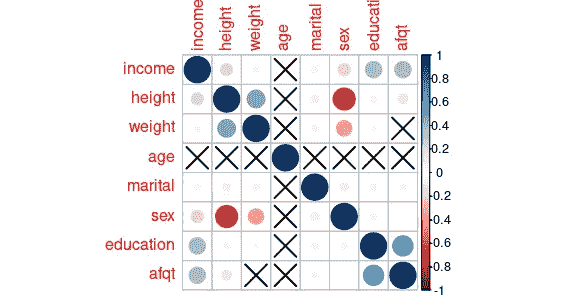
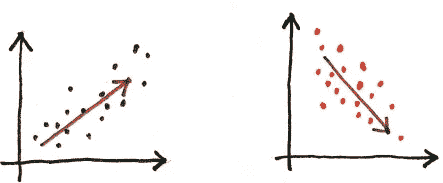
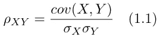
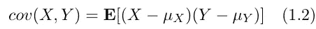
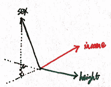
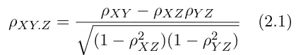
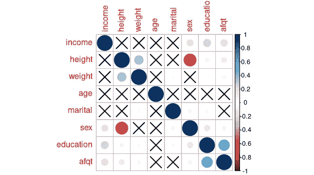
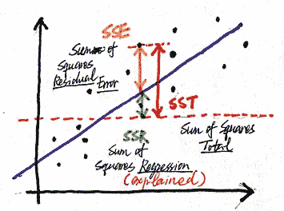

# 偏相关——概念和意义

> 原文：<https://towardsdatascience.com/partial-correlation-508353cd8b5?source=collection_archive---------3----------------------->

## 两个变量之间的相关性可靠吗？


来自[像素](https://www.pexels.com/cs-cz/foto/jidlo-kava-salek-zlomeny-7981894/)的图像

通常，多元线性回归是关于量化一个因变量和几个自变量之间的线性关系。通过这个模型，我们可以发现一个变量如何受其他变量的影响，例如，收入如何受教育程度、地区、年龄、性别等的影响。然而，我们需要问，模型显示的关系是可靠的，还是[乱真的](https://www.tylervigen.com/spurious-correlations)？

作为一个介绍性的例子，为了说明检验**偏相关**的重要性，我们尝试建立一个收入的多元线性回归模型。数据集[内置于 R](https://www.rdocumentation.org/packages/modelr/versions/0.1.8/topics/heights) 中，来源于[国家纵向研究](https://www.nlsinfo.org/)。

在构建多元模型之前，首先检查相关性通常是一个好的做法，这将在下一节中简要概述。我们使用相关矩阵来可视化相关性



图 0.1 相关矩阵。(图片由作者提供)

从图 0.1 我们可以看出，收入与身高、体重、教育程度和 afdp(武装部队资格测试百分位分数)正相关。**负面**受婚姻(婚姻状态用数字表示如下:单身:1，已婚:2，分居:3，离婚:4，丧偶:5)，性别(男性用 1 表示，女性用 2。这种负相关意味着女性挣得少一点)。数据在某种程度上证实了我们已经知道的，有一件事很可疑，那就是高个子挣得更多。其实这个相关性是乱真的，后面我们会用偏相关来验证和解释为什么会这样。

# 快速捕捉相关性

相关性描述了两个变量之间的关系，即其中一个变量的增长(减少)会导致另一个变量的增长(减少)。



图 1.1 相关性示意图。(图片由作者提供)

有几种方法可以衡量两个变量之间的相关性。在本文中，我们使用皮尔逊相关系数( **PCC** )，也称为 **Person's r** ，因为它也在稍后的偏相关公式中使用。另一个参数，Spearman 的 rho，经常在 R 中实现，事实上，也使用人的 R，只是在等级系数之上*。人的休息公式由下式给出*



人的 r

其中，σₓ是 x 的标准差，σᵧ是 y 的标准差，cov(X，y)表示协方差，其定义为*两个随机变量 x 和 y 与其均值*的偏差乘积的期望值，即



协方差

相关性 [**通过将协方差**](https://selipot.github.io/talks/lecture2.pdf) 除以两个变量的标准偏差来归一化协方差。与协方差不同，相关性的范围在-1 和 1 之间。当它等于-1 或 1 时，意味着两个变量之间的关系给定**正好是分别具有正斜率或负斜率的线性函数**。

# 偏相关—去除混杂因素

偏相关是与相关性密切相关的概念。它表明，当我们发现两个变量之间的相关性时，这并不一定意味着它们之间有因果关系。偏相关*以一个或几个其他变量*为条件，量化两个变量之间的相关性。这意味着，当两个变量之间存在相关性时，这种相关性可能部分地由第三个变量解释，即[混杂变量](https://en.wikipedia.org/wiki/Confounding)(或*控制变量*)，这是虚假相关性的常见原因。去掉这部分后，*剩下的*，就是这两个变量之间的**偏相关**。

几何是理解本中[提到的偏相关的直观途径之一。将变量表示为向量，下图显示了混杂因素如何影响其他变量。在我们的例子中，混杂因素是性别，我们可以看到它与收入和身高都呈负相关。](http://www.hawaii.edu/powerkills/UC.HTM#C7)



图 2.1 混杂因素的影响。(图片由作者提供)

在只有一个混杂因素的情况下(称为*一阶偏相关*)，剔除 Z 因素后，随机变量 X 和 Y 之间的偏相关公式为



一阶偏相关公式

如果有多个控制变量，比如说一组 n 个控制变量 **Z** = {Z₁，Z₂，..，Zₙ}，那么等式 2.1 中的 z 应该替换为 **Z** ，其中表示一个集合。X 和 Y 之间的偏相关的正式定义是

> X 与 **Z** 和 Y 与 **Z** 线性回归的残差之间的相关性。

在这篇文章中，我们将坚持一阶偏相关。现在我们有了一个不同的工具，我们可以重温我们的介绍示例，并研究变量之间的部分相关性，如图 2.3 所示。这次我们可以看到身高，体重，婚姻状况被划掉了，对比图 0.1 中的相关矩阵。



图 2.3 偏相关矩阵。(图片由作者提供)

如何计算偏相关？三种方法在[维基百科](https://en.wikipedia.org/wiki/Partial_correlation#:~:text=edit%5D-,using%20linear%20regression,-%5Bedit)上有描述:1。**线性回归**，2。**递归公式**，3。**矩阵求逆**。第一种方法，线性回归，是基于偏回归的定义，当我们计算偏相关时，它让我们了解我们在计算什么。假设我们要计算 X 和 Y 之间的偏相关，去掉 Z 的影响。思路是我们先计算 X 关于 Z 的线性回归，得到**残差**。为什么残？是因为这是*X 中的部分，Z* 没有解释。我们对 Y 做类似的事情。然后我们计算这两个残差之间的相关性。下图显示了“解释”的含义，它实际上是线性回归中定义的一个术语



图 2.2 线性回归模型中的 SSE、SST 和 SSR(图片由作者提供)

形式推导。有一个很重要的事实值得强调:**(偏)相关与线性回归**密切相关。

我们可以用下面几行代码，尝试用回归来计算身高和收入的偏相关。

```
m.i <- lm(income ~ sex, data = dataH)
m.s<- lm(height ~ sex, data = dataH)
v.i <- summary(m.i)
v.s <- summary(m.s)
cor(v.i$residuals, v.s$residuals, method="pearson")
```

使用线性回归的结果是 0.094。但是`pcor`的输出告诉我们，身高和收入的偏相关是 0.017。为什么会这样呢？这是因为`pcor`在**的影响下计算了每对变量之间的偏相关，所有其他**变量都被移除([使用摩尔-彭罗斯广义矩阵求逆](https://www.rdocumentation.org/packages/ppcor/versions/1.1/topics/pcor))。如果我们只取数据的子集(只有列`income`、`height`和`sex`)，输出将是相同的 0.094。

分析介绍示例的完整代码

除了帮助我们识别多元线性回归中两个因素之间的真正相关性，偏相关在更复杂的模型中也非常有用。自回归-移动平均(AMRA)模型可以作为这样的例子，其中偏相关，更准确地说是偏自相关，在[超参数](https://en.wikipedia.org/wiki/Hyperparameter_(machine_learning))选择中起着重要作用。

# 摘要

题目以一个介绍性的例子开始，这个例子让我们看到，有时候相关性不一定要表示因果关系。然后我们介绍这种现象的一个常见原因——**混杂因素**，以及解决这一问题的方法——检验**偏相关**。还介绍了计算偏相关的方法，并给出了用线性回归计算 R 中偏相关的实现。

## **资源**

[1]Everitt，B. S .，& Skrondal，a .剑桥统计词典(2010 年)。

[2]Kenett，D. Y .，黄，x .，Vodenska，I .，Havlin，s .，& Stanley，H. E. [偏相关分析:金融市场应用](https://www.tandfonline.com/doi/full/10.1080/14697688.2014.946660) (2015)。*量化金融*， *15* (4)，569–578。