# 偏最小二乘法

> 原文：<https://towardsdatascience.com/partial-least-squares-f4e6714452a?source=collection_archive---------1----------------------->

## [实践教程](https://towardsdatascience.com/tagged/hands-on-tutorials)

## 深入探讨偏最小二乘回归和偏最小二乘判别分析，并提供 R 和 Python 中的完整示例


偏最小二乘法——应用于橄榄油和肉类的例子——由 [Calum Lewis](https://unsplash.com/@calumlewis?utm_source=unsplash&utm_medium=referral&utm_content=creditCopyText) 在 [Unsplash](https://unsplash.com/?utm_source=unsplash&utm_medium=referral&utm_content=creditCopyText) 上拍摄

# 偏最小二乘法

在本文中，您将发现关于偏最小二乘您需要知道的一切。顾名思义，偏最小二乘法与普通最小二乘法相关:拟合线性回归的标准数学方法。

## 抗多重共线性的偏最小二乘

线性回归的目标是模拟一个因变量(目标变量)和多个自变量(解释变量)之间的依赖关系。普通的最小二乘法非常适合这种情况，只要你满足线性回归的假设。

在某些领域中，您的模型中可能会有许多独立变量，其中许多变量与其他独立变量相关。如果发生这种情况，如果你使用 OLS，你会遇到麻烦:你会有多重共线性，因此违反了线性回归的[假设。](/assumptions-of-linear-regression-fdb71ebeaa8b)

偏最小二乘法是这种情况的解决方案:它允许您减少相关变量的维度，并对这些变量的潜在共享信息进行建模(在因变量和自变量中)。

## 多元结果的偏最小二乘法

偏最小二乘法的第二大优势是它是一种可以模拟多个结果变量的方法。许多统计和机器学习模型不能直接处理多个结果变量。

通常可以为这些模型找到解决方案。例如，为每个变量建立一个模型。然而，特别是对于分析用例，将所有东西都放在一个模型中是非常重要的，因为一个多变量模型的解释将不同于许多单变量模型的解释。

# 偏最小二乘法与其他模型

您已经看到了使用偏最小二乘法的两个主要原因:有多个因变量和许多相关(独立)变量。

还有其他方法可以解决这些问题。在深入了解偏最小二乘法的细节之前，让我们先来看几个相互竞争的方法。

## 偏最小二乘法与多元多元回归

多元多元回归是多元回归的多元对应物:它对多个自变量进行建模，以解释多个因变量。

虽然多元多重回归在许多情况下工作良好，但它不能处理多重共线性。如果数据集有许多相关的预测变量，则需要进行偏最小二乘回归。

## 偏最小二乘法与主成分回归

主成分回归是一种回归方法，提出了一种替代解决方案，具有许多相关的独立变量。在将独立变量输入普通最小二乘模型之前，PCR 对独立变量应用[主成分分析](/what-is-the-difference-between-pca-and-factor-analysis-5362ef6fa6f9)。

PCR 可以分两步完成，先进行 PCA，然后进行线性回归，但也有同时完成这两步的实现。

偏最小二乘法和主成分回归的区别在于，主成分回归在降维的同时更注重方差。另一方面，偏最小二乘侧重于协方差，同时降低维数。

在偏最小二乘法中，自变量的已识别分量被定义为与因变量的已识别分量相关。在主成分回归中，在不考虑因变量的情况下创建成分。

当目标是找到因变量和自变量之间的依赖关系时，偏最小二乘法在这里具有优势。

## 偏最小二乘法与典型相关分析

[典型相关分析](/canonical-correlation-analysis-b1a38847219d)是一种专注于研究两个数据集之间相关性的统计方法。这是通过在两个数据集上减少维度并找到具有最大相关量的成分对来获得的。

偏最小二乘法和典型相关分析之间的思想是相当可比的。这两种方法的主要区别在于，偏最小二乘法侧重于协方差，而典型相关分析侧重于相关性。

# PLS 模型

现在我们已经看到了使用偏最小二乘法的一般原因，让我们来更详细地了解一下。

在偏最小二乘法中，有子类别，关于 PLS 的文献充满了**令人困惑的术语和类别**。在开始一个示例的实现之前，让我们试着澄清一些你在学习 PLS 时会遇到的术语，并给出一个不同 PLS 模型的**列表**。

## 偏最小二乘回归

绝对最常见的偏最小二乘模型是偏最小二乘回归，或 PLS 回归。偏最小二乘回归是 PLS 模型家族中其他模型的基础。由于它是一个回归模型，当你的**因变量是数字**时，它适用。

## 偏最小二乘判别分析

当您的**因变量是分类变量**时，可以使用偏最小二乘判别分析，或 PLS-DA。判别分析是一种分类算法，PLS-DA 增加了降维部分。

## PLS1 与 PLS2

在一些文献和软件实现中，对 PLS1 和 PLS2 进行了区分。在这种情况下，PLS1 指的是仅具有**一个因变量**的偏最小二乘模型，而 PLS2 指的是具有**多个因变量**的模型。

## SIMPLS vs NIPALS

SIMPLS 和 NIPALS 是做 PLS 的两种方法。SIMPLS 是作为早期版本 NIPALS 的更快和“更简单”的替代方案而发明的。当执行 PLS 时，这可能并不重要，因为两种方法的结果会非常接近。然而，如果你可以选择的话，最好还是选择更现代的简约风格。

## KernelPLS

如前所述，偏最小二乘法是普通最小二乘法(线性回归)的一种变体。正因为如此，偏最小二乘法不能应用于非线性问题。核 PLS 解决了这个问题，使得偏最小二乘可用于非线性问题。核 PLS 拟合高维空间中输入和输出变量之间的关系，使得输入数据集可以被认为是线性的。

## OPLS

OPLS 是潜在结构正交投影的缩写，是偏最小二乘法的一种改进。OPLS 承诺**更容易解读**。PLS 仅将变异性分为系统变异性和噪声变异性，而 OPLS 则更进一步，将系统变异性分为预测变异性和正交变异性。

对 OPLS 也有一些批评，因为众所周知这两种方法都获得了**相同的预测性能**(如果不能产生更好的性能，我们可以认为这不是“真正的”改进)，其次，**传统 PLS** 更快。

对于本文的其余部分，我们将坚持使用传统的 PLS，因为它执行起来更简单，性能也一样好。

## SPLS

SPLS 是稀疏偏最小二乘的缩写，是偏最小二乘模型的一种变体。如前所述，PLS 的目标是进行降维:将大量相关变量减少到更少的分量中。

SPLS 的目标不仅仅是降维。此外，它还适用于**变量选择**。SPLS 使用著名的**套索惩罚**在 X 和 Y 数据集中进行变量选择，目的是获得更容易解释的成分。

## 左旋偏最小二乘法

L-PLS 是 PLS 的一个提议变体，可以应用于一些特定的用例。该方法由 Martens 等人在 2005 年提出:

> 描述了一种新的方法，用于根据关于矩阵 X 中给出的 Y 中的行和矩阵 Z 中给出的 Y 中的列的附加信息来提取和可视化数据矩阵 Y 中的结构。X(I × K)和 Z(J × L)不共享矩阵尺寸维度，但通过 Y(I × J)相连。

正如他们在文章中所描述的，L-PLS 背后的思想是对同一个回归问题使用三个数据集，以便在行和列上有额外的数据。他们将这种情况描述为具有 L 形式的数据，这由 L-PLS 中的 L 表示。

这种方法**非常有创意**，当然也有它的使用案例。不幸的是,**在流行的统计库中缺乏实现**,而且它的应用非常特殊，这使得它在实践中还没有被广泛使用。

# 偏最小二乘回归示例

在本例中，我们将使用肉类数据集。应该数据集发布者的要求，以下是数据附带的官方声明:

```
*Fat, water and protein content of meat samples*
*"These data are recorded on a Tecator Infratec Food and Feed Analyzer working in the wavelength range 850 - 1050 nm by the Near Infrared Transmission (NIT) principle. Each sample contains finely chopped pure meat with different moisture, fat and protein contents.*

*If results from these data are used in a publication we want you to mention the instrument and company name (Tecator) in the publication.  In addition, please send a preprint of your article to Karin Thente, Tecator AB, Box 70, S-263 21 Hoganas, Sweden*

*The data are available in the public domain with no responsibility from the original data source. The data can be redistributed as long as this permission note is attached."*

*"For each meat sample the data consists of a 100 channel spectrum of*
*absorbances and the contents of moisture (water), fat and protein. The absorbance is -log10 of the transmittance measured by the spectrometer. The three contents, measured in percent, are determined by analytic chemistry." Included here are the traning, monitoring and test sets.*
```

肉类数据的目标是对肉类进行 100 次自动近红外测量，并使用它们来预测肉类的水分、脂肪和蛋白质含量。这个例子有多种理由使用偏最小二乘法:

*   它有许多可以相互关联的独立变量。至少它们是非常不可解释的，这是对它们进行降维的好例子。
*   有多个因变量，它们之间也可能有一些相关性。

这种模型的目标是能够直接从化学计量测量中推断出肉类的脂肪、水分和蛋白质含量。因此，基本上理想的目标是让您能够避免耗时的测量工作，只需将您的肉放入扫描仪，即可获得估计的脂肪、水分和蛋白质含量。

与大多数偏最小二乘法的化学计量学用例一样，该用例主要关注于获得最佳性能。对模型的分析和解释是次要的。稍后我们将看到第二个例子，其中解释是核心，而不是预测性能。

在为预测性能建立模型时，用不同的模型进行模型基准测试总是很重要的。你可以参考这个[机器学习入门指南](/beginner-guide-to-build-compare-and-evaluate-machine-learning-models-in-under-10-minutes-19a6781830de)来了解如何进行这样的基准测试设置，或者查看这篇关于[网格搜索的文章:一个调整模型的好方法](/gridsearch-the-ultimate-machine-learning-tool-6cd5fb93d07)。

# 偏最小二乘回归 R

首先，让我们导入 r 中的数据。这些数据存在于`modeldata`库中，因此您可以使用下面的代码来导入数据:

偏最小二乘法-导入数据

数据如下所示:100 列具有化学计量学测量值，三列提供水、脂肪和蛋白质含量的测量值:

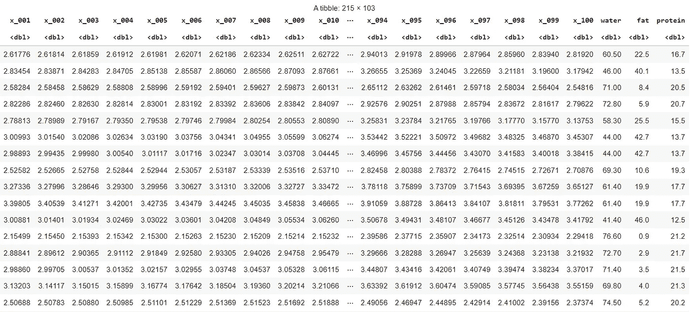

偏最小二乘法—肉类数据

如前所述，我们将尝试建立一个 PLS 回归模型，该模型可以从 100 次测量中预测水、脂肪和蛋白质含量。为了做到这一点，我们希望确定获得样本外的预测性能，而不是解释样本内的最大差异。

为此，我们将数据分成三个数据集:

*   用于训练模型的训练数据
*   用于调整模型的验证数据
*   对样本外误差进行最终估计的测试数据

通常，最好对数据进行随机分割。但是，为了使示例更容易理解，您可以对数据进行非随机分割，如下所示:

偏最小二乘法-分割数据

下一步是拟合一个完整的模型。也就是说，具有最大数量组件的模型:

偏最小二乘法-拟合模型

现在我们有了最复杂的模型，我们将使用它来确定应该使用多少个组件来获得最佳预测性能:这是一个重要的决定。

我们首先要看的是每个分量和每个因变量的预测均方根误差图。在这个 R 函数中，使用了内置的留一交叉验证函数:

您将获得以下三个图，以显示预测误差(与预测性能相反)在组件数量非常少的模型中最高，然后逐渐降低，当模型组件过多时，它们再次具有高误差。

最佳值应该在 15 到 20 之间。

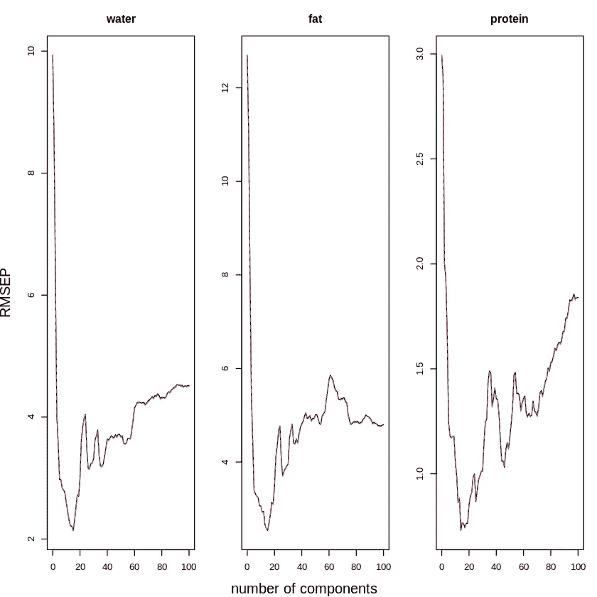

偏最小二乘法—组件数量

为了更好地理解当组件更多或更少时会发生什么，我们可以查看下图。它显示了每个变量的回归系数(每个变量对应一个波长)。

偏最小二乘法—回归系数

该图清楚地表明，我们使用的组件越多，模式就变得越难:

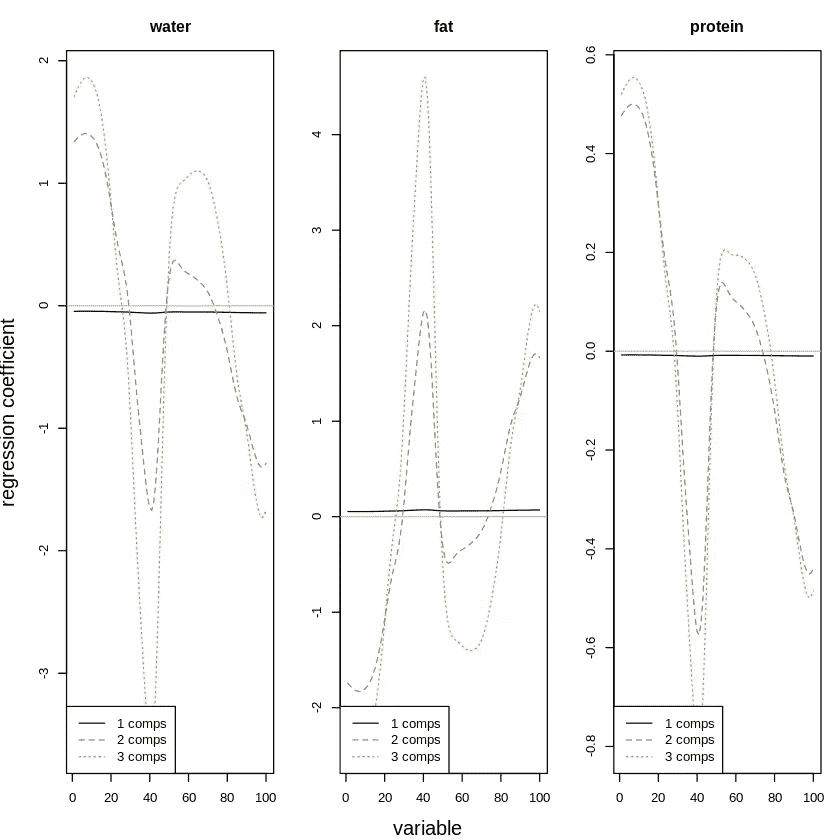

偏最小二乘法—系数图

相比之下，包含 15 个组件的模式要复杂得多:

偏最小二乘法—拟合 15 组分模型

从下图中可以看出这种复杂性，因为系数要极端得多(有些低得多，有些高得多):

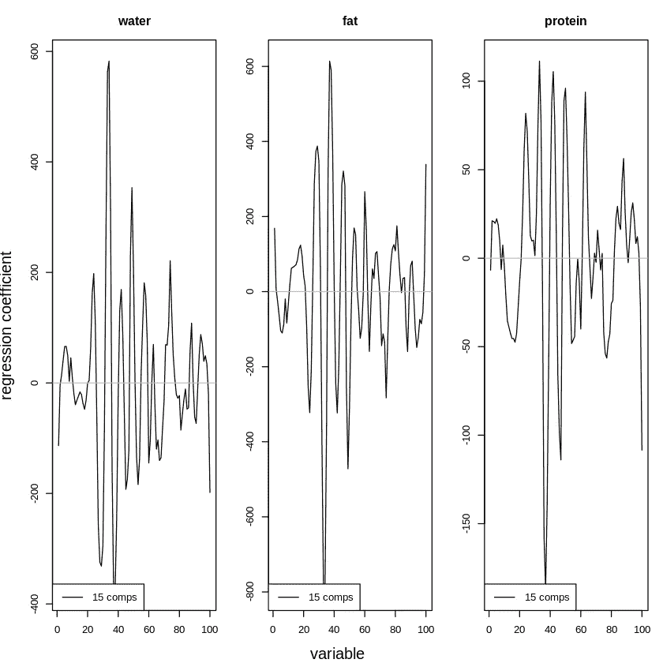

偏最小二乘法-15 组分模型的回归系数

现在，这些图表可以很好地获得最佳组件数量的估计值。然而，获得一个固定的数字作为输出要实际得多。[网格搜索](/gridsearch-the-ultimate-machine-learning-tool-6cd5fb93d07)是一个工具，允许您搜索数值网格以获得最佳预测性能。它通常用于调整 ML 模型的超参数，我们将在这里使用它来调整`ncomp`超参数:

偏最小二乘法——网格搜索最佳 ncomp

这就为一个 **19 的`best_ncomp`获得了一个 **0.9483937 的`best_r2`。根据网格搜索，这意味着具有 19 个成分的 PLS 回归模型是预测肉类水分、脂肪和蛋白质含量的最佳模型。****

作为最后的检查，让我们使用下面的代码来验证我们是否也在测试数据集上获得了好的分数:

偏最小二乘法-检查测试数据的 R2

最佳模型获得预测平均 R2 分数 **0.9726439。**我们现在已经成功调整了 PLS 回归模型，用于预测水、脂肪和蛋白质含量。如果这种误差幅度对于肉类测量所需的精度来说是可以接受的，我们可以用自动化的化学计量学测量来代替手工测量。然后，我们可以使用 PLS 回归模型将这些自动测量值转换为水、脂肪和蛋白质含量的估计值。

# 偏最小二乘回归 Python

对于那些喜欢 Python 的人来说，在继续讨论分类数据示例之前，让我们也用 Python 实现一下。

在 Python 中，您可以从我的 S3 存储桶中导入肉类数据，我在那里存储了来自 r 的数据的副本。

偏最小二乘法-导入数据

Python 中的数据如下所示:

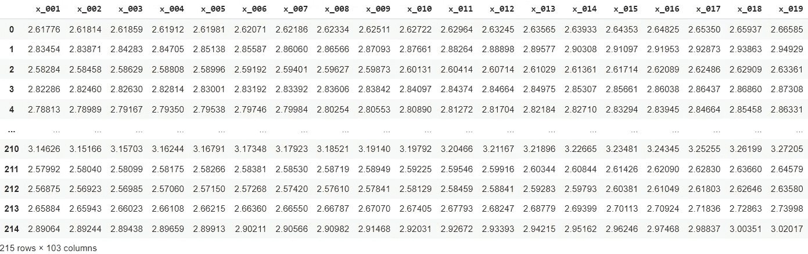

偏最小二乘法 Python 中的数据

要获得与 R 中相同的训练、验证和测试数据的非随机分割，可以使用下面的代码。如果你不介意结果略有不同，你也可以使用 scikitlearn 的`train_test_split`函数进行随机抽样。

偏最小二乘法-在训练、验证和测试中分割数据

现在，完整的模型可以估计如下:

偏最小二乘法-估计模型

就像我们在 R 中做的一样，您需要调整组件的数量。预测误差作为部件数量的函数的曲线图可以如下创建:

偏最小二乘法—绘制预测误差与 ncomp 的函数关系

它将为您提供以下图表，这些图表显示了 15 到 20 个组件的最佳数量。

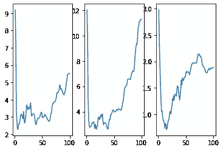

偏最小二乘法-绘制组件数量

现在，可视化不同数量组件的结果差异会很好。由于模型中有 100 个系数，数字数据很难查看。下图显示了图中的系数:

偏最小二乘法—系数图

对于三个因变量(水、脂肪、蛋白质)和成分数量(1 =蓝色，2 =橙色，3 =绿色)，该图从左到右如下所示。

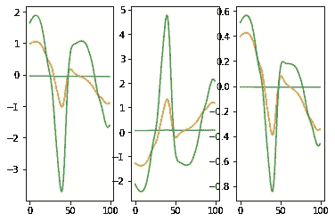

您可以看到，随着更多组件的加入，模型变得更加复杂，就像我们看到的 R 代码一样。

现在，让我们继续进行网格搜索，寻找元件数量`n_comp`的最佳值。我们为`n_comp`的每个可能值计算验证数据的 R2 分数，如下所示:

我们可以获得的最佳 R2 是 R2 分数**为 0.9431952353094432** ，ncomp 值为 **15。**

作为对我们模型的最后验证，让我们验证我们是否在测试数据集上获得了可比较的分数:

得到的 R2 分数为 **0.95628** ，甚至略高于验证误差。我们可以确信模型不会过度拟合，并且我们已经找到了合适数量的组件来制作一个高性能的模型。

如果这种误差对于肉类测试来说是可接受的，我们就可以放心地用自动化化学计量学测量结合 PLS 回归来代替手动测量水分、脂肪和蛋白质。然后，PLS 回归将化学计量学测量值转化为水、脂肪和蛋白质含量的估计值。

# 偏最小二乘判别分析实例

对于第二个例子，我们将做**一个解释性模型:一个专注于理解和解释组件**而不是获得预测性能的模型。

该数据是橄榄油的数据集。目的是看看我们能否根据化学测量和感官测量来预测原产国。这个模型将让我们了解如何根据化学和感官测量来区分不同国家的橄榄油。

因变量(原产国)是分类的，这使得它成为判别分析的一个很好的例子，因为这是分类模型家族中的一种方法。

# 偏最小二乘鉴别分析

在 R 中，只要导入 pls 库，就可以获得橄榄油数据集。您可以这样做:

偏最小二乘法-橄榄油数据

数据如下所示。它包含两个矩阵:具有 5 个化学测量变量的化学矩阵和具有 6 个感官测量变量的感官矩阵:

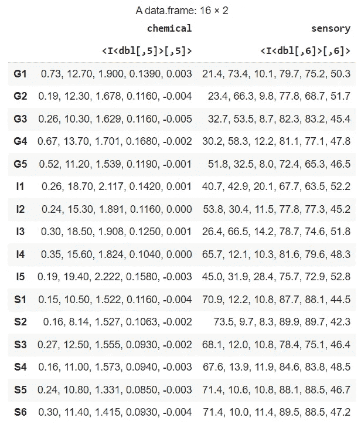

偏最小二乘法-橄榄油数据

当然，这种数据格式对于我们的用例来说并不理想，所以我们需要将两个矩阵的数据帧做成仅仅一个矩阵。您可以这样做:

偏最小二乘法-根据橄榄油数据制作一个矩阵

生成的矩阵如下所示。如您所见，它自动包含列名:

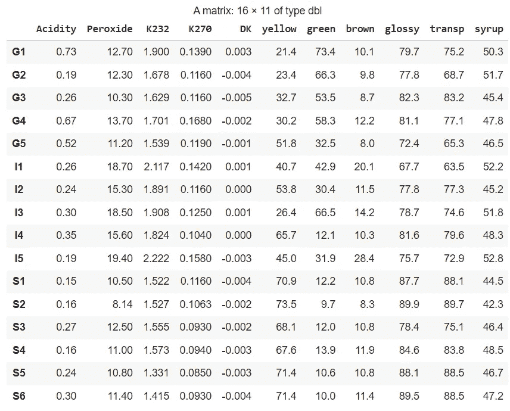

偏最小二乘法—正确的橄榄油数据格式

国家是行名的第一个字母(G 代表希腊，I 代表意大利，S 代表西班牙)。这里有一个简单的方法来创建 Y 数据作为因子。因子是 r 中的分类数据变量。

偏最小二乘法-创建国家变量

现在，我们来看看模型。我们将使用插入符号库来拟合模型。Caret 是一个很棒的库，包含了很多机器学习模型和很多模型开发工具。如果你对 caret 感兴趣，你可以看看这篇文章，它比较了 R 的 caret 和 Python 的 scikit-learn。

您可以使用 caret 中的 PLSDA 函数来拟合模型，如下所示:

下一步是获得双标图，这样我们可以解释组件的含义，同时分析个体的位置。

为了解释双绘图，你需要看方向。为了理解这意味着什么，试着从图的中间画一条假想的线到每个标签。假想线之间的角度使两个物体接近。与中间的距离决定了重量的强弱。

*提示:你可以快速向下滚动到 Python biplot 来更好地理解假想线的概念！*

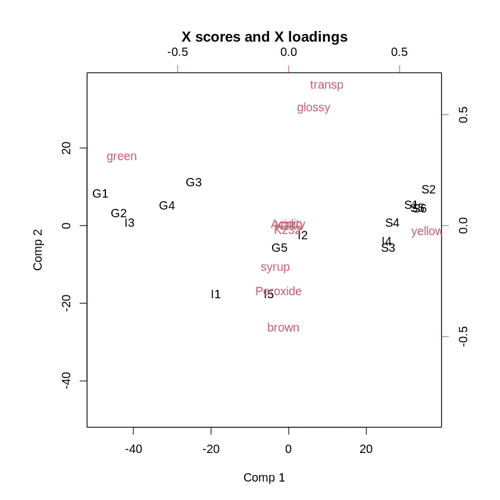

偏最小二乘法—双标图

## 解释偏最小二乘双图

当将偏最小二乘法用于解释性用例时，可以从双标图中得出很多结论。为了使事情简单，我们有时会考虑两个以上的维度，但是从第三维度开始，事情会很快变得复杂。这里我们坚持二维。

1.  **解读第一维度**

我们通常问自己的第一个问题是关于第一维的含义和解释。我们可以通过观察与第一维度密切相关的变量(图上的红色标签)来定义这一点。为了看到这些，我们可以把一个变量放在最左边(比较 1 的低分)和一个变量放在最右边(比较 1 的高分)。

在我们的例子中，第一个组件从左边的**绿色**到右边的**黄色**。显然，**绿色和黄色的分界在橄榄油中很重要！**

为了证实这一点，我们现在来看看个人是否有趋势(图中黑色标签)。我们在左边看到很多希腊油画，而在右边我们看到很多西班牙油画。这意味着黄色和绿色橄榄油的区别让我们能够区分希腊和西班牙的橄榄油！

就变量而言，一个有趣的见解是，橄榄油中从黄色到绿色似乎有一个非常明显的颜色梯度，而棕色不是由第一维度表示的。

**2。解读二次元**

现在，让我们看看我们能从二次元中学到什么。首先，我们来找一些有代表性的变量。要做到这一点，我们需要找到在维度 2 上得分非常高或非常低的变量。

我们可以看到，dimension 2 从底部的棕色到顶部的光滑透明。显然，**橄榄油有一个重要的梯度，一端是棕色的油，另一端是光滑透明的油**。

为了获得关于国家的知识，让我们看看个体是如何沿着维度 2 的轴分布的。这种分离没有维度 1 中的明显。然而，当我们仔细观察时，我们可以清楚地看到**意大利橄榄油通常比其他油更棕色。** **非意大利橄榄油一般也比其他油更有光泽和透明度。**

就变量而言，一个有趣的见解是，从棕色到另一种颜色没有渐变，而是从一侧的棕色到另一侧的光泽和透明。当然，在现实中，橄榄油专家会合作进行这样的研究来帮助解释这些发现。

**3。主要组件中变量类型的解释**

我们在这里看到的是被模型定义为最重要的维度。我们可以注意到，最重要的成分大多存在于感觉成分中。这意味着**感官特征似乎可以很好地检测橄榄油的来源国。**这也是一门很有意思的学问！

# 偏最小二乘判别分析 Python

橄榄油数据集内置在 R PLS 库中。我在我的 S3 桶上放了一个副本，让它也可以很容易地用 Python 导入。(如果您想在其他地方分发此数据集，请查看更高一级数据集的通知)。

您可以使用以下代码将数据导入 Python:

偏最小二乘法 Python 中的橄榄油数据

数据是这样的。我添加了国家作为变量，而在原始的 R 数据集中却不是这样。

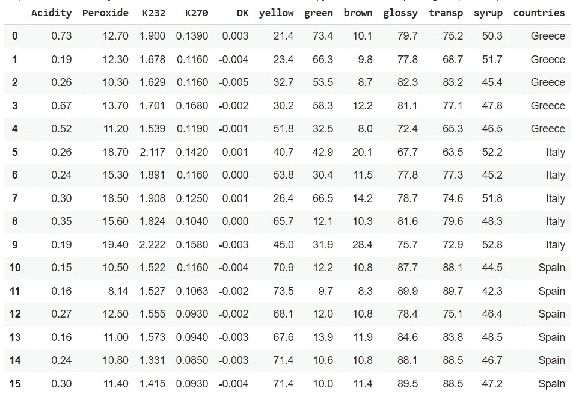

偏最小二乘法-橄榄油数据

Python 中的 PLS 判别分析实际上是通过对转换成哑元的分类变量进行 PLS 回归来完成的。虚拟变量将分类变量转换为具有 1 和 0 值的每个类别的变量:如果行属于该类别，则为 1，否则为 0。

进行虚拟编码是因为 0 和 1 在许多机器学习模型中更容易使用，并且一组虚拟变量包含与原始变量完全相同的信息。

在现代机器学习的行话中，创建虚拟人也被称为一热编码。

您可以使用熊猫创建假人，如下所示:

偏最小二乘法-创建虚拟数据

数据现在将包含三个国家变量:每个国家一个。如果该行属于该国家，则值为 1，否则为 0:

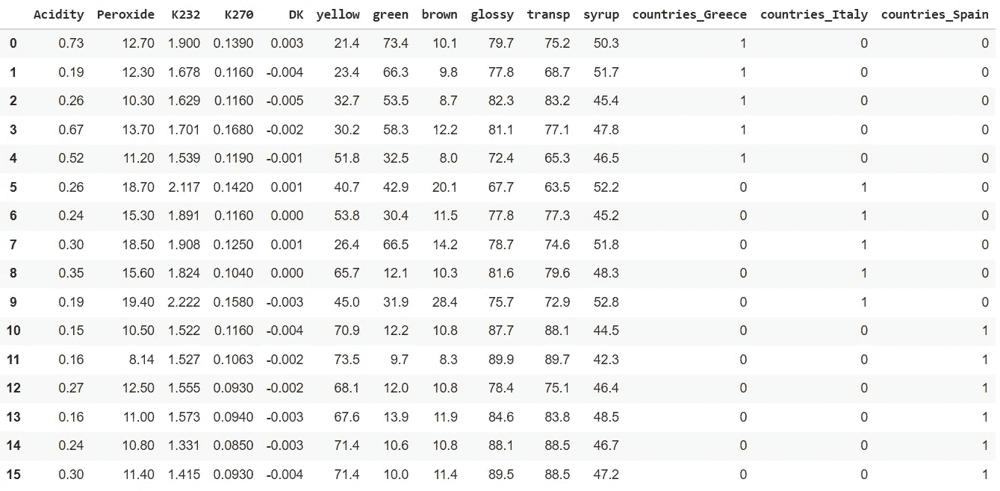

偏最小二乘法-虚拟编码国家

下一步是将数据分割成 X 数据框和 Y 数据框，因为这是 Python 中 PLS 模型所要求的:

偏最小二乘法-在 X 和 Y 方向分割数据

现在我们来看看模型。我们将使用 scikitlearn 包中的 PLSRegression。我们可以直接用两个分量来拟合它，以给出与我们在 R 示例中所做的相同的解释。

偏最小二乘法-拟合偏最小二乘法模型

Python 中多元统计的难点往往是图的创建。在下面的代码块中，创建了一个双绘图。它是逐步编码的:

*   首先我们获得分数。分数代表每种橄榄油在每个维度上的得分。分数将允许我们绘制双标图中的个体。
*   我们需要将分数标准化，以使它们与加载值在同一个图上。
*   然后我们得到载荷。载荷包含每个部件上每个变量的权重。它们将允许我们在双图上绘制变量。
*   然后，我们循环遍历每个个体和每个变量，并为它们绘制一个箭头和一个标签。维度 1 得分或载荷将成为图上的 x 坐标，维度 2 得分或载荷将成为图上的 y 坐标。

代码如下所示:

Python 中的偏最小二乘法-双标图

生成的双绘图如下所示:

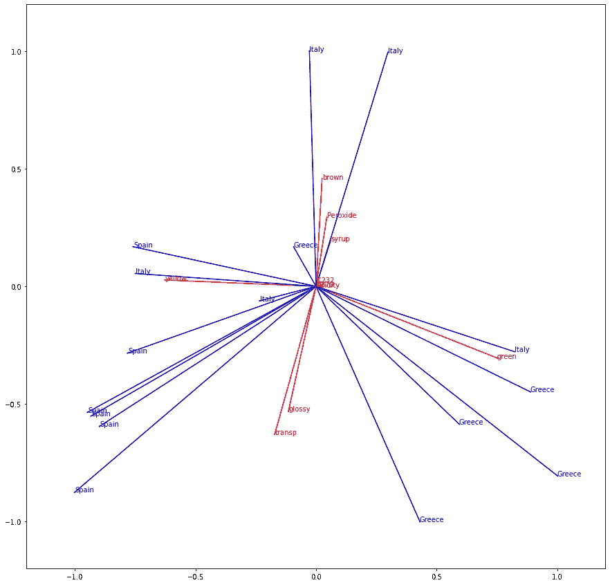

Python 中的偏最小二乘法-双标图

## 结论

双标图的 R 解释将给出与 Python 双标图相同的发现。快速回顾一下调查结果:

*   维度 1 (x 轴)的一边是绿色，另一边是黄色。因此区分黄色和绿色的油是很重要的。
*   在绿色的一边，有很多希腊的油画，在黄色的一边，有很多西班牙的油画。绿色/黄色分离允许区分希腊和西班牙橄榄油。
*   尺寸 2 (y 轴 _ 一侧为棕色，另一侧为光滑透明。很明显，棕色的油和光滑透明的油是有区别的，但两者不能同时存在。
*   意大利的油画倾向于棕色，而西班牙和希腊的油画倾向于光泽和透明。

# 关键要点

在本文中，您首先看到了偏最小二乘法的(许多)变体的概述。此外，您已经看到了使用偏最小二乘法的两种方法的深入解释和实现:

*   偏最小二乘法作为机器学习算法，用于肉类示例中的**预测性能**
*   橄榄油示例中**解释**的偏最小二乘法

您还看到了如何对不同类型的因变量使用偏最小二乘法:

*   肉类用例中**数字因变量**的偏最小二乘**回归**
*   橄榄油用例中**分类因变量**的偏最小二乘法**判别分析**

通过在两个例子中使用 R 和 Python 实现，您现在有了在自己的用例中应用偏最小二乘法所需的资源！

*现在，感谢您的阅读，请继续关注更多数学、统计和数据科学内容！*