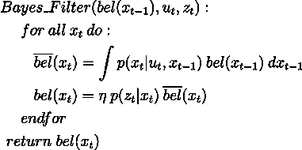

# 基于 Webots 和 ROS2 的粒子滤波定位

> 原文：<https://towardsdatascience.com/particle-filter-localization-with-webots-and-ros2-619ecf0c5f08?source=collection_archive---------16----------------------->

## [思想和理论](https://towardsdatascience.com/tagged/thoughts-and-theory)

## 使用蒙特卡罗方法(粒子滤波定位)帮助机器人在地图中定位。

# 概观

移动机器人必须解决的主要问题之一是**知道它在环境中的位置**。确定机器人相对于其环境的位置和方向(机器人姿态)的过程称为定位。

如果不知道它在环境中的位置，机器人能完成的任务就非常有限。因此这是它要解决的最重要的问题之一。

环境中的 e-puck(图片由作者提供)

我们很容易知道机器人在上图中的位置，因为我们可以看到一切。但是，机器人本身却不是这样。下图显示了机器人对周围环境的了解。

地图中的机器人(图片由作者提供)

它所知道的是地图看起来是什么样子，这不是很准确——有缺失的信息，如墙上的洞等。传感器的读数，有时还有它近似的初始姿态。

如果你把自己放入机器人中，你可以看到，用你所拥有的所有信息和能力来知道你在哪里并不是一件容易的事情。从你现在所处的位置来看，你可能无法百分百确定你在给定地图上的位置。

在本文中，我们将研究解决定位问题最广泛使用的方法，蒙特卡罗定位或通常称为粒子滤波定位。

我们将浏览粒子过滤器本地化的构建模块，并查看我在 Webots 模拟器和 ROS2 上实现的演示。源代码在我的 Github 上，你可以参考。

由于这个主题的复杂性，不可能在这一篇文章中写完所有的内容。我假设你熟悉 ROS2、Webots 模拟器、Python、统计学和概率论等。但是不要担心，如果您对所有这些东西不满意，您仍然可以浏览代码并尝试运行模拟。

# 贝叶斯过滤器

机器人学中许多概率方法的基础是 ***贝叶斯滤波器*** 或也被称为 ***递归贝叶斯估计*** 。在概率机器人学中，机器人姿态等状态由其[概率密度函数](https://en.wikipedia.org/wiki/Probability_density_function)或 pdf 表示。

另一个概念叫做 ***信念*** ，也就是说它是机器人的内部知识，是从它的角度而不是我们的角度。

贝叶斯滤波器是一种使用数学过程模型和测量值递归估计状态的 pdf 的通用方法。

贝叶斯过滤器(作者图片)

该算法根据先前的置信分布 ***bel(t-1)*** 、控制/过程数据*和测量数据 ***z*** 来计算置信分布 ***bel*** ，并且它递归地进行。*

*该算法有两个步骤:*

*   *预测步骤，我们根据之前的状态和控制数据计算我们的预测*
*   *测量更新，我们根据我们的预测和测量数据更新我们的信念分布*

*目前可能还不清楚这些步骤试图做什么。本质上，过滤器帮助我们计算**一些我们不能直接测量的东西**。为此，我们需要两样东西:*

*   *一些我们可以控制的事情*
*   *不准确/有噪音的测量*

*对于我们的机器人，我们可以控制速度(线性和角度)，我们可以使用距离传感器测量到最近物体的距离。因此，通过省略细节，我们的步骤是:*

*   *根据机器人先前的姿态和速度信息，预测机器人已经移动到哪里*
*   *根据传感器的测量结果调整我们的预测*

**

*预测与现实(作者图片)*

*如上图所示，我们的预测是不准确的，它可能是由不同的事情引起的。白色机器人是处于 **t-1** 或先前姿势的机器人，蓝色机器人是基于我们预测的当前姿势，红色机器人是真实姿势。星星是机器人环境中的地标。*

*第二步很重要，因为我们使用我们的测量来调整我们的估计，使之更加准确。因为，如果机器人在蓝色位置，我们应该期望从传感器得到一些读数。当读数不同时，我们相应地调整我们的估计。这是贝叶斯过滤器的基本和直观的概念。*

**

*根据测量数据调整估计值(图片由作者提供)*

*贝叶斯滤波器是一个通用的概念，现实世界的应用包括滤波器如[卡尔曼滤波器](https://en.wikipedia.org/wiki/Kalman_filter)及其变种如 EKF、UKF 等。，以及粒子过滤器，这就是我们在这篇文章中用于我们的定位。*

# *粒子滤波定位的构建模块*

*从上面讨论的两个步骤中，我们可以看到滤波器中有几个不同的组件。对于我们的应用程序，粒子过滤器定位，我们需要以下组件:*

*   *用于预测更新的运动模型*
*   *用于度量更新的度量模型*
*   *用于整体递归更新的粒子滤波器*

*我们可以使用许多方法来实现每个组件，在本文中，我们将重点关注:*

*   *里程计运动模型*
*   *可能性字段*
*   *粒子过滤器*

## *里程计运动模型*

*大多数机器人都配备了车轮编码器来感知车轮旋转了多远。利用这些信息，机器人可以预测它在移动一段时间后的姿态。*

*然而，就像从其他传感器获得的测量值一样，里程计是错误的。它会打滑和漂移。*

*里程计运动模型使用相对运动信息，该信息是先前和当前姿态之间的增量。*

**

*里程计运动模型(图片由作者提供)*

*如果我们知道三角洲，它包括:*

*   *旋转 1*
*   *翻译*
*   *旋转 2*

**

*增量计算(图片由作者提供)*

*我们可以通过在建模错误里程计数据的过程中添加一些不确定性来预测我们当前的姿态。我们将噪声建模为零均值高斯，误差参数为**α1**至**α4**。*

**

*零均值高斯(图片由作者提供)*

*下面噪声函数的输入是方差。*

**

*运动模型噪声(图片由作者提供)*

*最后，我们可以计算我们预测的状态。*

**

*预测状态(图片由作者提供)*

*你可以在 *motion_model.py* 中查看 python 中里程计运动模型的实现。*

## *可能性字段*

*如 [*概率机器人*](https://mitpress.mit.edu/books/probabilistic-robotics) 所述，测量模型描述了传感器测量在物理世界中生成的形成过程。形式上，它被定义为条件概率分布:*

**

*测量模型(图片由作者提供)*

*在我们的例子中，我们对距离传感器进行建模。有不同的方法来模拟距离传感器，例如:*

*   *梁模型*
*   *可能性字段*
*   *地图匹配*
*   *等等。*

*在本文中，我们主要关注似然场模型。该模型并不是一个真正的逆传感器模型，因为其关键思想是将传感器读数的端点投影到地图的坐标框架中。*

*当我们知道终点在地图上的位置时，我们就可以计算出它们是真实的可能性有多大。当没有障碍时，信息没有意义，因此被丢弃。*

*使用这种模型的好处是，与更好地描述传感器测量在物理世界中如何产生的波束模型相比，它更平滑。*

*为了计算地图上的端点，我们使用以下等式:*

**

*坐标框架中的端点(图片由作者提供)*

*算法相当简单，我们只需要计算每个端点到 ***最近物体*** 的距离。获得距离后，我们可以使用均值为零的高斯函数和可配置的标准偏差来模拟噪声，从而计算出概率。*

*对于真实的机器人，我们可能希望模拟不同类型的噪声，例如:*

*   *测量噪声*
*   *传感器故障*
*   *无法解释的随机测量*

*但是对于本文，我们只对测量噪声建模，因为在机器人的环境中没有动态对象。*

*要了解它在 Python 中是如何实现的，请参见 *sensor_model.py* 。我还在同一个 python 模块中实现了 Beam 模型。然而，正如《概率机器人学》一书中所述，它显示出缺乏平滑度，当前状态下的一个小姿势误差会产生很大的影响。很难获得大概率。*

## *粒子过滤器*

*最后也是最重要的组件是粒子过滤器。如上所述，它是从贝叶斯过滤器得到的。但与高斯滤波器不同，它是非参数的，这意味着我们不使用均值和方差等参数，它通过有限数量的样本来逼近后验概率。*

*关键思想是使用从后验概率 **bel(xt)** 中抽取的随机样本。因为它是非参数的，所以它可以表示更广泛的分布，例如，不限于高斯分布，并且它可以模拟非线性系统。这些样本被称为粒子，因此得名粒子滤波器。*

**

*基本粒子滤波算法(图片由作者提供)*

*就像贝叶斯过滤器一样，我们有两个步骤:*

*   *预测，使用样本运动模型*
*   *测量更新，在给定机器人的姿态和地图的情况下，或者在称为权重的粒子滤波器中，获得传感器读数正确的概率*

*直观地说，粒子过滤器通过使用一组粒子/样本来估计真实姿态。区域越密集，越有可能接近真实姿势。参见下面的例子，红色小箭头代表粒子。*

**

*红色小箭头显示粒子(图片由作者提供)*

*我们不会在粒子滤波上深入探讨，因为这是一个非常复杂的话题。然而，由于以下挑战，上述简单算法在实践中并不十分有效:*

*   ***简并问题，**其中一个粒子的权重将非常接近于**1**，而其余的非常接近于**0**，这个问题可以通过**重采样步骤来解决。***
*   ***样本贫化，**其中在对粒子进行重采样之后，它们中的大多数是相同的或者在相同的位置，这可以通过添加**人工噪声**的粗糙化来解决，或者在重采样步骤之后，或者将运动模型参数调整为噪声更大。*
*   ***偏离度，**姿态偏离真实姿态太远的情况，可以通过检查未标准化的权重(概率)来检测，如果它们都非常接近零的话。一种恢复方法是通过使用例如均匀分布来重新初始化粒子。*
*   ***计算复杂度**，粒子滤波器需要**大量样本**才能正常工作。我们使用的粒子越多，计算复杂度就越高。为了克服这个问题，有不同的方法，如**自适应**方法，其中粒子的数量在运行期间动态变化。如果粒子集中在同一位置，则可以减少样本/粒子的数量，以提高计算复杂度。*

*要查看 Python 中实现的细节，请查看 *monte_carlo_localizer.py* 。它实现了重采样和自适应方法。*

# *使用 Webots 和 ROS2 进行仿真*

*要构建软件包，您可以克隆存储库并按照自述文件中的步骤进行操作。*

*在这个模拟中，我们在 Webots 模拟器上使用了一个 e-puck 机器人，它配备了一个远程 ToF 传感器和八个短程红外传感器以及地图。*

**

*环境地图(图片由作者提供)*

*机器人的初始姿态是已知的，但不精确，所以我们将使用高斯分布来初始化我们的粒子。我们粒子的初始数量是 1000。*

## *非自适应粒子滤波器*

*在这种方法中，我们使用非自适应粒子过滤器，这意味着粒子的数量在整个运行过程中保持不变。在我们的例子中，它是 1000 个粒子。*

*正如我们在下面的视频中看到的，初始姿势是错误的，因此过滤器试图调整它。*

*非自适应粒子滤波器定位(视频由作者提供)*

*红色大箭头是里程计姿势，红色小箭头代表粒子。*

*我们命令机器人在开始时旋转 360 度，让粒子过滤器调整初始姿态。我们可以看到误差相当大，初始姿态向右移动。*

*我们还可以看到，粒子过滤器在调整姿态方面表现非常好。这不是很准确，但考虑到大多数时间传感器仅从 t of 传感器读数中提供**一个点**，并且地图也有噪声(有一些缺失的占用信息)，这是可以接受的。*

**

*机器人路径—非适应性(图片由作者提供)*

*蓝线是粒子过滤器路径，红线是里程计路径。我们可以看到，在某些时候，粒子滤波器会调整机器人的姿态。*

## *自适应粒子滤波器*

*如前所述，自适应粒子滤波器在运行过程中动态改变粒子数量，以降低计算复杂度。*

*这是因为如前一段视频所示，大部分时间粒子都集中在一个位置，因此我们实际上可以减少样本数量。看下面这个视频。*

*自适应粒子滤波器(视频由作者提供)*

*我们可以看到，在它开始旋转后，粒子的数量显著减少。从下面的路径中，我们可以看到，与上面的非自适应版本相比，精度没有显著影响。请注意，机器人是随机移动的，因此我们不希望它在所有运行中都遵循相同的路径。*

**

*机器人路径—自适应(图片由作者提供)*

# *摘要和参考文献*

*我们已经看到粒子滤波定位由三个主要部分组成:*

*   *运动模型*
*   *测量模型*
*   *粒子过滤器*

*粒子滤波器有一些我们必须解决的挑战，例如增加重采样步骤，向运动模型添加人工噪声，以及使用自适应方法来降低计算复杂度。*

*希望这篇文章和下面提供的源代码对更多人了解粒子滤波本地化有用。*

## *源代码*

*您可以从以下网址获得完整的源代码:*

*<https://github.com/debbynirwan/mcl>  

要了解更多，我建议您尝试在 Webots 模拟器和 ROS2 上运行它。

## 参考

如果你想了解更多细节，你可以阅读《概率机器人学》一书:

<https://mitpress.mit.edu/books/probabilistic-robotics>  

还有下面这张纸:

<https://www.mdpi.com/1424-8220/21/2/438> *