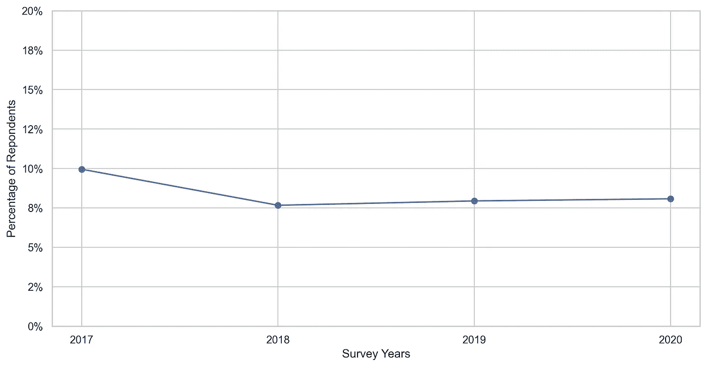
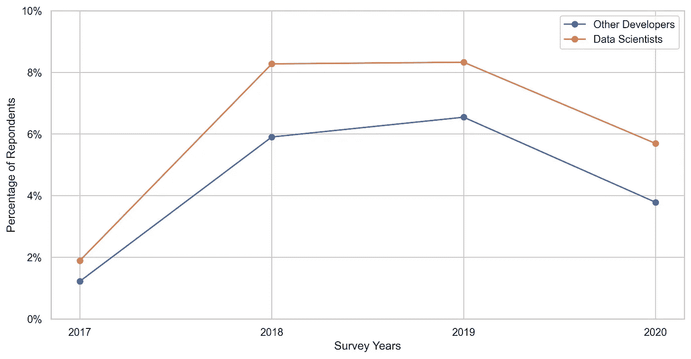
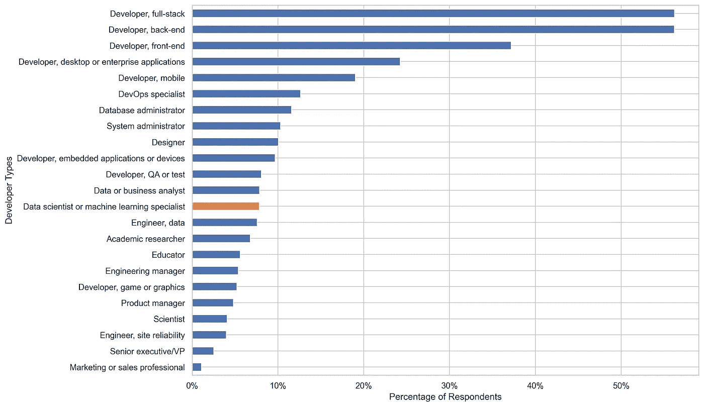
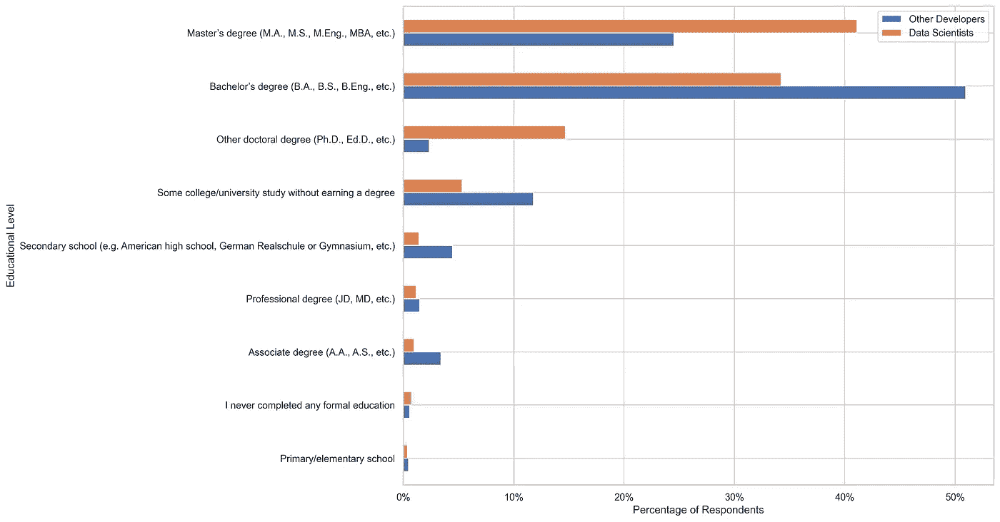
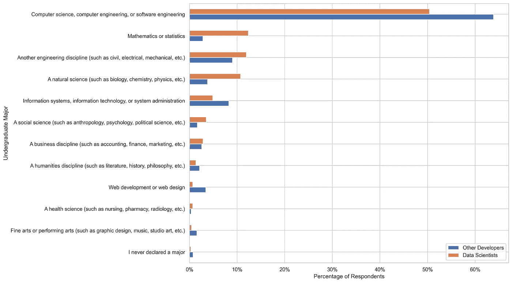
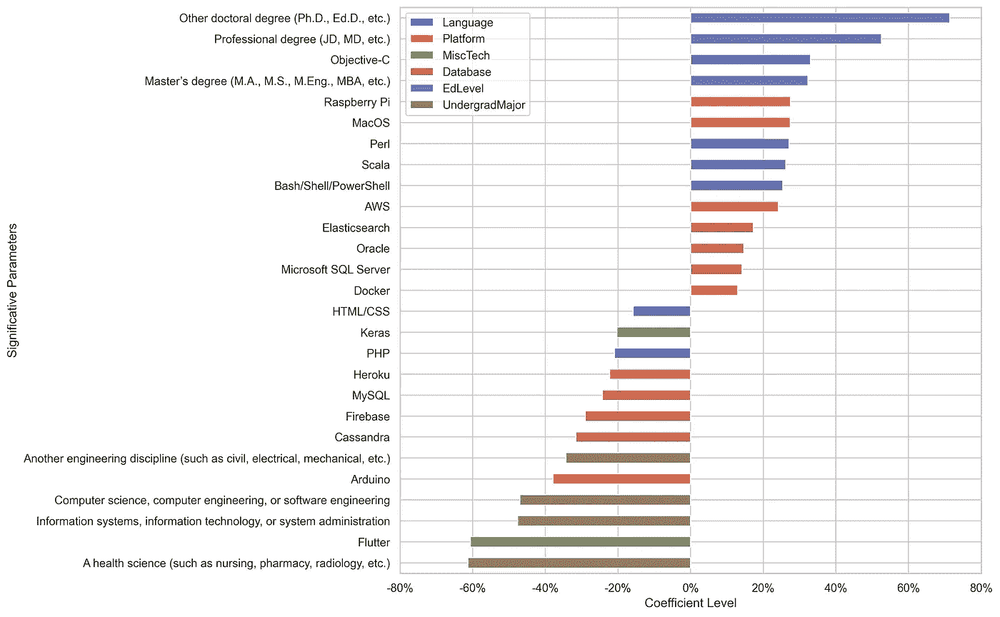

# 通往数据科学的道路

> 原文：<https://towardsdatascience.com/path-to-data-science-84dad09404ab?source=collection_archive---------35----------------------->

## *数据科学的重要技术和教育方面*

原始图像来源:【09d94fd.png(974×330)】(insightextractor.com)

数据科学被预测为 21 世纪最有希望的 T4 工作。因此，它应该会吸引许多试图改变职业的专业人士。对于这些人来说，提前知道作为数据科学家的关键要求是什么，以及什么可以帮助你成为成功的数据科学家，这可能很重要。在本文中，我们将解决其中的一些问题。更具体地说，我们将试图理解数据科学家的主要技术和教育特征，以及他们与其他类型的开发人员的区别。此外，我们将尝试通过这些功能如何影响数据科学家和专业人士的薪酬水平来衡量它们的重要性。

为了回答这些问题，我们将使用来自[堆栈溢出调查](https://insights.stackoverflow.com/survey/2020)的数据。这是世界范围内最大的调查之一，主要涉及编码人员。这已经是该地区的一项既定的传统举措，已经运行了近十年。在 2020 年，这项调查涉及近 65，000 名受访者。

本文使用的所有数据和代码都可以在我的 [GitHub 资源库](https://github.com/leofmr/stack_ds)中找到。

# 前景和机遇

尽管被认为是一个有前途的职业，但从 2017 年到 2020 年，我们在开发人员样本中的数据科学家比例下降了 1.87 个百分点。即使差别不是很大，但也有统计学意义。有人可能会说，我们的样本不足以代表数据科学家的数量。但即便如此，如果数据科学真的是一个有前途的工作，我们预计会看到我们的估计数上升。

数据科学家相对频率的演变

如果阻止数据科学人数上升的原因是专业人员短缺，那么数据科学仍有可能是一个有前途的工作。从这个意义上说，我们仍然有越来越大的兴趣从雇主那里雇佣更多的数据科学家。不幸的是，由于数据科学家群体的失业率更高，这也无法得到证实。

比较数据科学家和其他开发人员之间失业率的演变

# 数据科学家的特点是什么？

为了更好地了解数据科学家专业人士，我们将仅使用 2020 年调查的数据。仅选择那些有效地以专业方式编写代码的受访者(初始样本的 77.54%)，我们得出其中只有 7.83%是数据科学家。大多数受访者认为自己是更传统类型的开发者:全栈(56.22%)、后端(56.21%)和前端(37.19%)。由于回答者可以为他们的答案选择一个以上的选项，所有选项相对频率的总和大于 1。

显影剂类型分布

比较数据科学家和其他开发人员的教育水平，我们可以发现数据科学家通常比其他人有更高的教育水平。超过一半的其他开发人员止步于学士学位(50.96%)，而 41.11%的数据科学家更进一步，获得了硕士学位，14.68%的人甚至更进一步，获得了博士学位。

按本科专业分列的受访者分布

大多数数据科学家和其他开发人员都宣称他们的本科专业是计算机科学、计算机工程或软件工程。尽管这两个群体都是最受欢迎的专业，但其他开发人员的差距为 13.46 个百分点。数据科学家群体中这一较低的比例由数学或统计学(12.35%对 2.81%)、自然科学(10.73%对 3.77%)和其他工程学科(11.93%对 9.01%)中较高的相对频率来补偿。

按本科专业分列的受访者分布

这里的关键点是，数据科学名称中的科学部分很重要。数据科学家的方法就像一种科学方法，我们首先有我们的初始假设，然后我们将做我们的研究来验证我们的假设。数据科学家通常研究更科学的领域，并进一步深入他们的学术结构。这些方面对于发展作为数据科学家工作所必需的数学和研究技能可能很重要。

通过比较两组开发人员在 2020 年使用最多的 10 项技术，我们发现了语言和其他技术的一些显著差异。

Top-10 在 2020 年与其他开发人员和数据科学家的技术合作

虽然 Python 是最受数据科学家开发人员欢迎的语言，但它在其他开发人员中仅获得第五名。另一个重要的区别是关于 R 编程语言。虽然它在数据科学家分布中排名第八，但对于其他开发者来说，它甚至没有进入前十。

杂项是更具体的技术层，也是可以观察到大多数差异的地方。首先，看起来分布更集中在数据科学家群体，反映了技术使用的某种一致性和专业化。在十大杂项技术中，我们可以确定两种重要的技术:机器学习技术(TensorFlow、Keras 和 Torch/Pytorch)和大数据技术(Apache Spark 和 Hadoop)。这两种类型的技术都没有进入其他开发者的前 10 名，强调了数据科学工作的特殊性。

# 技术和教育特征如何反映在薪酬中

为了了解上述技术和教育特征与薪酬水平之间的关系，我们将使用多元线性回归模型(普通最小二乘法— OLS)。通过将所有这些特征的模型与薪酬水平的对数进行拟合，我们可以测量特定特征的存在如何影响薪酬水平的百分比。

用来预测补偿的一些特征被认为是不重要的(它们的系数在统计意义上等于零)。我们在分析中忽略了这些特征，我们将只关注那些对解释补偿差异有重要意义的特征。

技术和教育特征对数据科学家薪酬水平决定的影响

从上面的有序条形图中，我们可以看出，拥有较高的教育水平对专业人士的薪酬贡献最大。根据我们的估计，拥有博士学位预计会使专业人士的薪酬增加 71.37%，而拥有专业学位和硕士学位则分别增加 52.60%和 32.31%。令人惊讶的是，宣布本科专业为更技术性的领域与薪酬呈负相关。申报信息系统、信息技术或系统管理专业的人少挣 47.62%，申报计算机科学、计算机工程或软件工程专业毕业的人少挣 47.02%。

从十种最受数据科学家欢迎的语言来看，只有 HTML/CSS 和 Bash/Shell/PowerShell 具有统计显著性，命令行语言的积极影响是增加了 25.35%的补偿，HTML/CSS 减少了 15.87%。其他不太流行的语言对薪酬产生了积极的影响，Scala 提高了 26.18%，Perl 提高了 27.10%，Objective-C 提高了 33.06%。尽管我们没有发现 Python 与补偿正相关，但这并不意味着这种语言对数据科学家来说不重要。可能的情况是，用 Python 编程正成为数据科学家工作的一项要求。因此，它无助于职业分化，因此不会提高预期的薪酬。

对于这些平台，我们确定了三种对确定补偿水平很重要的部署技术。Heroku 是唯一有负面影响的(22%)。Docker (13.00%)和 AWS (24.17%)都与薪酬有正相关关系。另一个令人惊讶的结果是，大多数流行的杂项技术对薪酬并不重要。只有 Keras 是重要的，但不是以积极的方式，在 2020 年使用该技术导致薪酬水平降低了 20.30%。

# 结论

我们无法确认数据科学仍然是一个有前途的职业。可能是因为我们有一个有偏见的样本，不能正确地代表数据科学家在开发人员中的比例。或者，与我们最初的假设相反，数据科学不再那么有前途，数据科学家的数量已经激增。

我们可以确定的是，与其他类型的开发人员相比，数据科学家有一些显著的不同。Python 是他们的主要语言，被大多数专业人士使用。还有其他针对 te 职业的技术，比如 TensorFlow，Torch/Pytorch，Spark。但即使这些工具很受欢迎，它们对于获得高于平均水平的薪酬并不重要。情况可能是这样的，它们就像是职业的一个要求，而不是为开发者提供任何竞争优势。

获得更高的教育水平才是真正重要的。大多数数据科学家都有硕士或博士学位。此外，拥有更高的教育水平对于获得高于平均水平的薪酬是最重要的。尽管这不是必要条件，但更多的学习可能会为数据科学专业的成功铺平道路。