# 美国患者电子病历的采用

> 原文：<https://towardsdatascience.com/patient-electronic-medical-record-adoption-in-the-us-f961c9b95a96?source=collection_archive---------32----------------------->

## NCI 提示调查数据分析

# 项目定义

## 项目概述

本研究的目的是利用美国国家癌症研究所[健康信息国家趋势调查(HINTS)](https://hints.cancer.gov) 的公开数据，试图了解哪些患者人口统计、健康和互联网/电子设备相关因素推动了美国电子病历(EMRs)的访问和使用。

## 问题陈述

2009 年的《经济和临床健康卫生信息技术(HITECH)法案》为美国医疗保健提供商(hcp)采用和促进患者使用电子病历制定了要求和激励措施[1]。然而，患者对电子病历的使用率似乎很低(< 50%)，包括在慢性疾病状态下[2，3]。

控制患者使用 EMR 的一个因素是它们由 HCP 或其他来源(例如健康保险提供商)提供。了解哪些因素推动了电子病历的可用性，将有助于提高医护人员和健康计划管理者对患者获取电子病历的可能障碍的认识。它还将阐明 EMR 是否被适当地提供给那些最需要它们的人(例如，那些患有多种慢性疾病或不健康生活方式的人)，或者那些可能不太需要它们，但更有可能使用它们的人(例如，更年轻、更健康、受过更好教育的患者，他们可能不需要密切监控他们的健康)。

了解与实际使用电子病历相关的因素也将表明最需要访问或轻松携带其病历的患者(同样，患有多种慢性疾病或健康状况较差的患者，他们可能需要看多个 hcp 或可能需要更频繁地去医院或医生处就诊)是否在实际使用电子病历。

对于这两种结果，可用性和采用是否随着时间的推移而变化，以及在新冠肺炎疫情开始后是否有明显的变化将被评估为模型的一部分。

解决这个问题的策略将是应用多元逻辑回归模型来预测这两个结果。预期的结果是，这些模型将为每个预测变量产生易于解释的系数，允许计算优势比以确定每个变量的影响强度。这些系数也可以用来预测每个结果的可能性，从而确定哪些患者更有可能或更不可能接受和使用电子病历。

最后，将确定 EMR 使用和访问的预测概率≥ 80%和≤ 20%之间患病率差异最大的变量。

## 韵律学

最优模型将是最大化精确度和召回率的模型。这将倾向于最大限度地减少假阳性和假阴性，同时避免使用准确性的陷阱，这可能会在结果类别不平衡的情况下产生误导。

这些指标定义如下:

*精度=真阳性/(真阳性+假阳性)*

*召回=真 _ 正/(真 _ 正+假 _ 负)*

本项目中使用的自动递归特征消除( [RFECV](https://scikit-learn.org/stable/modules/generated/sklearn.feature_selection.RFECV.html) )的 [scikit-learn](https://scikit-learn.org/stable/) 实现采用了这些的组合，F1 分数:

*F1_Score = 2 *精度*召回/(精度+召回)*

在二元变量的情况下，比值比描述了变量存在与不存在时结果的比值。对于连续变量，它是预测值中单位变化的结果的概率。在逻辑回归中，系数为*β*的预测值的优势比是:

*Odds_Ratio = exp(beta)*

# 分析

为了进行这项分析，我们需要有关电子病历可用性和使用的数据，以及有关患者特征的数据，如人口统计、健康状况、病史和互联网/电子设备(e-device)访问，这些数据可能会影响电子病历对患者的可用性及其使用。

这一领域的大多数公开数据集都是由美国政府管理的。本研究使用的资料来源于[健康信息国家趋势调查(提示)](https://hints.cancer.gov)。这是由国家癌症研究所进行的年度调查，目的是:

> (收集)关于美国公众对癌症和健康相关信息的知识、态度和使用的全国代表性数据。提示数据用于监测快速发展的健康传播和健康信息技术领域的变化，并在不同人群中创建更有效的健康传播策略。

## 数据探索和可视化

完整的探索性分析和从中导出的数据集可以在 Jupyter 笔记本“DSND _ 最终 _ 探索. ipynb”的 [Github 存储库](https://github.com/ensst6/Udacity_DSND_FinalProject)中找到。

**方法**

许多提示数据是癌症特异性的；然而，有几个人口统计变量(例如，年龄、种族、性别、地理区域、收入、地理区域)。还有几个领域与互联网和电子设备的使用有关，也与健康状况和获得医疗保健资源有关。还有一些特定于电子病历的可用性和使用的字段。该调查旨在具有全国代表性。

截至 2020 年的多年数据均可获得。每年的调查由一个周期数命名，在一月和四月之间进行。2020 年调查(周期 4)与新冠肺炎疫情的《世卫组织宣言》( 2020 年 3 月 11 日)部分重叠，并且有一个字段表示是否在此日期之前或之后收到回复。

为了评估电子病历的采用是否随着时间的推移而发展，以及在大流行后的时间段(公认是有限的)是否有可察觉的变化，还检索了前两年的数据(周期 2 和周期 3)。

数据集包含 438 到 731 列(来自调查问题)和 3504 到 5438 行(每一行都是唯一的调查回答)。第 3 周期包含更多的回答，因为它包括一个实验，其中允许更多的回答者选择在网上完成调查，而不是在纸上。正如 HINTS 的“网络试点结果报告”(可在 [Github 知识库](https://github.com/ensst6/Udacity_DSND_FinalProject)中获得)中所讨论的，那些被随机分配到网络调查中的人与那些在纸上完成调查的人在几个人口统计数据(性别、年龄、健康状况、教育)上有很大不同。因此，第 3 周期的网络响应数据被删除。剩下 4573 个回答。

在以电子形式进行汇编之前，调查回答已经由 HINTS 工作人员进行了预先筛选，并且只有那些至少完成 50%的回答才被包括在内。除了每个允许回答的代码之外，每个字段还可以包含描述数据丢失原因的代码(例如，不适当的回答、错误回答的问题、省略的回答)。这些代码是:

*   -1:缺少“有效的”。不应填写该字段，因为前面的字段已标记了一个条目，使该字段不适用于此回应者。
*   -2:填写不当。根据以前的回答，该字段应该为空，但回答者给出了答案。
*   -4:难以辨认或不符合要求。回答无法阅读，或者远远超出问题的预期范围(例如，身高 11 英尺，年龄> 105 岁)。
*   -5:选择的答案多于问题的合适答案。
*   -6:对缺失“过滤器”问题的跟进中缺失值。应该触发回答者回答该问题的替代问题没有得到回答，该问题也没有得到回答。
*   -9:失踪/未查明。这个问题应该得到回答，但却没有。

如下所述，这些丢失数据代码是在特定字段的基础上处理的。

虽然大多数调查问题在各个周期中都很常见，但并非所有问题都是如此。提示数据集包括描述每个调查问题并列出可能的回答及其频率的代码本。使用代码簿，对可用变量的相关性和可用数据量进行了预先筛选。此外，与获取和使用电子病历的关联无法区分为因果相关的变量被删除。然后对相关变量进行协调，并保留所有三个周期共有的变量(或可以重新配置以匹配各周期的变量)。代码簿和方法报告可以在 [Github 存储库中获得。](https://github.com/ensst6/Udacity_DSND_FinalProject)

**结果**

初步筛选使用提示码书确定了 59 个变量被认为是相关的，并在所有三年的数据。这些变量的列表可以在“提示-变量. ods”文件的“数据”文件夹中的[中找到。合并后的数据集包含 11942 条记录。](https://github.com/ensst6/Udacity_DSND_FinalProject)

合并的数据被分成 70%/30%的训练集和测试集。然后对训练集进行探索性可视化和单变量统计分析，以识别多变量机器学习模型的潜在特征。使用 Kruskal-Wallis 检验对连续变量进行单变量分析，使用卡方检验对分类变量的 *n* 乘 *m* 列联表进行单变量分析。双侧 p 值<为 0.05 的变量被考虑纳入多变量模型。

*单变量可视化*

由于变量数量巨大，因此显示了代表性的单变量图。其余部分可在笔记本“DSND _ 最终 _ 探索. ipynb”中查看。

代表性人口统计预测值的分布:年龄、性别、种族、教育:

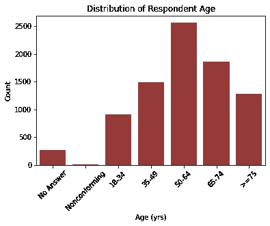

图一。年龄分布

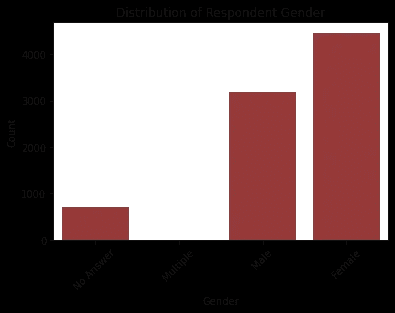

图二。性别分布

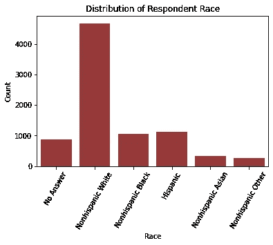

图 3。种族分布

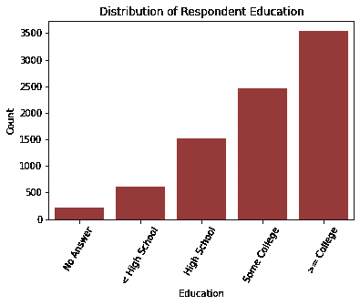

图 4。教育分布

年龄呈相对正态分布，高峰在 50-64 岁。大多数受访者认为自己是白人和女性，最常见的教育水平是大学学历。

结果变量:

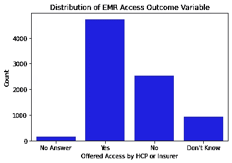

图 5。电子病历访问结果变量的分布

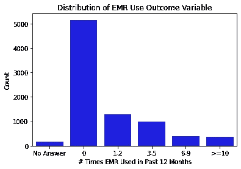

图 6。使用结果变量电子病历分布

HCP 或保险公司向大多数受访者提供了电子病历访问权限。然而，大多数人在过去的 12 个月里没有使用过电子病历。在有过的人中，最常见的频率是 1-2 次。

一个变量“phq4”根据这一分析进行了修改。此变量代表 PHQ-4 心理压力评分。范围从 0 到 12。它在这个尺度上的分布如图 7 所示。

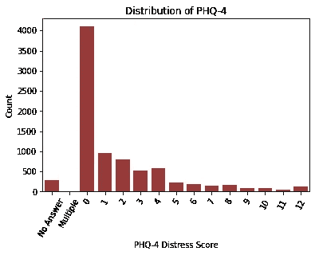

图 7。基于所有可能值的 PHQ-4 评分分布

大部分类别都比较稀疏。此外，通常根据范围进行评分，如下所示[4]:

*   0-2 分:无痛苦
*   3-5 分:轻度痛苦
*   6-8 分:中度痛苦
*   9-12 分:极度痛苦

这一变量被重新配置为代表上述范围的四个类别。修改后的变量如图 8 所示。这仍然是稀疏的，但稍微少一些，更医学相关。

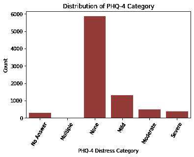

图 8。PHQ-4 类别的分布

*多变量可视化和单变量统计*

*结果变量中缺少条目*

在检查潜在预测因素和结果变量之间的个别关系之前，需要确定处理结果变量中省略响应(缺失数据代码-9)的策略。初步猜测是，没有反应可能表明不感兴趣或不参与。

对于 EMR 访问结果，回答“不知道”的患者和跳过该问题的患者的特征可能相似。如果是这样，丢失的条目可以与“不知道”的条目合并。如果它们不相似，缺少的条目需要作为一个单独的类别保留，或者被删除。
为了评估相似性，对回答“不知道”和没有回答的人的关键人口统计学特征进行了比较。

分析的人口统计学变量有:

*   “阶层”(人口普查地区的少数民族地位)
*   “highspanli”(英语说得不太熟练的人普遍存在)
*   “使用互联网”(互联网使用)
*   “健康保险”(任何形式的保险)
*   “自我性别”(性别)
*   “年龄组”
*   “educa”(教育级团体)
*   “raceethn5”(种族/民族群体)
*   “hhinc”(家庭收入组)

卡方列联表分析用于评估每个人口统计学变量和结果变量之间的关系。零假设是选择“不知道”(代码 3)作为结果变量的受访者与未回答(代码 9)的受访者具有相同的人口统计学特征。另一个假设是，这些群体之间的人口特征是不同的。对于 p 值< 0.05 的测试，无效假设将被拒绝。

分析结果揭示了 p 值< 0.05 for all variables except “stratum” (p = 0.09) and “highspanli” (p = 0.80). This indicates a lack of demographic similarity between the “don’t know” and omitted-answer respondents. Based on these criteria, the two responses can’t be combined. The differences appear to be almost completely driven by a higher frequency of omitted answers (code -9) to the demographic questions for those who also omitted an answer to the EMR access ( “offeredaccesseither”) outcome question. This could indicate a general lack of interest in the survey, or general concerns about providing information. Because these surveys are likely to have a large number of fields with missing data, requiring further assumptions to handle, the missing (-9) entries for this variable were dropped.

For the EMR use variable, categories relate to frequency of use and there isn’t a “don’t know” category. A missing answer could indicate that the respondent doesn’t use an EMR, doesn’t remember whether they have used it, or doesn’t want to respond. Thus, it would be difficult to determine which category to merge the missing-answer category with. Also, since the categories denote increasing frequency, keeping the missing code as a separate category creates a disruption in that order. For these reasons, and since the missing data are relatively infrequent, surveys with missing responses to this question will also be dropped.

Dropping these entries reduces the dataset to 11578 records.

*连续预测因子与结果的单变量关系*

有三个连续的变量:身体质量指数(身体质量指数)，每周平均锻炼时间，每周平均饮酒量。使用盒须图进行图形探索。由于这些变量显示出单变量分布的偏斜(参见“DSND 最终探索”的完整结果)，与结果变量的关系用非参数 Kruskal-Wallis 检验进行了检验。

图 9 和图 10 显示了每个连续变量对每个结果变量的盒须图。

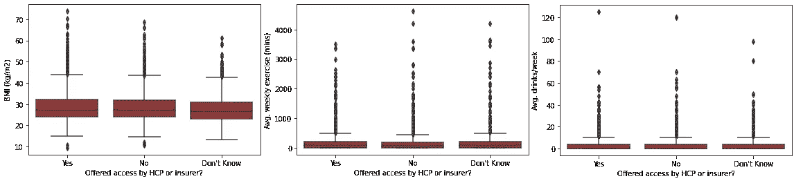

图 9。连续变量与电子病历访问变量的关系

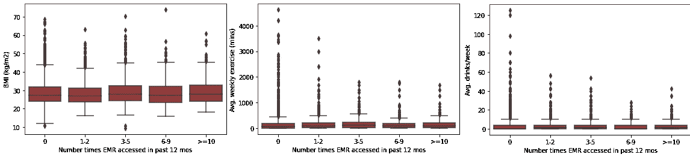

图 10。连续变量和 EMR 使用变量之间的关系

如果排除明显不一致的数据，所有关系在 p < 0.05 level; in fact, all except BMI vs. EMR use ( p = 0.043) had p-values < 0.001\. However, as the plots show, all three predictor variables have many outliers.

These fields *处都是显著的，因为根据方法论，这些数据将被标记为代码-4。*

例如，身体质量指数的值涵盖了一个极端的范围，但在生理上是可能的。平均运动量的数值也并非不合理(即不超过一周的分钟数)。平均饮酒量的数值也很大，但并非不可能，例如 120 杯/周就是 17 杯/天。

因此，有可能极端只是代表极端的行为或生理极端。由于这个原因，离群值没有被丢弃。相反，通过将这些变量转化为范畴，它们的影响被削弱了。

在此之前，缺失的条目(所有负代码)被删除，因为它们不能被放入分位数。这样做留下了 9803 个条目，主要是因为 940 个省略了对“每周平均饮酒量”问题的回答。

身体质量指数被分为四分位数，分界点如下:

第一个四分位数:21.6 千克/平方米

第二个四分位数:25.6 千克/平方米

第三个四分位数:29.4 千克/平方米

第四个四分位数:37.8 千克/平方米

另外两个变量有大量的零值条目。分位数不太适合这些情况，因为箱的边缘是不唯一的。对于这些变量，使用生理临界值代替。

对于“weeklyminutesmoderateexercise”(分钟/周的适度锻炼)，疾病控制中心(CDC)建议成人每周至少 150 分钟[5]。基于此建议的类别有:

*   0 分钟/周(最常观察到的值)
*   > 0 到< 50% recommended (0 — <75 mins)
*   ≥ 50% to < 100% recommended (75 — < 150 mins)
*   ≥ 100 to < 150% recommended (150– 224 mins)
*   ≥ 150% recommended (≥ 225 mins)

For “avgdrinksperweek” (average number of weekly alcoholic drinks), CDC recommendations [6] were again used. Those recommendations define heavy drinking as ≥ 8 drinks/week for women and ≥ 15 drinks/week for men [6]. For respondents who didn’t specify a gender, the mean value of ≥ 11.5 drinks/week was used. Cutoffs similar to those used for exercise were chosen:

*   0 drinks/week (the most frequent category)
*   > 0 到< 50% heavy drinking (M: 1–7; F 1–3; not specified: 1–5 drinks)
*   ≥ 50% to < 100% heavy drinking (M: 8–14; F: 4–7; not specified: 6–11 drinks)
*   ≥ 100 to < 150% heavy drinking (M: 15–22; F: 8–12; not specified: 12–17 drinks)
*   ≥ 150% heavy drinking (M: ≥ 23; F: ≥ 13; not specified: ≥ 18 drinks)

*分类预测因子与结果的单变量关系*

用条形图研究了图形关系。使用卡方列联表方法进行统计分析。

最初的分析包括-9“省略回答”代码。

对于这两个结果变量，唯一具有非显著关系(卡方 p 值> 0.05)的预测因子是“eciguse”，表示主动电子烟消费。此变量已被删除。包括“eciguse”在内的代表性地块如下所示。整套资料可在“DSND _ 最终 _ 探索. ipynb”笔记本中找到。

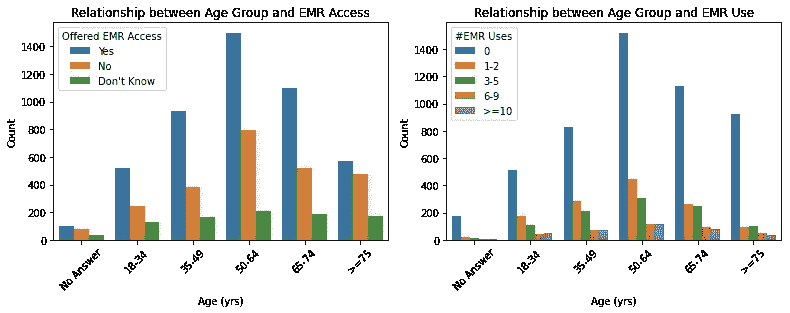

图 11。年龄和结果变量之间的关系。两种结果的卡方 p 值< 0.001。

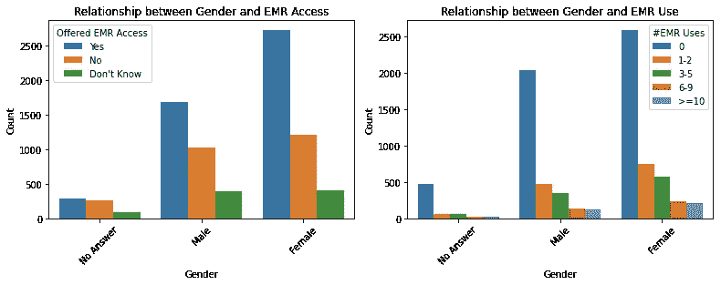

图 12。性别和结果变量之间的关系。两种结果的卡方 p 值< 0.001。

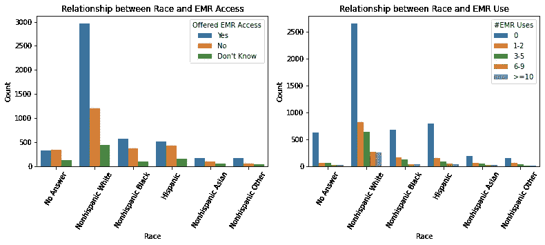

图 13。种族和结果变量之间的关系。两种结果的卡方 p 值< 0.001。

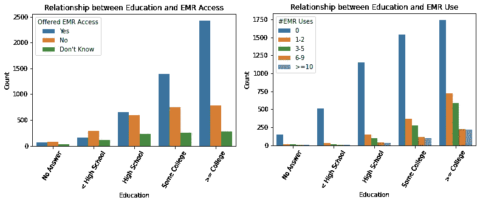

图 14。教育和结果变量之间的关系。两种结果的卡方 p 值< 0.001。

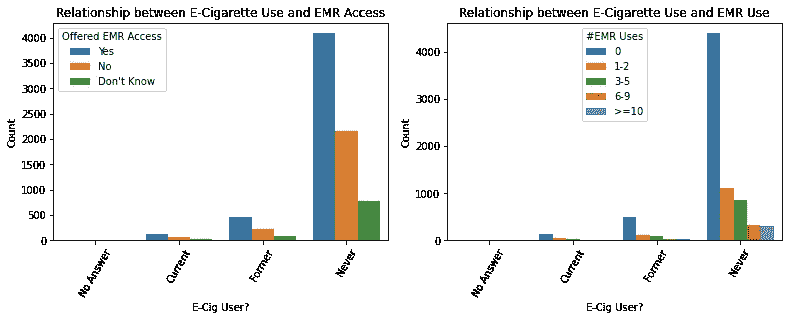

图 15。电子烟使用和结果变量之间的关系。EMR 访问和 EMR 使用的卡方 p 值分别为 0.214 和 0.882。

一般来说，除了性别、家庭收入和种族之外，9 代码很少见。对于这些变量,-9 条目被保留为单独的类别，因为它们可能表示不认同给定的选择(对于种族和性别),或者不愿意透露个人信息。

对于其余变量，通过检查其相对于其他响应类别的频率，并在删除该代码后重新运行分析，对该代码的影响进行了评估。这表明某些类别的显著 p 值可能是由于-9 标志的存在。在某些领域，这是因为其他反应很少。在其他情况下，这是由于-9 场中的小频率导致与预期值的相对较大的差异。为了避免这些未回答的问题影响最终的多变量模型，包含它们的行被删除。

删除缺失数据代码后，数据集缩减到 7818 个条目(训练集中 5490 个，测试集中 2328 个)。在该训练集中，以下预测因素不再与结果有显著关系(卡方检验 p > 0.05):

*EMR 访问结果:*

*   “健康保险”(tricare 或其他军事保险)
*   “退伍军人健康保险”
*   “healthins_ihs”(仅限印度健康服务福利)
*   “healthins_other”(上文未具体说明的其他保险)
*   “medconditions_highbp”(曾被诊断患有高血压)
*   “medconditions_heartcondition”(曾被诊断患有心脏病)
*   “medconditions_lungdisease”(曾被诊断患有肺部疾病)

*电子病历使用结果:*

*   “健康保险”(tricare 或其他军事保险)
*   “退伍军人健康保险”
*   “healthins_ihs”(仅限印度健康服务福利)
*   “medconditions_lungdisease”(曾被诊断患有肺部疾病)

最后四个预测因子，对两个结果都不重要，被删除了。

此外，有几个与互联网接入方式和位置相关的变量，其中受访者可以做出多种选择(例如，通过手机、wifi、宽带、拨号接入；在家里、工作场所、公共场所使用互联网)。健康保险的类型也有多种选择。为了避免冗余和使用多个相关变量过度拟合的可能性，对这些变量进行了更仔细的检查，并进行了一些合并。

就互联网接入方式而言，存在大量重叠，一些受访者甚至报告同时使用宽带和拨号上网。所有的问题都是“是/否”,所以没有什么可以表明那些选择了多个选项的人最常使用哪种模式。鉴于此，只保留了宽带类别(以及基本互联网接入与无接入变量)。那些选择这个选项的人承认他们拥有基于家庭的、相对高速的互联网接入，并且对电脑足够了解，知道这就是他们所拥有的。因此，这一类别可能会区分更多和更少的互联网知识的受访者。

对于互联网接入地点，类别之间再次出现严重重叠，即使是那些受访者报告日常使用的地点。然而，较少的主要使用公共场所的受访者有其他机会访问互联网。这可能会限制他们使用电子病历的能力。因此，创建了一个访问位置类别“whruseinet_pubvother ”,与“从不”或“不适用”相比，表示“每天”或“有时”使用公共互联网，其他类别则被删除。

最后，对于保险，由于与结果的关系不显著，已经排除了几种可能的反应(见上文)。此外，删除了“healthins_other ”,因为它与电子病历的使用没有显著关系，并且与选择“是”的受访者相比，遗漏的回答更多。这种不平衡可能使其成为无效的预测器。

保险类别有一些重叠，因为一个病人可能有一级和二级保险。相对较少的受访者只有医疗补助，这被认为是穷人或残疾人的“安全网”保险。然而，将那些享受公共资助保险(医疗保险或医疗补助)的人与那些享受私人保险的人进行比较是很有趣的。这些和其余的保险类别被合并为一个变量“healthins _ pubpriv ”,表示没有医疗保险/医疗补助的私人/雇主提供的保险，没有私人或雇主发放的保险的医疗保险/医疗补助，没有或其他。

在这些操作后，数据集包含 41 个预测变量(38 个与 EMR 访问有关；41 到 EMR 使用)。该数据集用于开发多元逻辑回归模型。

# 方法学

## 数据预处理

数据被读入[熊猫](https://pandas.pydata.org/)数据框。提示数据文件有 SAS、SPSS 和 STATA 格式。Pandas 的 SAS 导入不允许限制要读入的列集，而第 2 周期的 SPSS 文件似乎已损坏，无法加载。出于这些原因，使用了 STATA 文件。

59 个变量中有 55 个是分类变量。它们被从浮点转换成整数。

如上所述，第 3 周期包括一个实验，其中一部分受访者可以在网上完成调查。如前所述，这些回复被删除，因为这些回复的人口统计数据与纸质回复的人口统计数据存在显著差异。

根据这些数据集中的字段，创建了两个结果变量:

1.  EMR 可用性(变量名“offeredaccesseither”):HCP 或保险公司是否向患者提供了 EMR 访问权限(编码为“是”、“否”或“不知道”)。这是周期 2 的单个变量，但必须通过合并两个变量来创建(“offeredaccesshcp 2”):HCP 是否向受访者提供了访问权限？；以及“offeredaccessinsurer2”:保险公司是否向被调查者提供了访问权限？)用于第 3 和第 4 周期。
2.  EMR 使用(变量名“accessonlinerecord”):在过去 12 个月中，患者访问其 EMR 的频率(分为从“无”到“≥ 10”的 5 个类别)。这个变量在所有三个数据集中以相同的形式存在。

两个变量都是多类的，有一些稀疏的响应类别。初步分析是在它们保持原样的情况下进行的，如果多类分类较差，则计划将它们二值化。

此外，增加了一个名为“调查周期”的变量，以说明时间和大流行后时期的影响。这用 2 和 3 编码，代表那些周期，4 代表疫情之前的周期 4，5 代表疫情之后的周期 4。

然后合并三个周期的数据集，并评估缺失数据的频率。代码-1 和-2 在此分析中被忽略，因为它们代表回答者不应该回答的问题。大多数变量缺失≤ 2%的数据，只有“avgdrinksperweek”大于 10%，为 12.1%。基于此，没有变量因过度遗漏而被删除。

缺失数据通常通过删除来处理。例外情况如上所述。

## 履行

该项目是用 Python 实现的。在 Jupyter 笔记本“DSND _ 最终 _ 探索. ipynb”中进行数据处理、清理和初步分析。

使用这些测试的 [SciPy](https://www.scipy.org/) 实现来执行 Kruskal-Wallis 和卡方列联表分析。

使用 scikit-learn 的[逻辑回归](https://scikit-learn.org/stable/modules/generated/sklearn.linear_model.LogisticRegression.html)分类器创建多变量逻辑回归模型。平衡类权重用于解释结果反应类别之间的不平衡。分类变量是一次性编码的，每个模型都有一个参考类别。每个模型都适合训练数据集，并在测试集上进行评估。

首先尝试了使用每个结果变量的所有可能反应的多类模型。如果由于类别不平衡，这些被证明是不充分的，则响应被二进制化，并且模型被重新拟合。在笔记本“DSND _ 最终 _ 分析. ipynb”中进行机器学习分析。

用 scikit-learn 的递归特征消除算法( [RFE](https://scikit-learn.org/stable/modules/generated/sklearn.feature_selection.RFE.html) 和 [RFECV](https://scikit-learn.org/stable/modules/generated/sklearn.feature_selection.RFECV.html) )实现特征选择和减少。使用他们的网格搜索实现( [GridSearchCV](https://scikit-learn.org/stable/modules/generated/sklearn.model_selection.GridSearchCV.html) )进行模型调整。

最后，使用 scikit-learn 的[分类度量](https://scikit-learn.org/stable/modules/model_evaluation.html#classification-metrics)实现来计算精确度、召回率和混淆矩阵。

## 精炼

从初步筛选中识别的所有特征开始，使用递归特征消除(RFE)完成特征选择和减少。首先，使用交叉验证 RFE(rfe cv)进行自动选择，通过 F1 评分进行模型评估。

使用交叉验证的网格搜索方法尝试了模型调整。网格搜索中使用的参数是逻辑回归正则化参数 *C* ，平衡与无类别加权，以及 RFECV 中使用的特征缩减步长。随后，通过使用具有一系列规定数量特征的手动 RFE 来寻找更简洁的模型。

通过比较训练集和测试集之间的精度和召回率来评估过度拟合，检查测试集性能的大幅下降。每个结果的最佳模型是最节省的模型，它最大限度地提高了精确度和召回率。

中间和最终模型解决方案将在下面讨论。

# 结果

下面概述的用于机器学习模型开发的完整过程和代码包含在笔记本“DSND _ 最终 _ 分析. ipynb”中。

## 模型评估和验证

**EMR 访问模型**

对 38 个分类变量进行一次性编码，并为每个变量提供一个参考类别，得到了 106 个潜在的预测特征。对所有三个结果(“是”、“否”和“不知道”)拟合具有自动 RFECV 修剪的多类逻辑回归模型产生了 64 个特征，在测试集上具有相对较差的精度(0.622)和召回率(0.555)。训练集参数相似(0.666 和 0.598)，表明没有明显的过度拟合。

该模型使用网格搜索对以下参数进行了调整:

*   逻辑回归分类权重:平衡，无
*   逻辑回归正则化参数 *C* : 0.01，0.1，1，10，100
*   每次 RFECV 迭代中删除的特性数:1、3、5

调整产生了一个具有 81 个特征的模型，并且在精度(0.630)和召回率(0.567)上有最小的改进。最佳参数是 *C* = 0.01，平衡的类权重，以及每次 RFECV 迭代移除一个特征。再次，过度拟合并不明显(训练集精度 0.667，回忆 0.602)。

为了潜在地提高适合度，稀疏的“不知道”类别与“不”类别合并，创建了具有更好的类别平衡的二元结果。具有默认参数和 RFECV 修剪的二元模型具有 52 个特征，并且提高了精确度(0.702)和召回率(0.696)。训练集值为 0.728 和 0.719，因此不怀疑过度拟合。

使用上述相同参数空间的网格搜索调整产生了具有基本相同精度(0.706)和召回率(0.700)的 93 特征模型。训练集值是相似的(0.724 和 0.714)。最佳参数是 *C* = 0.01，平衡的类权重，以及每次 RFECV 迭代消除一个特征。

由于特征的增加和拟合的最小改进，网格搜索调整的模型被丢弃，并且初始模型被作为使用 RFE 手动特征减少的起点。从这个 52 个特征的模型中，拟合了 RFE 选择的具有 5 至 50 个参数(以 5 个参数为增量)的简化模型。图 16 显示了手动 RFE 调谐的结果。在 30 个特征上获得了最佳的准确率(0.705)和召回率(0.699)，该模型被选为最终模型。同样，训练和测试集精度(0.723)和召回率(0.715)是相似的，表明没有明显的过度拟合。

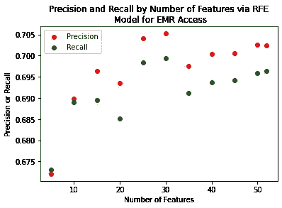

图 16。作为 EMR 访问的逻辑回归模型中特征数量的函数的精度和召回率(作为二元结果)。

最终模型中包含的功能如下所示。

**与获得 EMR 访问权限的可能性较高相关的特征:**

*人口统计&时间统计:*

*   “educa_4”:大学或高等教育(相对于所有其他级别)
*   “selfgender_2”:女(对男还是没答案)
*   “调查 _ 周期 _ 3”:2019 年(对比 2018 年、2020 年疫情会议前后)
*   “调查 _ 周期 _4”:疫情之前的 2020 年(对比疫情之后的 2018 年、2019 年、2020 年)
*   “调查 _ 周期 _5”:大流行后的 2020 年(与疫情前的 2018 年、2019 年、2020 年相比)
*   “Age grpb _ 4”:65-74 岁(相对于所有其他年龄层；最高≥ 75)

*健康相关:*

*   “固定提供者”:有固定的 HCP(相对于没有)
*   “健康保险”:有某种形式的健康保险(相对于没有)
*   “everhadcancer”:曾被诊断患有癌症(相对于从未)
*   “qualitycare_1”:将 HCP 的护理质量评定为“优秀”(与“不去”、“非常好”、“好”、“一般”、“差”相对比)
*   “qualitycare_2”:将 HCP 的护理质量评定为“非常好”(与“不要去”、“优秀”、“良好”、“一般”、“差”相对)
*   “freqgoprovider_2”:每年见 HCP 两次(相对于 0、1、3、4、5–9 和≥ 10)
*   “freqgoprovider_3”:每年查看 HCP 3 次(相对于 0、1、2、4、5–9 和≥ 10)
*   “freqgoprovider_4”:每年查看 HCP 4 次(相对于 0、1、2、3、5–9 和≥ 10)
*   “freqgoprovider_5”:每年查看 HCP 5–9 次(相对于 0、1、2、3、4 和≥ 10)
*   “freqgoprovider_6”:每年查看 HCP ≥ 10 次(相对于 0、1、2、3、4 和 5–9)

*电子设备&互联网相关:*

*   “使用互联网”:使用互联网浏览网页/收发电子邮件(与不使用互联网相比)
*   “electronic_selfhealthinfo”:在过去 12 个月中使用过电子方式搜索与健康相关的信息(从未使用过)
*   “whruseinet_pubvother_1”:在公共场所(如图书馆)“经常”或“有时”使用互联网(与从不或不使用互联网相对)
*   “whruseinet_pubvother_2”:不要在公共场所(如图书馆)使用互联网(相对于经常/有时或不使用互联网)
*   “tablethealthwellnessapps _ 1”:在平板电脑上安装健康/保健应用程序(相对于没有或不拥有平板电脑)
*   “tablet_discussionshcp_1”:使用平板电脑作为与 hcp 讨论的辅助工具(相对于没有或不拥有平板电脑)

**与获得 EMR 访问权限的可能性较低相关的特征:**

*人口统计&时间统计:*

*   “highspanli”:语言孤立(高流行率，不太精通英语的人)
*   “raceethn5_4”:非西班牙裔亚洲人(相对于所有其他种族群体)
*   “censdiv_6”:东南中心人口普查处(肯塔基州、田纳西州、密西西比州、阿拉巴马州；与所有其他部门相比)
*   “hhinc_1”:最低类别的家庭收入(< $20k/yr; vs. all higher categories & not reported)
*   “maritalstatus_6” : Single (vs. all other categories)

*与健康相关:*

*   “healthins _ pubpriv _ 2”:公共保险(医疗保险/医疗补助)，无雇主提供的保险(相对于私人/雇主提供或其他/无)
*   “avg drinks _ cat _ 5”:≥150%的饮酒量 CDC 分类为重度饮酒(M ≥ 23，F≥13；其他:≥18；这是最高的类别；与所有较低类别相比)
*   " ownabilitytakecarehealth_5 ":"一点也不"对自己照顾健康的能力有信心(相对于完全、非常、有点或有点信心)

图 17 显示了每个变量的优势，用优势比来衡量。在图中，1.0 处的分割线划分了与 EMR 访问相关的特征(绿色；比值比> 1.0)和那些与 EMR 使用无关的(红色；比值比< 1.0)。

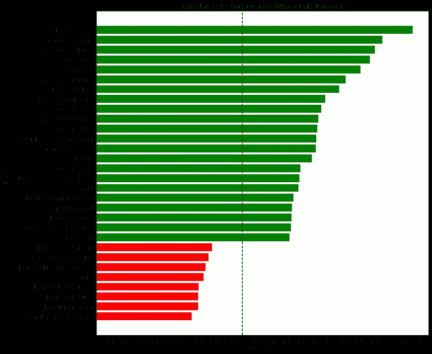

图 17。与 EMR 访问相关的特征的优势比(作为二元变量)。

拥有任何类型的保险与获得 EMR 访问权限的关联最强，其次是护理评级为“优秀”。女性、较高的教育程度和年龄也很重要。唯一有显著影响的慢性疾病是癌症史，尽管更频繁地访问 HCP 与获得访问的可能性更高相关。使用互联网，以及出于健康相关目的使用 it 和电子设备也是预测因素。最后，2019 年至 2020 年(相对于 2018 年)的调查周期与 EMR 访问的增加相关，疫情会议前的 2020 年权重最高，其次是疫情会议后的 2020 年，然后是 2019 年，这表明存在时间效应，尽管可能不是线性的。

相比之下，对自己照顾自己健康的能力“完全没有信心”与*没有*获得电子病历联系最紧密，其次是非西班牙裔亚裔种族身份。处于最低收入阶层、单身、仅享有 Medicare 和/或 Medicaid，以及居住在东南中心人口普查区或语言隔离区，也与访问权限减少相关。没有慢性疾病出现，但大量饮酒也预示着减少访问。

图 18 描述了 10 个特征，它们在提供 EMR 访问的预测概率≥ 80%和≤ 20%之间具有最大的差异。红色柱表示在被提供 EMR 访问的预测概率≤ 20%的患者中更普遍的特征，而绿色柱表示在预测概率≥ 80%的患者中更普遍的特征。

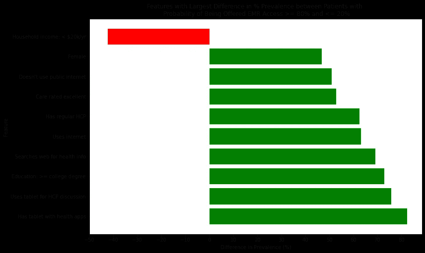

图 18。被提供 EMR 访问的概率≤ 20%和≥ 80%的患者之间患病率差异最大的特征。

前 10 个变量中在低概率群体中更普遍的唯一变量是最低家庭收入层(＄20，000/年)。

在高概率组中，患者更可能是女性，并且至少具有大学学位。从医学上讲，他们更有可能定期接受 HCP 检查，并对 HCP 的医疗质量给予最高评级(优秀)。其余变量与互联网接入和使用有关:他们更有可能使用互联网，但不太可能通过公共接入(如图书馆)这样做。他们更可能使用互联网和平板电脑等设备来查找健康信息，监控自己的健康状况，并与他们的 HCP 进行讨论。

## 电子病历使用模型

用一键编码扩展 41 个分类变量，并省去一个参考类别，得到 109 个潜在特征，用于预测在过去 12 个月内使用电子病历的可能性。类别包括“无”(包括无权访问 EMR 的人)、1-2 次、3-5 次、6-9 次和≥ 10 次。

再次，多类逻辑回归模型被用来预测所有五种可能的结果。该结果的初始 RFECV +逻辑回归模型有 82 个特征和相当的精确度(0.607)，但召回率很低(0.471)。训练集值是相似的(0.627 和 0.512)。

再次执行网格搜索调优。因为这个结果的类明显不平衡，所以没有尝试类权重=无。网格是:

*   逻辑回归正则化参数 *C* : 1x10^-5，1x10^-4，1x10^-3，0.01，0.1，1，10，100
*   每次 RFECV 迭代中删除的特性数:1、3、5

这种网格搜索给出了 99 个参数的模型，具有降低的精度(0.551)和略微改进但仍然差的召回率(0.517)。最佳参数是 *C* = 1x10^-5，每次 RFECV 迭代删除一个特征。过度拟合并不明显:训练集精度为 0.554，召回率为 0.521。

与 EMR 访问结果一样，罪魁祸首被认为是导致不平衡预测的不太频繁的类别。因此，一个比较“没有”和“任何”使用电子病历的二元结果变量产生了。

这个结果的 RFECV +逻辑回归模型显示使用 62 个特征大大提高了精确度(0.741)和召回率(0.724)。训练集值(0.752 和 0.740)没有表明过度拟合。

使用与上面相同的参数网格的网格搜索调优将特征空间减少到 54，但是具有较低的精度(0.709)和召回率(0.689)。最佳参数与多级模型相同。训练集性能(精度 0.714，召回 0.703)没有表明过度拟合。

基于这些结果，62 特征模型被用作手动 RFE 调整的起点。创建了包含 5 至 60 个特征(同样以 5 个特征为增量)的模型，并比较了它们的得分。

图 19 显示了手动 RFE 调谐的结果。用 45 个和 50 个特征获得了最佳精度(0.742)和召回率(0.724)；具有 45 个特征的模型被选为最节俭的。如前所述，对于训练集，观察到精度(0.749)和召回率(0.736)的最小差异，降低了过度拟合的可能性。

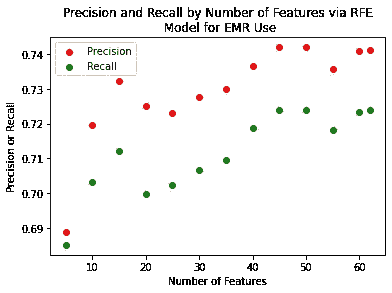

图 19。作为电子病历使用的逻辑回归模型中特征数量的函数的精确度和召回率(作为二元结果)。

下面列出了为此型号选择的功能。

**使用电子病历可能性较高的特征:**

*人口统计&时间统计:*

*   “educa_2”:高中教育(相对于所有其他级别；最低/参考是
*   “educa_3”:一些大学教育(相对于所有其他级别)
*   “educa_4”:大学或高等教育(相对于所有其他级别)
*   “selfgender_2”:女(对男还是没答案)
*   “censdiv_9”:太平洋人口普查司(CA，OR，WA，AK，HI；与所有其他部门相比)
*   “调查 _ 周期 _ 3”:2019 年(对比 2018 年、2020 年疫情会议前后)
*   “调查 _ 周期 _4”:疫情之前的 2020 年(对比疫情之后的 2018 年、2019 年、2020 年)
*   “调查 _ 周期 _5”:大流行后的 2020 年(与疫情前的 2018 年、2019 年、2020 年相比)

*健康相关:*

*   “固定提供者”:有固定的 HCP(相对于没有)
*   “健康保险”:有某种形式的健康保险(相对于没有)
*   “medconditions_diabetes”:曾被诊断患有糖尿病(相对于从未)
*   “everhadcancer”:曾被诊断患有癌症(相对于从未)
*   “qualitycare_1”:将 HCP 的护理质量评定为“优秀”(与“不去”、“非常好”、“好”、“一般”、“差”相对比)
*   “qualitycare_2”:将 HCP 的护理质量评定为“非常好”(与“不要去”、“优秀”、“良好”、“一般”、“差”相对)
*   “qualitycare_3”:将 HCP 的护理质量评定为“好”(与“不要去”、“优秀”、“非常好”、“一般”、“差”相对比)
*   “qualitycare_4”:对 HCP 的护理质量进行“一般”评级(与“不要去”、“优秀”、“非常好”、“好”、“差”相对)
*   “qualitycare_5”:将 HCP 的护理质量评定为“差”(与“不要去”、“优秀”、“非常好”、“良好”、“一般”相比)
*   “freqgoprovider_3”:每年查看 HCP 3 次(相对于 0、1、2、4、5–9 和≥ 10)
*   “freqgoprovider_4”:每年查看 HCP 4 次(相对于 0、1、2、3、5–9 和≥ 10)
*   “freqgoprovider_5”:每年查看 HCP 5–9 次(相对于 0、1、2、3、4 和≥ 10)
*   “freqgoprovider_6”:每年查看 HCP ≥ 10 次(相对于 0、1、2、3、4 和 5–9)
*   “smokestat_2”:以前吸烟者(与现在相比，从不吸烟)
*   “smokestat_3”:从不吸烟(对比现在和以前)

*电子设备&互联网相关:*

*   “使用互联网”:使用互联网浏览网页/收发电子邮件(与不使用互联网相比)
*   “electronic_selfhealthinfo”:在过去 12 个月中使用过电子方式搜索与健康相关的信息(从未使用过)
*   “intrsn_visitedsocnet”:使用互联网访问社交网络(相对于没有或不浏览)
*   “whruseinet_pubvother_1”:在公共场所(如图书馆)“经常”或“有时”使用互联网(与从不或不使用互联网相对)
*   “whruseinet_pubvother_2”:不要在公共场所(如图书馆)使用互联网(相对于经常/有时或不使用互联网)
*   “tablethealthwellnessapps _ 1”:在平板电脑上安装健康/保健应用程序(相对于没有或不拥有平板电脑)
*   “tablet_discussionshcp_1”:使用平板电脑作为与 hcp 讨论的辅助工具(相对于没有或不拥有平板电脑)
*   “havedevice_cat_5”:拥有多个电子设备(手机、普通电话、平板电脑；与没有或其中之一相比)
*   “internet_broadbnd_1”:通过宽带连接访问互联网(相对于不要或没有互联网)

**EMR 使用可能性较低的特征:**

*人口统计&时间统计:*

*   “highspanli”:语言孤立(高流行率，不太精通英语的人)
*   “raceethn5_3”:西班牙裔(相对于所有其他种族群体)
*   “censdiv_2”:中大西洋人口普查局(新泽西州、纽约州、宾夕法尼亚州；与所有其他部门相比)
*   “censdiv_6”:东、南、中人口普查局(肯塔基州、田纳西州、密西西比州、阿拉巴马州；与所有其他部门相比)
*   “censdiv_8”:山区人口普查司(亚利桑那州、CO、ID、NM、MT、UT、NV、WY；与所有其他部门相比)
*   “nchsurcode2013_4”:大都市:小型地铁城市与农村分类(6 个分类中的第 4 个最小分类；与所有其他分类相比)
*   " nchsurcode2013_5 ":非大都市:小城市与农村分类(6 个分类中的第 5 个最小分类；与所有其他分类相比)
*   “hhinc_1”:最低类别的家庭收入(< $20k/yr; vs. all higher categories & not reported)
*   “hhinc_2” : Household income in second-lowest category ($20–34.99k/yr; vs. all other categories & not reported)
*   “maritalstatus_5” : Separated (vs. all other categories)

*健康相关:*

*   “phq4_cat_4”:基于 PHQ-4 评分的严重心理困扰(相对于无、轻度或中度)
*   “avg drinks _ cat _ 4”:≥100%至< 150% of number drinks CDC classifies as heavy drinking (M: 15–22, F: 8–12; missing: 12–17; this is second-highest category; vs. other categories)
*   “ownabilitytakecarehealth_5” : “Not at all” confident in own ability to take care of health (vs. completely, very, somewhat, or a little confident)

Odds ratios for each variable are shown in Figure 20, where again green bars (odds ratio > 1.0)与 EMR 使用相关，而红色(比值比< 1.0)则不相关。

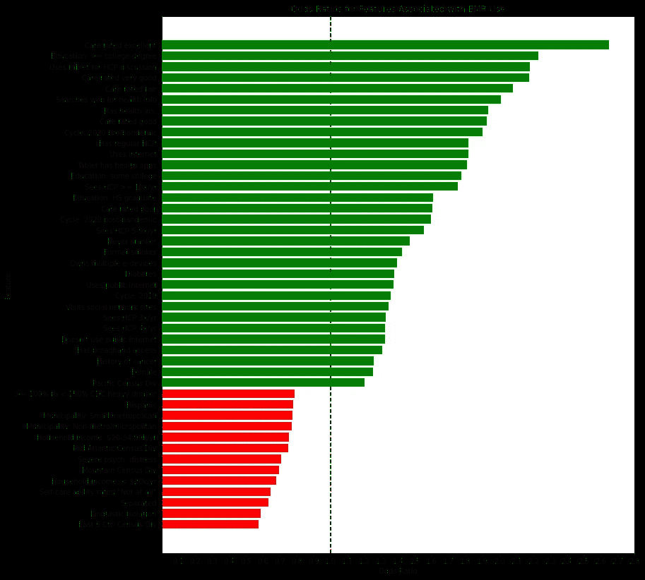

图 20。EMR 使用相关特征的优势比(作为二元变量)。

在这里，将护理评为“优秀”与使用过电子病历联系最紧密，其次是获得了大学学位或更高学位。HCP 保健评级类别与电子病历的使用有不同程度的关联(相对于默认的无评级类别)。投保和女性，定期 HCP 和更高的 HCP 访问频率都再次出现，癌症史也是如此。另一种慢性疾病，糖尿病，也是一个预测因素，同时目前不吸烟也包括在内。调查周期的顺序与 EMR 访问的顺序相同。受教育程度较低也影响较小(与没有高中文凭相比)。电子设备和互联网相关因素与电子病历访问相关因素类似。最后，居住在太平洋人口普查局预示着使用电子病历的可能性更高。

同样类似于 EMR 访问的模型，居住在东南中心人口普查区和语言隔离区与没有使用过 EMR 最相关。家庭收入低，自我照顾能力差，饮酒量大。EMR 访问模型中不存在的其他人口普查分区(山区和大西洋中部)预测使用的可能性较低，居住在更多农村地区、被隔离以及 PHQ-4 评分与严重心理困扰一致的情况也是如此。

图 21 显示了使用 EMR 的预测概率≥ 80%和≤ 20%之间存在最大差异的 10 个特征。红色柱再次表明预测概率≤ 20%的人群患病率较高，绿色柱表明使用 EMR 的预测概率≥ 80%。

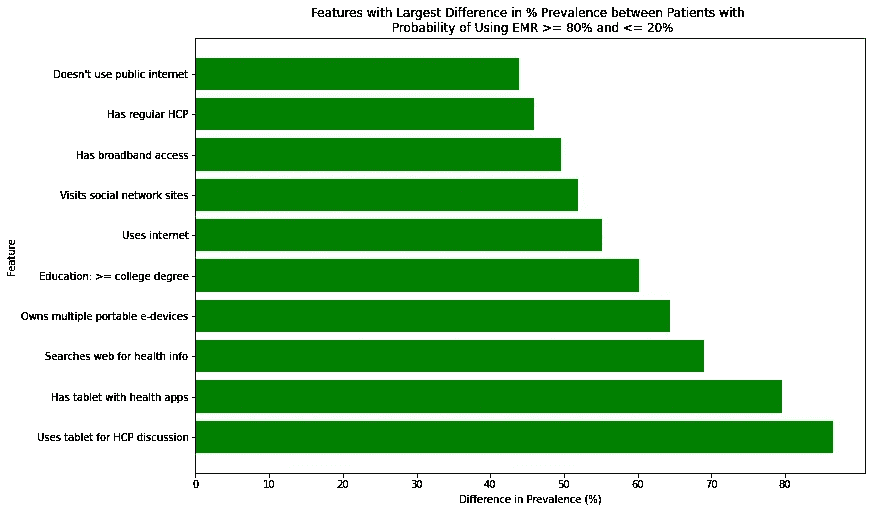

图 21。使用 EMR 的概率≤ 20%和≥ 80%的患者之间患病率差异最大的特征。

所有前 10 个特征在高概率群体中更普遍。与 EMR 访问模式不同，不存在性别差异。同样，这些患者更有可能至少拥有大学学位。从医学上讲，他们更有可能患有常规 HCP。同样，其余变量与互联网接入和使用有关:他们更有可能使用互联网和宽带互联网接入。他们不太可能通过公共资源(如图书馆)访问互联网。他们更有可能使用互联网访问社交网站。他们倾向于使用多种便携式电子设备，在网上查找健康信息，使用桌面应用程序监控他们的健康状况，并使用平板电脑与他们的 HCP 进行讨论。

## 正当理由；辩解

机器学习模型能够使用公开的美国政府数据集的数据来识别与 EMR 访问相关的特征。

选择逻辑回归而不是其他机器学习模型，因为该研究的目标是阐明每个预测变量的影响。逻辑回归为每个变量提供了易于解释的系数和优势比，以及易于部署的最终模型，例如在电子表格中。

两种结果的初始多类模型显示出较差的精确度和召回率，通过参数网格搜索的调整没有改善。这是由于类别不平衡，一些结果类别很少有响应，导致这些类别不太适合。因此，多重结果被合并为“是”/“否”二元变量，从而减少了类别不平衡。

将两种结果二分法极大地提高了精确度和召回率。虽然这导致结果中粒度的一些损失(例如，无法区分更多使用 EMR 和更少使用 EMR 的人的特征)，但是多类模型的不良拟合使得它们在进行预测时用处更小。

网格搜索调整并没有提高二元模型的拟合度。在逻辑回归中，正则化参数 *C* 是唯一可调整的模型变量，默认值 1.0 提供了比通过网格搜索获得的较低值更好或更好的拟合。这可能是因为调查响应的数量(训练集中有 5490 个，测试集中有 2328 个)远远大于特征的数量(106 & 109 个)，因此过度拟合不是主要问题。所有模型的训练集和测试集之间在精度和召回率方面的最小观察差异证实了不存在过度拟合。

此外，平衡的类权重被用于初始模型，并且比没有类权重表现得更好。这可能表明平衡权重有助于补偿任何结果类别的不平衡。

最后，调整了 RFECV 删除的默认特性数量。每次迭代删除一个特性比删除三个或五个要好，这表明模型比大的变化更能容忍小的变化。

由于大量的预测变量(106 个用于 EMR 访问，109 个用于 EMR 使用)，递归特征消除被用于修剪特征空间。使用 F1 分数的自动特征修剪能够将二进制模型的特征数量减少到 52 和 62 个特征，以供 EMR 访问和使用。然而，通过从这些模型开始并使用手动 RFE，特征空间可以分别减少到 30 和 45 个特征，而不会损失精度和召回率。这些更简约的模型被选为最终模型，用于确定与电子病历访问和使用最相关的功能。

更有可能由 HCP 或保险公司提供电子病历的调查受访者往往是受过良好教育的女性，并且更多地使用电子资源获取健康信息。这些特征可能表明向那些最有可能使用 EMR 的人提供 EMR 访问的一些偏向。应该进一步研究这种可能性，以提高获得电子病历的平等性。

他们也倾向于更频繁地拜访他们的医护专业人员，并且年龄较大，这可能表明他们有更复杂的医疗需求。就慢性疾病而言，只有患过癌症的人预测获得治疗的可能性更高。是否有必要更积极地为患有其他慢性疾病的患者提供治疗，应进一步探讨。

最后，有一个时间效应，随着调查周期的增加，访问增加。然而，大流行后的 2020 年变量的影响小于疫情 2020 年前的变量，因此在可获得数据的大流行后时期(诚然有限), EMR 的可用性没有明显提高。

相反，那些不太可能获得 EMR 访问权限的人处于最低的教育和年收入层，更可能生活在东南中心人口普查区和语言隔离区，倾向于单身，更可能参加公共医疗保险，酗酒，对自己管理医疗保健的能力信心非常低。这些变量中的大多数表明，患者通常不太可能获得资源，包括医疗保健。这些患者可能与他们的医护人员互动较少，或者可能被他们的医护人员预判为 EMR 访问的不良候选人。语言隔离表明他们可能英语说得不好，无法与医护人员很好地沟通。这些患者可能会从教育计划中受益，最好是用他们的母语，宣传电子病历的价值并提供使用说明。医护专业人员也可能不知道关于这些患者的无意识偏见，并可能受益于激励措施，以扩大 EMR 对未得到充分服务的患者的访问。

同样，那些更有可能使用电子病历的人也往往是女性，受教育程度更高，更经常访问他们的医疗保健中心，更经常使用电子设备和健康相关信息的消费者。就慢性疾病而言，糖尿病和癌症病史都预示着 EMR 使用的增加。

时间效应与 EMR 访问相同，随着每个调查周期的使用增加，但大流行后时期的影响不如疫情 2020 年前。

同样，看起来更多的电子和健康知识患者更倾向于使用电子病历。相应地，那些有较高 HCP 访问频率和慢性疾病的人也更有可能使用电子病历。这些患者可能有复杂的病史和多个医护专业人员，如果他们的信息以电子形式更便于携带，并且能够访问他们的数据以便与医护专业人员或家庭成员讨论，他们将从中受益。

与那些不太可能获得电子病历的人类似，那些被预测不太可能使用电子病历的人往往属于收入最低的类别，居住在东南中心人口普查区和语言孤立的地区，对他们管理自己护理的能力评价很差，并且往往是酗酒者。这些相似性可能是由于那些未被提供 EMR 访问的人也不会使用 EMR。

此外，这些患者往往来自更多的农村地区，处于第二低收入阶层，被认为是西班牙裔，并符合 PHQ-4 标准的严重心理困扰。这些指标再次确定了一个高风险患者群体，他们可能较少获得资源，特别是医疗保健。严重的心理压力和对健康相关能力的低信心可能表明那些需要更多支持/援助来管理其健康事务的人。如上所述，这些患者可能受益于适当的语言，有针对性的宣传和教育，以强调电子病历的可用性和好处。

# 结论

## 反射

在这项分析中，来自国家癌症研究所[提示](https://hints.cancer.gov/)调查的三年数据被用于分析与访问和使用电子病历相关的患者属性。

经过初步筛选和分析后，为这两个结果变量建立了多变量逻辑回归模型。由于两个变量中的多个结果类别的稀疏性，多类别模型显示出较差的预测性能，如通过精确度和召回率测量的。将结果二分法导致了更好的类别平衡，提高了精确度和召回率。

预测 EMR 访问的最终模型有 30 个特征，并在测试集上产生了 0.705 和 0.699 的精确度和召回率。

与 EMR 访问的预测可能性增加相关的人口统计学特征是女性、高等教育和中等年龄(65-74 岁)。还有年份(调查周期)和新冠肺炎疫情的影响。与进入可能性降低相关的人口统计学特征是单身、低收入、非西班牙裔亚裔、语言孤立和居住在东南中心人口普查区。

与预测的 EMR 访问增加相关的健康相关特征是:定期进行 HCP，其护理评级更高，每年看两次或更多次 HCP，有健康保险，有癌症史。这一类别中与获得可能性较小相关的特征是单独的公共保险(Medicare 和/或 Medicaid)、酗酒以及对个人管理健康事务的能力缺乏信心。

预测接入可能性增加的电子设备和互联网相关因素是互联网使用、出于健康相关目的使用电子设备和网络的增加、访问社交网站以及公共互联网接入的使用程度。在这一类别中，没有变量预测减少访问。

每个特征的强度通过它的优势比来检验。与增加可及性最密切相关的特征是拥有健康保险和对个人护理的高度评价。与获得机会的可能性降低最密切相关的是对自己管理健康事务的能力缺乏信心，以及非西班牙裔亚裔种族。

最后，评估了那些被提供 EMR 访问的预测可能性≥ 80%和≤ 20%之间患病率差异最大的特征。在前十名中，低收入在低可能性组中更普遍，而女性性别、较高教育水平、定期 HCP、较高 HCP 评级以及与互联网/设备使用增加和用于健康相关目的相关的几个变量在高可能性组中更普遍。

预测电子病历使用的最终模型有 45 个特征，精度为 0.742，召回率为 0.724。

与 EMR 使用的预测可能性增加相关的人口统计学特征为女性、任何教育程度≥高中以及居住在太平洋地区(加州、俄勒冈州、华盛顿州、阿拉斯加州、HI)人口普查部门。再次有一个年度(调查周期)和新冠肺炎疫情的影响。与使用可能性降低相关的人口统计学特征包括分居、低收入、西班牙裔、语言孤立、居住在大西洋中部、东南中部或山区人口普查区，以及居住在更偏远的农村地区。

与预测的 EMR 使用增加相关的健康相关特征是定期进行 HCP 检查，每年检查 HCP ≥ 3 次，任何护理评级(除了无/不要访问 HCP)，有健康保险，有糖尿病或癌症史，以及目前不吸烟。这一类别中与使用可能性较小相关的特征是酗酒、严重的心理困扰(PHQ-4 评分最高)以及对自己管理健康事务的能力缺乏信心。

电子设备和互联网相关因素预测使用电子病历的可能性增加，这些因素包括互联网使用、宽带接入、拥有多个电子设备、出于健康相关目的使用电子设备和网络的增加以及公共互联网接入的使用程度。如前所述，这一类别中没有变量预测减少使用。

检查优势比，一个“优秀”的 HCP 护理等级和≥大学学位与增加使用电子病历的可能性最强相关。那些与访问可能性下降最密切相关的人居住在东南中心人口普查处和语言隔离区。

最后，评估了使用 EMR 的预测可能性≥ 80%和≤ 20%的人群之间的患病率差异。前十名在那些预测更可能使用电子病历的人群中更常见。除了教育程度≥大学学位和定期 HCP 外，所有这些都与出于一般和健康相关目的的互联网和电子设备接入/使用增加有关。

我发现这个项目的一个有趣的方面是，这样一个庞大的、功能丰富的数据集是公开可用的，并且这些数据是每年收集一次的。在开始为这个项目寻找合适的数据集之前，我从未听说过[提示](https://hints.cancer.gov/)调查。对于未来的项目，我一定会探索像这样的其他政府管理的数据源。我也很好奇这些数据是否用于卫生政策决策。[提示页面](https://hints.cancer.gov/about-hints/learn-more-about-hints.aspx)声明收集数据的目的是:

> 调查研究人员正在使用这些数据来了解 18 岁及以上的成年人如何使用不同的沟通渠道，包括互联网，来为他们自己和他们所爱的人获取重要的健康信息。项目规划者正在使用这些数据来克服跨人群使用健康信息的障碍，并获得他们需要的数据来创建更有效的沟通策略。最后，社会科学家正在使用这些数据来完善他们在信息时代的健康传播理论，并为减轻整个人口的癌症负担提供新的更好的建议。

然而，他们没有引用基于调查结果的具体举措或政策。看到这方面的更多细节会很有意思。提到的最后一次用户会议发生在 2014 年。如果这些数据仅仅是为了拥有它们而被收集，而不是用于进一步提高医疗保健可及性的目标，那将是不幸的。

我发现这个项目最具挑战性的是(我想，通用数据科学家的抱怨)争论数据和有效地修剪特征。即使有可用的代码簿，也很难确定一些相关字段之间的关系。令我惊讶的是，如此多的特征与结果有显著的单变量关系，这在很大程度上否定了我试图在创建多变量模型之前删除变量的目标。我的结论是，这些是使用一个不是自己收集的数据集的困难，并且它不是为所提问题而专门构建的。

## 改进

**限制**

该数据集仅限于从[提示](https://hints.cancer.gov/)中可获得的字段，这不是专门为 EMR 使用调查而设计的。

虽然提示调查旨在代表美国人口，但本研究的感兴趣领域有相当数量的缺失条目，这些条目的删除可能会改变样本的组成，使其代表性降低。

虽然有关于患者几种慢性疾病史的数据，但没有关于患者整体医学状况复杂性或其共病负担的数据。这些因素可能会增加多次 HCP 就诊的需求以及对多个不同 hcp 的就诊需求，从而增加对可用的便携式电子病历的需求。

同样，调查也没有阐明一个病人看多少种不同的 hcp。它也没有关于紧急护理、急诊或住院医疗访问的数据。对其中许多信息的需求可能表明患者需要更密切的随访，他们可能访问多个医疗保健来源，并且他们可能从访问他们的许多医疗保健记录中受益。

最后，由于调查在每年 1 月至 4 月间进行，2020 年大流行后的数据仅涵盖有限的时间段。

**改进**

进一步的研究可以深入评估医护人员在教育患者和传播电子病历信息时所面临的障碍。医护人员的办公室是否缺乏资源来讨论和教育患者有关电子病历，从而可能产生一种偏见，倾向于主要向需要较少帮助的“潜在采纳者”提供电子病历？同样，对于管理电子病历中面向患者的部分及其可能增加的 HCP 工作人员的负担，会缺乏兴趣吗？

额外研究的另一个领域可能包括检查具有 EMR 访问权限的患者不使用它们的原因。与此相关的问题是提示的一部分，但额外的分析超出了本项目的范围。也许一些患者在讨论复杂的健康问题时更喜欢直接的面对面互动，或者也许他们觉得 EMR 中的数据在他们访问的上下文之外没有用。对于以电子方式访问此类敏感数据，还可能存在隐私问题。

此外，评估患者和 HCP 对各种电子病历利弊的看法，尤其是就其可用性而言，将是有益的。从患者的角度来看，了解 EMR 数据是否有任何对患者友好的解释将是有用的，因为没有医学背景的人很难理解原始诊断测试或实验室结果。

尽管互操作性是 HITECH Act 互操作性倡议[1]的一个非常具体的目标，但研究各种 EMR 系统的实际互操作性也是值得的，尤其是从最终用户的角度来看。这对于有多个提供商的患者来说尤其重要，他们可能使用不同的电子病历平台。

最后，与疫情 2020 年之前相比，在大流行后时期，获得或使用电子病历没有明显增加。然而，所研究的大流行后时期相对较短，进一步的随访可能会更好地阐明这种独特的情况是否影响 EMR 的获取和使用。

# 参考

1.  疾病控制和预防中心，国家癌症登记计划:电子健康记录的有意义的使用。[https://www.cdc.gov/cancer/npcr/meaningful_use.htm](https://www.cdc.gov/cancer/npcr/meaningful_use.htm)。2021 年 8 月 5 日接入。
2.  拉法塔·JE，米勒·CA，谢雷斯·达，戴尔·K，拉特里夫·SM，施赖伯·m。患者对电子患者门户网站的采用和特征访问。*Am J Manag Care*2018；24(11):e352-e357。
3.  Jhamb M，Cavanaugh KL，Bian A，Chen G，Ikizler TA，Unruh ML，Abdel-Kader K.《电子健康记录患者门户网站在肾病诊所的使用差异》.*Clin J Am Soc Nephrol*2015；10(11):2013–22.
4.  社会科学测量工具数据库:患者健康问卷-4 (PHQ-4)。[https://www . midss . org/content/patient-health-question-4-phq-4](https://www.midss.org/content/patient-health-questionnaire-4-phq-4)。2021 年 8 月 7 日接入。
5.  疾病控制和预防中心:体力活动:成年人需要多少体力活动？[https://www . CDC . gov/physical activity/basics/adults/index . htm](https://www.cdc.gov/physicalactivity/basics/adults/index.htm)。2021 年 8 月 10 日接入。
6.  疾病控制和预防中心:酒精和公共健康:酒精使用和你的健康。[https://www.cdc.gov/alcohol/fact-sheets/alcohol-use.htm](https://www.cdc.gov/alcohol/fact-sheets/alcohol-use.htm)。2021 年 8 月 10 日接入。