# Patsy:用任意 Python 代码构建强大的特性

> 原文：<https://towardsdatascience.com/patsy-build-powerful-features-with-arbitrary-python-code-bb4bb98db67a?source=collection_archive---------8----------------------->

## 一行代码中的数据转换

# 动机

有时，您可能想要试验各种功能的组合来创建一个好的模型。然而，这通常需要额外的工作来将特征转换成可以被 scikit-learn 的模型使用的数组。

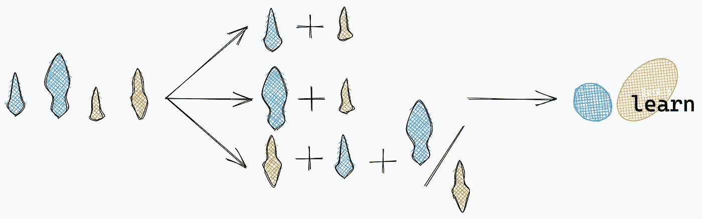

作者图片

如果可以使用任意 Python 代码快速创建要素，那不是很好吗？这时候 Patsy 就派上用场了。

# Patsy 是什么？

[Patsy](https://patsy.readthedocs.io/en/latest/overview.html) 是一个 Python 库，允许使用任意 Python 代码进行数据转换。

对于 Patsy，您可以使用人类可读的语法，如`life_expectancy ~ income_group + year + region`(预期寿命取决于收入群体、年份和地区)。

要安装 Patsy，请键入:

```
pip install patsy
```

# 入门指南

为了测试这个库，我们将使用来自 Kaggle 的[不同国家出生时预期寿命数据集。为了便于我们观察输出，我们将只取原始数据的一个子集。](https://www.kaggle.com/shitalgaikwad123/life-expectancy-at-birth-for-different-countries)

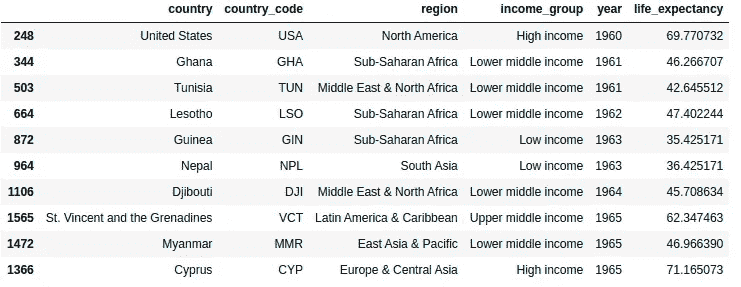

[查看数据](https://datapane.com/u/khuyentran1401/reports/0kzZNyk/patsy/?block_name=life_expectancy)

我们的任务是预测一个地区在特定年份的预期寿命。

由于收入群体、地区和年份可能在决定预期寿命方面起很大作用，我们将使用 Patsy 将这 3 个特征转换成一个矩阵。

在上面的代码中，

*   `outcome`是一个代表`life_expectancy`的`DesignMatrix`对象，T3 是我们要预测的变量

```
>>> outcomeDesignMatrix with shape (140, 1)
  life_expectancy
         60.73805
         59.74837
         68.94266
         46.45793
         54.71871
  [135 rows omitted]
  Terms:
    'life_expectancy' (column 0)
  (to view full data, use np.asarray(this_obj))
```

*   `predictors`是一个`DesignMatrix`对象，代表`income_group`、`region`和`year`的组合

```
>>> predictorsDesignMatrix with shape (140, 11)
  Columns:
    ['Intercept',
     'income_group[T.Low income]',
     'income_group[T.Lower middle income]',
     'income_group[T.Upper middle income]',
     'region[T.Europe & Central Asia]',
     'region[T.Latin America & Caribbean]',
     'region[T.Middle East & North Africa]',
     'region[T.North America]',
     'region[T.South Asia]',
     'region[T.Sub-Saharan Africa]',
     'year']
  Terms:
    'Intercept' (column 0)
    'income_group' (columns 1:4)
    'region' (columns 4:10)
    'year' (column 10)
  (to view full data, use np.asarray(this_obj))
```

酷！似乎我们得到了一个形状的特征矩阵`(140, 11)`。`140`表示有 140 个例子，`11`表示有 11 个特征。这 11 个特征是:

*   Intercept(第 0 列)—1 的数组
*   `income_group`(第 1 至第 4 栏)
*   `region`(第 4 至 10 栏)
*   `year`(第 10 列)

为什么`income_group`和`regions`特性有额外的列？这是因为 Patsy 使用[一键编码](https://hackernoon.com/what-is-one-hot-encoding-why-and-when-do-you-have-to-use-it-e3c6186d008f)对这些分类特征进行编码，因此它们可以被机器学习模型解释。

这意味着，分类列:

```
 income_group
1\. low_income   
2\. upper_middle_income
3\. lower_middle_income
4\. low_income
5\. upper_middle_income
```

…将被转换为 0 和 1 的矩阵:

```
 low_income  lower_middle_income  upper_middle_income
1\.     1               0                     0
2\.     0               0                     1
3\.     0               1                     0
4\.     1               0                     0
5\.     0               0                     1 
```

## 好吧，我知道用 Patsy 创建功能有多简单了。但是我如何使用这些功能呢？

Patsy 创建的功能可以很容易地被 scikit-learn 等流行的机器学习库使用。换句话说，你可以把`**DesignMatrix**` **对象当作一个 NumPy 数组。**

这意味着您可以使用`train_test_split`将`DesignMatrix`对象分为训练集和测试集:

…并将训练集和测试集提供给机器学习模型。

我们将使用 [Yellowbrick](/introduction-to-yellowbrick-a-python-library-to-explain-the-prediction-of-your-machine-learning-d63ecee10ecc) 的预测误差图来比较实际目标和我们的模型生成的预测值。

要安装 Yellowbrick，请键入:

```
pip install yellowbrick
```

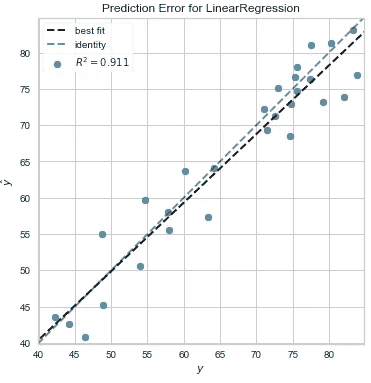

作者图片

在上面的图中，

*   y 是代表真实值的轴
*   ŷ是表示预测值的轴
*   黑色虚线是由当前模型创建的拟合线
*   如果预测值与实际值完全匹配，灰色虚线表示拟合线的位置

线性模型很好地跟踪了观察到的目标。R 分是 0.911。让我们创建一个函数，这样我们就可以观察给定方程的拟合线。

如果我们仅使用`income_group`列预测目标值，会发生什么情况？

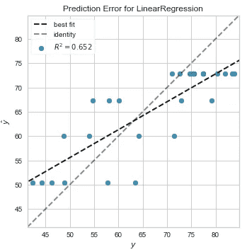

作者图片

R 分相当低。我们可以通过组合`income_group`列和`region`列来看输出是否更好:

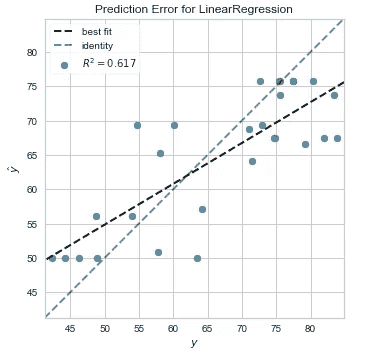

作者图片

输出看起来也不是很好。让我们试着把`income_group`和`year`结合起来:

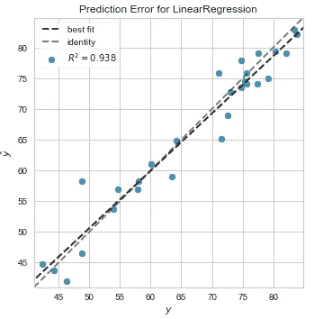

作者图片

啊哈！结合`income_group`和`year`功能可以产生非常好的结果。这可能是因为收入群体和年份强烈影响一个国家一年的预期寿命。

# 内置函数

有时，我们可能希望对某个特性进行额外的处理，比如缩放或标准化。幸运的是，Patsy 提供了内置函数，使我们可以轻松地做到这一点。

为了演示这些函数，让我们切换到 [Bikeshare 数据集](https://www.scikit-yb.org/en/latest/api/datasets/bikeshare.html)并仅从数据中提取 2k 个样本。

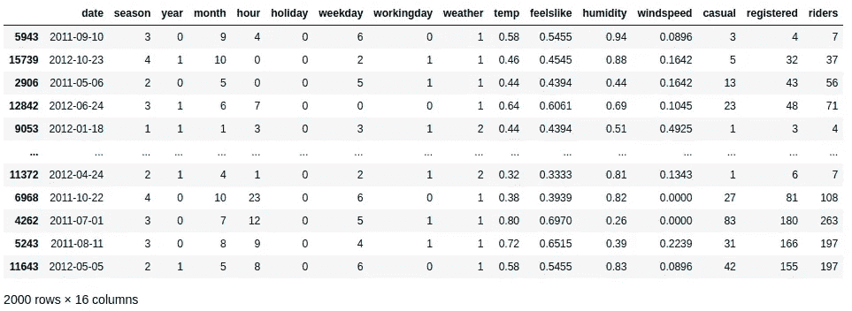

[查看数据](https://datapane.com/u/khuyentran1401/reports/0kzZNyk/patsy/?block_name=bikeshare)

注意列`season`、`year`、`month`、`hour`、`holiday`、`workingday`和`weather`是分类变量。然而，由于它们的数据类型是整数，Patsy 认为它们是数字变量。

```
DesignMatrix with shape (2000, 4)
  Intercept  year  hour  temp
          1     0     4  0.58
          1     1     0  0.46
          1     0     0  0.44
          1     1     7  0.64
          1     1     3  0.44
  [1995 rows omitted]
  Terms:
    'Intercept' (column 0)
    'year' (column 1)
    'hour' (column 2)
    'temp' (column 3)
  (to view full data, use np.asarray(this_obj))
```

## 指定分类变量

为了解决上面的问题，我们可以使用`C(column)`将一些列指定为分类列:

```
DesignMatrix with shape (2000, 26)
  Columns:
    ['Intercept',
     'C(year)[T.1]',
     'C(hour)[T.1]',
     'C(hour)[T.2]',
     ....
     'C(hour)[T.22]',
     'C(hour)[T.23]',
     'temp']
  Terms:
    'Intercept' (column 0)
    'C(year)' (column 1)
    'C(hour)' (columns 2:25)
    'temp' (column 25)
  (to view full data, use np.asarray(this_obj))
```

这些特征现在得到了更好的表现。

## 使标准化

我们还可以通过使用`standardize`方法来标准化特定特征(减去平均值并除以标准偏差):

该功能将转换`humidity`的初始分布:

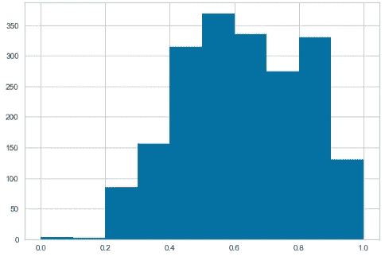

作者图片

…对于该发行版:

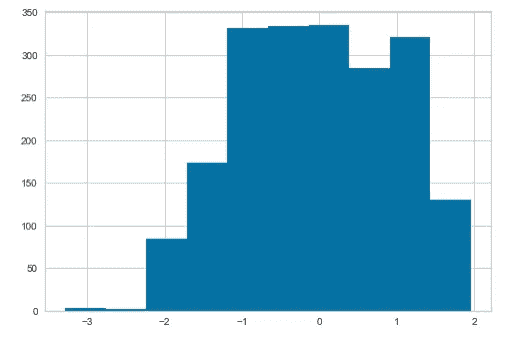

作者图片

你可以在这里找到 Patsy 提供的其他内置方法。

# 自定义功能

除了内置函数之外，您还可以编写自己的函数，例如将一列乘以二:

`temp`功能的前 5 行:

```
 temp
  0.58
  0.46
  0.44
  0.64
  0.44
```

`multiply_by_two(temp)`特征的前 5 行:

```
 multiply_by_two(temp)
  1.16
  0.92
  0.88
  1.28
  0.88
```

# 经营者

除了`+`操作符，您可以使用其他操作符以其他方式组合特征。

`**-**` **操作员**

该运算符用于删除右边的术语。例如，使用`month + temp — 1`将删除截距:

```
DesignMatrix with shape (2000, 2)
  month  temp
      9  0.58
     10  0.46
      5  0.44
      6  0.64
      1  0.44
  [1995 rows omitted]
  Terms:
    'month' (column 0)
    'temp' (column 1)
  (to view full data, use np.asarray(this_obj))
```

`**:**` **操作员**

该运算符计算左侧和右侧每一项之间的相互作用。例如，使用`riders ~ month:temp`会将`month`列中的值除以`temp`列中的值。

```
DesignMatrix with shape (2000, 2)
  Intercept  month:temp
          1        5.22
          1        4.60
          1        2.20
          1        3.84
          1        0.44
  [1995 rows omitted]
  Terms:
    'Intercept' (column 0)
    'month:temp' (column 1)
```

如果每边有多个项，左边的每个项将被右边的每个项除。举个例子，

```
(C(year) + C(hour) + C(workingday)) : temp
```

扩展为:

```
C(year):temp + C(hour):temp + C(workingday):temp
```

让我们画出上面的等式，看看输出是什么样子的:

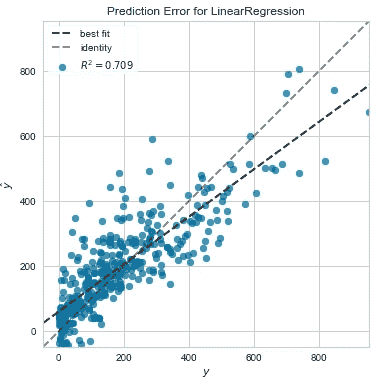

作者图片

我们得到了 0.709 的 R 值。这是一个相当不错的分数！

`*****` **操作员**

`a:b`包括`a`和`b`之间的互动，但不包括`a`和`b`本身的特性。如果你想既包括变量又包括变量之间的相互作用，使用`a * b`。

举个例子，

```
month * temp
```

是以下内容的简写:

```
month + temp + month:temp
```

`******` **操作员**

这个操作符用自身计算一组术语的`*`n 次。

举个例子，

```
(temp + humidity + windspeed)**3
```

扩展为:

```
(temp + humidity + windspeed) * (temp + humidity + windspeed) * (temp + humidity + windspeed)
```

让我们画出方程式`riders ~ (C(year) + C(hour) + C(workingday) + temp) ** 3`，看看它看起来是什么样子:

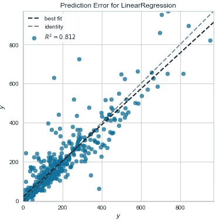

作者图片

哇！我们得到了 0.812 的 R，这是一个非常好的分数。这是否意味着拥有更多的功能会产生更好的输出？让我们试着把`3`换成`6`，看看会发生什么。

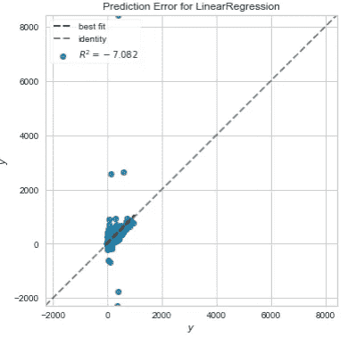

作者图片

不完全是。拥有更多的特性会导致过度拟合，所以增加更多的特性并不一定更好。

你可以在这里找到所有的操作符及其用法[。](https://patsy.readthedocs.io/en/latest/formulas.html#operators)

# 结论

恭喜你！您刚刚学习了如何使用 Patsy 用任意 Python 代码构建特性。我希望这个工具能让您更容易地试验不同的特性组合，并理解它们对输出的影响。

随意发挥，并在这里叉源代码:

<https://github.com/khuyentran1401/Data-science/blob/master/statistics/patsy_example.ipynb>  

我喜欢写一些基本的数据科学概念，并尝试不同的算法和数据科学工具。你可以在 LinkedIn 和 Twitter 上与我联系。

如果你想查看我写的所有文章的代码，请点击这里。在 Medium 上关注我，了解我的最新数据科学文章，例如:

</kats-a-generalizable-framework-to-analyze-time-series-data-in-python-3c8d21efe057>  </how-to-solve-a-production-planning-and-inventory-problem-in-python-45c546f4bcf0>  </how-to-schedule-flights-in-python-3357b200db9e>  </human-learn-create-rules-by-drawing-on-the-dataset-bcbca229f00> 