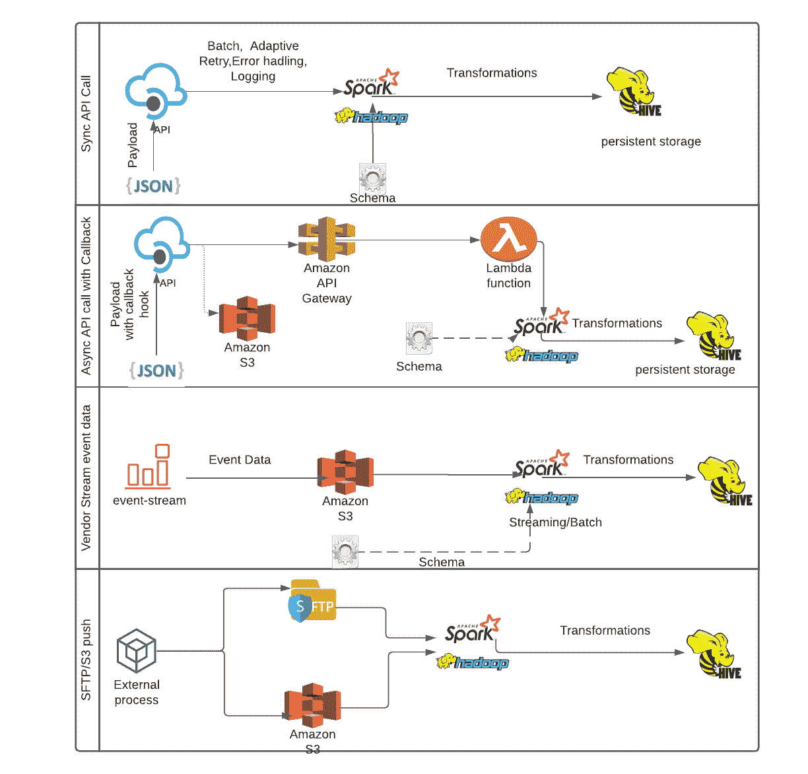

# 数据仓库中外部数据集成的模式抽象

> 原文：<https://towardsdatascience.com/patterns-abstractions-of-external-data-integrations-in-data-warehouse-989f03ddfa66?source=collection_archive---------31----------------------->

## 简化数据仓库中的第三方数据集成

照片由 [Unsplash](https://unsplash.com?utm_source=medium&utm_medium=referral) 上的 [Imthaz Ahamed](https://unsplash.com/@imthaz?utm_source=medium&utm_medium=referral) 拍摄

我们的大部分数据是在组织的内部系统中有机生成的，但我们从第三方系统获取(并发送到第三方系统)的数据中有很大一部分是出于分析或运营目的。这些需求可以是财务、物流、营销或任何其他业务部门的需求。我将在下面提供一些营销方面的例子，因为我最近一直在创建和标准化许多第三方营销数据资产。

*   电子邮件/推送营销:我们在数据-api 交互方面的一个重要参与方是 Braze，它是我们的电子邮件和推送营销供应商。我们使用 Braze SDK 收集不同的就餐者行为指标，并将这些指标与其他内部和外部数据结合起来，向我们的就餐者发送深入的个性化通信/促销信息。因此，这是一种反馈循环，使用我们的数据和第三方 API 不断完善。对于 Braze，我们使用异步调用、直接 API 调用和事件数据收集，供应商将事件实时传输到 S3 存储桶。
*   搜索引擎营销(SEM):我们与几个搜索引擎合作，我们的产品在这些搜索引擎中排名更高，并在某些关键词搜索中显示为付费广告。我们收集广告效果和其他第三方数据用于 SEM 分析。我们为此使用的一些 API 是——广告活动表现(苹果、必应、谷歌、雅虎...)、广告分析(谷歌、脸书、Snapchat...)等。
*   搜索引擎优化(SEO):我们需要尽一切努力来提高我们的产品在相关搜索中的知名度，以最好地利用我们的营销资金。我们的一些 API 交互是——Ahrefs(反向链接/入站链接检查)，关键字性能报告(谷歌广告词，谷歌广告词 PPA，关键字建设…)等。
*   应用商店优化(ASO):我们收集评级、评论、移动属性、竞争对手数据等。以优化我们的应用安装转化率和应用评级。一些例子是——AppFollow(ASO 数据)、Appsflyer(移动归属数据收集)等。
*   联盟营销:我们从联盟营销市场收集联盟营销数据，如按钮、影响半径、朋友购买等。
*   潜在客户:我们从为我们带来潜在客户的不同合作伙伴那里收集数据，如果这些潜在客户转化为客户，他们就会得到报酬。
*   其他:一系列其他第三方系统，我们使用 SFTP/S3 或事件流获取或发送数据。

# 问题:

我们在 EMR 中使用 Python & Spark，并将结果数据集存储在 S3 的 Hive 中。在此期间，来自不同团队的许多数据科学家和工程师致力于这些第三方集成。我们面临的问题是—

*   **缺乏抽象**:主要问题是不同的数据收集模式没有被识别和抽象。这导致了更长的开发周期、代码重复、无法从最佳实践中获益以及其他问题，这些问题本可以通过使用抽象或制造工厂来隐藏。
*   **性能**:许多开发人员没有利用并行处理或分布式处理，而是使用单线程 python 进程。在这些情况下，性能受到严重影响。
*   **可伸缩性**:单线程 python 进程是不可伸缩的。在某些情况下，使用了分布式处理，但以不可扩展的方式，例如使用 pandas_df 或将所有数据收集到主节点。
*   **重试机制**:对 API 的调用可能由于多种原因而失败。可以实现盲重试，但这可能会适得其反。因为 API 可以阻止客户端(由 API 键标识)配额限制耗尽或过多尝试，从而导致相同的错误代码。在这些情况下，我们应该使用“自适应重试”机制。
*   **日志**:当前进程没有存储 API 响应细节的机制。因此，即使作业完成了，也不能保证所有数据都提取出来了。可重用的日志记录机制用原因代码量化失败，并有助于稍后重试失败的调用。

在 ETL 管道过程中，我将保留“T”部分，因为这是每个过程特有的，但是我们可以识别和抽象数据收集中的主要模式，即提取(E)和加载(L)。

# 数据收集模式(E)

我们确定了五种不同的第三方数据收集模式—

*   **API —同步拉取**:这里我们调用一个 SOAP 或者 REST API 端点，以 JSON 为例传递一个有效载荷。API 处理该请求，完成后返回一个带有结构化数据格式(JSON、CSV、XML 等)的响应。)该数据由被调用者保存，并且该过程继续到下一个请求。
*   **API —异步拉取**:有时 API 接受请求，但不通过同步方式提供请求的数据，而是返回确认并在后台准备请求的数据。因此，被调用方进程不会等待，而是转到下一个任务。在这里，在有效负载中，我们可以选择传递一个“回调 url ”, API 可以点击该 URL 来表示数据已准备好并保存到某个事先商定的云存储位置。
*   **API 客户端库**:如果可用，可以使用供应商特定的库。这些可用于直接在 JSON、CSV 等中提取固定报告。格式，并作为底层原始 API 端点的更高层次的抽象。
*   **事件流**:在某些情况下，第三方供应商将事件数据流式传输到云存储，可以批量接收或使用流式传输技术(如 spark streaming)。
*   **SFTP/云存储**:数据按照特定的时间表或根据请求上传到 SFTP 服务器或云存储位置，需要被拉取并摄取到数据仓库。
*   网页抓取:我们不怎么做这个。

既然我们已经最终确定了模式，那么是时候看看这些模式中的每一个有哪些是可重用的部分，以及我们如何标准化它们了。

## API 同步拉取

这里的主要组件是 API 端点和有效负载。但是由于每个 API 可以有不同的存储和服务数据的结构，集合可以是嵌套的和复杂的。例如，如果我正在收集上个月所有活动的时间序列数据，首先我必须点击**活动/列表？**端点收集 campaign _ ids，然后将这些 id 传递给**campaign/details？**收集相应的详细数据以使用特定过滤器或获取字段，我可以将这些字段作为最终有效负载传递给 **campaigns/data_series？**端点。在每个响应中，数据可以按页或有限数量的行提供，下一个 URL 标记表示更多数据。所有这些页面或数据块都需要导航，直到我们全部使用完。因此，这可以深入运行许多级别，或者可以有其他需要考虑的 API 特定实现。但是这里仍然有很多标准化的空间-

a.**重试** —使用“重试”模块很容易创建一个包装器，其中每个 API 调用都使用这个模块，并在失败之前重试多次。这太普通和盲目了，相反我们可以做一个自适应的重试模块，我们可以根据从 API 收到的响应定制“重试”行为。例如，对于脸书分析 API，如果响应的 status_code 是 400，这意味着“超过速率限制”，并且将有相应的文本建议在下一次重试之前等待的分钟数，线程应该在重试之前休眠该时间。类似地，响应代码 500 表示“请求的数据太多，请减少数据大小”，这里我们可以减少“页面限制”并重试。从这些例子中可以看出，盲目重试实际上是有害的，因为它不会成功返回任何数据，相反，调用将被计入 API 速率限制，等待时间将被进一步提前。这个“自适应重试”模块可以是基于规则的，它将基于 API 和错误代码来管理重试的行为，其细节需要从相应的 API 文档中获得。

b.**批处理**—API 通常接受“批处理”有效载荷，即 API 将接受一批有效载荷并返回一批响应。批量发送 50 个请求比一个接一个地发送 50 个请求要有效得多。关于使用和限制，需要参考相应的 API 文档，但是不管怎样，这种批处理功能是可以抽象的。

c.**日志** —在来自 API 的响应被解析和处理之前，它可以通过一个日志包装器，该包装器将响应记录在一个持久存储中。这样，我们可以量化错误的原因，并在此基础上，如果需要，稍后重试。

d.**结构化解析** —来自大多数业务 API 的响应是结构化的，并且有良好的文档记录。应该使用定义良好的模式来解析结构化数据，例如创建 spark 模式并使用该模式解析响应 json。在解析时，我们可以省略一些数据元素，甚至进行转换。这种方式易于管理，可以轻松处理复杂的数据类型，并且比将响应视为文本并使用普通 python 从文本中收集数据元素要高效得多。应该在代码库中创建一个模式存储库，用于解析不同的 API 响应。

## API 异步拉取

对于异步拉取，可以简化的一个特别的事情是“回调 url”以及如何在数据管道中触发下一步。通常，我们希望将 AWS API 网关 url 作为“回调 url”与我们的有效负载一起传递，当 API 异步完成处理请求时，它可以点击该 url，让我们知道请求的任务已完成，数据在预先安排的位置(例如 S3 路径)可用。我们可以将 lambda 函数与 API 网关集成在一起，并可以触发 EMR 步骤函数或任何其他自定义流程来处理管道中的后续步骤。但是我们可以把它抽象成一个单独的过程，这个过程可以被任何异步提取 API 数据的作业重用。只创建一个 API 网关，格式为-[https://xxxxxxx . execute-API . us-east-1 . Amazon AWS . com/{ environment }/{ u](https://xxxxxxx.execute-api.us-east-1.amazonaws.com/%7Benvironment%7D/%7Buuid)nique identifier }。从提取代码，同时使用它作为回调 url，我们传递一个环境(开发，生产等。)和唯一标识符。与 API 网关集成的 lambda 函数要么在 S3 中创建一个唯一的空“信号”文件，以表示下一步的启动准备就绪(可以从被调用方作业轮询)，要么采取规则集中定义的其他动作。

一旦提取了数据，在摄取期间也可以使用日志记录和结构化解析。

## API 客户端库

API 客户端库提供了与底层 API 交互的编程访问。在大多数情况下，这减少了代码量，使代码更健壮，并简化了身份验证和授权的设置。如果可行，这是指导 API 调用的首选方法。安装和使用指南需要参考 API 客户端文档。由于这些客户端库已经在 raw API 之上提供了一个更高层次的抽象层，除了在其他情况下已经遵循的，这里没有太多具体的改进范围。

## 事件流

有时，第三方供应商将事件流式传输到云存储，我们以批处理模式或使用流式传输技术(如 spark streaming)接收这些事件。在批处理模式下，我们可以检查最后处理的文件，在下次运行时，我们可以从那里处理文件。在流的情况下，我们可以创建一个 streamingFactory，用于检查点(元数据和/或数据)、流的离散化、将较小的文件合并为较大的文件以提高配置单元性能、分区刷新、错误处理等。可以抽象出来。基本上这两个过程都是高度可配置的，因为主要的移动部分只有表名、模式、数据位置等。

## SFTP/云存储

云存储或 SFTP 是一种流行而安全的数据传输方式，许多小供应商更喜欢在无法利用 API、事件流或其他技术的地方使用。但这显然不是第三方数据集成的首选方式，因为它没有数据契约(不像 API、事件流或 API 库)或无缝集成。然而，如果使用云存储(例如 S3)，那么当数据到达时，lambda 函数可以触发接收作业，对于 SFTP，我们必须不断轮询和检查数据到达。

以下是不同数据收集流程的高级图示。

作者图片

# 数据存储(L)

在提取和处理之后，我们需要存储处理过的数据，使其易于使用。在我们的生态系统中，我们使用带有 S3 的 Hive 作为外部持久存储。我们还在 hive 上的 EMR 上使用 Presto 来最小化 SQL 读取延迟。由于 S3 文件系统是不可变的，所以在写入已处理的数据时，我们可以选择覆盖所有现有的数据，向其追加数据，或者将数据写入一个全新的路径并在那里重新打印表。在这里，我们可以处理不同的用例，如下所示—

a. **Insert** :这是所有方法中最简单的，可以将处理过的数据附加到未分区表的现有路径上，或者在那里创建并写入新的分区。

b.**更新/删除**:由于 S3 文件系统是不可变的，最终数据集作为一个整体，需要在数据处理过程中进行计算，并像 Insert 一样写回 S3。

c.**保留/清除**:我们可以通过放置一个 _history hive 表元数据来保留表以前的状态，并通过 run_date 或 run_id 对其进行分区，以便于时间序列/趋势分析。通过传递一定数量的保留天数或运行 id，可以自动清除 S3 中较旧分区的相应数据。

以上所有常见的任务都可以被抽象出来，成为可重用的流程。我不会深入技术细节，因为这里的目标是识别和讨论可以抽象的共性。

# 最终想法

接收各种不同格式的第三方数据是数据工程师/科学家日常生活的一部分。理解不同的模式并将它们抽象为可重用的工具和过程有很多好处，例如缩短开发生命周期、更干净的代码库、易于维护、性能和可伸缩性提高等等。在许多情况下，我们会将数据或消息发送回外部系统，在那里可以遵循类似的流程。我们不断发送用户资料、客户旅程、订购行为等。使用各种内部系统和流程的 API 将事件发送到我们的 CRM 和电子邮件/推送营销外部系统。我们正在进行 POC，以建立一个中间消息传递系统，使该流程更加可靠和健壮。