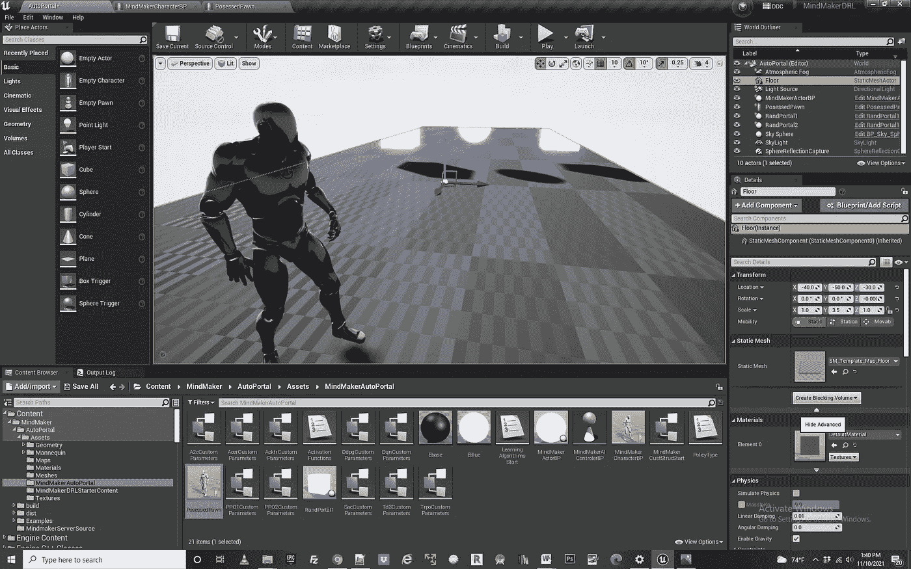
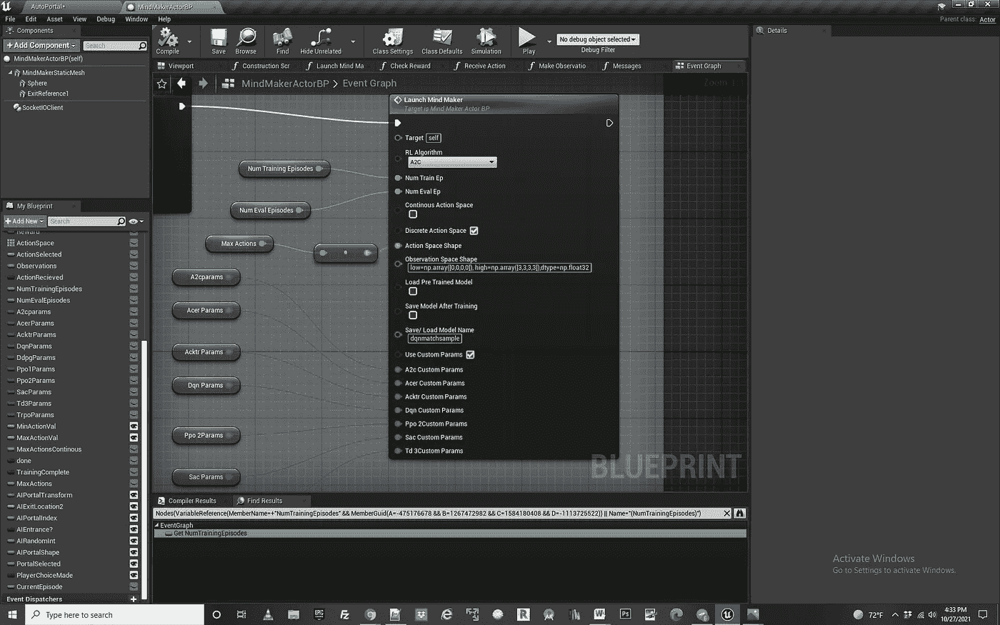
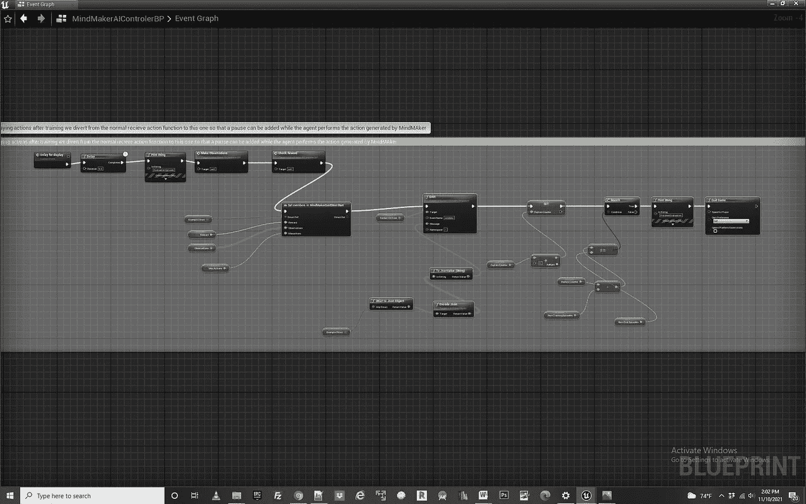

# 通过强化学习实现自动化内容创建和 A/B 测试

> 原文：<https://towardsdatascience.com/patterns-of-desire-deep-reinforcement-learning-for-automated-content-creation-and-a-b-testing-967fdc2b9c0d?source=collection_archive---------22----------------------->

## 情人眼里出西施，但它的创造将很快掌握在算法的手中

[Pixabay 许可](https://pixabay.com/service/license/) : **免费用于商业用途
无需署名**

附带视频:[https://youtu.be/dmxrN7uUUhs](https://youtu.be/dmxrN7uUUhs)

这篇文章介绍了自动内容创建的新兴领域，它具有播放器生成的强化学习信号。在所展示的虚幻引擎示例中，用户在与游戏交互时展示了他们对游戏组件的偏好，而软件则根据这些展示的偏好自动调整或创建组件。在极端情况下，这种技术可以用来根据用户潜意识的反馈完全重新设计一个软件的脚本或目标。

虽然没有水晶球，但这种方法似乎代表了游戏开发的下一个前沿，或许更普遍地代表了艺术、娱乐和用户界面。在这种情况下，没有一个内容是固定的，而是随着用户与它的交互而不断调整。虽然这听起来像科幻小说，但通过网飞和潘多拉推荐算法，我们已经熟悉了这个概念。这里介绍的工具和方法只是扩展了这一点，允许人工智能连续和主动地操作内容，而不仅仅是在播放列表中的歌曲或视频之间进行选择。在深入研究使用虚幻引擎的真实游戏示例之前，让我们先了解一下这是如何使用玩家生成的强化学习信号来完成的概念。

对于那些不熟悉的人来说，深度强化学习代表了一种根据在试错的基础上与环境交互时收到的奖励来调整人工智能行为的方法。这种方法目前在 AlphaZero 等国际象棋机器人中表现最佳，甚至正在揭开蛋白质折叠的神秘面纱，以解锁新的超级药物。我和其他人认为，强化学习是实现人工智能的关键，我在《超越:强化学习——承诺与危险》一书中详细探讨了这个话题。在下图中，我们可以看到强化学习设置中使用的模式。

作者提供的图片

现在，让我们来看看如何使用强化学习来创建基于用户偏好的独特场景组件。考虑一个思维实验，其中用户在游戏中遇到三个入口，必须选择一个以进入下一关。每个入口都是特定设计或颜色的形状。然而，玩家不知道的是，这三个门户也代表了一个游戏——在这个游戏中，人工智能试图猜测用户喜欢哪种形状，并在未来向他们提供更多这种类型的门户。起初，人工智能没有猜测用户偏好的信息，然而，当用户在这些随机生成的入口中进行选择时，人工智能现在已经接收到关于用户欣赏特定场景组件的设计和构成的反馈信号。下次向用户提供门户选择时，它可以利用过去与用户的交互来更好地猜测他们喜欢门户中的哪些组件，并相应地创建一个。随着这一过程的重复，人工智能将最终专注于该用户的独特偏好，并能够生成与这些期望模式一致的门户。

然而，这种设置有一个缺陷。如果人工智能被允许控制所有三个入口的设计组件，它可能会学习创建两个看起来很糟糕的入口，以便引导玩家进入相对不那么糟糕的入口形状。它不是为了吸引而优化，而是为了相对厌恶而优化。每当处理强化学习算法时，在构建奖励信号时必须非常小心，以免导致意想不到的后果。在我们的例子中，为了避免这种情况，两个门户是随机生成的，尽管人工智能可以“观察”它们是什么，但它只能根据用户的选择来调整单个门户。

为了验证这种方法在梳理用户偏好和相应地调整内容方面的实际效果，我们将进一步简化这个示例，其中门户只能采用 4 种形状——三角形、圆形、正方形或圆柱形。想象一下，在人工智能不知道的情况下，我们的玩家对三角形有一个秘密的偏好。因此，我们将假设当他们在门户中挑选时，他们会表现出选择三角形门户的明显偏好。随着时间的推移，我们希望我们的 AI 学习这种偏好，并在选择向用户显示什么时显示更多基于三角形的门户。请记住，这可以是任何特征，或者是我们选择的特征的组合，因为这些都可以被随机化以创建任意大的解决方案空间，AI 可用的独特模式的数量是无限的。但是回到我们的简单例子，当用户选择三角形的入口时，我们将会看到 AI 选择显示三角形入口和其他形状的频率。一旦我们验证了人工智能已经学习了这个简单的偏好，我们就可以将其扩展到更复杂的例子，在这些例子中，人工智能正在探索关于用户偏好的更大的解决方案空间，甚至可能选择游戏中的角色看起来会是什么样子，或者给用户提供什么样的任务。

其他应用包括优化人工智能助手，如 Google Now 或 Alexa，其中助手可能会根据用户反馈的不同措施来改变或调整他们的语气和反应类型。这也延伸到伴侣机器人和任何其他数字存在。让我们使用免费的 [MindMaker 机器学习插件](https://www.unrealengine.com/marketplace/en-US/product/mindmaker-ai-plugin)在 Unreal Engine 中浏览基于门户的示例，看看在自己选择的领域中开始实施这些类型的调整是多么容易。

作者的屏幕截图

我们从默认的 MindMaker Starter 内容图开始，它提供了许多基本的深度强化学习功能和算法，我们将在本示例的剩余部分中使用这些功能和算法。接下来，我们创建三个新的场景对象，一个球体是默认的 MindMakerActorBP 蓝图，两个球体是具有基本形状(如正方形)的蓝图类。回想一下，我们只希望一个入口由人工智能控制，其他两个将被随机分配形状。我们只是给他们我们自己选择的任何形状。为了让我们的物体看起来更有“传送门”的感觉，我们给它们添加了蓝色的发射色。发射的颜色，它的大小和强度也是我们可以用人工智能控制的因素。见上面截图。

接下来，我们要将门户动作添加到这些对象中，这样当玩家接触到它们时，它们的位置会重置，并出现新一轮的门户对象。回想一下，每次我们遍历一个入口时，我们都希望其中两个入口被随机分配一个形状。这是通过随机门户蓝图类的以下蓝图来完成的。

作者的屏幕截图

接下来，我们需要构建 AIs 反馈系统，以便在游戏的每一轮中，它可以看到随机入口被分配了什么形状，并赋予它选择自己的入口形状的能力。我们还将修改 MindMaker 奖励功能，这样如果用户选择了人工智能选择的形状，它就会获得奖励。这将允许人工智能随着时间的推移学习用户的偏好。人工智能的观察空间将是一个由 4 个值组成的数组(3 个入口各一个，一个表示玩家选择的入口)。每个门户占位符可以取 0 到 3 之间的整数值，表示门户的形状。同样，这可能是任意复杂的。参见下面的屏幕截图。AI 的动作空间是 0-3 之间的离散值，表示它为自己的入口形状选择的形状。最后，奖励函数是一个整数，当玩家决定通过哪个入口时，每当 AI 选择一个形状，奖励函数就增加 100。

作者的屏幕截图

不要过多地谈论深度强化学习算法如何工作，简单地说，奖励、观察和行动都被馈送到 MindMaker 中包含的选定深度强化学习算法，如 A2C、DQN 等。然后，该算法将根据过去的行动和观察结果，决定为门户选择什么形状。有许多方法可以通过选择神经网络的深度等来微调这些算法。有关 MindMaker 深度强化学习算法和功能的详细信息，请参考[创建定制的深度强化学习环境](/create-a-custom-deep-reinforcement-learning-environment-in-ue4-cf7055aebb3e) t。

接下来，我们需要在基本的 MindMaker 蓝图中添加一个延迟节点，以便游戏在将动作、观察和奖励数据传递给算法之前等待，直到玩家选择了一个入口。所有这些都是由用户操作生成的。

作者的屏幕截图

为了测试它，我们将尝试 50 集训练，之后人工智能将从训练切换到实际尝试猜测玩家更喜欢什么形状。在此之前，它将主要进行随机猜测，并观察其猜测的结果。如果它已经正确地学习了，根据我们作为玩家选择的形状，它将相应地调整其中一个入口，因此将有更多的那个形状呈现给用户。就这么简单——随着时间的推移，我们希望看到人工智能选择更多的三角形入口，如果这是玩家一直表现出偏好的形状。

这正是所发生的事情，在大约 50 次试验中，当出现三角形时，玩家始终选择三角形，AI 将几乎停止显示它所控制的门户的任何其他形状。至关重要的是，可以调整强化学习算法的探索利用权衡，以便它永远不会完全停止显示其他形状，从而允许玩家的偏好随着时间的推移而演变，如果他们厌倦了看到如此多的三角形，并希望开始看到更多的其他形状。虽然这似乎是没有区别的区别，因为我们中很少有人会对门户的形状有强烈的偏好，但该技术可以扩展到包括任何与用户操作相关的偏好。从这个角度来理解，它是一个非常强大和广泛的工具。

我们还没有讨论资产的另一个主要用例，那就是 A/B 测试。在某种程度上，A/B 测试可以被视为自动内容生成的一个子集，其中不是实际对游戏组件进行调整，而是简单地收集关于用户偏好和权衡备选方案的数据。例如，通过跟踪用户选择不同门户形状的频率，可以了解用户的偏好。在这种情况下，AI 的任务只是改变门户形状，记录用户选择一个门户形状的频率。这可以以某种友好的格式显示，或者以另一种方式使用。使用 MindMaker 深度强化学习资产进行 A/B 测试的好处是，我们可以随着时间的推移战略性地改变选择。这一点很重要，因为人们的偏好在许多情况下很难辨别或者是非固定的。通过延长探索阶段和调整算法的超参数，我们可以系统地改变呈现给用户的选择，以允许这些偏好的改变。在上面给出的例子中，用户可能开始偏好三角形，但是随着人工智能逐渐向他们显示更多的三角形，他们可能决定他们真的更喜欢圆柱。

我们可以通过深度强化学习来操纵和跟踪这些变化，因为人工智能不需要承诺任何一种策略或一组选项，而是根据用户的动作不断改变它们。人工智能学习用户偏好的速率是通过探索/开发权衡和学习速率来控制的。与其他方法相比，这种方法可以实现更加细致入微的数据收集。

总之，深度强化学习为内容生成者，无论是游戏程序员、UI 设计师，甚至是数字艺术家，提供了一种新的、强大的方法来探索和创建用户生成的内容。像 MindMaker 这样的插件降低了那些希望采用这些方法的人的门槛，并有助于开创游戏开发、娱乐和用户界面的新时代。

如果您有任何问题或疑问，请随时留在这里或亲自联系我。在接下来的文章中，我将探索相关的主题，比如奖励工程的黑暗艺术在强化学习中的应用。