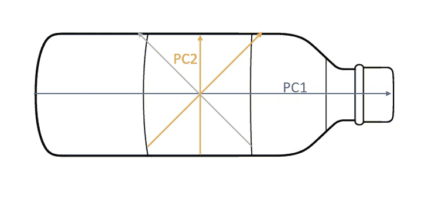
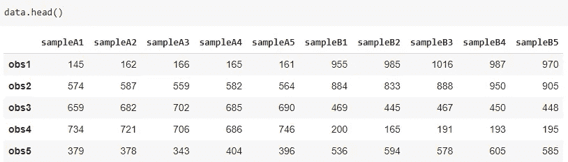
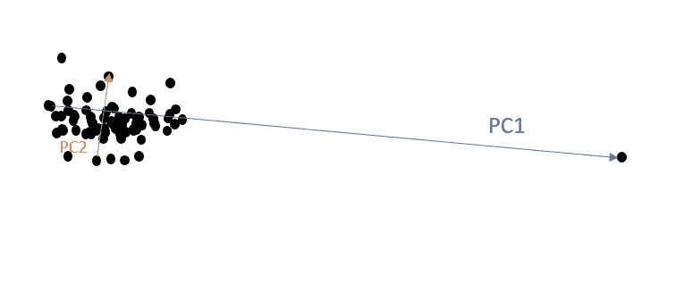
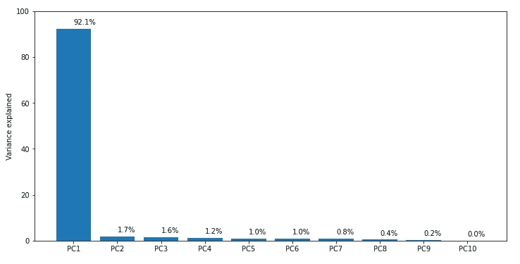
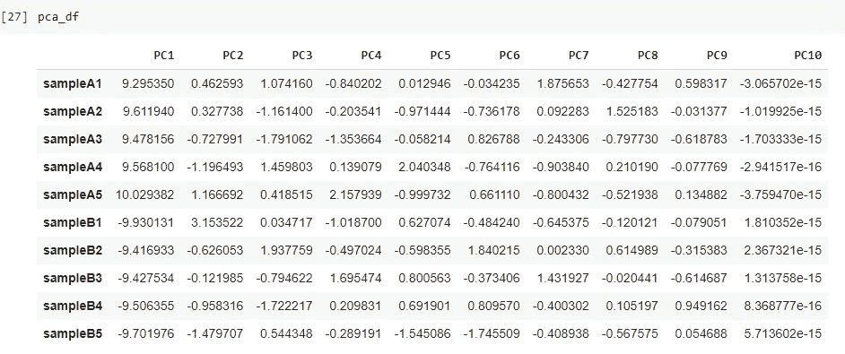
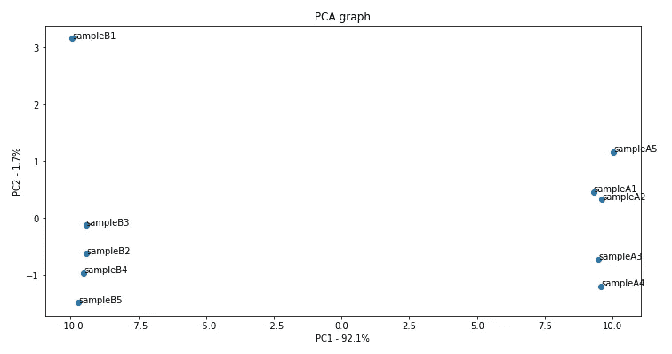
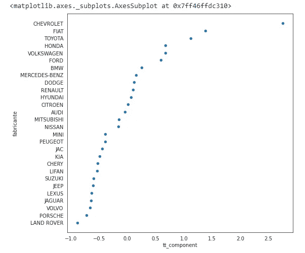

# 主成分分析:超越降维

> 原文：<https://towardsdatascience.com/pca-beyond-the-dimensionality-reduction-e352eb0bdf52?source=collection_archive---------21----------------------->

## 了解如何使用 PCA 算法来寻找一起变化的变量


照片由 [Unsplash](https://unsplash.com/s/photos/variance?utm_source=unsplash&utm_medium=referral&utm_content=creditCopyText) 上的 [Pritesh Sudra](https://unsplash.com/@pritesh557?utm_source=unsplash&utm_medium=referral&utm_content=creditCopyText) 拍摄

## 主成分分析

*主成分分析*简称 PCA，是一种基于协方差计算的数学变换。

许多初学数据的科学家第一次接触到算法，知道它有利于降维，这意味着当我们有一个包含许多变量的宽数据集时，我们可以使用 PCA 将我们的数据转换成我们想要的尽可能多的*分量*，从而在预测之前减少它。

这是真的，实际上是一个很好的技巧。但是在这篇文章中，我想告诉你 PCA 的另一个好的用法:*验证特征是如何一起变化的。*

> 协方差用于计算两个变量的移动。它表示变量之间线性关系的方向。

知道了什么是协方差以及它的作用，我们就可以知道变量是一起运动，相反还是彼此独立。

## PCA 做什么

明白事情比这个解释复杂多了，不过还是简单点说吧。

假设我们有一个三维数据集。嗯，PCA 将获得您的数据集，并查看这三个维度中的哪一个可以绘制最长的线，这意味着逐点查看，我可以获得每个维度的最大差异是什么。一旦计算完成，它将画出这条线，称之为主成分 1。

> 第一个主成分捕获了数据的最大变化。第二台 PC 捕捉第二多的变化。

之后，它会转到下一个维度，画另一条线，这条线必须垂直于 PC1，并保持可能的最大方差。最后，将在第三维度上完成，始终遵循垂直于先前 PCs 的规则，并尽可能保持最大的方差。这样，如果我们有 *n* 个维度，那么这个过程将被执行 *n* 次。

我发现解释这一点的一个好方法是想象一个瓶子。想象它充满了来自你的数据集中的点。当然，最大的变化将是从顶部到底部。这就是 PC1。然后，PC2 需要垂直，所以它留给我们从一边到另一边的箭头。



图 1:“瓶子”数据集。计算机将如何“看到”您的数据。图片由作者提供。

在那之后，我们可以继续画很多其他的线来显示我们的数据是如何分布到所有可能的边上的。这些向量以数学方式“绘制”数据集，因此计算机可以理解它。

## 运行 PCA

让我们编写一点代码并运行 PCA。

```
import pandas as pd
import random as rd
import numpy as np
from sklearn.decomposition import PCA
from sklearn import preprocessing
import matplotlib.pyplot as plt# Create a dataset
observations = ['obs' + str(i) for i in range(1,101)]
sA = ['sampleA' + str(i) for i in range(1,6)]
sB = ['sampleB' + str(i) for i in range(1,6)]data = pd.DataFrame(columns=[*sA, *sB], index=observations)for observation in data.index:
  data.loc[observation, 'sampleA1':'sampleA5'] = np.random.poisson(lam=rd.randrange(10,1000), size=5)
  data.loc[observation, 'sampleB1':'sampleb5'] = np.random.poisson(lam=rd.randrange(10,1000), size=5)
```



表 1:样本数据。图片由作者提供。

现在我们应该缩放数据。如果一些变量的方差很大，一些很小，PCA 会为 PC1 画一条最长的线，这样会扭曲你的数字，使其他的 PCs 变得很小。是的，PCA 会受到异常值的影响。



PC1 方差中的主要异常值。图片由作者提供。

因此，将变量标准化将使这种影响最小化。另一方面，如果你的变量的具体范围很重要(因为你希望你的 PCA 在那个范围内)，也许你不想标准化，但要意识到这个问题。

接下来，当您运行 PCA 时，您将看到矩阵的行是显示组件编号的行。在我们的例子中，**我们希望看到样本是如何一起变化的**，所以我将转置样本，使其成行，缩放并运行 PCA。

```
# Transpose and Scale
scaled_data = preprocessing.scale(data.T)# PCA instance
pca = PCA()#fit (learn the parameters of the data)
pca.fit(scaled_data)# transform (apply PCA)
pca_data = pca.transform(scaled_data)# Creating the Scree Plot to check PCs variance explanation
per_var = np.round(pca.explained_variance_ratio_*100, 1)
labels = ['PC' + str(x) for x in range(1, len(per_var)+1)]plt.figure(figsize=(12,6))
plt.bar(x=labels, height=per_var)
plt.ylabel('Variance explained')
plt.show()
```



Scree Plot:每台电脑解释了多少差异。图片由作者提供。

## 特征向量，特征值

运行 PCA 后，您将收到一串数字，如表 2 所示。这些数字是每个主成分的*特征向量*——换句话说，这些数字“创造”了计算机用来理解你的数据的箭头。

*特征值*代表由变量`pca.explained_variance_`解释的方差的量

```
# Loadings Table
pca_df = pd.DataFrame(pca_data, index=[*sA, *sB], columns=labels)
```



表 2:特征向量。图片由作者提供。

如果你想降低数据集的维数，这很简单。使用参数`n_components`即可。

```
# PCA instance with 3 dimensions
pca = PCA(n_components=3)#fit (learn the parameters of the data)
pca.fit(scaled_data)# transform (apply PCA)
pca_data = pca.transform(scaled_data)
```

## 变量关系

现在我们到了这篇文章的最后一部分。让我们超越降维。让我们学习如何理解变量是否一起浮动。

*   看每个主成分列，注意有正负符号。
*   正样本与 PC 的方向相同，而负号表示样本的变化方向相反。
*   数字意味着力量。越高，PC 中样本的方差越大。
*   查看每台 PC 解释差异的百分比— PC1 = 92%。因此，我们可以只查看 PC1 来了解样本之间的关系，因为 PC1 中解释了几乎所有的方差。
*   我们可以看到，A 样本朝一个方向(+)前进，而 B 样本朝另一个方向(-)前进。

让我们画一张图来更好地说明这个想法。

```
# PC1 x PC2 scatter plotplt.figure(figsize=(12,6))
plt.scatter(pca_df.PC1, pca_df.PC2)
plt.title('PCA graph')
plt.xlabel(f'PC1 - {per_var[0]}%')
plt.ylabel(f'PC2 - {per_var[1]}%')for sample in pca_df.index:
  plt.annotate(sample, (pca_df.PC1.loc[sample], pca_df.PC2.loc[sample]) )plt.show()
```



令人惊讶的是样品 A 和 B 是如何排列在一起的。图片由作者提供。

## 在你走之前

在这篇文章中，我们学习了 [PCA 算法](https://scikit-learn.org/stable/modules/generated/sklearn.decomposition.PCA.html)的另一个很好的用途，那就是了解哪些变量是相关的，哪些变量“浮动”在一起，哪些变量可以成为特征选择的有趣工具或者可以与聚类相结合。

观看 StatQuest 的这个视频，你可以学到更多东西，这是我找到的关于 PCA 的最好的视频，也是我经常回来咨询的视频。

另一个考虑因素:

*   PCA 基于协方差分析，受离群值影响。
*   它可以用来降低维数。
*   可用于检查数据集中的要素是如何相关的。
*   如果 Scree 图(显示百分比的图)显示 PC1 的方差较低，如 20%，您可能需要更多的 PCs 来合计至少 80%的解释方差，以执行您的分析。比如下面的例子。

```
# Multiply (weigh) by the explained proportion
pca_df2 = pca_df.mul(pca.explained_variance_ratio_)# Sum of the components
pca_df2 = pd.DataFrame({'fabricante':pca_df2.index, 'tt_component': pca_df2.sum(axis=1)}).sort_values(by='tt_component')pca_df2.plot.scatter(x='tt_component', y='fabricante', figsize=(8,8))
```



用于差异分析的总件数。图片由作者提供。

代码在 GitHub，[在这里](https://github.com/gurezende/Studying/blob/master/Python/PCA/PCA_Example_Python.ipynb)。

如果你对这些内容感兴趣，请关注我的博客。

<https://medium.com/gustavorsantos> 