# PCA、LDA 和 SVD:通过用于交通 POI 分类的特征缩减进行模型调整

> 原文：<https://towardsdatascience.com/pca-lda-and-svd-model-tuning-through-feature-reduction-for-transportation-poi-classification-8d20501ee255?source=collection_archive---------11----------------------->

## 比较要素缩减方法以调整将 POI 记录分类为机场、火车站或公交车站的模型


布雷特·乔丹在 [Unsplash](https://unsplash.com/s/photos/reduce?utm_source=unsplash&utm_medium=referral&utm_content=creditCopyText) 上的照片

***注意*** *:本文是关于使用安全图模式数据进行分类的系列文章中的第二篇。第一篇文章使用几个多类分类器(如高斯朴素贝叶斯分类器、决策树分类器、K-最近邻分类器和支持向量机分类器)来分析数据的初始分类，如公交车站、机场和火车站。第 1 部分可在此链接找到*:*:*[*POI 分类第 1 部分*](/poi-classification-using-visit-and-popularity-metrics-part-1-ae5e94f92077)

本文将通过使用各种特征约简算法来调整我们在本系列第一部分中使用的模型。这篇文章将作为本项目笔记本中代码片段的解释。该项目利用来自[安全图](https://www.safegraph.com/)的数据。SafeGraph 是一家数据提供商，为数千家企业和类别提供 POI 数据。它向学术界免费提供数据。对于这个项目，我选择使用 SafeGraph 模式数据，以便将记录分类为各种 POI。模式数据的模式可以在这里找到:[模式信息](https://docs.safegraph.com/v4.0/docs/places-schema#section-patterns)。如果你想看笔记本并自己运行代码，在这里看笔记本[看](https://colab.research.google.com/drive/1A6ZZ0WZX3v4N5sN4pU5Yz_gxx2gThVqd?usp=sharing)

**什么是特征约简？**

真实世界的数据非常复杂，由许多要素组成，尤其是用于机器学习的数据。随着要素数量的增加，可视化数据变得越来越困难。此外，大量特征的存在导致更长的计算时间。因此，为了更好地可视化数据并更快地执行计算，我们必须通过组合变量来移除不需要的特征或降低特征的维度。

在我们进入特征缩减概念的第一步之前，我们必须首先加载我们将用于这个项目的数据:加载数据的过程可以在[笔记本](https://colab.research.google.com/drive/1A6ZZ0WZX3v4N5sN4pU5Yz_gxx2gThVqd?usp=sharing)中找到，并且已经在系列的[第一部分中详细解释。就我们的目的而言，所需要的只是对所采取的步骤和结果数据框架的简要概述:](/poi-classification-using-visit-and-popularity-metrics-part-1-ae5e94f92077)

1.  删除不必要的列- ['parent_safegraph_place_id '，' placekey '，' safegraph_place_id '，' parent_placekey '，' parent_placekey '，' safegraph_brand_ids '，' brands '，' poi_cbg']
2.  创建地面实况列，将每个记录建立为机场、汽车站、机场或未知
3.  删除未知记录以清除无法识别的记录
4.  使用 pyspark 水平分解 JSON 字符串的列
5.  阵列的水平分解列
6.  使用 Sklearn LabelEncoder 包转换类列

作为这些转换的结果，输出的数据如下所示，并具有以下各列:


**Raw_visit_counts:** 在日期范围内，我们的小组中对此兴趣点的访问次数。

**Raw_visitor_counts:** 在日期范围内从我们的面板访问该兴趣点的独立访问者的数量。

**Distance_from_home:** 访客(我们已确定其住所的访客)离家的中间距离，以米为单位。

**中值 _ 停留:**中值最小停留时间，以分钟为单位。

**分时段停留(分解为< 5，5–10，11-20，21-60，61-120，121–240):**键是分钟范围，值是在该持续时间内的访问次数

**Popularity_by_day(分解到周一至周日):**一周中的某一天到日期范围内每天(当地时间)的访问次数的映射

**Popularity_by_hour(分解为 Popularity _ 1-Popularity _ 24):**将一天中的某个小时映射到当地时间日期范围内每小时的访问量。数组中的第一个元素对应于从午夜到凌晨 1 点的时间

**Device_type(分解为 ios 和 Android):** 使用 Android 和 IOS 的 POI 访客人数。仅显示至少包含 2 个设备的设备类型，包含少于 5 个设备的任何类别都报告为 4


[Alex](https://unsplash.com/@worthyofelegance?utm_source=unsplash&utm_medium=referral&utm_content=creditCopyText) 在 [Unsplash](https://unsplash.com/s/photos/divide?utm_source=unsplash&utm_medium=referral&utm_content=creditCopyText) 上的照片

既然已经获得了数据，我们可以使用特征约简来查看整体精度和各个类的精度是如何变化的。以下是高斯朴素贝叶斯模型、决策树模型和 K-最近邻模型在使用原始数据集进行训练和测试时的热图和精度，以供参考:

**高斯朴素贝叶斯:**

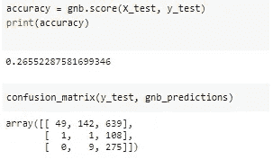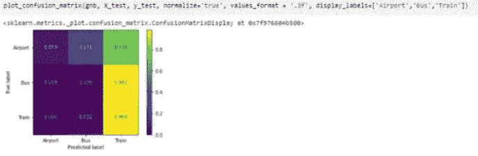

**决策树:**

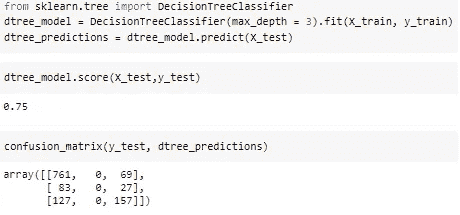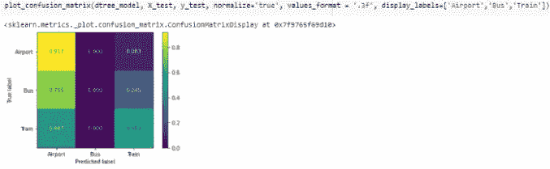

**K-最近邻分类器**

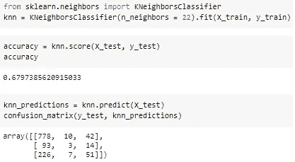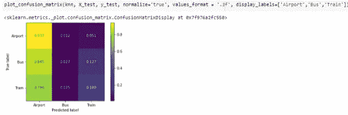

[杰里米·泽罗](https://unsplash.com/@jeremy0?utm_source=unsplash&utm_medium=referral&utm_content=creditCopyText)在 [Unsplash](https://unsplash.com/s/photos/divide?utm_source=unsplash&utm_medium=referral&utm_content=creditCopyText) 上拍摄的照片

# **使用主成分分析的特征减少**

PCA 是一种降维方法，它采用具有大量特征的数据集，并将它们减少到几个基本特征。PCA 通过执行以下步骤来查找给定数据集中的基础要素:

1.计算特征矩阵的协方差

2.计算协方差矩阵的特征向量和特征值

3.按特征值降序排列特征向量

4.选择第 k 个特征向量。这个 **k** 值将成为 **k** 的新尺寸

5.将原始数据转换成 **k** 尺寸

这篇文章深入探讨了 PCA 背后的数学原理

sklearn 的 PCA 包为我们执行这个过程。

在下面的代码片段中，我们将初始数据集的 75 个要素缩减为 8 个要素。

```
from sklearn.decomposition import PCApca = PCA(n_components=8)Principal_components=pca.fit_transform(transportation_df.drop([‘location_name’, ‘Class’], axis=1))pca_df = pd.DataFrame(data = Principal_components, columns = [‘PC 1’, ‘PC 2’, ‘PC 3’, ‘PC 4’, ‘PC 5’, ‘PC 6’, ‘PC 7’, ‘PC 8’])pca_df.head(3)
```

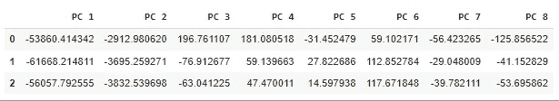

此代码片段用于显示特征缩减算法适合的最佳特征数量。scree 图显示理想值是`n = 2`，但是，我们将继续使用`n = 8`特征进行剩余的分析，因为它实际上为下面的分类器提供了比`n = 2`特征稍好的准确性

```
PC_values = np.arange(pca.n_components_) + 1plt.plot(PC_values, pca.explained_variance_ratio_, ‘ro-’, linewidth=2)plt.title(‘Scree Plot’)plt.xlabel(‘Principal Component’)plt.ylabel(‘Proportion of Variance Explained’)plt.show()
```

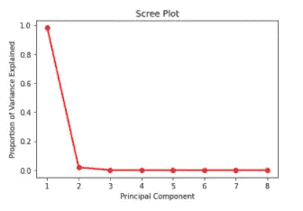

将类列添加回 PCA 数据帧

```
PCA_df = pd.concat([pca_df, transportation_df[‘Class’]], axis = 1)PCA_df.head()
```

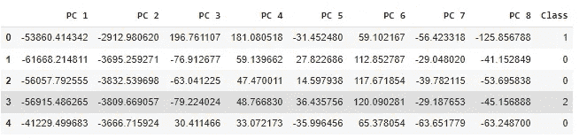

将 PC1 和 PC2 绘制成不同类别的散点图

```
PC_0 = PCA_df.where(PCA_df[‘Class’] == 0).dropna()[[‘PC 1’,’PC 2']]PC_1 = PCA_df.where(PCA_df[‘Class’] == 1).dropna()[[‘PC 1’,’PC 2']]PC_2 = PCA_df.where(PCA_df[‘Class’] == 2).dropna()[[‘PC 1’,’PC 2']]plt.scatter(PC_0[‘PC 1’],PC_0[‘PC 2’])plt.scatter(PC_1[‘PC 1’],PC_1[‘PC 2’])plt.scatter(PC_2[‘PC 1’],PC_2[‘PC 2’])
```

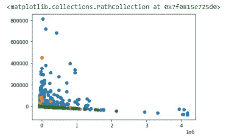

# **使用 PCA 的分类算法**

以下片段将展示如何使用高斯朴素贝叶斯、决策树和 K-最近邻分类器来简化特征。

将数据分为训练数据和测试数据

```
x_cols = []for item in list(PCA_df.columns):if(item != 'Class'):x_cols.append(item)X = PCA_df[x_cols]y = PCA_df['Class']X_train, X_test, y_train, y_test = train_test_split(X, y, random_state = 0)
```

**高斯朴素贝叶斯分类器:**

```
gnb = GaussianNB().fit(X_train, y_train)gnb_predictions = gnb.predict(X_test)
```

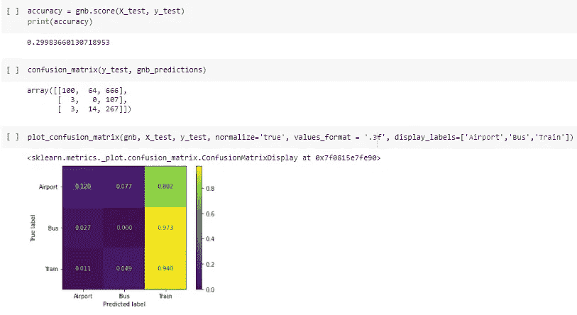

将特征减少到 n = 8 个特征似乎有助于高斯朴素贝叶斯模型的整体模型准确性。预测率略好于原始数据集的准确率~26%。该模型将实际机场预测为预测列车，PCA 数据帧的速率略高于初始数据帧(. 770 vs .802)。该模型很好地正确预测了火车站，但表现略差于初始数据(. 940 vs. .968)。该模型在正确预测公交车站方面稍差一些(0.009 比 0.00)，但这种准确性的降低会导致模型错误地预测所有公交车站记录。该模型预测机场的精度是原始数据集的两倍(. 59 vs .120)。我们可以从上面的热图中看到，大多数记录都被归类为火车站。

**决策树分类器:**

```
dtree_model = DecisionTreeClassifier(max_depth = 3).fit(X_train, y_train)dtree_predictions = dtree_model.predict(X_test)
```

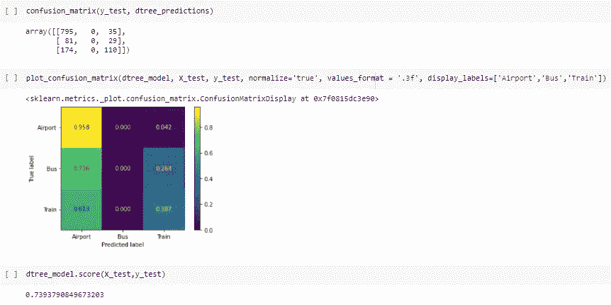

决策树模型使用 PCA 数据帧的总体性能比使用原始数据帧的性能稍差(75%比 73.93%)。该模型在正确预测机场方面表现非常好，事实上，比原始数据在这个特定模型中表现得更好(. 958 vs .912)。该模型在预测公交车站方面表现不佳，这与该模型对原始数据集的预测方式类似。该模型预测火车站的正确率低于原始数据集的正确率(. 387 vs. .553)。该模型倾向于将大多数记录预测为机场。

**K-最近邻:**

```
knn = KNeighborsClassifier(n_neighbors = 22).fit(X_train, y_train)
```

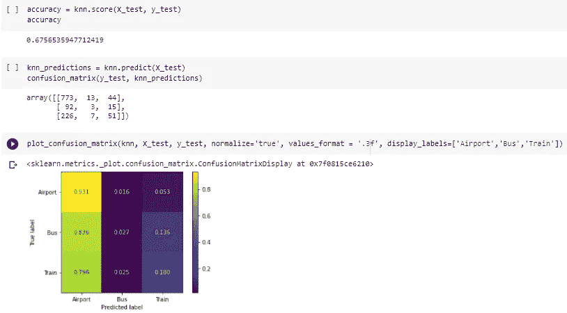

K-最近邻算法具有良好的总体精度，并且与使用原始数据集的算法一样好。该模型以类似于原始数据集的速率(0.931 比 0.937)准确预测机场记录。该模型准确地预测了公共汽车记录和火车记录，预测率与原始数据的预测率相同(分别为 0.027 比 0.027，0.180 比 0.180)。在应用 PCA 算法之前，大部分数据被分类，因此，对于这个特定的模型，使用 PCA 来降低特征的维度似乎不是最佳选择。

从这三个模型及其结果中，我们可以看到 PCA 数据框架并没有提高决策树和 K-最近邻等模型的准确性。唯一看到增长的模型是高斯朴素贝叶斯模型。这可能是由于模型没有考虑特征之间的相关性，这个问题用主成分解决了，因为主成分考虑了原始特征之间的相关性。因此，通过主分量的这种调节导致了稍好的精确度。


Anthony Intraversato 在 [Unsplash](https://unsplash.com/s/photos/divide?utm_source=unsplash&utm_medium=referral&utm_content=creditCopyText) 上拍摄的照片

# 使用 LDA 的特征约简

线性判别分析是另一种降维算法。下面是对 LDA 算法的深入研究: [LDA 文章](https://medium.com/@srishtisawla/linear-discriminant-analysis-d38decf48105)

LDA 通过以下步骤工作:

1)计算不同要素的平均值之间的距离-这称为要素间方差

2)计算每个要素的平均值和样本之间的距离-这称为要素内方差

3)构造低维空间以最大化特征间方差和最小化特征内方差

sk learnlinear discriminant analysis 软件包非常方便地为我们执行这一分析

```
from sklearn.discriminant_analysis import LinearDiscriminantAnalysislda = LinearDiscriminantAnalysis(n_components=2, solver=’svd’)X_lda = lda.fit_transform(transportation_df.drop([‘location_name’, ‘Class’], axis=1), transportation_df[‘Class’])lda_df = pd.DataFrame(data = X_lda, columns = [‘PC 1’, ‘PC 2’])lda_df.head()
```

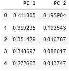

将类列添加到 LDA 数据帧:

```
lda_df = pd.concat([lda_df, transportation_df[‘Class’]], axis = 1)lda_df.head()
```

下面的代码片段将数据集中的不同类绘制成 PC 1 和 PC 2 的函数。从图中可以看出，LDA 分析得出的降维结果与 PCA 分析得出的降维结果有很大不同。让我们看看这个特殊的降维算法的有效性

```
PC_0 = lda_df.where(lda_df[‘Class’] == 0).dropna()[[‘PC 1’,’PC 2']]PC_1 = lda_df.where(lda_df[‘Class’] == 1).dropna()[[‘PC 1’,’PC 2']]PC_2 = lda_df.where(lda_df[‘Class’] == 2).dropna()[[‘PC 1’,’PC 2']]plt.scatter(PC_0[‘PC 1’],PC_0[‘PC 2’])plt.scatter(PC_1[‘PC 1’],PC_1[‘PC 2’])plt.scatter(PC_2[‘PC 1’],PC_2[‘PC 2’])
```

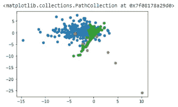

# 使用 LDA 的分类算法

以下片段将展示如何使用高斯朴素贝叶斯、决策树和 K-最近邻分类器来简化特征。

将数据分为训练数据和测试数据

```
x_cols = []for item in list(lda_df.columns):if(item != 'Class'):x_cols.append(item)X = lda_df[x_cols]y = lda_df['Class']X_train, X_test, y_train, y_test = train_test_split(X, y, random_state = 0)
```

**高斯朴素贝叶斯分类器:**

```
gnb = GaussianNB().fit(X_train, y_train)gnb_predictions = gnb.predict(X_test)
```

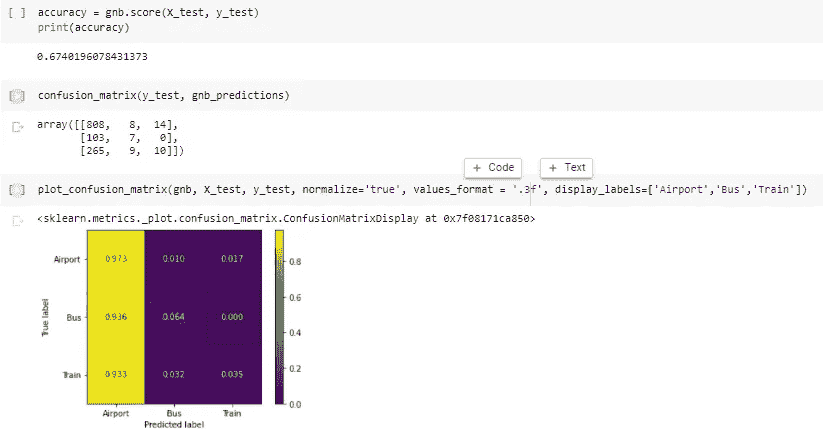

尽管高斯朴素贝叶斯模型背后的耻辱是效率低下，因为它无法将数据集的要素视为相互依赖，而是将它们和独立且不相关的要素(因此是模型的朴素本质)考虑在内，但该模型在降维后的数据上似乎表现得非常好。该模型在预测真实的机场记录(. 973)方面表现非常好，并且在预测真实的公交车站记录(. 064 vs. .009)方面做得更好。该模型在正确分类真实列车记录方面表现更差(. 968 vs. .035)。与模型使用原始数据的性能不同，模型现在预测大多数值为机场。这个模型预测的原因可以归结为数据的不平衡。由于数据主要由机场记录组成，该模型可能倾向于预测更多的机场记录

**决策树模型:**

```
dtree_model = DecisionTreeClassifier(max_depth = 3).fit(X_train, y_train)dtree_predictions = dtree_model.predict(X_test)
```

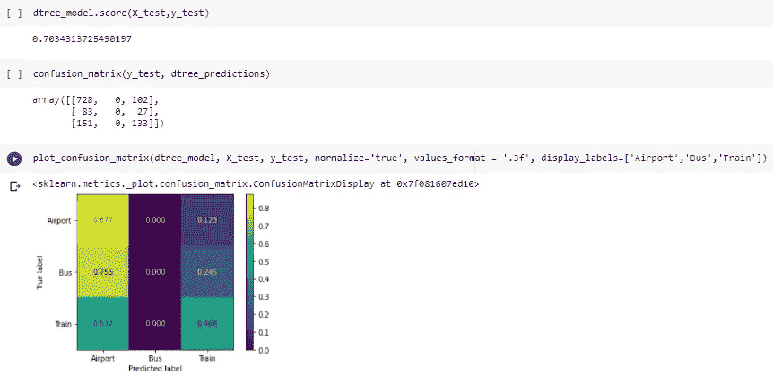

使用 LDA 数据帧的决策树模型的性能比使用原始数据帧的模型稍差(分别为 0.703 和 0.75)。该模型在准确预测真实的机场记录方面稍差(0.91 比 0.9)。该模型不能用任何一个数据帧预测任何真实的公交车站记录，并且在正确分类真实的火车站记录时表现明显更差(0.292 对 0.553)。该模型显示了将大多数记录预测为机场的趋势，这可能归因于数据的不平衡性质。

**K 近邻:**

```
knn = KNeighborsClassifier(n_neighbors = 22).fit(X_train, y_train)
```

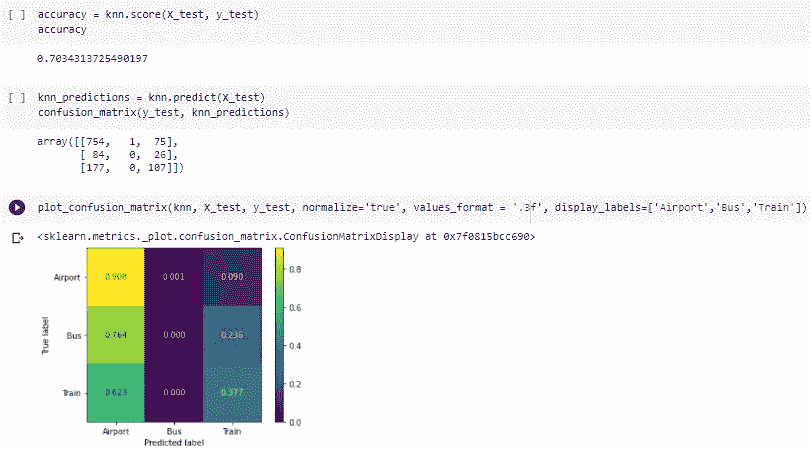

K-最近邻分类器使用降维的数据帧比原始数据帧执行得更好(. 703 对. 673)。与原始数据帧(. 927 vs. .937)相比，该模型在预测具有 LDA 数据帧的真实机场记录方面稍差，但是它在正确预测正确的汽车站记录方面做得同样好。该模型在预测真实火车站记录时表现稍差(0.173 比 0.180)。虽然使用 LDA 数据帧的模型的性能与原始数据帧相同或稍差，但准确性提高了，因为与原始数据帧的情况相比，错误预测记录的比率在 LDA 数据帧中分布得更好。

从对 LDA 数据帧进行的分析中，我们开始看到一种模式。随着特征约简的出现，不围绕数据的互连性质的分类算法的整体准确性会降低。这可以从决策树算法中看出，该算法以一种简单明了的方式工作，其核心思想是根据特征的变化选择一个特定的类。当特征的数量从 75 个特征减少到 2 个特征时，模型的精度下降。但是，特征约简有助于完全基于概率的模型或无监督模型(如高斯朴素贝叶斯模型和 K-最近邻算法)的准确性。让我们看看这种趋势是否会延续到最后一种特征约简方法中。


由 [Marek Piwnicki](https://unsplash.com/@marekpiwnicki?utm_source=unsplash&utm_medium=referral&utm_content=creditCopyText) 在 [Unsplash](https://unsplash.com/s/photos/split?utm_source=unsplash&utm_medium=referral&utm_content=creditCopyText) 拍摄的照片

# **使用奇异值分解减少特征**

奇异值分解是另一种降维算法。下面是对 SVD 算法的深入研究: [SVD 文章](https://medium.com/the-andela-way/foundations-of-machine-learning-singular-value-decomposition-svd-162ac796c27d)

SVD 算法的工作原理是将特征矩阵分解为三个矩阵，这三个矩阵通过以下公式组合在一起:

**A = U𝚺V^T**

其中 **A** 是维数为(m×n)的特征矩阵， **U** 是维数为(m×m)的正交矩阵， **V** 是维数为(n×n)的正交矩阵， **𝚺** 是大小为(m×n)的非负矩形对角矩阵

**sklearn** 包中的`TruncatedSVD`函数很好地执行了这种转换

```
from sklearn.decomposition import TruncatedSVDsvd = TruncatedSVD(n_components=2, algorithm=’randomized’,random_state=0)X_svd = svd.fit_transform(transportation_df.drop([‘location_name’, ‘Class’], axis=1))svd_df = pd.DataFrame(data = X_svd, columns = [‘PC 1’, ‘PC 2’])svd_df.head(3)
```

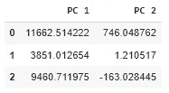

将类列添加到 SVD 数据帧中

```
svd_df = pd.concat([svd_df, transportation_df[‘Class’]], axis = 1)svd_df.head(3)
```

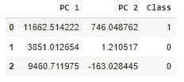

绘制 PC1 和 PC2 的各种类的函数图。下图似乎类似于通过 PCA 分析生成的图表。这显示了两种算法的输出之间的相似性。让我们看看分类算法在准确性上是否与 PCA 分析相似

```
PC_0 = svd_df.where(svd_df[‘Class’] == 0).dropna()[[‘PC 1’,’PC 2']]PC_1 = svd_df.where(svd_df[‘Class’] == 1).dropna()[[‘PC 1’,’PC 2']]PC_2 = svd_df.where(svd_df[‘Class’] == 2).dropna()[[‘PC 1’,’PC 2']]plt.scatter(PC_0[‘PC 1’],PC_0[‘PC 2’])plt.scatter(PC_1[‘PC 1’],PC_1[‘PC 2’])plt.scatter(PC_2[‘PC 1’],PC_2[‘PC 2’])
```

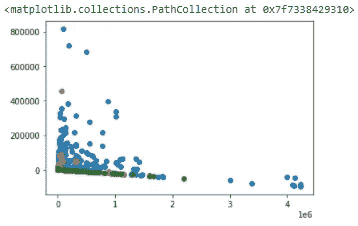

# 使用奇异值分解的分类算法

以下片段将展示如何使用高斯朴素贝叶斯、决策树和 K-最近邻分类器来简化特征。

将数据分为训练数据和测试数据

```
x_cols = []for item in list(svd_df.columns):if(item != ‘Class’):x_cols.append(item)X = svd_df[x_cols]y = svd_df[‘Class’]X_train, X_test, y_train, y_test = train_test_split(X, y, random_state = 0)
```

**高斯朴素贝叶斯分类器:**

```
gnb = GaussianNB().fit(X_train, y_train)gnb_predictions = gnb.predict(X_test)
```

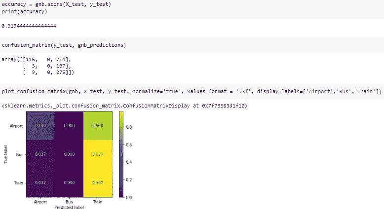

高斯朴素贝叶斯的热图显示，SVD 数据帧的总体精度略好于原始数据帧的总体精度(. 265 vs. .319)。总的来说，该模型在用数据帧(. 140 对. 059)和(0 对. 009)预测实际机场记录和汽车站记录方面表现不佳。在这两种情况下，大多数记录都被分类为火车站，并且在这两种情况下，模型都非常好地预测了实际的火车站记录(. 968 vs. .968)。与所有使用高斯朴素贝叶斯模型的情况一样，无论是否使用特征约简，该模型都倾向于将大多数记录预测为火车站。这也是因为模型的性质，以及它如何将每个功能视为单独的功能，而不是相互关联的功能。

**决策树分类器:**

```
dtree_model = DecisionTreeClassifier(max_depth = 3).fit(X_train, y_train)dtree_predictions = dtree_model.predict(X_test)
```

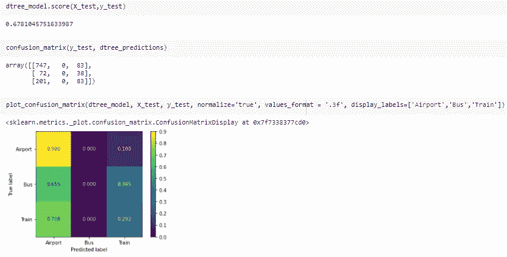

使用 SVD 数据帧的决策树模型比使用原始数据帧的模型稍差(67.8 比 75)。该模型预测真实机场记录的速度比使用原始数据时的模型(0.91 比 0.9)稍差。该模型在缺乏对真实公交车站记录的预测方面没有改变，但在预测真实列车记录方面比原始数据集差得多(. 533 vs. .292)。该模型显示了将大多数记录分类为机场的趋势，因为数据中存在不平衡，并且大多数记录具有机场的初始地面真实性

**K-最近邻分类器**

```
knn = KNeighborsClassifier(n_neighbors = 22).fit(X_train, y_train)
```

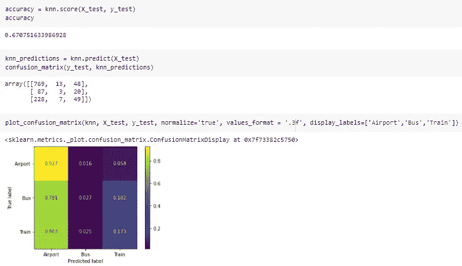

使用 SVD 数据帧的 K-最近邻模型比使用原始数据的模型表现稍差(分别为 0.67 和 0.679)。像原始模型一样，SVD 数据框架模型在预测实际机场记录方面做得很好(. 927 vs. .93)。实际公共汽车和火车站记录的预测精度也类似于原始数据的精度(0.027 对. 027)和(. 180 对. 173)。与以前的模型一样，数据集中的不平衡和大量的机场记录导致该模型将大多数记录预测为机场。

上述分析证实了我们以前的理论。基于概率决策和无监督模型(如高斯朴素贝叶斯和 K-最近邻模型)的算法在处理特征减少的数据时比需要大量特征以获得更好性能的模型(如决策树模型)表现得更好。

# 结论:

从我们对三种不同形式的特征约简进行的分析以及这些特征约简的数据帧在三种不同的多类分类器上的应用中，我们看到一种特定形式的特征约简比其他两种效果好得多，这就是 LDA 变换。LDA 算法有助于提高所使用的大多数分类器的准确性，事实上，使高斯朴素贝叶斯模型的准确性提高了近 30%。因此，该模型在减少安全图数据的特征和提供最佳结果方面是最有效的。

本[笔记本](https://colab.research.google.com/drive/1A6ZZ0WZX3v4N5sN4pU5Yz_gxx2gThVqd?usp=sharing)向我们介绍了基于安全图模式访问数据使用特征缩减和 POI 类别分类进行模型调整的方法。我们的算法在对机场、火车站和公交车站进行分类时取得了一些成功，所有这些都基于停留时间、游客离家的距离、一天中每个小时的受欢迎程度以及一周中每一天的受欢迎程度。

该系列的下一个笔记本(链接即将推出！)将深入研究使用深度学习分类器来执行相同的分析，并看看神经网络是否能提高预测精度

***提问？***

我邀请你在 [SafeGraph 社区](https://www.safegraph.com/academics)的 **#safegraphdata** 频道问他们，这是一个面向数据爱好者的免费 Slack 社区。获得支持、共享您的工作或与 GIS 社区中的其他人联系。通过 SafeGraph 社区，学者们可以免费访问美国、英国和加拿大 700 多万家企业的数据。