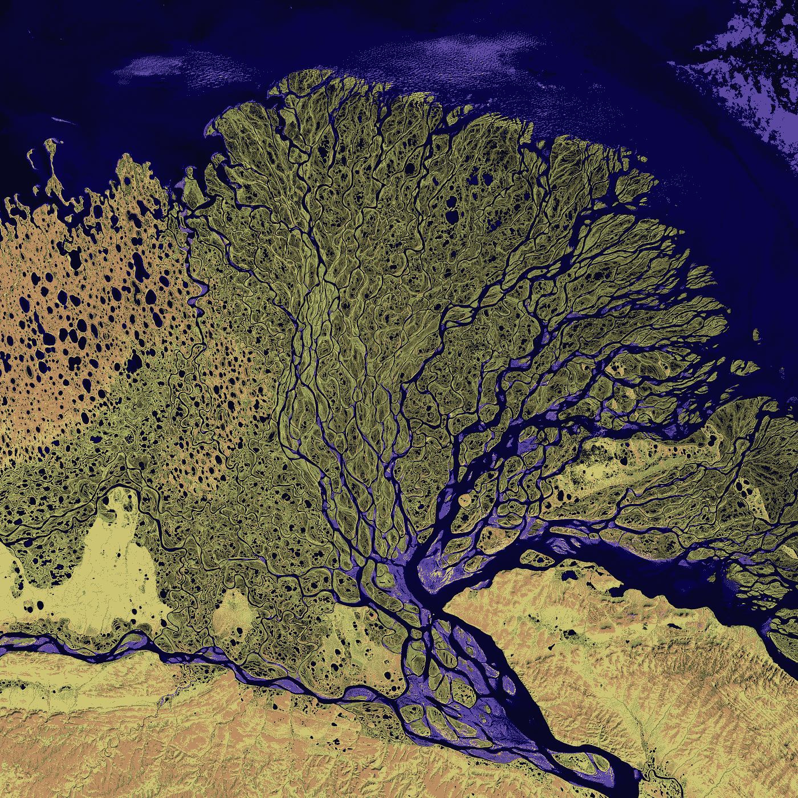
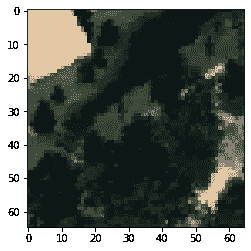
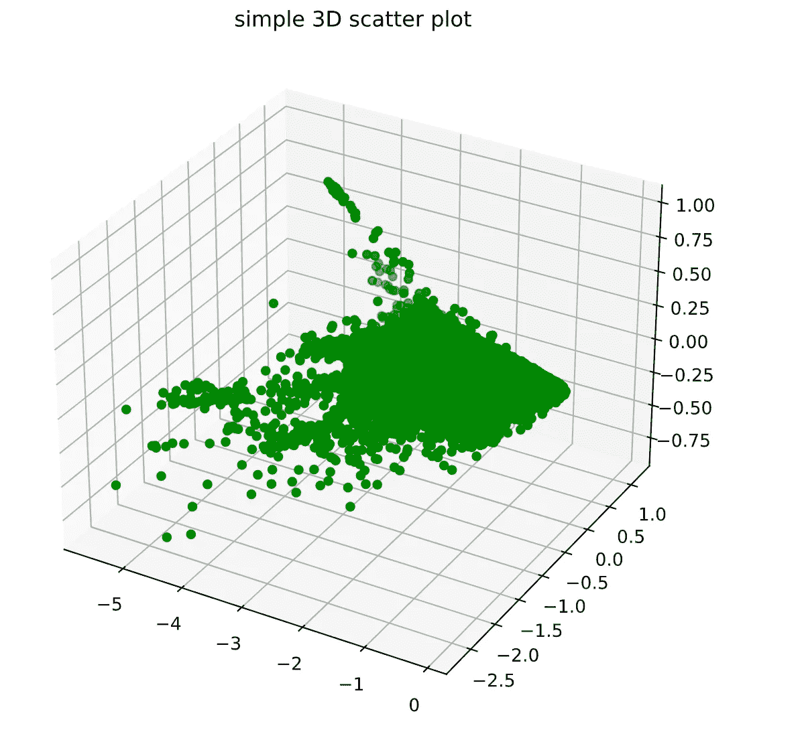
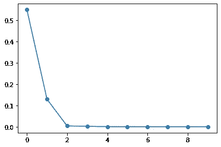

# 高光谱数据的主成分分析

> 原文：<https://towardsdatascience.com/pca-on-hyperspectral-data-99c9c5178385?source=collection_archive---------13----------------------->

## 对初学者友好的高光谱数据主成分分析教程

美国地质勘探局在 [Unsplash](https://unsplash.com/s/photos/satellite?utm_source=unsplash&utm_medium=referral&utm_content=creditCopyText) 上拍摄的照片

# 介绍

高光谱数据扩展了图像分类的能力。高光谱数据不仅区分不同的土地覆盖类型，而且还提供每种土地覆盖的详细特征，如矿物、土壤、人造结构(建筑物、道路等)。)和植被类型。

在处理超光谱数据时，一个缺点是要处理的波段太多。除此之外，存储如此大量的数据也是一个挑战。数据量大，时间复杂度也增加。

因此，减少数据量或仅选择相关波段变得至关重要。应该记住，分类质量不应该随着波段数量的减少而降低。选择相关波段的方法之一是通过应用主成分分析对高光谱数据进行预处理。

# 应用主成分分析

PCA 是基于高光谱图像的相邻波段高度相关并且传达相同信息的事实。

PCA 有许多方法，如 [Hotelling 变换](https://scholarsarchive.jwu.edu/cgi/viewcontent.cgi?article=1003&context=engineering_fac)或 [Karhunen-Loeve 变换](https://en.wikipedia.org/wiki/Karhunen%E2%80%93Lo%C3%A8ve_theorem)，但它们都具有相同的高光谱波段协方差矩阵特征值分解的数学原理。

让我们仔细看看 PCA 的工作原理…

## 步骤 1:导入库

## 第二步:准备数据

您可以从以下链接下载数据。

 [## GitHub-gator sense/muuflgulport:MUUFL gulf port 超光谱和激光雷达数据:该数据集…

### MUUFL Gulfport 超光谱和激光雷达数据:该数据集包括 HSI 和激光雷达数据，评分代码，照片…

github.com](https://github.com/GatorSense/MUUFLGulfport) 

它包含 MUUFL Gulfport 超光谱和激光雷达数据收集文件。但是我们只处理 HSI 数据。

**输出形状:** *(325，220，64)*

## 步骤 3:可视化 RGB 数据

RGB 图像

## 步骤 4:重塑超光谱数据

**输出形状:** *(71500，64)*

## 步骤 5:计算协方差矩阵；特征值和特征向量

PCA 基于被称为待分析的超光谱波段的协方差矩阵的特征值分解的数学原理。

## 第六步:按降序排列特征值，并获得相应的特征向量

按降序排列后，信息最多的特征值和特征向量将位于列表的顶部。

## 步骤 7:提取前 3 个特征向量

## 步骤 8:特征向量的 3D 投影

## 步骤 9:打印特征向量的投影矩阵

## 步骤 10:绘制特征值

在这幅图中，我们可以看到顶部的特征值包含了最多的信息。

# **结论**

主成分分析是一种非常有用的高光谱分类技术。从上面的图中我们可以看到，前 3 个特征值包含了最多的信息。之后，剩下的大多是噪音。PCA 大大减少了分类的计算时间，也减少了要处理的数据量。PCA 预处理给出了相当可接受和准确的分类结果。

除了 PCA 之外，还有其他可选的预处理方法，如典型成分分析。它将来自不同视图的数据映射到一个具有最大相关性的公共空间。

> 感谢阅读！我希望这篇文章对你有用。如果你有任何问题，请随意提问。

# 参考

1.  【https://github.com/GatorSense/MUUFLGulfport 号
2.  [https://engineering . purdue . edu/~ jshan/publications/2002/SaLIS _ 2002 _ hyperimagespca . pdf](https://engineering.purdue.edu/~jshan/publications/2002/SaLIS_2002_HyperImagesPCA.pdf)
3.  [https://www . asprs . org/WP-content/uploads/pers/1999 journal/aug/1999 _ aug _ 909-914 . pdf](https://www.asprs.org/wp-content/uploads/pers/1999journal/aug/1999_aug_909-914.pdf)
4.  [https://en . Wikipedia . org/wiki/Karhunen % E2 % 80% 93Lo % C3 % A8ve _ theory](https://en.wikipedia.org/wiki/Karhunen%E2%80%93Lo%C3%A8ve_theorem)