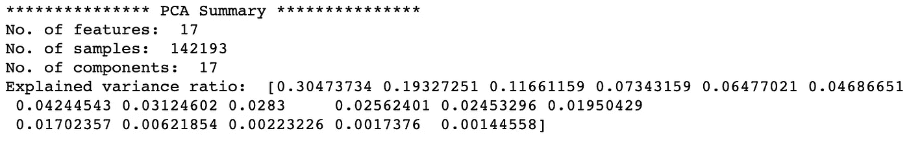

# PCA:主成分分析——如何用更少的维度获得优越的结果？

> 原文：<https://towardsdatascience.com/pca-principal-component-analysis-how-to-get-superior-results-with-fewer-dimensions-7a70e8ab798c?source=collection_archive---------8----------------------->

## 机器学习

## 降维的最佳技术之一

主成分分析。图片由[作者](https://solclover.com/)提供。

# 介绍

主成分分析(PCA)是数据科学家常用的技术，用于提高模型训练的效率，并在较低的维度上可视化数据。

在本文中，我解释了 PCA 是如何工作的，并给出了一个如何在 Python 中执行这种分析的例子。

# 内容

*   PCA 属于机器学习技术的范畴
*   PCA 工作原理的直观解释
*   对真实数据执行 PCA 的 Python 示例
*   结论

# 主成分分析(PCA)属于机器学习技术的哪一类？

虽然 PCA 通常被称为降维技术，但它实际上是一种数据转换。

然而，主成分分析可以很容易地使用得到的主成分来减少维数，因为它将它们从“最有用”(捕获大量数据方差)到“最不有用”(捕获非常少的数据方差)进行排序。

因此，把它放在 ML 的无监督学习分支中的算法的维数减少组中是没有害处的。

下图是**互动，**所以请点击不同类别**放大并展示更多**👇。

机器学习算法分类。由[作者](https://solclover.com/)创建的交互式图表。

***如果你喜欢数据科学和机器学习*** *，请* [*订阅*](https://solclover.com/subscribe) *每当我发布一个新的故事，你都会收到一封电子邮件。*

# 主成分分析(PCA)是如何工作的？

## 准备数据

简单来说，主成分分析帮助我们找到新的维度轴(主成分),可以更好地捕捉数据的方差。

例如，您可能有两个属性-房屋大小(平方英尺)和房屋中的房间数量。毫不奇怪，这两个属性高度相关，因为更大的房子往往有更多的房间。

让我们通过在 2D 散点图上绘制这两个属性来形象化我们虚构的示例:

房子大小和房间数量的关系。图片来自[作者](https://solclover.com/)。

我们可以看到，房子大小和房间数量之间是正相关的。此外，与房间数量相比，房子的大小似乎有更大的差异。

但是，在我们做出任何过早的结论之前，让我们暂停一分钟，看一下 x 和 y 的标度，我们可以看到，这两个属性使用了两种不同的标度；因此，上面的图片并不真正具有代表性。

为了更客观的解读，我们先把数据标准化。

> 请注意，标准化是一种数据转换技术，它对数据进行重新缩放，使每个属性的平均值为 0，标准差为 1。这种转换可以用下面的公式来描述:

标准化。图片由[作者](https://solclover.com/)提供。

这是同样的数据经过标准化后的样子:

房子大小和房间数量之间的关系(标准化数据)。图片由[作者](https://solclover.com/)提供。

我们可以看到数据现在以原点为中心，因为两个标准化属性的平均值都是 0。同时，现在更容易直观地比较这两个属性的分布(方差)。正如之前推测的那样，房子的大小确实比房间的数量有更大的差异。

## 寻找主成分— PC1

我将有意避免进入寻找主成分背后的数学，因为我的目标是给你一个关于 PCA 如何工作的**直观/视觉**理解。

如果你确实喜欢一点代数，尤其是矩阵乘法，你可以看看这个来自[王子晨](https://medium.com/u/cefe6819be80?source=post_page-----7a70e8ab798c--------------------------------)关于 [PCA 和 SVD 使用 NumPy](/pca-and-svd-explained-with-numpy-5d13b0d2a4d8) 的解释。

既然我们已经将数据标准化并以原点为中心，我们可以寻找“最佳拟合”线。这条线必须穿过原点，我们可以通过最小化数据点到它们在这条线上的投影的距离来找到它。看起来是这样的:

数据的“最佳”线，也是 PC1 的坐标轴。图片由[作者](https://solclover.com/)提供。

有趣的是，这条“最佳拟合”线恰好也是主成分 1 (PC1)的轴。这是因为最小化与线的距离也使同一条线上的数据点投影的分布最大化。

换句话说，我们已经找到了一个新的轴，它可以捕捉到该维度中数据的最大变化量。

如果你决定单独研究这个过程的数学，你会遇到像**特征向量**和**特征值**这样的术语。在某种意义上，它们描述了这条“最佳”线，并通过对协方差矩阵进行**特征分解**或通过**奇异值分解**分析(简称 SVD)在数学上找到。

## 寻找主成分— PC2 和其他

记住，主成分分析不仅仅是降维。因此，我们可以在数据中找到和属性(维度)一样多的主成分。说了那个，还是找 PC2 吧。

由于我们只有两个属性，在本例中，一旦我们知道了 PC1，就很容易找到 PC2。它只是一条穿过原点与 PC1 正交(90 度角)的直线。

这是图表:

主成分 2 (PC2)。图片由[作者](https://solclover.com/)提供。

请注意，如果我们有三个属性，那么 PC2 将是穿过原点的直线，与 PC1 正交，并且使数据点到它们在 PC2 直线上的投影的距离最小。那么 PC3 就是穿过原点并与 PC1 和 PC2 都正交的直线。

## 总结主要成分

如果我们要列出每个主成分，PC1 将是捕获数据方差的最高比例的维度，PC2 是捕获 PC1 不能捕获的剩余**方差的最高比例的维度。类似地，PC3 将是捕获 PC1 和 PC2 不能捕获的剩余方差的最高比例的维度，等等。**

> PCA 的目标是以某种方式转换数据，使我们能够捕捉每个后续维度中的最大方差。

现在我们已经在二维示例中找到了 PC1 和 PC2，我们可以旋转图形，将 PC1 和 PC2 作为我们的新轴:

PC1 — PC2 图。图片由[作者](https://solclover.com/)提供。

此外，如果我们愿意，我们可以通过将点投影到 PC1 并去掉 PC2 来进行降维。

将数据点投影到 PC1 上。图片由[作者](https://solclover.com/)提供。

最后，无论出于何种原因，如果我们不喜欢 PC1，我们可以通过将点投影到 PC2 上来降低维数，从而摆脱 PC1。然而，如果我们这样做，我们将丢失大量的数据方差。

将数据点投影到 PC1 和 PC2 上。图片由[作者](https://solclover.com/)提供。

# 使用真实数据在 Python 中进行主成分分析

现在让我们动手对真实数据进行 PCA 分析。

## 设置

我们将使用以下数据和库:

*   来自 Kaggle 的澳大利亚天气数据
*   scikit-learn 的[标准定标器](https://scikit-learn.org/stable/modules/generated/sklearn.preprocessing.StandardScaler.html?highlight=standard%20scaler#sklearn-preprocessing-standardscaler)用于标准化我们的数据，而 [PCA](https://scikit-learn.org/stable/modules/generated/sklearn.decomposition.PCA.html) 用于执行主成分分析
*   [熊猫](https://pandas.pydata.org/docs/)进行数据操作
*   用于可视化的 [Matplotlib](https://matplotlib.org/stable/contents.html) 和 [Seaborn](https://seaborn.pydata.org/)

让我们导入所有的库:

然后，我们从 Kaggle 下载并获取[澳大利亚的天气数据。同时，我们还衍生出一些新的特性。](https://www.kaggle.com/jsphyg/weather-dataset-rattle-package)

下面是数据的一个片段:

Kaggle 的澳大利亚天气数据片段。图片由[作者](https://solclover.com/)提供。

## 数据相关性

在进行 PCA 分析之前，让我们通过查看相关图来更好地理解我们的数据。

气象数据的相关矩阵。图片由[作者](https://solclover.com/)提供。

正如我们所见，我们有大量高度相关的变量。例如，在上午 9 点和下午 3 点，MaxTemp 与湿度高度负相关。同时，风速与上午 9 点和下午 3 点的风速高度正相关。

许多变量之间的强相关性表明，主成分分析将帮助我们在潜在的更小数量的维度内捕获大量的方差。

## 数据标准化

现在让我们对数据进行标准化，得到一组特征，每个特征的平均值为 0，标准差为 1。

## 执行 PCA

最后，让我们用算法进行主成分分析。

为我们提供了以下结果:

PCA 结果。图片由[作者](https://solclover.com/)提供。

解释的方差比告诉我们有多少方差被每个后续的主成分捕获。让我们把它画在条形图上，这样我们可以更容易地检查它。

PCA 解释的方差图。图片来自[作者](https://solclover.com/)。

该图使我们能够很容易地看到，大部分方差仅被前几个 PC 捕获:

*   PC1 单独获得了 31%的方差
*   前 2 台电脑获得了 50%的差异
*   前 6 台电脑占据了 80%的差异
*   前 11 台电脑占据了 95%的差异
*   前 13 台电脑占据了 99%的差异

因此，如果您正在建立一个预测模型，您肯定可以在很少或没有损失其性能的情况下使训练更加有效。你可以通过减少维数，只选择几个主要成分来达到这个目的。

> 请注意，您可以通过简单地选取 **X_trans** 数组的一个子集来选择顶部的几个组件，或者通过将 **n_components** =6 或任何您想要保留的维数来重新运行 PCA 分析。

# 结论

我们已经了解了主成分分析的工作原理，以及如何将其应用到我们的数据中。我真诚地希望您能够使用这些新知识和我提供的代码来构建更好、更高效的模型。

在你离开之前，最后一个有趣的想法要记住。尽管减少维度数量会损失一些数据方差，但这通常会导致**更好的**模型性能。

虽然这听起来可能违反直觉，但值得记住的是，一些预测算法受到维度诅咒的困扰，这意味着过多的维度会使数据变得稀疏，更难建模。因此，减少维数有助于识别属性之间的联系，从而提高性能。

如果你觉得这篇文章很有用，或者有任何问题或建议，请随时联系我们。

干杯！👏
**索尔·多比拉斯**

***如果你已经花光了这个月的学习预算，下次请记得我。*** *我的个性化链接加入媒介是:*

<https://solclover.com/membership>  

一些相关的文章你可能会感兴趣:

</umap-dimensionality-reduction-an-incredibly-robust-machine-learning-algorithm-b5acb01de568>  </dbscan-clustering-algorithm-how-to-build-powerful-density-based-models-21d9961c4cec> 