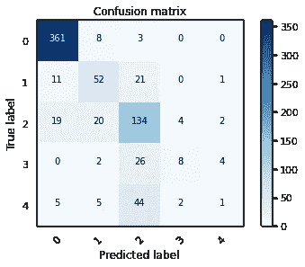
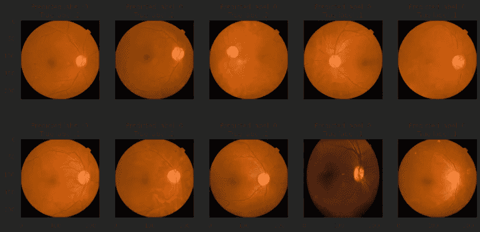

# 窥视黑盒内部

> 原文：<https://towardsdatascience.com/peeking-inside-the-black-box-433338925c56?source=collection_archive---------30----------------------->

## 一个简单的方法来洞察你的 CNN 模型的局限性

Marc-Olivier Jodoin 在 [Unsplash](https://unsplash.com/s/photos/mirror?utm_source=unsplash&utm_medium=referral&utm_content=creditCopyText) 上拍摄的照片

现代算法解决我们当前数据驱动的问题的方式有些神奇。尽管来自神经科学背景，对我们的感觉系统有很强的理解，但当我编写模拟它们的算法时，我感到谦卑。

然而，给我印象最深的一件事是，两者都可以被描述为黑盒，这个术语通常是为深度学习模型保留的。例如，现在当你读这篇文章时，*你真正看到的是什么*？

单词…句子…段落？不会吧！

你没有看到任何*的东西*。相反，以不同波长、角度和强度发射的光进入你的视网膜，产生一连串事件，转换成电化学信号。这个信号被发送到你大脑深处的一个小区域，在那里它被整合，然后被投射到你大脑后部的一个大区域……以某种方式让你将信息解释为一篇文章中的文本。

如果你真的想让自己大吃一惊，考虑一下在浅色背景下阅读黑色文字的后果。如果我们的视觉系统被光激活，我们真正阅读的东西更像是文本的“影子”(因为黑色=没有光，因此没有激活我们的视网膜细胞)！

今天，我们将找到窥视黑盒内部的方法，以帮助从卷积神经网络(CNN)的结果中获得洞察力。在之前的[文章](/harnessing-the-power-of-transfer-learning-for-medical-image-classification-fd772054fdc7)中，我提供了从头开始构建自己的 CNN 的逐步说明。我用迁移学习将这个模型与其他几个模型进行了比较。有兴趣可以看看我这个项目的 [Github](https://github.com/ryancburke/blindness_detection) 回购！

最近，有人问我是否知道我的模型在哪里出错…这是一个多么好的问题！我掉进了兔子洞，只考虑损失最小化和准确性最大化。当我开发出一个性能良好的模型时，我真的很高兴。与此同时，我不知道这个模型在哪里或者为什么会失败。

这篇文章的目的是试图找出我的模型哪里出错了。为此，我将使用下面的代码生成一个混淆矩阵(注意:这个例子为我从头构建的表现最好的 CNN 提供了一个混淆矩阵，其验证准确率为 76%)。

## 数据集的刷新

对于那些没有看过这篇文章的人来说，这只是一个快速入门，这是一个针对糖尿病视网膜病变(DR)的多分类任务。诊断的分布极不均衡。在原始数据集中，有 1805 个对照，370 个轻度(1 级)，999 个中度(2 级)，193 个重度(3 级)，295 个增生性(4 级)。

为了解释混淆矩阵，我们的目标是最大化从左上到右下的对角线上的值。我们可以在图 1 中看到，在对照组中，n=361 被正确分类，而 n=8 被分类为 1，n=3 被分类为 2。这还不错。

但是看看其他的类，准确率没有什么值得大书特书的！

图 1 —混淆矩阵，展示了该数据集的真实标签与预测标签。回想一下，0 是对照组，1-4 代表糖尿病视网膜病变严重程度的增加。作者图片

更进一步，我们可以使用下面的代码来绘制顶级错误的图像，以及它们的真实值和预测值。

绘制前 10 个错误的图像向我们显示，它们都被预测为控制图像。

图 2-10 大错误图片。作者图片

## 通过绘制误差图，我们获得了什么信息？

我认为公平地说，这里提出的模型受到不成比例的群体规模的严重影响。在总共 733 幅验证图像中，650 幅被预测为对照或第 2 类，这与它们在数据集中的过度表现一致。

## 如何改进模型

由于不平衡的数据集显著影响了模型，有一些方法可以纠正这个问题。查看这篇[文章](/handling-imbalanced-datasets-in-deep-learning-f48407a0e758)了解更多详情。

*   焦点损失:定制的损失函数将惩罚容易分类的类别，而不是为每个类别分配相等的权重。这一结果将所有阶层置于一个更加公平的竞争环境中，这可能会改善代表性不足的阶层的分类。
*   过采样/欠采样:通过选择过代表组的随机比例(欠采样)或创建欠代表组的副本(过采样)，我们可以综合平衡组大小。

我将尝试这些不同的选项，并让您知道它们如何改变模型的准确性。感谢阅读！