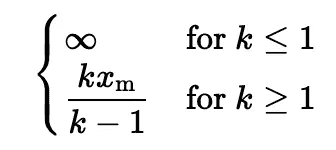
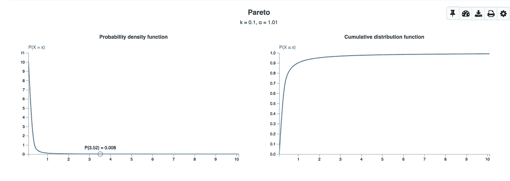
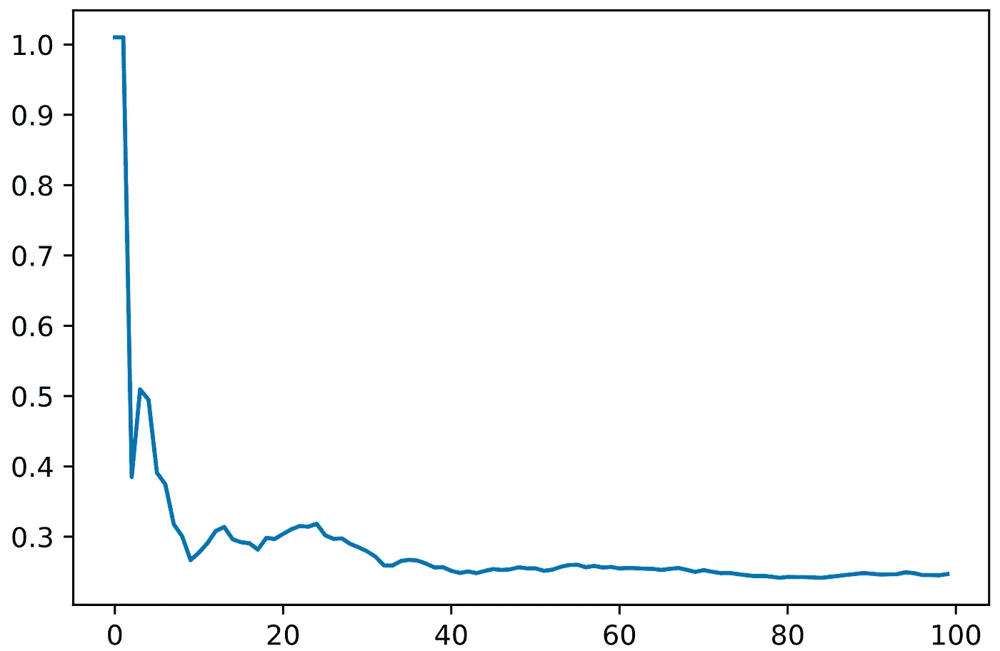
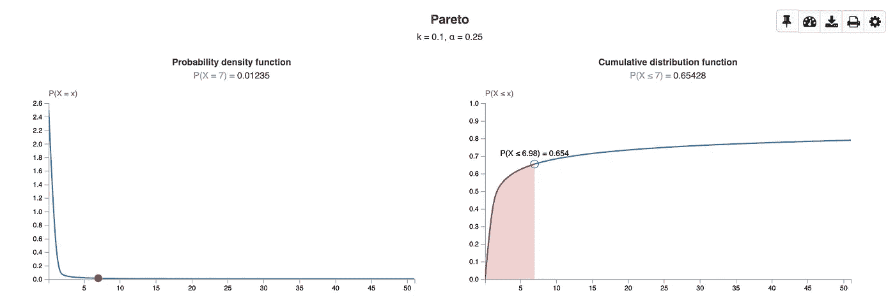

# 笔和纸贝叶斯

> 原文：<https://towardsdatascience.com/pen-paper-bayes-58be521ff0d9?source=collection_archive---------31----------------------->

## 如何通过优雅的结果享受更简单的计算

这个故事假设你对[贝叶斯框架](https://en.wikipedia.org/wiki/Bayesian_inference)有一个基本的了解——相对于经典的频率主义者框架。但差不多就是这样了:)我们将看到模型的学习步骤不需要大量的数字，因为一些幸运的结果可以大大加快速度。每当资源紧张时，例如在减少的硬件或在线学习环境中，这种改进就开启了这种东西的采用。

“以前，当我看着一张白纸时，我的脑海里充满了各种想法。现在我所看到的是一张白纸“保罗 Erdős |照片由[亚伦负担](https://unsplash.com/@aaronburden)在 [Unsplash](https://unsplash.com/?utm_source=medium&utm_medium=referral)

**离开被打败的贝叶斯路径**

贝叶斯学习的主要思想是迭代地应用贝叶斯定理来寻找以可能的最佳方式描述某些数据行为的分布。该描述是关于一些产生新的数据点并预测接下来哪种数据点的机器，告知这种机器在两种成分上看起来如何。第一个是从一些或多或少有根据的对你的数据看起来如何的猜测开始。第二个是我们不断观察的数据，随着时间的推移，这完善了我们最初的假设。

首先，值得一提的是贝叶斯定理本身:

霓虹贝叶斯！|照片由 [mattbuck](https://commons.wikimedia.org/wiki/User:Mattbuck) 在[维基共享](https://commons.wikimedia.org/wiki/Main_Page)上拍摄

一些非常基本的符号(并为格式道歉，见结束语):

*   *x* ᵢ是我们看到的第 *i* 个数据点，来自我们试图了解的随机变量 *X̅*
*   *θ̅* 是模型参数的向量，所以分布 *D* 中的参数*x̅*~ d(*θ̅*)——我们的目标是为它发现合理的值；如果 *X̅~ N(μ，σ )* 那么 *θ̅=(μ，σ )*
*   *α̅* 是模型 *H* 统治 *θ̅* 的参数向量:由于我们将 *θ̅* 视为随机向量，它遵循一个分布，其参数由 *α̅* 表示，因此*θ̅****~****h*(*α̅*超参数

注意:我们将在下面的例子中使用 *α̅* ，但这是巧合。

学习一些东西——每当你看到新的东西时，就刷新你已经学到的东西。|照片由[凯莉·西克玛](https://unsplash.com/@kellysikkema)在 [Unsplash](https://unsplash.com/?utm_source=medium&utm_medium=referral) 上拍摄

该机制依赖于几个项目的定义:

1.  先验分布:这是初始假设 *H* ，定义为关于数据分布参数的分布，所以*p(θ̅|α̅)*；它的参数是模型的超参数
2.  后验分布:这是根据进来的新数据点对初始假设的更新，所以 *p(θ̅|x* ₁ *，x* ₂ *，…，x*ᵢ*,α̅)*；它的超参数是我们用来初始化先验分布的原始超参数的函数，当然还有数据点
3.  抽样分布:这就是你的实际数据分布 *D* 的样子，它被称为似然性；正是 *p(x* ᵢ *|θ̅)*
4.  边际可能性:抽样分布，在超参数上被边缘化，这就是所谓的证据，*p(x*ᵢ*|α̅)*；我们在问自己，先验的一个特定实例如何与数据相兼容
5.  后验预测分布:这是学习引擎，因为它定义了任何可能性假设下的事件概率——不仅仅是当前的假设，这是最新的后验超参数集——它是 *p(x* ᵢ *|x* ₁ *，x* ₂ *，…，x*ᵢ₋₁*,α̅)*；这是与基于简单最大似然法的频率主义方法的主要概念差异。

您可以从当前可能性或后验预测性中对一些数据点进行采样，但有一个根本的区别:前者仅说明截至目前更新参数的特定假设，而后者说明一个点仍可能来自任何其他*可能性的事实——即使随着更多数据点的出现出现一个选项，我们也不知道真相。*

注意*后验分布*和*后验预测分布*之间的区别，如上所述，它们是*而不是*的同义词。特别是:

*   后验是随着新数据点的到来而对先验的重复更新；它的形式是 *p(θ̅|x* ᵢ *)* ，它说了一些关于可能的模型参数 *θ̅* 视一个点 *x* ᵢ的条件
*   后验预测对实际点 *x* ᵢ说了些什么，将所有可能的模型假设 *θ̅* 一起考虑(边缘化)

后验分布是关于数据分布的参数，这就是为什么我们说在贝叶斯框架中，我们不试图准确预测下一个点会是什么——提出一个最佳候选是基于频率最大似然的方法——而是告知它应该看起来如何，因此它的分布。

我们的定义。和 5。上图:你可能认为这是我们可以使用的主要方法工具，当我们看到越来越多的要点时，它会变得更加锋利。记住这些定义并不重要，但当然要理解它们的含义。我们将在后面看到后验预测的作用！

一般来说，更新后验概率在计算上具有挑战性，因为你基本上必须求解积分。对于先验和可能性的任意选择，你可能需要一些库的帮助，比如 [PyMC3](https://github.com/pymc-devs/pymc3) 。但是……对于许多已知的组合来说，后验概率的封闭形式确实存在:这是一个很大的优势，因为它为在线学习的采用打开了大门——当你只希望能跟上数据流时，你就不会被昂贵的数字所困。

**一个阐明性的例子**

这种神奇的配对被称为[共轭先验](https://en.wikipedia.org/wiki/Conjugate_prior#Table_of_conjugate_distributions)，理解任何一张表上的几个例子都是确保你理解正在发生什么的一个极好的方法。共轭先验到底是什么？可能性函数(见上文)是我们对产生数据的过程的假设:如果我们正在研究一个硬币投掷，这个过程将是伯努利过程——代表特定硬币投掷的每个变量都是一个指标，0 代表正面 1 代表反面。伯努利分布的参数是人头的概率 *p* 。先验分布以概率分布的形式，设定了这个 *p* 应该是什么样子的初始假设，希望是有根据的假设。每次抛硬币，随着新的数据观测值的到来，这个先验被更新，得到的分布被称为后验分布。如果新更新的后验概率来自与先验概率相同的族，那么我们说先验分布是所选过程似然分布的*共轭先验*。一个分布族实际上可能是一个纯粹形式上的，而且正在消失的概念。它是一组给定的分布，可以用有限数量的参数一次性全部描述出来。例如，正态分布可以被视为一个*族*分布，特别是一个指数分布；如果通过正确设置参数，可以从同一个解析形式获得两个分布，那么它们属于同一个族。

例如，假设我们认为我们的数据点来自一个[帕累托](https://en.wikipedia.org/wiki/Pareto_distribution)分布，那么这将是我们的可能性。这种厚尾分布是由一个标度 *xm* 和一个形状 *k* 定义的，标度告诉我们最小值是多少，k 越靠近轴越高(注意:维基百科使用*XM*——不幸的是[不能用 Unicode 呈现](https://www.unicodeit.net/)——标度是α，形状是α，我们用 *k* 代替)。对其样本不能为负的任何事件进行建模是有用的，并且我们预计大值并非不可能(非正式地，比我们用[半正态](https://en.wikipedia.org/wiki/Half-normal_distribution)所能做的更好)。

帕累托咖啡:80%水，20%咖啡因。|照片由 [Austin Distel](https://unsplash.com/@austindistel) 在 [Unsplash](https://unsplash.com/?utm_source=medium&utm_medium=referral) 上拍摄

让我们确定尺度；在大多数应用中，这是一件合理的事情:假设我们对保险公司索赔的预期成本建模感兴趣，最小成本可以作为被拒绝索赔的处理和办公成本(保险公司不支付客户，但即使说不也有一些成本)。通常我们只在固定了一个参数子集后才研究一个共轭；总的来说，有可能找到一种形式来学习所有这些知识，我们将简要地谈到这一点。假设我们将比例固定为某个值 *xm=xm** 。请注意，对于我们示例中的所有计算，我们将舍入到两位小数(这将在各处引入一些小的舍入误差)。

所以帕累托是我们的可能性，比例是固定的；我们最初对这个形状的猜测是什么？形状值的分布应该是怎样的呢？从表中我们看到[伽马](https://en.wikipedia.org/wiki/Gamma_distribution)是一个；这个分布有两个参数，α和β，我们学习模型的超参数。对于我们的帕累托来说，一个好的选择是 *k=2.1* ，其中 *2* 作为方差未定义的病理值，因此 *2+0.1* 保持足够接近。将 gamma 集中在 *2.1* 上:我们知道 gamma 的平均值是 *μ=α/(α+β)* 所以我们设置: *α/(α+β)=2.1* 集中在它周围，并固定 *α=2* (我们在这里没有好的猜测，所以我们选择一个好的 *α* )所以我们得到: *β = -1.04* 。所以结果是 *Gamma(2，-1.04)* :很好，我们已经决定了我们的先验是什么样子的！在该表中，您还可以看到我们如何在读取更多 xᵢ数据点时更新这两个超参数，其中 *n* 是迄今为止的观察次数。更新后的α和β的后验概率是什么样的？通过共轭的美丽，在看到她从 Pareto 得到的数据后更新 Gamma 仍然会产生一个 Gamma，带有更新的参数。请注意后验*预测*是如何从表格中消失的。这意味着我们可以继续从可能性过程中生成数据，但是我们还没有真正的方法。)来说明特定数据点接下来出现的概率，而不局限于关于可能性的特定假设。

**链接参数**

对于具有多个参数的可能性，如上例所示，默认设置是固定所有参数，除了要学习的参数，该参数成为模型参数。这是针对单参数共轭的。没有什么能阻止我们尝试一下子了解所有的参数。从这个意义上说，对一个单一参数的推理是大多数例子和应用的情况，但它不是一个要求或任何东西。你可以在假设的基础上思考假设。

相当详细的讨论可以在[这里](https://vioshyvo.github.io/Bayesian_inference/chap-multi.html)找到。以高斯共轭为例，其中先验和似然都是正态的。我们可以对平均值进行第一次猜测: *θ ~ N(μ₀，τ₀)* 并将其插入实际的后验概率 *X̅ ~N(θ，σ ₀)* 因此从三个超参数开始，两个获得平均值(一个平均值和一个方差，因为我们有一个正态先验)，一个获得插入该平均值后的点(一个方差，也在正态先验下)。参见[此处](https://people.eecs.berkeley.edu/~jordan/courses/260-spring10/lectures/lecture5.pdf)的算出示例(第。3).注意:精度是方差的倒数， *τ=1/σ* 。

没有什么能阻止你根据自己的假设做出假设——逻辑被解放了！|照片由[郭佳欣·阿维蒂斯扬](https://unsplash.com/@kar111)在 [Unsplash](https://unsplash.com/?utm_source=medium&utm_medium=referral) 上拍摄

**显示数据**

我们现在将把帕累托例子带到生活中，显示分析似然更新和数字预测后验概率，后者没有一个安全的封闭形式。

这将使你的想法成为一个伟大的想法。|图片由 [Franki Chamaki](https://unsplash.com/@franki) 在 [Unsplash](https://unsplash.com/?utm_source=medium&utm_medium=referral) 上拍摄

**共轭案**

您可能希望打开[示例笔记本](https://github.com/rvvincelli/bayes-penandpaper/blob/main/pareto_conjugate.ipynb)。

对于帕累托的例子，在维基百科页面上我们发现了一个非常有趣的(并且无人认领，至少在撰写本文的时候)参考:Steam 上的用户玩不同游戏的时间量是帕累托分布的。根据著名的原则，这基本上意味着普通用户将花费 80%的时间玩他或她拥有的 20%的游戏——有些游戏玩得很多，但大多数不是。这里的*基本上*是有意义的，因为只有对于一个非常具体的尺度和形状选择，我们才能得到帕累托分布的经典 80–20 行为——我们不知道这是否会成为我们数据集的情况。我们想研究一个游戏被玩 *x* 小时的概率。

事实证明(这真的是一个巧合)，在 Kaggle 上我们可以找到完美的[数据集](https://www.kaggle.com/tamber/steam-video-games?select=steam-200k.csv)(已经上传，连同其原始许可证，在[回购](https://github.com/rvvincelli/bayes-penandpaper)):数百名 Steam 用户的用户行为。

蒸汽上有吃豆人吗？如果是的话，我很确定它的游戏时间是集合中的异常值。|照片由 [Kirill Sharkovski](https://unsplash.com/@sharkovski) 在 [Unsplash](https://unsplash.com/?utm_source=medium&utm_medium=referral) 上拍摄

从数据中我们可以看出，游戏时间的最小值是 0.1 小时(如果你在五分钟后就厌倦了，那确实是一个非常糟糕的游戏)；这将成为我们的固定比例， *xm=0.1* 。在现实生活中，你必须只是猜测，因为你事先没有所有的数据，所以你当然不能取最小值！或者你必须依赖于你所建模的事物的法则或硬性限制。追逐形状参数 *k* 将会精心制作我们的帕累托图。我们对伽玛整形 k 的最初猜测是什么？我们可以根据我们一般预期的平均游戏时间，从一个有根据的猜测开始；从网站上这个数据集的元数据来看，不清楚它指的是哪个时期，也不清楚它是否被更新过；我们可以从绝对的角度来选择，从 2003 年(Steam 启动)到 2017 年(数据集创建)。我们说 7 个小时好吗？作为补充:如果我们的猜测不准确，这真的是个问题吗？如果我们有足够的数据，并检查了一些无聊的条件，它不是，因为:任何偏见来自一个最初的坏选择在先验将被冲走，因为我们阅读更多的数据，并调整后验；这要感谢[这个](https://en.wikipedia.org/wiki/Bernstein%E2%80%93von_Mises_theorem)定理，它告诉我们先验变得不相关，渐近地。人们甚至可以谈论贝叶斯模型的收敛速度，但那是另一个故事了。我们可能没有足够的数据，但规律性检查是有的。那么我们如何得到想要的形状呢？首先，我们必须问一下 *k > 1* 否则 *μ=∞* 这在我们的例子中是不正确的:一般的游戏倾向于玩一个有限的小时，也有一个小的小时，我们选择的是 *7* 。插入 *xm=0。*进入均值对于这种情况，我们求解出 *k* 的帕累托均值，即:

帕累托分布平均值，k 和 xm 如上。你能找出这个错别字吗？

这给了我们 k = 1.01 T21。首先，我们期望我们的数据过程是一个*帕累托(0.1，1.01)* 。

用 [essycode](https://www.essycode.com/distribution-viewer/) 创建；没有重新调整。

我们从数据集中获取的每个数据点都是某个用户和某个游戏的注册游戏时间；由于我们对全局行为感兴趣，我们丢弃了用户和游戏信息，只保留小时记录。

现在的问题是:对于我们的先验，什么是好的价值？我们的帕累托参数是 *xm=0.1* 和 *k=1.01* 。对于伽马，我们设置 *α=1* ，因为它是最小和最好的形状(对于 *α ≥ 1* ，分布被很好地定义并且也有一个模式)；观察到我们的目标帕累托形状是 *k=1.01* ，我们将通过选择 *β=0.99* 观察到 *μ=α/β* 来将伽马集中在 *k* 周围。同样，我们的帕累托标度 *xm* 是固定的，并且作为未知模型参数的形状被假设为表现为*伽马(1，0.99)* (这里用标度 *θ* 表示，它是我们的速率 *β* 的倒数)。从这个分布中取样，以帕累托分布的形式给出了我们的可能性的一个实例。

现在，是获取数据的时候了。该集合按用户 id 排序，它只是用户的一个小样本。我们只对娱乐活动感兴趣。因为我们想有一种从未知和帕累托假设分布中随机抽样的感觉，我们将稍微打乱行。

这是前几次迭代的伽马后验均值的演变，因此随着超参数的更新，图为 *μ=α/β* :

伽马后验均值图；你可以看到它在大约 n=50 次迭代后稳定下来。

你可以看到它在 *0.25* 附近非常快地稳定下来，实现了我们的帕累托似然的形状参数 *k* 的期望值。总的来说，这可以被视为一个好的迹象。为了更进一步的信心，我们可以对不同的范围伽马选择进行一点试验，看看收敛速度是否保持恒定——或者至少不会爆炸。关于收敛，一些结果确实如我们上面提到的那样成立，但是这个讨论暂时带了一个*太先进的*标志，并成为一些其他博客实验的好材料:)

以下是我们的后验概率和可能性的最终结果:

所以我们最终得到的是一个规模 *xm=0.1* 形状 *k=0.25* 的帕累托分布。这毕竟不是很好:如果规模小于 *1* ，均值和方差都趋向于无穷大，这是获得任何分布感觉的两个重要特征。如果这是一个保险风险模型，我们真的应该退出，因为这将意味着:预期的索赔成本是巨大的！

在我们的例子中，我们确实看到一个合法的帕累托出现了，尽管这个帕累托信息量不大，看起来也不美观。有可能随着更多的数据，结果转移到更好的模型，即形状大于 *1* 的模型，因此主力矩是有限的。但由于我们很快就在这个数据集上收敛了，我们真的希望看到更多来自分布中间的数据，而不是来自肥胖尾部的数据——如果事情真的过于普遍，我们就说不出任何有趣的东西，肥胖尾部是一条平坦的线，我们可以在任何地方着陆。

我们从中可以得出什么结论？当然，我想到的问题是:*我们的假设是合法的吗？*总的来说，无论何时，只要得到的分布看起来不太好，我们就应该保持谨慎，抛开理论不谈，因为一个看起来不太好的分布，例如，一个缺少一些时刻的分布，是不适合工作的，并且它也没有什么信息价值。

如果我们认为帕累托就是我们的过程，那么它会是一个数据吗？例如:

*   没有足够的来自整个 Steam 群体的数据:这个假设在这么少的样本下可能不成立——我们可能需要更多的数据
*   数据采样不良:如果该数据来自带有固有偏差的一些采样，或者通常代表不同的子群体(例如顶级玩家、单一土地等)。)我们可能不得不确定这不是事实，或者寻找一个更适合于这片土地的假说

为了强调我们的选择是好的还是不好的，我们也可以看看贝叶斯范围之外，考虑更经典的拟合优度测试。

为了这个博客的目的，我们坚信帕累托仍然是一个很好的描述。总的来说，对于根据数字和经验判断过于古怪的假设，要保持警惕；)

让我们看看如何保持帕累托假设，并在数字案例中尝试，我们得到了完全相同的数字。

**数值案例**

请看示例笔记本[这里](https://github.com/rvvincelli/bayes-penandpaper/blob/main/posterior_predictive.ipynb)。

链条的另一个特写。这次是马尔可夫链。|图片由 [JJ 英](https://unsplash.com/@jjying)在 [Unsplash](https://unsplash.com/?utm_source=medium&utm_medium=referral) 上拍摄

由于我们没有预测后验概率的分析形式，使用共轭方法，我们可以发现可能性应该是什么样子，我们也可以从这种最佳可能性的特定实现中取样，但是……我们不能看一眼某个匿名数据点会是什么样子，匿名是指源自我们新发现的特定可能性或任何其他类似的可能性——所以形状仍然来自更新的 Gamma。

为了得到一些帮助，我们将求助于数字抽样。详述这种方法如何工作超出了我们的讨论范围。我们将使用著名的 PyMC3 库。

我们模型的定义非常简单:[https://gist.github.com/ad1a76de0cd45db8a1e580cb6033b1af](https://gist.github.com/ad1a76de0cd45db8a1e580cb6033b1af)

我们从贝叶斯构建模块中提取不同种类的样本，最后一个当然是我们遗漏的:【https://gist.github.com/8f48b5e26ed1bb6bd1d83e643e0424e1

绘制先验我们看到了一些我们已经知道的东西:帕累托图的形状围绕着 *k=0.25* :

很高兴看到我们得到了相同的结果！

为后验预测提供若干样本:[https://gist.github.com/7159b872941b272307ea4f272e59bebb](https://gist.github.com/7159b872941b272307ea4f272e59bebb)

你可能已经注意到了数字采样比纸笔循环花费更多的时间。

**重述**

我们已经看了一个在真实数据上进行贝叶斯学习的例子，借此机会看看数字方法旁边的分析方法。你对我们的模型满意吗？如果没有，为什么？:)

最后，关于笔和纸的事情:在这个 supa-dupa 机器学习的世界里，只进行加法和乘法来得到结果，真的感觉就是这样——但是让计算机做数学绝对是一个更好的主意。

第 *t+1* 时间见！

再见了。| Jonathan Kemper 在 [Unsplash](https://unsplash.com/?utm_source=medium&utm_medium=referral) 上拍摄的照片

*找到 Markdown 版本* [*此处*](https://github.com/rvvincelli/bayes-penandpaper/blob/main/blogpost.md) *及其 HTML 渲染* [*此处*](https://github.com/rvvincelli/bayes-penandpaper/blob/main/blogpost.html) *。作为结束语，很遗憾 Medium 不支持 LaTeX 公式，也不允许像 KaTeX_Math 这样的自定义字体。的。md 用* [*这种*](https://marketplace.visualstudio.com/items?itemName=yzhang.markdown-all-in-one) *这样的扩展名可以正常渲染。*

让我来看看这个乳胶配方……|照片由[克莱班克斯](https://unsplash.com/@claybanks)在 [Unsplash](https://unsplash.com/?utm_source=medium&utm_medium=referral) 上拍摄

作者:[里卡多·温切利](https://www.linkedin.com/in/riccardo-vincenzo-vincelli-24b79160/?originalSubdomain=nl)

作者要感谢他在荷兰的雇主[毕马威](https://home.kpmg/nl/nl/home.html)对这篇博客故事发展的支持，以及同事[尤因·斯密茨](https://www.linkedin.com/in/ewinesmits/)、[雷德默·伯滕斯](https://www.linkedin.com/in/rbertens/)和[安布尔·普拉茨曼](https://www.linkedin.com/in/amber-plaatsman-b11620105/)对其内容的审阅。