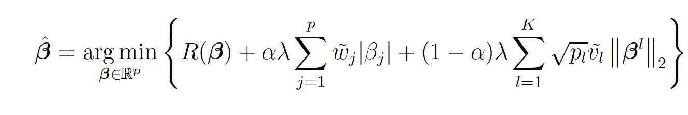

# 用新的 ASGL Python 模块惩罚回归

> 原文：<https://towardsdatascience.com/penalised-regression-with-the-new-asgl-python-module-9a4c36b13e02?source=collection_archive---------33----------------------->

## 随身携带的新 Python 模块


伊利亚·巴甫洛夫在 [Unsplash](https://unsplash.com/s/photos/coding?utm_source=unsplash&utm_medium=referral&utm_content=creditCopyText) 上的照片

有几个用于回归的 Python 模块，每个模块都有其特殊性和局限性。现有 Python 模块的使用很大程度上取决于用户想要执行的回归类型及其目标。如果回归是简单的，并且变量是连续的，在许多情况下 NumPy 库有特定的方法来处理这个问题。另一方面，如果您对更复杂的定量和定性变量回归问题感兴趣，则 Scikit-learn 模块可根据具体情况和问题为用户提供多种选择。

最近，一个新的 Python 模块已经向公众开放，其目的是改善当前 Python 模块在惩罚回归方面的一些限制，并提高操作性能。模块的名称是 [**asgl(自适应稀疏组套索)**](https://github.com/alvaromc317/asgl) **。在这篇文章中，我讨论了这个模块是关于什么的，它应该做什么，以及你是否应该在你的回归问题中使用它。**

# 当前的事态

许多软件为用户提供了根据具体问题以不同尺度进行回归的可能性。人们可以用 Python、Mathematica、R 和 Matlab 进行回归，这里仅举几个例子。

回归可以分为几类，其中最重要的一类是**惩罚回归**。当预测值的数量( *p* )远大于观察数据的数量( *n* )时，这种类型的回归通常在高维数据中非常重要。

惩罚过程包括向最小平方成本函数添加正则化器*C(****x****)；D)* 。LASSO 是最重要的正则化方法之一，它给最小二乘代价函数增加了一个正则化惩罚。LASSO 的目标是提供线性模型系数的稀疏估计。套索的其他重要品种包括群套索和稀疏群套索。

稀疏组套索是套索和套索组的概括，其目标是生成稀疏组之间和之内的回归解。

上述所有基于套索的方法的共同问题是，它们都使用恒定的惩罚率 *𝛌* ，这有可能严重影响变量选择的质量和准确性。为了解决这个问题，一些研究者提出了所谓的自适应群套索(asgl)方法来计算成本函数*C(****x****；d)。*读者可以在这篇[文章](https://link.springer.com/article/10.1007%2Fs11634-020-00413-8)中找到这种方法的数学描述。该方法的目标是在高维度和低维度数据集中提供非常好的误差估计。

正如我上面提到的，可以做不同的层次(套索等。)使用 Scikit-learn 和 Statsmodel 进行回归。然而，由于 asgl 误差估计器是一个相对较新的概念，这个估计器不包括在上面提到的 Python 模块中。asgl Python 模块将标准套索和组套索扩展到适用于线性和分位数回归的情况，我将在下面进行描述。

# 线性和分位数回归的 asgl

我假设读者知道什么是线性回归，以及它是如何正式完成的。然而，读者可能不太熟悉分位数回归。这种类型的回归是由 Koenker 和 Basset 在 1978 年提出的，它适用于存在异方差和异常值的情况。该方法的目标是提供自变量条件分位数作为协变量函数的估计值。

当仅在线性和分位数回归的情况下可以使用自适应方法时，asgl 误差估计器提供了一个框架。正如我上面提到的，在线性和分位数回归的情况下，Statsmodel 和 Scikit-learn 中不存在自适应方法。例如，Scikit-learn Python 模块根本没有给用户提供执行分位数回归的可能性，更不用说自适应情况了。

在 asgl 方法中，通过使用惩罚自适应方法找到的参数向量𝜷的解是由给出的[:](https://link.springer.com/article/10.1007%2Fs11634-020-00413-8)



其中 *R(* 𝜷 *)* 是仅用于线性和分位数回归的风险函数。在线性回归的情况下，该函数由下式给出:


另一方面，在分位数回归的情况下，它由下式给出:


其中函数𝜌_𝜏是所谓的损失检查函数。在上面的参数向量方程中， *𝛌* 是控制惩罚权重的惩罚率， *K* 是组的数量，𝜷^l 是从第 *l 到第*组的𝜷分量的向量，在组套索中， *p_l* 是每个 *l 到第*组的大小，𝛼是控制套索和组套索之间的平衡的参数。波浪号矢量 ***v*** 和 ***w*** 是 asgl 模型中定义的权重矢量。更多细节可以在原研[文章](https://link.springer.com/article/10.1007%2Fs11634-020-00413-8)中找到。

asgl 方法带来的关键概念，即包含在 ***v*** 和 ***w、*** 中的关键概念是，重要的变量必须具有较小的权重，因此处罚较轻，而不太重要的变量必须具有较大的权重，并且处罚较重。这种方法通过提高准确性和变量选择为用户提供了更多的灵活性。

# 如何用 Python 实现 asgl？

与其他 Python 包一样，使用 asgl 模块/包非常简单。可以使用以下命令完成安装:

```
pip install asgl
```

aslg 模块基于其他 python 模块，如 NumPy(1.15 版或更高版本)、Scikit-learn(0 . 23 . 1 版或更高版本)、cvx py(1 . 1 . 0 版或更高版本)。该模块还需要 Python 版本 3.5 或更高版本。

另一种可能是使用 GitHub 并提取以下存储库:

```
git clone https://github.com/alvaromc317/asgl.git
```

然后，在存储库提取之后，您必须运行以下代码来执行 setup.py 文件:

```
cd asgl
Python setup.py
```

# 你能用 asgl 做什么？

asgl 模块使用四个主要的类对象:ASGL 类、重量类、CV 类和 TVT 类。有了这些类，就可以使用上面描述的自适应方法来解决实际的线性和分位数回归问题。

ASGL 类是最重要的一个，它可以用来执行套索、群组套索、稀疏套索和自适应稀疏套索。asgl 类的缺省参数是(更多细节请参见 ASGL 模块作者撰写的这篇 [arXiv 文章](https://arxiv.org/pdf/2111.00472.pdf)):

```
model = asgl.ASGL(model, penalization, intercept=True, tol=1e-5,lambda1=1, alpha=0.5, tau=0.5, lasso_weights=None,gl_weights=None, parallel=False, num_cores=None, solver=None,max_iters=500)
```

ASGL 类有三个主要方法，分别是:**拟合**、**预测、**和**检索参数值。****配合**功能的调用方法是:

```
fit(x, y, group_index)
```

其中 *x* 是预测向量的 2D NumPy 数组， *y* 是 1D 独立变量向量，group_index 是长度等于问题中存在的变量数量的 1D NumPy 数组。

**预测**函数的调用方法是:

```
predict(x_new)
```

其中 x_new 是一个 2D NumPy 数组，其列数等于原始矩阵*中的列数。为了进行预测，用户必须运行以下命令:*

```
*predictions = model.predict(x_new)*
```

*因此，我们可以看到，这些模块的使用方式与其他 Python 模块(如 Statsmodel 或 Scikit-learn)相当标准。*

*另一个重要的方法是**retrieve _ parameter _ values**，它的作用是给出用 asgl 方法求解最小二乘回归得到的模型参数。要运行它，需要调用方法:*

```
*retrieve_parameters_value(param_index)*
```

*其中，param_index 是不大于 model.coef_ list 长度的整数。要显示参数的解，需要运行:*

```
*N 
model.retrieve_parameters_value(param_index = N)*
```

*其中 N 是整数。*

*正如我上面讨论的，asgl 包有另外三个主要的类，每个类都有自己的重要性，可以根据用户的需要来使用。我在这里不讨论这些其他的类，读者可以参考 asgl 包存储库来获得更多的信息。*

# *结论*

*上面我简要讨论了新的 asgl Python 包及其主要用途和特性。该软件包为用户提供了使用自适应方法进行线性和分位数回归的可能性。*

*你应该使用 asgl 模块吗？这个问题的简短回答是:是的，你应该试一试。但是，我建议您首先了解 asgl 方法背后的理论，看看是否可以将其应用于您的数据科学和机器学习问题。正如作者所述，这个新模块让用户有可能首次在 Python 中执行分位数回归，并使用 asgl 包提供的自适应方法来改进变量选择和预测。*

# *如果你喜欢我的文章，请与你可能对这个话题感兴趣的朋友分享，并在你的研究中引用/参考我的文章。不要忘记订阅将来会发布的其他相关主题。*