# 钟摆:可能是最好的 Python 日期时间库

> 原文：<https://towardsdatascience.com/pendulum-one-of-the-most-useful-python-libraries-you-have-ever-seen-e2ecc365c8c0?source=collection_archive---------3----------------------->


图片由来自 [Pixabay](https://pixabay.com/?utm_source=link-attribution&utm_medium=referral&utm_campaign=image&utm_content=242740) 的 [Manfred Antranias Zimmer](https://pixabay.com/users/antranias-50356/?utm_source=link-attribution&utm_medium=referral&utm_campaign=image&utm_content=242740) 拍摄

## Python datetime 模块的绝佳替代产品

datetime 模块是 Python 中最重要的内置模块之一。它非常灵活和强大，为实际编程问题提供了许多现成的解决方案。例如，时间增量是我最喜欢的工具之一。

但是，我不得不说，datetime 模块也有一些限制。例如，当我们处理时区时，它通常会揭示短缺。有时，我们不得不引入一些第三方库作为补充。此外，datetime 模块中的某些方面不是很直观，或者在其他编程语言中不常用。

在本文中，我将介绍一个名为 Pendulum 的第三方库，它将解决内置日期时间模块的所有问题。

# 1.日期时间的插入替换


图片来自 [Pixabay](https://pixabay.com/?utm_source=link-attribution&utm_medium=referral&utm_campaign=image&utm_content=3179167) 的[布鲁诺/德国](https://pixabay.com/users/bru-no-1161770/?utm_source=link-attribution&utm_medium=referral&utm_campaign=image&utm_content=3179167)

使用一些第三方库比如`pytz`来解决一些 Python datetime 不擅长的问题并不少见。但是，我们仍然需要导入 datetime 模块，并将其作为基本模块使用，因为我们需要使用它来实例化 datetime 对象。

让我告诉你为什么钟摆是一个下降的替代品。首先，我们需要使用 pip 安装它。

```
pip install pendulum
```

库的名字有点长，所以我建议用别名导入。

```
import pendulum as pdl
```

虽然`pd`是一个较短的缩写，但我会把它留给熊猫。不想制造任何混乱。

让我们用 Pendulum 创建一个 datetime 对象，看看它的对象类型。

```
from datetime import datetimedt = pdl.datetime(2021, 11, 6)
isinstance(dt, datetime)
```

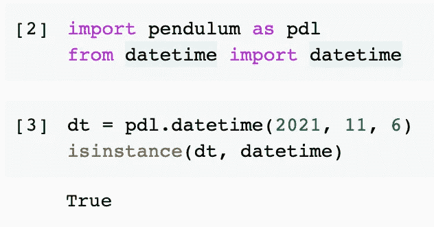

没有魔法。只是因为 Pendulum 继承了 Python 的 datetime 对象。因此，我们不需要担心使用 datetime 模块中的一些原始特性。从字面上看，钟摆日期时间对象是 Python 日期时间对象。

# 2.时区

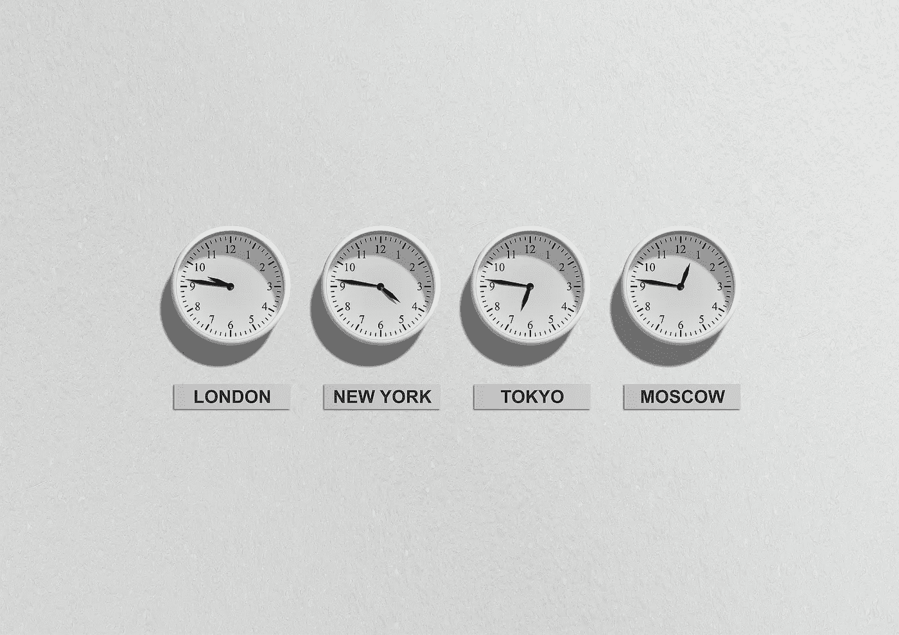

图片来自 [Pixabay](https://pixabay.com/?utm_source=link-attribution&utm_medium=referral&utm_campaign=image&utm_content=257911) 的[米哈尔·贾莫鲁克](https://pixabay.com/users/jarmoluk-143740/?utm_source=link-attribution&utm_medium=referral&utm_campaign=image&utm_content=257911)

钟摆图书馆最令人印象深刻的特征是时区。这也是内置 datetime 模块的关键问题之一。在 Python 3.9 之前，如果我们想使用 [IANA 时区](https://en.wikipedia.org/wiki/List_of_tz_database_time_zones)，我们必须涉及`pytz`。

有了钟摆库，我们可以轻松地创建一个带有时区的 datetime 对象。

```
dt_melbourne = pdl.datetime(2021, 11, 6, tz='Australia/Melbourne')
dt_brisbane = pdl.datetime(2021, 11, 6, tz='Australia/Queensland')
print(dt_melbourne)
print(dt_brisbane)
```


在上面的例子中，我们同时创建了两个对象。然而，时区是不同的。钟摆也让我们可以很容易地比较时间。

```
dt_melbourne.diff(dt_brisbane).in_hours()
```

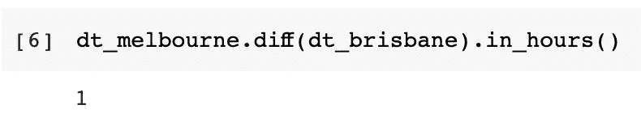

多简单啊！比较两个不同时区的 datetime 对象并获得准确的结果！

如果我们需要定义多个 datetime 对象并希望重用 timezone 字符串，我们可以创建一个 timezone 对象并将其传递给 datetime 构造函数。

```
my_timezone = pdl.timezone('Australia/Melbourne')
dt_melbourne = pdl.datetime(2021, 11, 6, tz=my_timezone)print(dt_melbourne)
print(dt_melbourne.timezone.name)
```

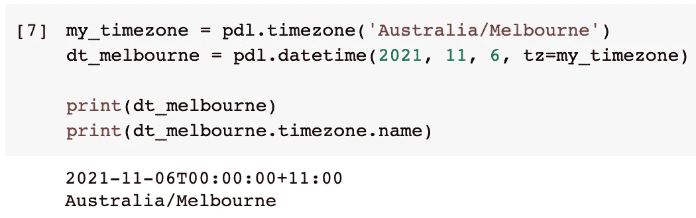

一个更酷的功能是将时间返回到不同的时区。例如，墨尔本现在是午夜，那么布里斯班现在是几点？

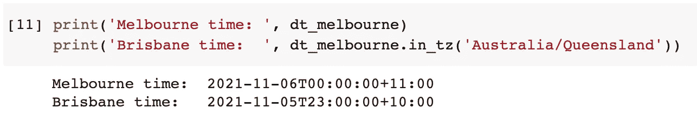

# 3.日期时间解析


来自[像素库](https://pixabay.com/?utm_source=link-attribution&utm_medium=referral&utm_campaign=image&utm_content=2116007)的[设计](https://pixabay.com/users/congerdesign-509903/?utm_source=link-attribution&utm_medium=referral&utm_campaign=image&utm_content=2116007)的图像

解析日期时间可能是编程中最常见的用例。Python 日期时间模块做得很好。然而，与大多数其他编程语言相比，Python 使用不同的格式`%Y%m%d`。

Pendulum 允许我们使用如下的通用格式代码。

```
pdl.from_format('2021-11-06 22:00:00', 'YYYY-MM-DD HH:mm:ss')
```

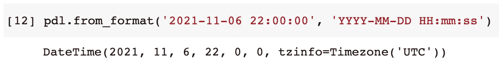

此外，它完全支持 RFC 3339 和 ISO 8601 格式，以及其他一些常见的格式。这意味着我们不必指定格式代码来将字符串解析成日期时间。

```
pdl.parse('2021-11-01 22:00:00')
```

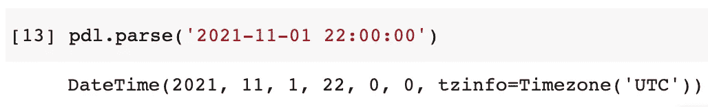

Pendulum 还集成了许多常见的日期时间扩展，如 [dateutil](https://dateutil.readthedocs.io/) 。如果我们希望库依赖于 dateutil 解析器，我们可以传递标志`strict=False`。

```
pdl.parse('21-11-06', strict=False)
```

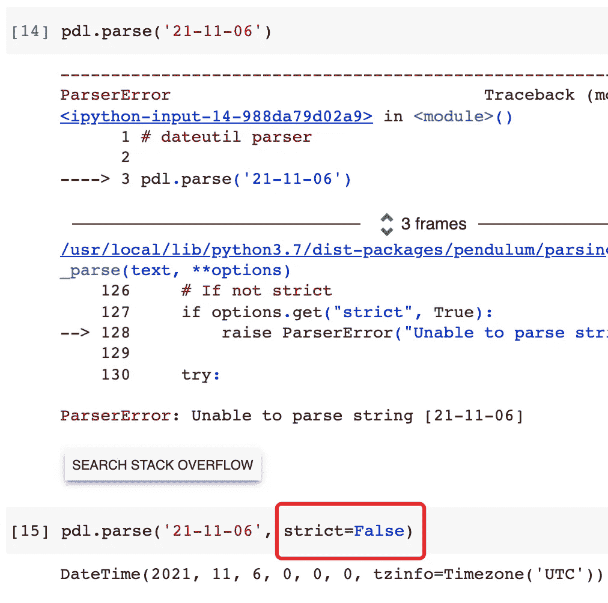

除此之外，钟摆还支持更多的动态格式。例如，只有数字的日期时间。

```
pdl.parse('20211106')
```

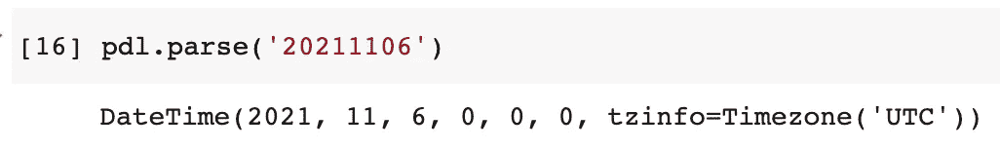

这个非常有趣，指定了年份，星期号和星期几，钟摆给你正确的日期时间。

```
pdl.parse('2021-W44-6')
```

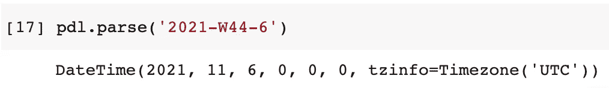

如果我们特别想拥有一个日期对象或者时间对象，只需要指定`exact=True`，这比 Python 的 datetime 模块简单多了。

```
pdl.parse('20211106', exact=True)
pdl.parse('22:00:00', exact=True)
```

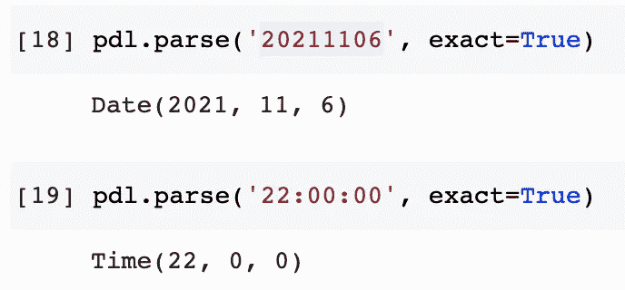

# 4.字符串格式


图片来自 [Pixabay](https://pixabay.com/?utm_source=link-attribution&utm_medium=referral&utm_campaign=image&utm_content=650753) 的 [obpia30](https://pixabay.com/users/obpia30-804832/?utm_source=link-attribution&utm_medium=referral&utm_campaign=image&utm_content=650753)

在将字符串解析成 datetime 对象之后，下一件重要的事情就是将 datetime 输出成带格式的字符串。

首先，让我们有一个日期时间对象。由于 Pendulum 继承了 Python datetime，所以我们可以使用所有的方法，比如`now()`。

```
dt = pdl.now()
```

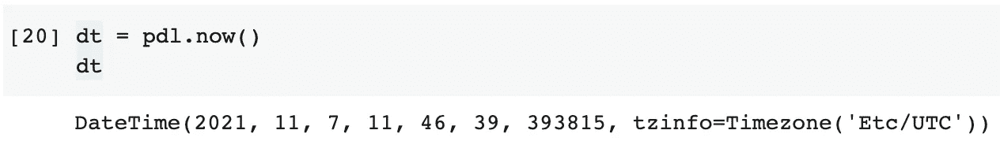

然后，让我从 Pendulum 中挑选几个“to string”方法的例子，看看用现成的格式输出 datetime 是多么容易。

```
dt.to_date_string()  # with date only
dt.to_time_string()  # with time only
dt.to_formatted_date_string()  # month_abbr date, year
dt.to_day_datetime_string() # day, month_abbr date, year hh:mm am/pm
dt.to_iso8601_string()  # to ISO 9601 standard
dt.to_atom_string()  # to Atom format
dt.to_cookie_string()  # to cookie style format
```

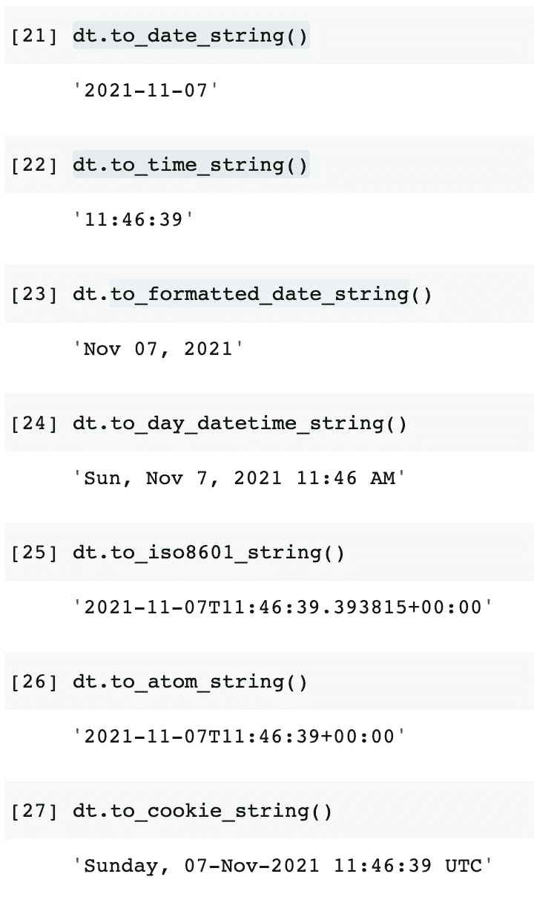

当然，我们可以使用格式代码定制输出字符串，格式代码更直观。

```
dt.format('DD MMMM, YYYY dddd HH:mm:ss A')
```

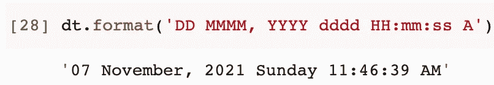

另一个很酷的东西是，我们可以很容易地将一些不相关的字符串添加到格式字符串中，并让它们从格式中逸出。

```
dt.format('[Hi! Today is] DD MMMM, YYYY dddd HH:mm:ss A')
```

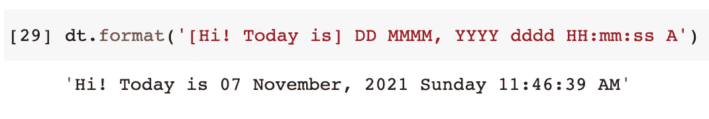

# 5.人类可读性


图片来自 [Pixabay](https://pixabay.com/?utm_source=link-attribution&utm_medium=referral&utm_campaign=image&utm_content=821557) 的 [fancycrave1](https://pixabay.com/users/fancycrave1-1115284/?utm_source=link-attribution&utm_medium=referral&utm_campaign=image&utm_content=821557)

在内置的 Python datetime 模块中，timedelta 工具非常好地完成了比较工作。然而，在比较两个 datetime 对象时，Pendulum 甚至可以通过提供一些更人性化的输出来改进它。

例如，`diff_for_humans()`方法将日期时间对象与当前时间进行比较，并返回一个非常人性化的输出。

```
dt1 = pdl.datetime(2021, 1, 1)
dt1.diff_for_humans()dt2 = pdl.datetime(2021, 11, 7, 1)
dt2.diff_for_humans()
```

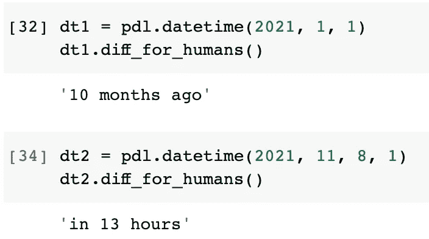

# 6.查找相对日期时间


图片来自 [Pixabay](https://pixabay.com/?utm_source=link-attribution&utm_medium=referral&utm_campaign=image&utm_content=1990453) 的 [Andreas Lischka](https://pixabay.com/users/webandi-1460261/?utm_source=link-attribution&utm_medium=referral&utm_campaign=image&utm_content=1990453)

内置 Python datetime 可以改进的一个方面是根据给定的日期时间查找相对日期时间。例如，当我们想找到当月的最后一天时，我们必须使用 datetutil 模块中的`relativedelta`。

```
from dateutil.relativedelta import relativedeltadatetime.datetime(2013, 2, 21) + relativedelta(day=31)
```

此外，代码可读性不强，因为我们使用了`day=31`作为参数，尽管它在一个月少于 31 天的时候也可以使用。

而在钟摆中，这再简单不过了。

```
pdl.now().start_of('day')  # find the start time of the day
pdl.now().start_of('month')
pdl.now().end_of('day')
pdl.now().end_of('month')
```

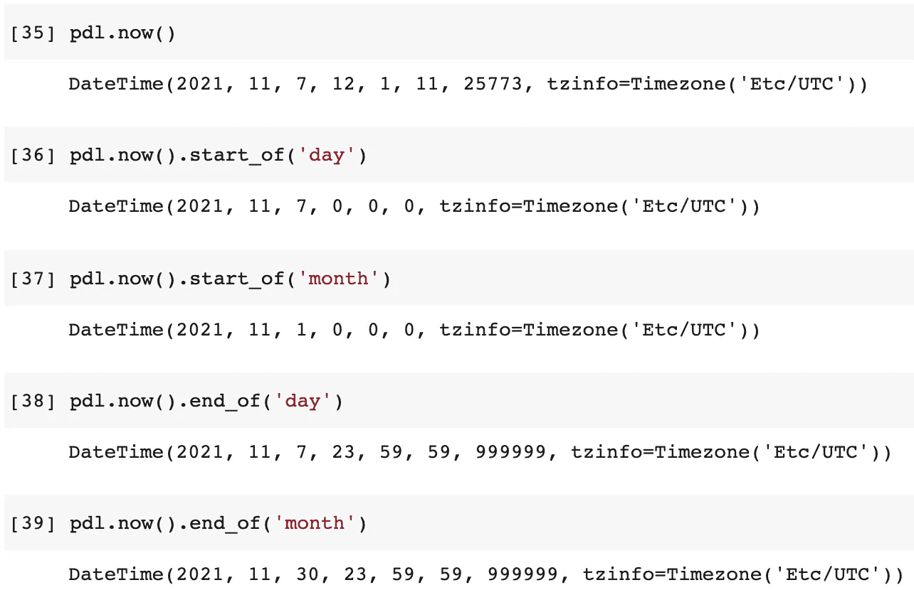

内置 datetime 模块的另一个不便之处是查找一周中的某一天。例如，如果我们想找到下周一的日期，这可能是最简单的方法。

```
from datetime import datetime, timedeltadatetime.now() + timedelta(days=(0-datetime.now().weekday()+7)%7)
```

它完成了工作，但是可读性很差。开发人员需要花一些时间来理解这行代码的逻辑。

用钟摆，就是这么简单。

```
pdl.now().next(pdl.MONDAY)
```

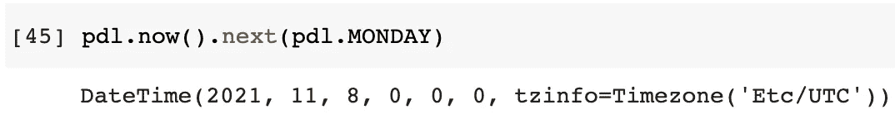

我们甚至不去考虑应该用 0 还是 1 来表示星期一，因为钟摆使用了枚举法。

同样，我们可以用`previous()`方法找到前一个星期二，如下所示。同样，我们可以通过设置参数`keep_time=True`来保留时间部分。

```
pdl.now().previous(pdl.TUESDAY)
pdl.now().previous(pdl.TUESDAY, keep_time=True)
```

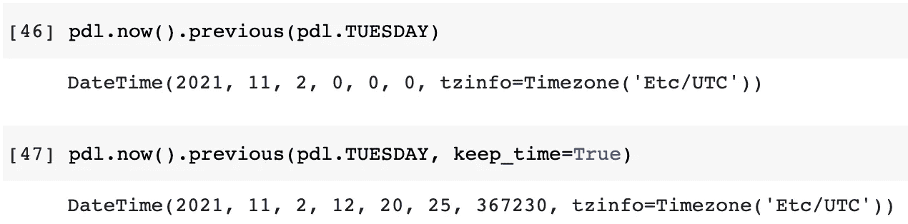

# 7.一些额外的便利


图片由[设计](https://pixabay.com/users/congerdesign-509903/?utm_source=link-attribution&utm_medium=referral&utm_campaign=image&utm_content=3073971)来自 [Pixabay](https://pixabay.com/?utm_source=link-attribution&utm_medium=referral&utm_campaign=image&utm_content=3073971)

这个库中藏着更多的“糖”。再举几个例子，比如得到昨天或者明天。

```
print(pdl.yesterday())
print(pdl.today())
print(pdl.tomorrow())
```

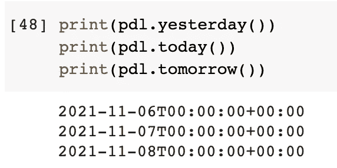

对于不同的文化和语言，输出带有区域设置的日期时间也非常容易。

```
pdl.now().format('dddd DD MMMM YYYY', locale='zh')
```

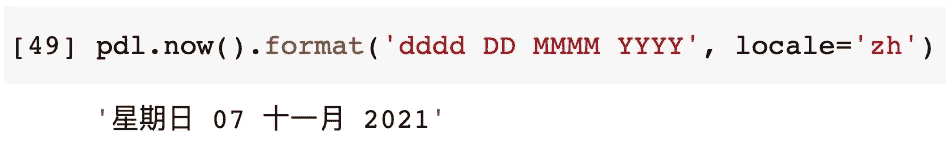

再举一个例子。如果一个人出生于 1988 年 1 月 1 日，这个人的年龄是多少？

```
pdl.datetime(1988, 1, 1).age
```

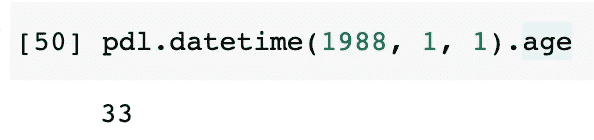

在官方文档中可以找到更多有趣的东西。

 [## 证明文件

### 安装 pendulum 非常简单:或者，如果您使用的是诗歌:Pendulum 是一个 Python 包，用于简化日期时间…

钟摆](https://pendulum.eustace.io/docs/) 

# 摘要


图片来自 [Pixabay](https://pixabay.com/?utm_source=link-attribution&utm_medium=referral&utm_campaign=image&utm_content=6744567) 的 [Mariakray](https://pixabay.com/users/mariakray-23567841/?utm_source=link-attribution&utm_medium=referral&utm_campaign=image&utm_content=6744567)

在本文中，我介绍了第三方 Python 库 Pendulum。它是 Python 内置 datetime 模块的替代产品。通过使用这个库，datetime 模块可以解决的许多问题，例如查找相对日期，现在都可以很容易地解决。更重要的是，Pendulum 提供了整洁干净的 API 来提高我们代码的可读性，这些解决方案更加直观。

[](https://medium.com/@qiuyujx/membership) [## 通过我的推荐链接加入灵媒-陶

### 作为一个媒体会员，你的会员费的一部分会给你阅读的作家，你可以完全接触到每一个故事…

medium.com](https://medium.com/@qiuyujx/membership) 

如果你觉得我的文章有帮助，请考虑加入 Medium 会员来支持我和成千上万的其他作者！(点击上面的链接)