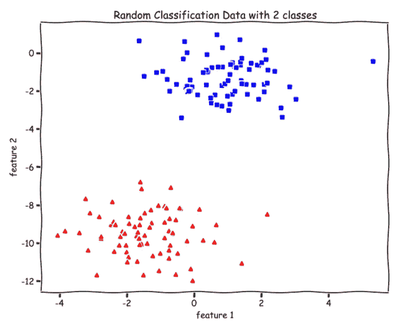

# 用 Python 实现感知器算法

> 原文：<https://towardsdatascience.com/perceptron-algorithm-in-python-f3ac89d2e537?source=collection_archive---------1----------------------->

## 从零开始的机器学习:第 6 部分


作者图片

在这篇文章中，我们将看看感知器算法，它是用于**二进制分类**的最**基本单层神经网络**。首先，我们将查看**单位阶跃函数**并查看感知器算法如何分类，然后查看**感知器更新规则**。

最后，我们将为我们的数据绘制**决策边界**。我们将使用只有两个特征的数据，由于感知器是一个二元分类器，因此将有两个类。我们将使用 **Python NumPy** 实现所有代码，使用 **Matplotlib** 可视化/绘图。

[](/logistic-regression-from-scratch-in-python-ec66603592e2) [## Python 中从头开始的逻辑回归

### 从零开始的机器学习:第 5 部分

towardsdatascience.com](/logistic-regression-from-scratch-in-python-ec66603592e2) [](/polynomial-regression-in-python-b69ab7df6105) [## 用 Python 从头开始实现多项式回归

### 从零开始的机器学习:第 4 部分

towardsdatascience.com](/polynomial-regression-in-python-b69ab7df6105) 

# 介绍

感知器算法的灵感来自大脑中的基本处理单元，称为神经元，以及它们如何处理信号。它是由弗兰克·罗森布拉特利用麦卡洛克-皮茨神经元和赫布的发现发明的。[感知器研究论文](https://citeseerx.ist.psu.edu/viewdoc/download?doi=10.1.1.335.3398&rep=rep1&type=pdf)。

感知器算法并没有在实践中广泛使用。我们研究它主要是因为历史原因，也因为它是最基本和最简单的单层神经网络。


神经元；来源[维基百科](https://www.google.com/url?sa=i&url=https%3A%2F%2Fsimple.wikipedia.org%2Fwiki%2FNeuron&psig=AOvVaw11_hIa-2-Z0MEcaHoK0ruy&ust=1618665454908000&source=images&cd=vfe&ved=0CAIQjRxqFwoTCNCU--_sgvACFQAAAAAdAAAAABAO)

# 感知器

让我们用下面的数据作为激励的例子来理解感知器算法。

```
**from sklearn import datasets****X, y = datasets.make_blobs(n_samples=150,n_features=2,
                           centers=2,cluster_std=1.05,
                           random_state=2)**#Plotting**fig = plt.figure(figsize=(10,8))****plt.plot(X[:, 0][y == 0], X[:, 1][y == 0], 'r^')
plt.plot(X[:, 0][y == 1], X[:, 1][y == 1], 'bs')
plt.xlabel("feature 1")
plt.ylabel("feature 2")
plt.title('Random Classification Data with 2 classes')**
```



作者图片

有两个类，红色和绿色，我们想通过在它们之间画一条直线来区分它们。或者，更正式地说，我们想要学习一组参数`theta`来找到一个最佳超平面(我们的数据的直线),它将两个类分开。

对于 [**线性回归**](https://medium.com/analytics-vidhya/linear-regression-from-scratch-in-python-b6501f91c82d) 我们的假设(`y_hat`)是`theta.X`。然后，对于 [**Logistic 回归**](/logistic-regression-from-scratch-in-python-ec66603592e2) 中的二元分类，我们需要输出 0 到 1 之间的概率，所以我们将假设修改为——`sigmoid(theta.X)`。我们对输入要素和参数的点积应用了 sigmoid 函数，因为我们需要将输出压缩在 0 和 1 之间。

对于感知器算法，我们对`theta.X`应用不同的函数，即单位阶跃函数，其定义为—


来源:吴恩达课程

在哪里，


来源:吴恩达课程

与输出 0 和 1 之间概率的[逻辑回归](/logistic-regression-from-scratch-in-python-ec66603592e2)不同，感知器输出的值恰好是 0 或 1。

该函数表示，如果输出(`theta.X`)大于或等于零，则模型将分类为 **1** (例如红色)，如果输出小于零，则模型将分类为 **0** (例如绿色)。感知算法就是这样分类的。

让我们用图形来看单位阶跃函数—


单位阶跃函数；[来源](http://wwwf.imperial.ac.uk/metric/metric_public/functions_and_graphs/particular_functions/heaviside_im1.jpg)

我们可以看到对于 **z≥0** ， **g(z) = 1** 和对于 **z < 0** ， **g(z) = 0** 。

让我们编写步骤函数。

```
**def step_func(z):
        return 1.0 if (z > 0) else 0.0**
```

# 作为神经网络的感知器


**一个感知器**；作者图片

我们可以通过上图直观的了解感知器。对于每个训练示例，我们首先取输入特征和参数的点积，`theta`。然后，我们应用单位阶跃函数进行预测(`y_hat`)。

如果预测是错误的，或者换句话说，模型对这个例子进行了错误分类，我们对参数θ进行更新。当预测正确时(或者与真实/目标值`y`相同)，我们不更新。

我们来看看更新规则是什么。

# 感知器更新规则

感知更新规则非常类似于梯度下降更新规则。以下是更新规则—


来源:吴恩达课程

> 请注意，即使感知器算法可能看起来类似于逻辑回归，但它实际上是一种非常不同的算法，因为很难赋予感知器的预测有意义的概率解释，或导出感知器作为最大似然估计算法。
> 
> **(出自吴恩达教程)**

我们来编码吧。**见评论(#)。**

```
**def perceptron(X, y, lr, epochs):**

    # X --> Inputs.
    # y --> labels/target.
    # lr --> learning rate.
    # epochs --> Number of iterations.

    # m-> number of training examples
    # n-> number of features 
 **m, n = X.shape**

    # Initializing parapeters(theta) to zeros.
    # +1 in n+1 for the bias term.
   **theta = np.zeros((n+1,1))** 
    # Empty list to store how many examples were 
    # misclassified at every iteration.
    **n_miss_list = []** 
    # Training.
    **for epoch in range(epochs):**

        # variable to store #misclassified.
        **n_miss = 0**

        # looping for every example.
        **for idx, x_i in enumerate(X):**

            # Insering 1 for bias, X0 = 1.
            **x_i = np.insert(x_i, 0, 1).reshape(-1,1)**

            # Calculating prediction/hypothesis.
            **y_hat = step_func(np.dot(x_i.T, theta))** 
            # Updating if the example is misclassified.
            **if (np.squeeze(y_hat) - y[idx]) != 0:
                theta += lr*((y[idx] - y_hat)*x_i)** 
                # Incrementing by 1.
               ** n_miss += 1**

        # Appending number of misclassified examples
        # at every iteration.
        **n_miss_list.append(n_miss)**

  **  return theta, n_miss_list**
```

# 绘制决策边界

我们知道这个模型预测了—

> *y=1 时*
> 
> *y=0 时*

所以，`**theta.X = 0**`将是我们的决策边界。

> 以下用于绘制决策边界的代码仅在`X`中只有两个特征时有效。

**见注释(#)。**

```
**def plot_decision_boundary(X, theta):**

    # X --> Inputs
    # theta --> parameters

    # The Line is y=mx+c
    # So, Equate mx+c = theta0.X0 + theta1.X1 + theta2.X2
    # Solving we find m and c
   ** x1 = [min(X[:,0]), max(X[:,0])]
    m = -theta[1]/theta[2]
    c = -theta[0]/theta[2]
    x2 = m*x1 + c**

    # Plotting
    **fig = plt.figure(figsize=(10,8))
    plt.plot(X[:, 0][y==0], X[:, 1][y==0], "r^")
    plt.plot(X[:, 0][y==1], X[:, 1][y==1], "bs")
    plt.xlabel("feature 1")
    plt.ylabel("feature 2")
    plt.title(’Perceptron Algorithm’)** **plt.plot(x1, x2, 'y-')**
```

# 训练和绘图

```
**theta, miss_l = perceptron(X, y, 0.5, 100)****plot_decision_boundary(X, theta)**
```


作者图片

我们可以从上面的决策边界图中看到，我们能够完美地分离绿色和蓝色类。也就是说，我们得到了 100%的准确率。

# 感知器算法的局限性

1.  它只是一个线性分类器，不能分离不可线性分离的数据。
2.  该算法仅用于二元分类问题。

感谢阅读。对于问题、评论、顾虑，请在回复部分进行讨论。更多的 ML 从零开始即将推出。

**看看从零开始学习的机器系列—**

*   第 1 部分:[**Python 中从零开始的线性回归**](https://medium.com/analytics-vidhya/linear-regression-from-scratch-in-python-b6501f91c82d?source=your_stories_page-------------------------------------)
*   第二部分:[**Python 中的局部加权线性回归**](/locally-weighted-linear-regression-in-python-3d324108efbf?source=your_stories_page-------------------------------------)
*   第三部分: [**使用 Python 的正规方程:线性回归的封闭解**](/normal-equation-in-python-the-closed-form-solution-for-linear-regression-13df33f9ad71?source=your_stories_page-------------------------------------)
*   第四部分:[**Python 中的多项式回归从零开始**](/polynomial-regression-in-python-b69ab7df6105)
*   第五部分:[**Python 中的逻辑回归从零开始**](/logistic-regression-from-scratch-in-python-ec66603592e2)