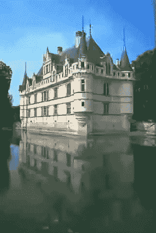

# 深度图像恢复的感知损失

> 原文：<https://towardsdatascience.com/perceptual-losses-for-image-restoration-dd3c9de4113?source=collection_archive---------4----------------------->

## 从均方误差到 GANs——什么是好的感知损失函数？

图片由作者提供。

神经网络的第一次应用让我忍不住惊呼“哇！”是关于风格转变的开创性论文。这项工作使用卷积神经网络(CNN)将风格从一幅图像转移到另一幅图像。这是第一次，我们可以在普通的图片上添加很酷的艺术滤镜——将任何照片变成 Vang Gough 的画，或者添加莫奈的笔触！

我们现在已经发展到把一幅图像的特征转移到另一幅图像的更复杂的问题。例如，人类肖像的情感/风格转移，或者从一个视频到另一个视频的运动转移。现实主义的水平和质量所取得的成果也有天空火箭！然而，在这份第一风格的转印纸中提出的一个元素以这样或那样的形式持续存在——*知觉丧失*。

*感知损失是损失函数中的一个术语，它鼓励自然的和在感知上令人愉快的结果。*

在这篇文章中，我将谈论不同种类的感知损失。然而，由于它们的应用在复杂程度上有所不同，因此它们的使用也有细微差别，我将集中讨论它们可以应用的最简单的问题之一——图像恢复。这里，目标是从失真的对应物中恢复高质量的图像，该图像可能已经被噪声、欠采样、模糊、压缩等破坏。

本文部分基于[我们最近的工作](https://arxiv.org/abs/2103.14616)，该工作探索了对于图像恢复任务，如单幅图像超分辨率、去噪和 JPEG 伪像消除，什么是好的损失函数的问题。作为这项工作的结果，我们还提出了一个新的损失，专门为图像恢复定制。点击查看[代码！](https://github.com/gfxdisp/mdf)

下面，我先说说正在解决的问题。然后，我讨论了各种感知损失函数，并比较他们的表现。

# 图像恢复

如果图像占用很少的空间，却保持高质量，这不是很好吗？这是研究压缩算法的工程师和研究人员向自己提出的问题。然而，这并不是一项简单的任务——压缩算法经常会引入伪像。

从左至右:地面真相，JPEG 压缩图像，重建消除人工制品。来自 [BSD](https://www2.eecs.berkeley.edu/Research/Projects/CS/vision/bsds/) 数据集的图像。

用旧诺基亚手机拍摄的图像分辨率如何？我们能否将它们超分辨率提高 16 倍，从而在现代高分辨率显示器上获得愉悦的观看体验？

从左至右:原始图像、降采样图像和 4x 超分辨率图像。来自 [BSD](https://www2.eecs.berkeley.edu/Research/Projects/CS/vision/bsds/) 数据集的图像。

在弱光条件下拍摄的图像怎么样？通过相机管道的图像引入了噪声。我们能把它从照片上去掉吗？

从左至右:原始图像、噪声图像和清洁图像。图片来自 [BSD](https://www2.eecs.berkeley.edu/Research/Projects/CS/vision/bsds/) 数据集。

这些问题的答案是肯定的！深度学习方法取得了特别的成功。卷积神经网络(CNN)专门针对图像，特别是我在以前的[文章](/cnn-cheat-sheet-the-essential-summary-for-a-quick-start-58820a14d3b4)中详细谈到的图像，经常被用于这项任务。

## 为什么我们需要一个感知损失函数？

影响图像恢复方法性能的因素之一是定义优化目标的损失函数。

在图像恢复的情况下，目标是将受损图像恢复到*视觉上*与原始的未失真图像相匹配。因此，我们需要设计符合这一目标的损失。

在解决这个问题时，我们承认开发完美恢复目标图像的方法可能是不可能的，因为重建问题本质上是不适定的，即对于任何失真的图像，都可能有多个感觉上令人满意的似乎合理的解决方案。

# 感知损失

下面，我将损失函数分类为手工制作的损失，这些损失依赖于现有的度量；特征方面的损失，其中使用深度学习模型提取图像统计；和分布损失，其中损失将解决方案推向自然图像的流形。

## 手工制作的损失

直觉上，感知损失应该随着感知质量的增加而减少。因此，设计良好的感知损失函数的最初尝试着眼于提取简单的图像统计，并将它们用作损失函数中的分量。

然而，并不是所有的统计数据都是好的。例如，考虑一个标准损失项——L2。优化图像恢复方法以最小化平均每像素平方差会导致图像模糊。

问题在于当损失接近零时的形状。误差越接近零，梯度越小，这意味着与地面真实值的小偏差(这对锐度很重要)不会受到太多的惩罚。

这是一个众所周知的问题很长一段时间与 L1 被用来作为一个更好的替代图像恢复。L1 具有恒定的梯度，这意味着随着损耗接近零，梯度不会减小，从而产生看起来更清晰的图像。

用 L2 和 L1 损失训练超分辨率方法(EDSR)的结果。来自 [BSD](https://www2.eecs.berkeley.edu/Research/Projects/CS/vision/bsds/) 数据集的图像。

[赵等人。艾尔。](https://arxiv.org/pdf/1511.08861.pdf)使用 L2、L1、SSIM 和 MS-SSIM(后两者是客观的图像质量度量)作为损失函数，研究了图像超分辨率、去噪和去马赛克算法产生的图像的视觉质量。由 L1 损失和 MS-SSIM 损失的组合训练的算法产生的图像达到了由客观质量度量测量的最佳质量。紧随这一结果的是单独使用的 L1 损失。

[后期作品](https://arxiv.org/abs/2005.01338)比较了几种图像重建方法中用作损失函数的图像质量指标。他们发现，许多流行的图像质量评估指标不具有可以保证良好重建结果的属性。

**缺点** 尽管 L1 能产生更清晰的图像，但它不会根据像素对感知质量的重要性来衡量像素。人类视觉系统被调整为聚焦于特定的、显著的区域，例如面部。因此，良好的感知损失也应该考虑到这一点。

## 特征损失

一类新的损失函数，最近获得了显著的普及，采用神经网络作为特征提取器。最常见的是，损失被计算为经过训练的图像分类网络(例如 [VGG 网络](https://www.robots.ox.ac.uk/~vgg/publications/2015/Simonyan15/))的隐藏层的激活之间的 L2 距离。

由于隐藏层中的池化，实现损失函数的网络通常不是双射的，这意味着对函数的不同输入可能导致相同的潜在表示。因此，基于特征的损失通常与正则化项(如 L2 或 L1 范数)结合使用，并且需要仔细调整每个损失分量的权重。

[最早的工作](https://arxiv.org/abs/1603.08155)使用从 VGG 网络提取的参考和测试图像的特征之间的 L2 范数作为损失函数来训练风格转移和超分辨率算法。在这里，VGG 网络在 [ImageNet 数据集](https://www.image-net.org)上被训练。

图片由[约翰逊](https://arxiv.org/abs/1603.08155)

使用 L2 范数进行特征比较有些武断。后来的工作已经开发了替代方案来比较提取的表征。因此，这是一种专门针对风格转换的[语境损失](https://arxiv.org/abs/1803.02077)。

**缺点** 基于特征的损失有多个缺点——它们计算量大，需要正则化和超参数调整，涉及在不相关的任务上训练的大型网络，因此图像恢复任务的训练过程非常占用存储器。

## 分布损耗(GAN)

由于许多图像恢复算法本质上是不适定的，例如，由超分辨率或去噪算法产生的图像可能具有可接受的感知质量，而不是精确地匹配地面实况，所以图像重建算法可以被优化以产生在自然图像流形上的图像，该图像受到与地面实况分布的相似性的约束。为了确保第一个要求得到满足，许多作品都依赖于[生成对抗网络(GAN)的](https://arxiv.org/abs/1406.2661)。

在这样的设置中，图像生成算法具有几个损失项:被训练来区分生成图像和自然图像的鉴别器，以及一个或几个限制生成器网络产生接近地面真实的图像的损失项。

典型的约束条件是 L1 规范，使训练正规化，如[叶](https://arxiv.org/abs/1607.07539)和[伊索拉](https://arxiv.org/abs/1611.07004)所示，可以产生相当好的效果。 [Dosovitsky](https://arxiv.org/abs/1602.02644) 和 [Ledig](https://arxiv.org/abs/1609.04802) 使用基于特征的 VGG 损失。其他一些作品使用了手工制作和特征损失相结合的方法。 [Tej](https://arxiv.org/abs/2005.07502) 和 [Jo](https://openaccess.thecvf.com/content_CVPRW_2020/papers/w31/Jo_Investigating_Loss_Functions_for_Extreme_Super-Resolution_CVPRW_2020_paper.pdf) 引入了基于鉴别器特征损失的正则化。

**缺点** GANs 确保生成的图像位于自然图像流形上，但当单独使用时，可能会导致图像与输入有很大不同，需要多个损失项和仔细的微调。此外，由于其优化问题的不稳定性，gan 的训练也具有挑战性。

## [我们的工作](https://arxiv.org/abs/2103.14616)

在我们的工作中，我们观察到单个自然图像足以训练一个轻量级的特征提取器，该特征提取器在单个图像的超分辨率、去噪和 JPEG 伪影去除方面优于最先进的损失函数。

我们提出了一种新的多尺度鉴别特征(MDF)损失，包括一系列鉴别器，训练以惩罚由生成器引入的错误。

多尺度鉴别器。图片由作者提供。

我们的损失函数的基础基于以下命题:

*命题 1:* 用作损耗特征提取器的网络应被训练成对发电机的恢复误差敏感。这使得特征空间更适合于在特定任务的训练期间惩罚失真。

*命题 2:* 学习自然图像流形，这是通常归因于鉴别器的任务，是更困难的任务，并且与特征方式损失函数不太相关。

为了验证这两个命题，我们设计了一个新的特征损失。特征空间包括这组鉴别器网络的中间激活。鉴别器网络被训练为[单图像 GAN](https://arxiv.org/abs/1905.01164) ，其从种子图像中移除特定任务的失真(阶段 1)。我们用 y 表示种子图像，以将其与用于学习恢复任务的用 x 表示的训练图像区分开。所提出的损失函数以多尺度方式训练，使得它对多尺度下的相关失真敏感。种子图像可以具有与训练图像不同的大小，可以描绘不同类型的场景，或者可以是合成图像。用于特定任务生成器的生成图像和测试图像的训练鉴别器的中间特征之间的 L2 范数被用作损失。

## 比较性能

视觉内容的最终消费者是人类观察者。因此，如果有一组观察者来判断针对各种损失函数优化的图像重建算法所产生的图像质量，那就太好了。

在我们的工作中，我们在亚马逊 Mechanical Turk 众包平台上进行感知实验。为了测试的最佳灵敏度，我们使用了完全设计[成对比较方案](/dataset-fusion-sushi-age-and-image-quality-and-what-the-hell-do-they-have-in-common-814e8dae7cf7)。

在我们的实验中，我们比较了四种图像恢复应用的损失函数:使用 [SR-ResNet](https://arxiv.org/pdf/1609.04802.pdf) 的单幅图像超分辨率，使用 [EDSR](https://arxiv.org/abs/1707.02921) 的单幅图像超分辨率，去噪和 JPEG 伪像去除。

对于每个应用程序，我们都进行了两两比较实验，汇总了收集到的比较结果，并使用[这种方法](https://arxiv.org/abs/1712.03686)对结果进行了显著差异(JND)(瑟斯顿)衡量。缩放的结果用 JND 单位表示质量差异。一个 JND 单位意味着 75%的人会(从一对方法中)选择一种方法。缩放的结果显示了我们的方法相对于其他损失函数的持续改进。

来自亚马逊 MTurk 的主观实验，以 JND 为单位(越高越好)。误差线表示 95%的置信区间。LPIPS 和 VGG 损失与 L2 损失一起使用。图片由作者提供。

为了获得更深入的了解，下面我们将结果可视化为感知失真权衡，其在 x 轴上示出了失真(PSNR ),在 y 轴上示出了 JND 质量值(反向标度)。所有应用的结果清楚地表明，MDF 损耗导致最低的失真和最高的感知质量。

测试损失的感知失真权衡。轴已经颠倒，因此最低的失真显示在左边，最高的感知质量显示在底部。图片由作者提供。

上图还显示，传统的[客观图像质量评估指标](/deep-image-quality-assessment-30ad71641fac)，如 PSNR 或 NIQE，在预测图像的感知质量时可能不可靠。他们也没有抓住感知差异的实际意义；我们不知道 0.5 dB 的改善是否会被普通观察者所接受。

## 定性结果

使用 EDSR 获得 4 倍单幅图像超分辨率的结果。从左上顺时针方向:原件、L2、L1、VGG+L1、MDF、MS-SSIM+1。来自 BSD 数据集的图像。

使用 SR-ResNet 获得 4 倍单幅图像超分辨率的结果。从左上顺时针方向:原件、L2、L1、VGG+L1、MDF、MS-SSIM+1。来自 BSD 数据集的图像。

想了解更多关于 JPEG 伪像去除和去噪的结果，请查看我们的[项目页面](https://www.cl.cam.ac.uk/research/rainbow/projects/mdf/)！

# 摘要

设计有效的感知损失函数是具有挑战性的。尤其困难的是从人类观察者那里获得反馈，以判断图像生成方法产生的结果的质量——这既昂贵又耗时。

然而，关于损失函数的多个发现已经被提出:好的感知损失不需要预测感知的图像质量，并且好的质量度量可能不会产生好的损失函数；应该小心选择用于比较特征方面损失的深度表示的度量；特定任务损失往往比一般损失表现更好。

更多细节请看[我们最近的作品](https://arxiv.org/abs/2103.14616)，关于图像恢复的损失函数，记住我们这里也有[代码](https://github.com/gfxdisp/mdf)！

如果你喜欢这篇文章，请与朋友分享！要阅读更多关于机器学习和图像处理的主题，请点击订阅！

## 喜欢作者？保持联系！

我错过了什么吗？不要犹豫，直接在 [LinkedIn](https://www.linkedin.com/in/aliakseimikhailiuk/) 或 [Twitter](https://twitter.com/mikhailiuka) 上给我留言、评论或发消息吧！

</deep-image-quality-assessment-30ad71641fac>  </cnn-cheat-sheet-the-essential-summary-for-a-quick-start-58820a14d3b4>  </deep-video-inpainting-756e60ddcaaf> 