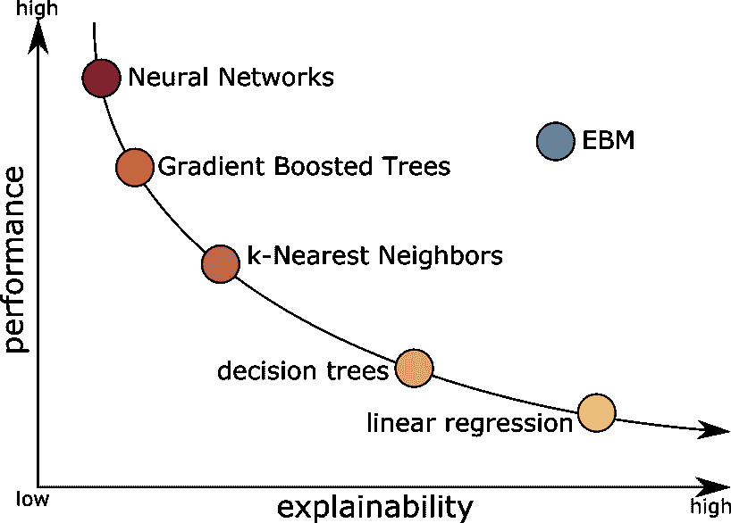
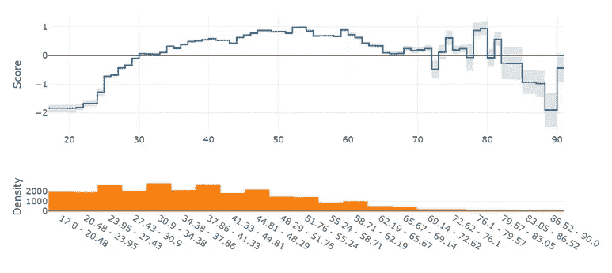
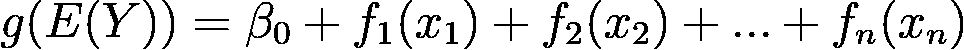
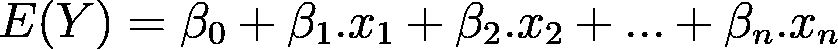
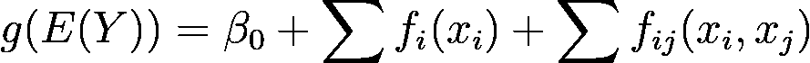
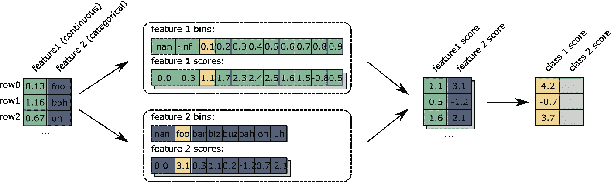
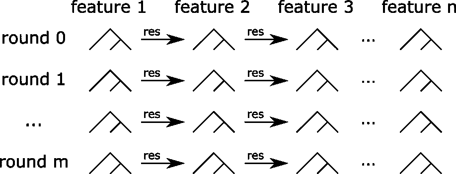

# EBM 的性能和可解释性

> 原文：<https://towardsdatascience.com/performance-and-explainability-with-ebm-c5d363e5f82?source=collection_archive---------40----------------------->

## [模型可解释性](https://towardsdatascience.com/tagged/model-interpretability)

## 可解释的助推机器是如何收获这两者的

[轮滑](https://unsplash.com/@alternateskate?utm_source=unsplash&utm_medium=referral&utm_content=creditCopyText)在 [Unsplash](/?utm_source=unsplash&utm_medium=referral&utm_content=creditCopyText) 上的照片。作者的所有其他数字。

从那时起，人们不得不在有效模型和可解释模型之间做出选择。一方面，像逻辑回归这样的简单模型是可以解释的，但是在表现上有所滞后。另一方面，像提升树或神经网络这样的复杂模型达到了令人难以置信的准确性，但却难以理解。

自 2012 年以来，来自微软的研究人员研究并实现了一种打破规则的算法:[可解释的助推机器](https://github.com/interpretml/interpret) (EBM)。EBM 是唯一没有这种性能与可解释性比率曲线的算法。

有了 EBM，当可解释性是一个需求时，你不必牺牲性能，你可以用顶级性能免费得到解释。循证医学的一个重要方面是它是自然可解释的。我们不谈论用像 Lime、Shap 或 GramCam 这样的方法来解释复杂的模型:EBM 本质上是可以解释的。人们可以直接看到模型如何使用每个特性。例如，参见一个变量的全局解释图:

蓝线**是**模型如何使用特性，而不是估计。这些图表对于理解模型的内部工作是非常宝贵的。它们对调试也有很大的帮助:如果模型在某个地方过度拟合了一个特性，您可以立即看到它(您看到这里的过度拟合了吗？).这些都是用石灰或 Shap 很难发现的问题。有人会说这是数据探索阶段的目标。不幸的是，在这一阶段很容易遗漏一些东西，所以依赖模型本身是很好的。

那么 EBM 是如何工作的呢？这是不是好得难以置信？

我们将会看到，由于几种技术的巧妙结合，这是可能的。

# 广义可加模型

先说让 EBM 可解释的基础。EBM 是一种*广义加法模型* (GAM)，由 *Trevor Hastie* 和 *Robert Tibshirani* 形式化。这个模型家族的完整描述可以在他们的书[统计学习要素](https://web.stanford.edu/~hastie/ElemStatLearn/)的第 9 章中找到。GAM 是满足以下公式的任何模型:

这些 *f* 函数被命名为*形状函数*。 *g* 功能就是*链接功能*。您可能注意到这与线性回归非常相似:

你是对的！线性回归也是博弈，其中:

*   形状函数是(与权重的)乘法。
*   链接功能就是身份。

类似地，逻辑回归也是一个 GAM，其中链接函数是 [logit](https://en.wikipedia.org/wiki/Logit) 。

gam 的数学定义定义了为什么它们是可解释的:画出形状函数，看看模型如何使用每个特征。就这么简单。上一节的图就是:一个形状函数的图。

# 比 GAM 更好:GA M

所以游戏可以通过设计来解释。然而，它们有一个明显的缺点:它们单独使用每个特性，忽略了它们之间的任何联系。即使是一个单独的决策树也可以结合特征进行预测。请注意，根据我的经验，这种简单的方法可以提供非常好的性能。

EBM 为 GAMs 带来了第一个改进，它还在附加项上使用了成对的特性:

这样的模型叫做 GA M: *有相互作用的广义模型*(不对，定义没有错误。为一个算法找一个名字并不总是容易的)。

关键是，使用两个特征的形状函数仍然是可以解释的:它们不是以直线、曲线或台阶的形式呈现，而是以热图的形式显示。当然，它们更难解释，但它们确实如此。另一方面，这允许组合几个特征并提高性能。

在我们继续讨论 EBM 对 GAMs 的改进之前，让我们看看如何进行预测。

# 循证医学推理

EBM 的另一个优点是它的推理在计算方面是轻的。这是生产环境中预测延迟必须尽可能小的一点。

下图显示了预测的所有步骤:

计算密集型部分是箱柜查找和加法！

第一步包括连续变量的离散化和分类变量的映射。连续变量被分割成箱。在宁滨步骤中，特征被映射到索引值。每个指数都与一个分数相关联。对每个特征都这样做。最终，预测是所有分数加上截距/偏差的总和。多类分类，每类一分。根据任务，可能会使用后处理(链接功能):

*   对于回归，总和直接是预测值。
*   对于分类，得分最高的类是预测类。
*   对于类别概率，对每个类别的分数应用软最大值

让我们通过一个例子来遵循这些步骤。下图突出显示了使用两个特征的模型对数据集第一行的预测:

这些步骤都是 GAM 所期望的。然而，最初的宁滨和计分部分更有趣:它们是形状函数，但独立于任何算法或公式。它们可以代表任何形状的函数:样条、决策树，甚至神经网络。

让我们看看这种离散化是从哪里来的。

# 拟合形状函数

EBM 培训部分结合使用提升树和套袋。一个好的定义可能是*袋装浅树*。该算法的核心使用提升树，如下图所示:

浅树以助推的方式训练。这些是小树(默认情况下最多有 3 片叶子)。此外，提升过程是特定的:每个树只针对一个特征进行训练。在每一轮提升过程中，针对每个特征一个接一个地训练树。它确保:

*   模型是可加的。
*   每个形状函数只使用一个特征。

这是算法的基础，但其他技术可以进一步提高性能:

*   Bagging，在这个基础估计值之上。
*   可选装袋，用于每个增压步骤。默认情况下它是禁用的，因为它大大增加了训练时间。
*   成对互动。

根据任务的不同，第三种技术可以极大地提高性能:一旦用单个特征训练了一个模型，就进行第二次训练(使用相同的训练程序)，但使用成对的特征。配对选择使用专用算法，避免尝试所有可能的组合(当有许多特征时，这是不可行的)。

最后，经过所有这些步骤，我们有一个树合奏。这些树被离散化，只需用输入要素的所有可能值运行它们。这很容易，因为所有特征都是离散化的。因此，预测值的最大数量是每个要素的条柱数量。最后，这数千棵树被简化为宁滨和每个特征的得分向量。

所以这些向量是成千上万只存在几分钟的树的结果。一旦我们建造了它们，我们就不再需要它们了！

# 结论

人们不得不在准确性和可解释性之间做出选择的时代已经过去了。EBMs 可以像 boosted 树一样有效，同时又像逻辑回归一样容易解释。

EBM 属于广义可加模型家族。他们使用以允许简单推断和解释的方式编码的增强树。

EBM 是微软 [InterpretML](https://github.com/interpretml/interpret) 项目的一部分。我鼓励任何从事表格数据工作的数据科学家尝试一下。我们在几个任务上取得了与 XGBoost 相当的性能，同时清楚地了解了模型如何使用每个特性。如果你在一个领域工作，其中可解释性是强制性的，或者运行时性能是关键，你应该尝试一下。

*原载于 2021 年 4 月 13 日*[*【https://blog.oakbits.com】*](https://blog.oakbits.com/ebm-algorithm.html)*。*