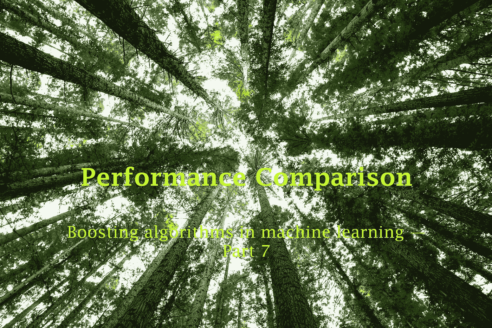
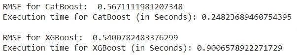
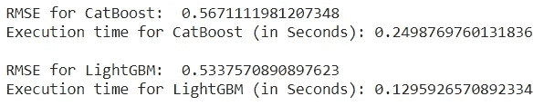

# 性能比较:CatBoost 与 XGBoost 以及 CatBoost 与 LightGBM

> 原文：<https://towardsdatascience.com/performance-comparison-catboost-vs-xgboost-and-catboost-vs-lightgbm-886c1c96db64?source=collection_archive---------11----------------------->

## 助推技术

## 机器学习中的助推算法——第七部分

Arnaud Mesureur 在 [Unsplash](https://unsplash.com/?utm_source=unsplash&utm_medium=referral&utm_content=creditCopyText) 上拍摄的照片

到目前为止，我们已经讨论了 5 种不同的 boosting 算法: [**AdaBoost**](/how-do-you-implement-adaboost-with-python-a76427b0fa7a) ， [**梯度 Boosting**](/under-the-hood-of-gradient-boosting-and-its-python-implementation-99cc63efd24d) ， [**XGBoost**](https://rukshanpramoditha.medium.com/unlock-the-power-of-xgboost-738536b9f36f) ，[**light GBM**](/can-lightgbm-outperform-xgboost-d05a94102a55)**和 [**CatBoost**](/how-do-you-use-categorical-features-directly-with-catboost-947b211c2923) 。**

**其中， [**XGBoost**](https://rukshanpramoditha.medium.com/unlock-the-power-of-xgboost-738536b9f36f) ，[**light GBM**](/can-lightgbm-outperform-xgboost-d05a94102a55)**和[**CatBoost**](/how-do-you-use-categorical-features-directly-with-catboost-947b211c2923)**是更重要的算法，因为它们产生更准确的结果，执行时间更快。******

******在[第 5 部分](/can-lightgbm-outperform-xgboost-d05a94102a55)中，我们已经比较了 XGBoost 和 LightGBM 的性能和执行时间。在那里，我们发现:******

> ******LightGBM 有时会优于 XGBoost，但并不总是如此。但是，LightGBM 比 XGBoost 快 7 倍左右！******

******是时候对 CatBoost 和 XGBoost 以及 CatBoost 和 LightGBM 进行一些性能比较了。在本内容的最后，我还将提到一些指导原则，帮助您为您的任务选择正确的升压算法。******

# ******CatBoost 与 XGBoost******

******这里我们考虑 2 个因素: ***性能*** 和 ***执行时间*** 。我们在[加州房价数据集](https://drive.google.com/file/d/1Kees3lk-Zo7AsrYz7svcj8Hnbr6gHok6/view?usp=sharing)上构建 CatBoost 和 XGBoost 回归模型。******

****CatBoost 与 XGBoost****

********

****(图片由作者提供)****

> ******XGBoost 的表现略胜于 CatBoost。但是，CatBoost 比 XGBoost 快 3.5 倍左右！******

# ****CatBoost 与 LightGBM****

****这里，我们也考虑同样的两个因素。这一次，我们在[加州房价数据集](https://drive.google.com/file/d/1Kees3lk-Zo7AsrYz7svcj8Hnbr6gHok6/view?usp=sharing)上构建 CatBoost 和 LightGBM 回归模型。****

****CatBoost 与 LightGBM****

********

****(图片由作者提供)****

> ******LightGBM 略胜 CatBoost，比 CatBoost 快 2 倍左右！******

# ****结论****

****当我们考虑执行时间时，LightGBM 轻而易举地胜出！比 XGBoost 快 7 倍，比 CatBoost 快 2 倍！****

****当我们考虑性能的时候，XGBoost 比另外两个稍微好一点。然而，选择正确的升压技术取决于许多因素。这里有一些指导方针，可以帮助您为您的任务选择正确的升压算法。****

## ****选择正确增压技术的指南****

1.  ****除了并行化训练过程之外，任何提升技术都比决策树和随机森林好得多。****
2.  ****您可以从基本的增强技术开始，如 [**AdaBoost**](/how-do-you-implement-adaboost-with-python-a76427b0fa7a) 或 [**渐变增强**](/under-the-hood-of-gradient-boosting-and-its-python-implementation-99cc63efd24d) ，然后您可以转向增强技术，如 [**XGBoost**](https://rukshanpramoditha.medium.com/unlock-the-power-of-xgboost-738536b9f36f) 。****
3.  ****[**light GBM**](/can-lightgbm-outperform-xgboost-d05a94102a55)**和 [**CatBoost**](/how-do-you-use-categorical-features-directly-with-catboost-947b211c2923) 是 [**XGBoost**](https://rukshanpramoditha.medium.com/unlock-the-power-of-xgboost-738536b9f36f) 的绝佳替代品。******
4.  ****如果你有更大的数据集，可以考虑使用 [**LightGBM**](/can-lightgbm-outperform-xgboost-d05a94102a55) 或者**[**CatBoost**](/how-do-you-use-categorical-features-directly-with-catboost-947b211c2923)。LightGBM 是最好的选择。******
5.  ****如果你的数据集有分类特征，可以考虑使用[**light GBM**](/can-lightgbm-outperform-xgboost-d05a94102a55)**或者**[**CatBoost**](/how-do-you-use-categorical-features-directly-with-catboost-947b211c2923)。两者都可以处理尚未编码的分类特征。CatBoost 是处理分类特征的最佳选择。********
6.  ****[**XGBoost**](https://rukshanpramoditha.medium.com/unlock-the-power-of-xgboost-738536b9f36f)**比其他 boosting 技术有更多的泛化能力。就性能而言，这很好。******
7.  ******[**light GBM**](/can-lightgbm-outperform-xgboost-d05a94102a55)**执行时间最快。********
8.  ******当我们同时考虑 ***性能*** 和 ***执行时间*** 时，[**light GBM**](/can-lightgbm-outperform-xgboost-d05a94102a55)**是最佳选择。********

******boosting 技术的一个主要缺点是，由于 boosting 算法是基于树的算法，因此很容易发生过拟合。我们已经讨论了一些解决过度拟合问题的技术:******

******

解决文章系列过多的问题(作者截图)****** 

******可以用来解决 boosting 算法中过拟合问题的最佳技术之一是 ***提前停止*** 。这是我们在本文中讨论过的一种正规化。我还将发表一篇单独的文章，描述我们如何使用早期停止，尤其是在 boosting 算法中。******

****今天的帖子到此结束。我的读者可以通过下面的链接注册成为会员，以获得我写的每个故事的全部信息，我将收到你的一部分会员费。****

**** [## 通过我的推荐链接加入 Medium

### 作为一个媒体会员，你的会员费的一部分会给你阅读的作家，你可以完全接触到每一个故事…

rukshanpramoditha.medium.com](https://rukshanpramoditha.medium.com/membership) 

非常感谢你一直以来的支持！下一个故事再见。祝大家学习愉快！

特别要感谢 Unsplash 网站上的 **Arnaud Mesureur** 、**、T3，他为我提供了这篇文章的精美封面图片。**

[鲁克山·普拉莫迪塔](https://medium.com/u/f90a3bb1d400?source=post_page-----886c1c96db64--------------------------------)
**2021–11–03******