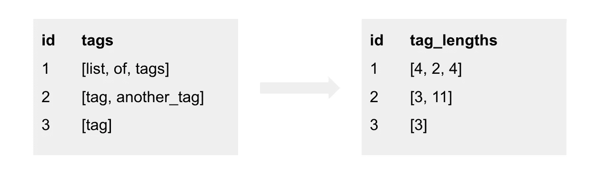
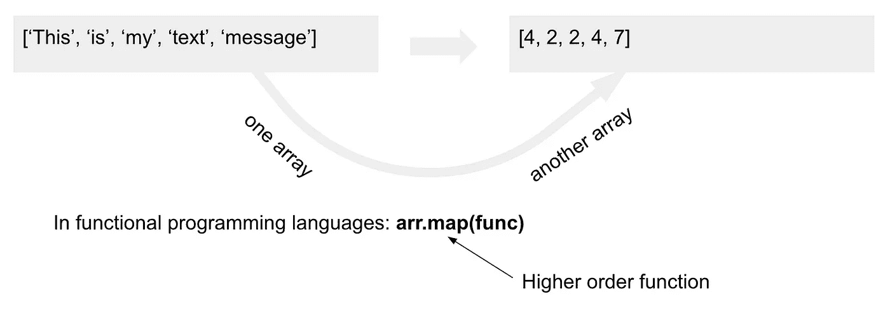
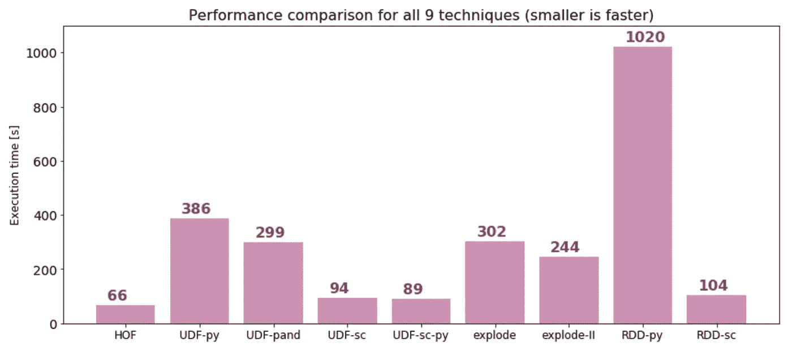

# Apache Spark 中的性能:基准测试 9 种不同的技术

> 原文：<https://towardsdatascience.com/performance-in-apache-spark-benchmark-9-different-techniques-955d3cc93266?source=collection_archive---------5----------------------->

## Spark 3.1 中不同数组处理方法的比较


照片由 [Kolleen Gladden](https://unsplash.com/s/users/kolleen-gladden) 在 Unsplash 上拍摄

在 Apache Spark 中，相同的转换可以通过不同的方式实现是很常见的。这也是 Spark 不断发展的结果，因为新版本中提供了新的技术和功能。

在本文中，我们将比较导致相同结果的 9 种不同技术，但是它们中的每一种都有非常不同的性能。我们将在一个与数组处理相关的特殊例子中展示它，但是结果可以推广到其他情况。

## Spark 中的基准测试

当测量 Spark 中不同转换的性能时，需要小心避免一些陷阱。首先，我们需要通过调用一个操作来运行 Spark 作业来实现转换(要理解 Spark 中转换和操作的区别，请参见我最近的[文章](/a-decent-guide-to-dataframes-in-spark-3-0-for-beginners-dcc2903345a5))。您能想到的一个动作是函数 *count()* 。然而，使用*计数*时，有一个问题，即要评估结果数据帧代表多少行，Spark 并不总是需要执行所有的转换。Spark 优化器可以以这样的方式简化查询计划，即您需要测量的实际转换将被跳过，因为在找出最终计数时根本不需要它。所以为了确保所有的转换都被执行，最好调用 *write* 并将结果保存在某个地方。但是保存输出还有另一个缺点，因为执行时间会受到写入过程的影响。

在 Spark 3.0 中，由于 Spark 3.0 中的一个新特性 *noop* write format，基准测试简化了，进行性能基准测试变得更加方便。我们可以简单地将其指定为 *write* 格式，它将具体化查询并执行所有转换，但不会将结果写入任何地方。

```
(
  final_df
  .write
  .mode("overwrite")
  **.format("noop")**
  .save()
)
```

我们将要对查询进行基准测试的用例与下面的例子相关。想象一个数据集，其中每行都有一个单词数组。我们想添加一个新的列，它也是数组类型，这个新数组的值对应于原始数组中单词的长度，如下图所示:



作者图片

## 技术 I——高阶函数

从概念上来说，我们在这里要做的转换是，我们要从一个数组创建另一个数组，并且我们要对数据集中的每一行都这样做。在函数式编程语言中，通常有一个在数组(或另一个集合)上调用的 *map* 函数，它将另一个函数作为参数，然后这个函数被应用到数组的每个元素上，如下图所示



作者图片

从 Spark 2.4 开始，Spark SQL 中也支持这个概念，这个*映射*函数被称为 [*变换*](https://spark.apache.org/docs/latest/api/sql/index.html#transform) (注意，除了*变换*之外，Spark 中还有其他可用的 Hof，比如 [*过滤器*](https://spark.apache.org/docs/latest/api/sql/index.html#filter) 、 [*存在*](https://spark.apache.org/docs/latest/api/sql/index.html#exists) *、*等)。这种支持最初只出现在 SQL API 中，所以如果你想在 DataFrames DSL(在 2.4 中)中使用它，你必须在 *expr* 中调用它(或者 *selectExpr* )。然而，从 Spark 3.0 开始，Hof 也在 Scala API 中得到支持，并且从 Spark 3.1.1 开始，Python API 中也增加了这种支持。使用 HOFs，可以如下实现转换:

```
final_df = (
  df
  .withColumn("tag_lengths",expr("TRANSFORM(tags, x -> length(x))"))
)
```

在 Scala API 中——从 Spark 3.0 开始:

```
val final_df = df
  .withColumn("tag_lengths", transform($"tags",  x => length(x)))
```

在 Python API 中—从 Spark 3.1.1 开始

```
final_df = (
  df
  .withColumn("tag_lengths", transform("tags", lambda x: length(x)))
)
```

## 技术二— Python UDF(香草)

由于没有直接的本地函数来执行我们想要的转换，人们可能会尝试为它实现一个用户定义的函数(UDF ),事实上在 Spark 2.4 支持 HOFs 之前，UDF 是解决 Spark 中数组问题的一种非常常见的技术。在 PySpark 中有两种主要类型的 UDF，第一种是普通的 UDFs 我们在这里称之为香草 UDF，第二种是熊猫 UDF，我们将分别测量它们的性能。使用普通 UDF 的转换可以写成如下形式:

```
@udf("array<int>")
def pythonUDF(tags):
  return [len(tag) for tag in tags]final_df = df.withColumn("tag_lengths", pythonUDF("tags"))
```

## 技巧三——蟒蛇 UDF(熊猫)

因为 Spark 不能将 Python 代码从 UDF 翻译成 JVM 指令，所以 Python UDF 必须在 Python worker 上执行，而不像 Spark 作业的其余部分在 JVM 中执行。为了做到这一点，Spark 必须将数据从 JVM 传输到 Python worker。使用普通的 Python UDF，这种传输是通过将数据转换为腌制字节并将其发送到 Python 来实现的，这不是很高效，并且具有相当大的内存占用。这在 Spark 2.3 中得到改进，将 Spark 与 Apache Arrow 集成在一起，并支持所谓的熊猫 UDF。其思想是，如果 UDF 是使用熊猫 API 实现的，并且该函数注册为熊猫 UDF，则数据将使用 Arrow 格式传输，这是一种内存中的数据格式，专门设计用于在不同系统之间高效地交换数据。此外，熊猫 UDF 可以在 Python 端利用矢量化执行，这将非常有效，特别是如果 UDF 将进行一些数值计算并将使用 NumPy 或 SciPy 支持的矢量化操作。使用熊猫 UDF，我们的数组转换可以实现如下:

```
@pandas_udf("array<int>")
def pandasUDF(tags):
  return tags.map(lambda x: [len(tag) for tag in x])final_df = df.withColumn("tag_lengths", pandasUDF("tags"))
```

## 技术四——斯卡拉 UDF

使用这种技术，我们将测试如果我们使用 Scala 而不是 Python，性能会有怎样的变化。如果您只使用 DataFrame API 支持的原生转换，而不使用任何 UDF，那么无论您使用 Python 还是 Scala，性能都是一样的，因为原生转换在幕后创建了一个查询计划，无论使用什么语言，该计划都是一样的(参见我的另一篇[文章](/mastering-query-plans-in-spark-3-0-f4c334663aa4)以了解关于查询计划的更多信息)。计划的执行和 Spark 作业的执行将在 JVM 内部发生。然而，如果您使用 UDF，情况就不同了，因为在这种情况下，UDF 内部的转换不能转换为查询计划，并且正如我们上面所描述的，在 Python 的情况下，执行将在 Python 工作器上进行，这与传输数据的开销有关。如果 UDF 是在 Scala 中实现的，我们可以避免将数据传输到 Python，执行将留在 JVM 中。然而，将数据从内部数据格式转换为 java 对象仍然会有一些开销。对于原生转换，Spark 使用内部数据格式，所有原生转换在运行时都会生成非常高效的 Java 代码。对于 UDF，Spark 不知道如何生成代码，必须将数据转换为 Java 对象，然后在其上执行 UDF，之后，将数据转换回内部格式。Scala UDF 的代码可以写成如下形式:

```
def tag_lengths(tags: Seq[String]): Seq[Int] = {
  tags.map(tag => tag.length)
}val scalaUDF = udf(tag_lengths(_:Seq[String]): Seq[Int])val final_df = df.withColumn("tag_lengths", scalaUDF($"tags"))
```

## 技术五——从 Python 调用 Scala UDF

上面我们描述了使用 Scala 和 Python 作为 Spark 语言的区别——如果我们只使用本机转换，对性能没有影响，但是，如果我们使用 UDF，性能会受到影响。对于 Python 开发人员来说，如果性能很关键，但又需要使用 UDF，这可能会很不幸。有趣的是，有一种混合的方法，在这种方法中，我们可以用 Python 编写 Spark 应用程序，而在 Scala 中，我们只实现 UDF 来保持 JVM 内部的执行。

```
// in Scala:
// this is inside src/main/scala/vrbad/sandbox/CustomFunctions.scalapackage vrbad.sandboximport org.apache.spark.sql.SparkSessionobject CustomFunctions { def sizeElements(elements: Seq[String]): Seq[Int] = {
    elements.map(el => el.length)
  } def registerUDF(_spark: SparkSession) = {
    val f = sizeElements(_)
    _spark.udf.register("sizeElements", f)
  }
} # in Python:java_instance = spark._jvm.vrbad.sandbox.CustomFunctions
java_instance.registerUDF(spark._jsparkSession)final_df = (
  df.withColumn("tag_lengths", expr("sizeElements(tags)"))
)
```

Scala 文件使用 *sbt* 编译成 jar 文件，上传到集群，可以在 PySpark 应用程序中使用，如上面的代码所示。

## 技术六——分解阵列

分解数组允许分别访问数组的每个元素。 [*explode*](https://spark.apache.org/docs/latest/api/python/reference/api/pyspark.sql.functions.explode.html#pyspark.sql.functions.explode) 函数将简单地为数组中的每个元素生成一个新行，因此 DataFrame 在它所代表的行数方面变得更大。我们可以计算每个元素的长度，然后，我们可以将这些结果分组到数组中，从而将数据帧收缩回其原始大小:

```
from pyspark.sql.functions import explode, length, collect_listfinal_df = (
  df.withColumn("tag", explode("tags"))
  .withColumn("tag_size", length("tag"))
  .groupBy("id")
  .agg(
    collect_list("tag_size").alias("tag_lengths")
  )
) 
```

必须理解这种技术有五个重要的注意事项，其中一个与性能直接相关，两个与结果的正确性相关，一个与最终输出的形状相关，一个与空处理相关:

1.  *groupBy* 是一种需要特定分区的转换，即数据必须按分组键重新分区。如果不满足这一要求，Spark 将不得不对数据进行洗牌，这将对性能产生直接影响，因为洗牌的成本通常很高。
2.  *collect_list* 函数是不确定的，所以最终数组中的元素可能以不同的顺序结束，就像原始数组中的元素一样。
3.  该方法假设在调用 *explode* 之前，分组键包含唯一值，因为如果有重复，它们将在 *groupBy* 之后被删除，因此在这种情况下，我们将得到比开始时更少的行——重复将被分组在一起。
4.  在 *groupBy* 之后的输出数据帧将只包含分组关键字和聚合结果，所有其他原始字段都将丢失，因此如果您在最终输出中需要它们，您需要将结果与原始数据帧连接起来，这当然会带来额外的速度减慢。
5.  如果数组为空，那么 *explode* 函数将不会生成任何行，所以在这里，在分组之后，我们可以得到比开始时更少的行。这可以用函数 [*explode_outer*](https://spark.apache.org/docs/latest/api/python/reference/api/pyspark.sql.functions.explode_outer.html#pyspark-sql-functions-explode-outer) 来控制，即使数组为空，也会生成一行(空值)。

## 技术七—用分桶源分解阵列

如果数据有正确的划分，上一点提到的混乱就可以避免(参见我的另一篇[文章](/should-i-repartition-836f7842298c)，我在那里详细描述了这一点)。如果数据源是按分组键分桶的，就可以实现这一点。在这里，我们将测试它如何提高性能，查询与技术 VI 中的相同，但是源将按照分组关键字— *id* 进行分类。

## 技术八 Python 中的 RDD API

RDD API 是一个低级 API，尤其是在 Spark 2.0 之前使用。从 Spark 2.x 开始，建议避免使用它，而使用 DataFrames 或 SQL。Spark 内部仍然使用 RDD，在执行期间，查询计划总是被编译成 RDD DAG(有向无环图)。关键是 Spark 以一种非常高效的方式做到了这一点，首先它优化了查询计划，然后它还生成了高效的 Java 代码来操作内部数据表示——一种所谓的钨格式。然而，如果您自己编写 RDD 代码，不会发生任何优化，数据将被表示为 Java 对象，与钨相比，其内存消耗要大得多。

为了完整起见，我们将在这里测试 RDD 方法，在 Python 中，代码可能是这样的

```
from pyspark.sql.types import *r = (
  df.rdd
  .map(lambda row: (row[0], [len(tag) for tag in row[1]]))
)data_schema = StructType(
  [
    StructField("id", StringType()),
    StructField("tag_lengths", ArrayType(LongType()))
  ]
)final_df = spark.createDataFrame(r, data_schema)
```

## 技巧九 Scala 中的 RDD API

在这个基准测试中测试的最后一项技术与前一项相同——RDD 方法，但是现在在 Scala 中:

```
val final_df = df.rdd
  .map(row => 
    (row(0).asInstanceOf[String],
    row(1).asInstanceOf[Seq[String]].map(tag => tag.length))
  ).toDF("id", "tag_lengths")
```

## 基准详细信息

所有查询都使用 Spark 3.1.1(撰写本文时的最新版本——2021 年 3 月)在运行时为 8.0 的 Databricks 平台上执行。所使用的集群有 3 个工作线程 m5d.2xlarge(总共 24 个内核)，输入数据集以 Apache Parquet 文件格式存储在 S3 (AWS 分布式对象存储)上，它有 1 047 385 835 行(略超过 1 0 亿行)。

## 基准测试结果

在下图中，您可以看到所有 9 种技术的执行时间:



作者图片

最快的是技术 I——使用高阶函数的本地方法，耗时 66 秒。稍微慢一点的是技术 V 和 IV——从 Python 应用程序调用的 Scala UDF(89 秒)和从 Scala 应用程序调用的 Scala UDF(94 秒)。接下来是用 Scala 中的 RDD API 编写的查询，令人惊讶的是它只用了 104 秒。使用 *explode* 和 *groupBy* 的方法要慢得多，如果我们使用分桶源并避免混洗，它运行 244 秒，另一方面，如果我们不使用分桶，执行速度会慢一些，需要 302 秒。非常类似的是熊猫 UDF——299 秒。普通的 Python UDF 用了 386 秒，最后最慢的是 Python 中使用的 RDD API(1020 秒)。让我们来看看一些亮点:

1.  HOFs 的本地方法是最有效的——这并不奇怪，它可以利用所有的内部特性，如 Spark optimizer、代码生成或内部钨数据格式。
2.  Scala UDF 比 Python UDF 快得多——我们预料到了这一点，因为 Scala UDF 在 JVM 内部执行，避免了 JVM 和 Python 工作器之间的数据传输。
3.  从 Python 调用的 Scala UDF 比从 Scala 调用的 Scala UDF 略快。在这里，我假设这两种技术在性能方面是等价的，并且我确实看不出为什么从 PySpark 应用程序调用时会更快，但是，差异非常小，只有 5 秒钟，所以也可能是在集群上发生了一些不相关的事情。
4.  技术 VI 和 VII ( *爆发* + *分组通过*无桶和有桶)之间的差别不是很大。这意味着在第一种情况下，洗牌并不是一个大的瓶颈。这是因为混洗数据不是很大，从 SparkUI 中，我可以看到*混洗写*只有 26 GB。就行而言，数据集很大(超过 10 亿)，但它只有两列( *id* 和*标记*)被混洗，并且在具有 24 个核心的集群上，这样的混洗不会带来很大的开销。
5.  熊猫 UDF 比香草 UDF 跑得快，但没有人们想象的那么快。实际上，熊猫 UDF 的表现可以接近斯卡拉 UDF 的表现。但是这些情况通常是你的 UDF 在做一些数值计算，并且是用 SciPy 或 NumPy 编写的，所以熊猫可以在幕后利用 BLAS 或 LAPACK 库的矢量化执行。这不是我们的情况——我们不做任何数值计算，但我们仍然获得了比香草 UDF 更快的执行速度，因为熊猫 UDF 使用 Apache Arrow 格式进行数据交换。
6.  在我们的例子中，Scala 中的 RDD API 非常快。在 DataFrame API 的例子中，Spark 使用了一个优化器，它不会用于 rdd。但是在这里，我们实际上只对阵列进行了一次转换，因此优化器不会带来太多好处。RDD API 不会利用生成的代码和钨数据格式，其性能可以与 Scala UDF 相媲美。
7.  Python 中的 RDD API 确实非常慢，我们可以看到所有其他技术都快得多。

## 结论

在本文中，我们针对 Apache Spark 处理阵列中的一个特定用例测试了 9 种技术的性能。我们已经看到，SQL 中的 Spark 2.4、Scala API 中的 3.0 以及 Python API 中的 3.1.1 都支持高阶函数，从而实现了最佳性能。我们还比较了用户定义函数的不同方法，如 vanilla Python UDF、Pandas UDF、Scala UDF，以及一种混合方法，其中我们从 PySpark 应用程序中调用 Scala UDF。我们还看到了它与分解数组的比较，并指出了与这种方法相关的一些注意事项。最后，我们还在测试中包含了遗留的 RDD API。