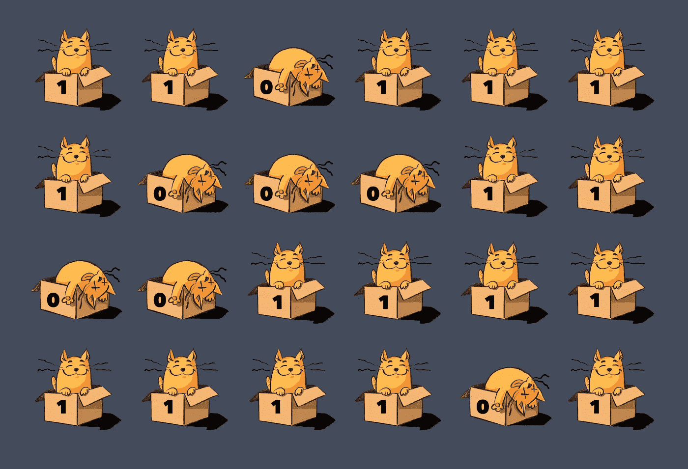
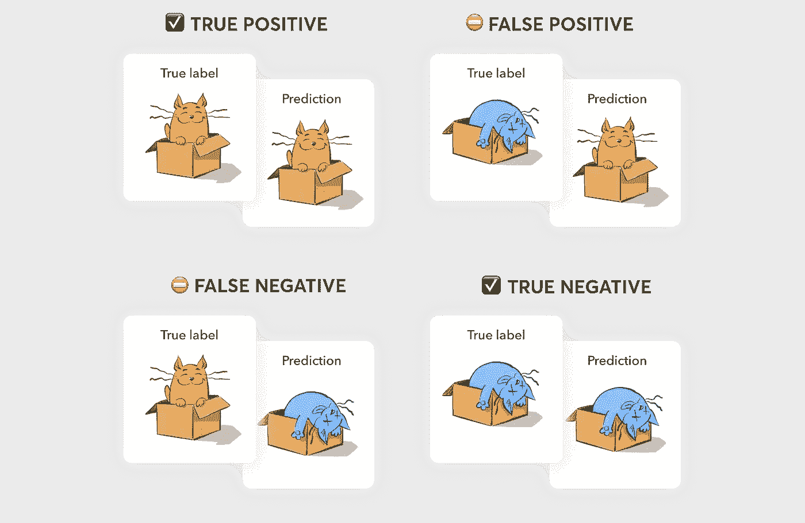
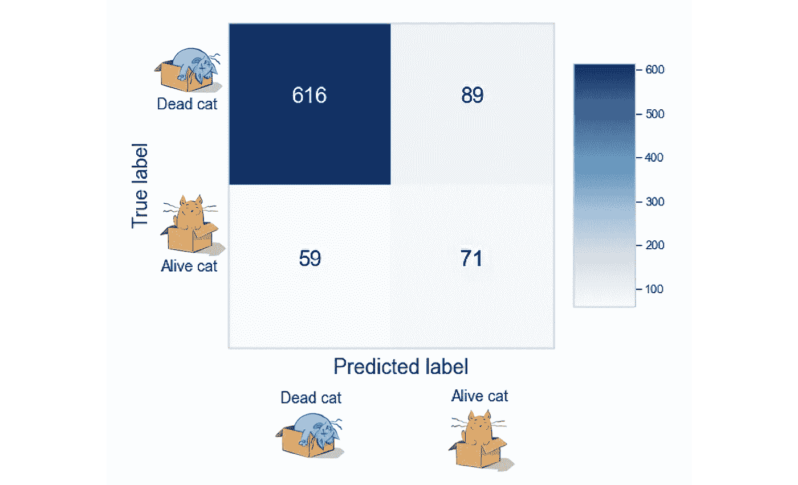
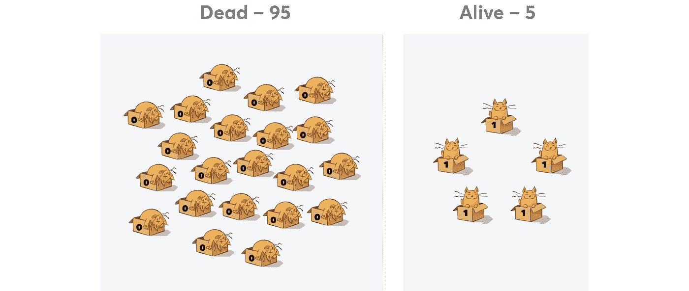
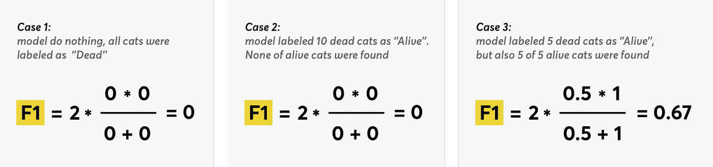
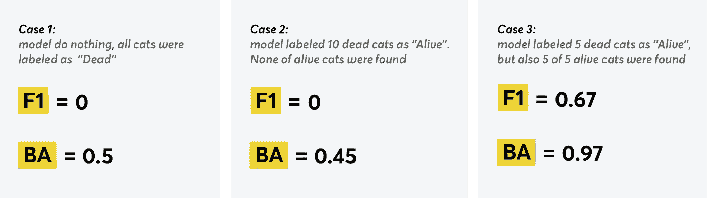
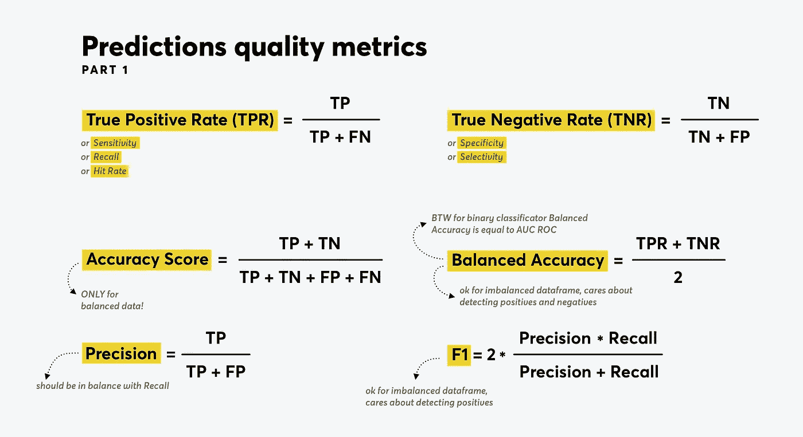

# 二元分类器的性能度量(用简单的话来说)

> 原文：<https://towardsdatascience.com/performance-metrics-for-binary-classifier-in-simple-words-be958535db49?source=collection_archive---------13----------------------->

## 对于初学者和所有喜欢猫和不喜欢深奥解释的人



*作者所有图片*

# 分类错误

假设我们有一个简单的二进制分类器，它接受装有薛定谔猫的盒子😺作为输入，如果猫是活的，我们期望分类器返回标签 1(阳性),如果不是，返回标签 0(阴性),但是错误时有发生。

## **为什么？**

原因可能有所不同，例如，输入数据质量差，或者选择了错误的要素。例如，如果它是一只熟睡的猫，所以它看起来很死，分类器可以很容易地为它返回 0。

下图显示了 4 种可能的情况，其中两种分类器给出了正确的预测，而另外两种则是错误的:



因此，如果我们的零假设是所有的猫都活着(属于第 1 类)，那么可能的错误是:

## **假阳性(**I 型错误)

*   无效假设被错误地拒绝了
*   死猫被归类为活的

## **假阴性(**II 型错误)

*   零假设被错误地接受了
*   活猫被归类为死猫

# 混淆矩阵

让我们用数字来完成上面的 pic:有多少样本被正确标记，有多少次分类器是错误的。这就是我们如何得到二元分类的混淆矩阵。

下面是一个使用 Python [scikit-learn](http://scikit-learn.org/stable/auto_examples/model_selection/plot_confusion_matrix.html) 构建的矩阵示例:

```
from sklearn.metrics import confusion_matrix
import pandas as pdn = confusion_matrix(test_labels, predictions)
plot_confusion_matrix(n, classes = ['Dead cat', 'Alive cat'], 
											title = 'Confusion Matrix');
```



在这种情况下，我们有:

*   真阴性= 616(死猫标记为死亡)
*   假阴性= 59(标记为死亡的活猫)
*   真阳性= 71(标记为活的活猫)
*   假阳性= 89(死猫标记为活的)

我们可以从 numpy 使用 ravel()获得的所有值:

```
tn, fp, fn, tp = confusion_matrix(test_labels, predictions).ravel()
```

所以，现在我们知道模型做了多少次正确和错误的预测，下一步是评估分类器——检查它做出的预测是否足够好。让我们看看我们有什么衡量标准。

# 准确度分数

首先；我们将尝试使用**准确度分数**进行评估；将正确预测的数量除以总预测数量；得到正确预测的样本百分比；


## 不合适的时候？

当数据不平衡，且**活猫数量明显**多于死猫数量时(反之亦然)。让我们弄清楚为什么。

## 想象一个非常悲伤的情况:在 100 个盒子中，我们有 95 个装着死猫，只有 5 个装着活猫。



我们想在它们加入其他 95 只之前尽快找到所有活着的猫，但我们的分类器已经失去了所有希望，变得**悲观**:现在它**总是说盒子里的猫已经死了**(即使它没有死)。

那么就会对 95 次(TN = 95)，错 5 次(FN = 5)。其他值为:TP = FP = 0。让我们计算分类器的准确度:


> 看起来分类器**有很高的准确率** — 95%，但是**却什么也做不了**。
> 
> 原因是大量“猜测”的死猫对准确度分数和抑制误差有很大贡献。

因此，为了获得较高的准确率，分类器总是能够给出一个主要类别的标签。但这不符合问题的解决逻辑:高精度并没有帮助我们找到一个装有活猫的盒子。

看起来我们需要从计算所有类的公共度量转移到**每个类的单独性能度量**。

# 真阳性率，真阴性率

*   为了计算**真阳性率**(又名**回忆**、**灵敏度**和**命中率**)，我们将猫活着的正确预测数与装有活着的猫的箱子总数进行比较:


*   **真阴性率**(又名**特异性**或**选择性**):这里我们比较有死猫的箱子数和猫已经死亡的正确预测数:


让我们计算悲观分类器和不平衡数据(95 只活猫和 5 只死猫)的度量:


好吧，这一次模型没能欺骗我们:虽然 TNR 是完美的(1)，但 TPR 是 0。

这清楚地说明了这个模型的本质:它很擅长寻找死猫，但很难找到活猫。

所有这些都在**平衡精度**度量中考虑到了，该度量是精度的模拟，但可用于不平衡的类别。

# 平衡精度

它被计算为灵敏度和特异性的平均值，即每个类别的比例校正值的平均值:


当所有类别都是平衡的，因此每个类别中有相同数量的样本时，TP + FN ≈ TN + FP 和二进制分类器的“常规”准确度大约等于平衡准确度。

在我们不平衡的猫的例子中(95 只死了，5 只活了):


这里我们得到了 50%,而准确性得分是 95%。而且，直到我们的模型猜出至少一只活着的猫，它也不会得到高于 50%的 BA 分数——这就是生活(以及平衡的准确度公式)。

# 问题解决了？

看起来已经完成了——我们可以一直使用平衡精度，因为它不受职业不平衡的影响。但这里还有一个例子。

假设现在我们的分类器说盒子里有 10 只活着的猫，但是……没有一只真的活着。

这就是我们所拥有的:

*   没有发现 5 只存活的猫(TP = 0)，它们都被标记为死亡(FN = 5)
*   在 95 只死猫中，85 只被正确分类(TN = 85)，10 只被误认为是活的(FP = 10)

平衡精度从 0.5 下降到 0.45:


一方面，这是有道理的，因为现在有更多的错误(该模型以前明确无误地识别了死猫)。另一方面，当我们试图寻找活着的猫时，两个模型都同样无用:**他们都没有找到一只活着的猫，但 metrics 说第一个模型更好**。那么我们应该相信什么呢？

# 活着的猫比死了的更重要

关键是，平衡准确度指标只给出了我们正确分类的存活猫数量的一半。另一半是我们正确标记了多少只死猫，而对于我们的任务来说，这个信息是没有用的。

我们使用分类器的任务在这里扮演了一个重要的角色。在上面描述的例子中，检测最大数量的活猫符合我们的最佳利益，但模型是否能识别死猫并没有太大关系(无论如何，试图拯救它们已经太晚了)。但如果有一天找到死猫变得和找到活猫一样重要，我们可以放心地使用平衡精度。

但目前，我们仍然专注于检测活着的猫，并继续寻找可以帮助我们评估我们模型的指标。

# 回忆和精确:从两个角度看

让我们假设我们重新训练了我们的模型，它最终预测出 5 只猫中有 5 只还活着！但是我们仍然有一些错误——5 只死猫也被标记为活的。

换句话说:FP = 5，TP = 5，TN = 90，FN = 0。

那么什么是模型的**回忆(真阳性率)**？


1%或 100% —太棒了！

但是那些被称为活着但已经死了的猫呢？我们都知道分类器**错的次数和它对的次数一样多**。显然，应该有一个指标来反映它。

# **精度又名阳性预测值**

有这样一个度量——**精度**:


它显示了我们的模型将“活着的猫”类与所有其他类区分开来的能力，但是，不幸的是，它没有给出我们是否已经找到所有活着的猫的想法。

相比之下， **Recall** metric 显示了我们是否找到了所有活着的猫，但它不能说明我们在整个搜索过程中打开装有死猫的箱子的次数。

好吧，让我们计算最后一次实验的精度，然后解释结果:


所以:

*   Recall = 1 意味着无论总共有多少只活着的猫，我们都会找到它们。
*   精度= 0.5 意味着打开一个标签为“活着”的盒子，在一半的情况下，我们会在那里找到一只死猫。

# 找到平衡

(我要提醒一下，我们还有 95 名☠️死亡，5 名活着😸猫)

分开来看，精确度和召回率没有什么意义:

*   一个总是把所有猫都归类为活的(**乐观** ) 的模型，召回率很完美(100%)，但是精度非常低(5%)。
*   一个认为只有那些绝对确定的猫还活着的模型(**悲观**)，具有 100%的精确度。但是如果有很多猫睡得像狗一样，召回率会很低。

我们需要平衡这两个指标，以获得完整的图片和两个问题的答案:
1。**有多少“活着”的预测是正确的**(精度)
2。**活猫的哪一部分被正确分类**(回忆)

这就是 F1 指标派上用场的地方。

# f1-分数

F1 是精确度和召回率的调和平均值，所以如果其中一个非常低，你就不可能得到高的 F1。


让我们回忆一下我们的模型是如何训练的，并计算所有 3 种情况下的 F1 分数:

1.  起初，模型将所有猫标记为死亡:
    TP = FP = 0，TN = 95，FN = 5
2.  然后它将 10 只猫标记为活着，但其中没有一只活着的猫:
    TP = 0，FP = 10，FN = 5，TN = 85
3.  最后，分类器正确预测了 5 只活着的猫中的 5 只，但也错误地将 5 只死猫标记为活着:
    TP = 5，FP = 5，FN = 0，TN = 90

您可以看到，随着每次重新训练，负面预测的“质量”下降，而正面预测的“质量”上升，因此我们希望 F1 能够反映这种变化:



嗯，有道理。案例 1 和案例 2 对我们来说基本上是一样的——尽管模型的行为不同，但我们没有发现任何活着的猫。但是第三次，分类器正确地标记了所有活着的猫——F1 增加了，同时我们拯救猫的希望也增加了😸。

问题是，与平衡精度不同，F1 没有考虑真正的负面因素——如果我们扩展公式，很容易看出这一点:


这意味着数据集中有多少只死猫并不重要，我们成功找到了多少只也不重要。我们专注于检测活着的人，因为他们更重要。

让我们将其与平衡精度行为进行比较:



> 因此，如果我们更关心拯救活着的猫(检测阳性)，度量 F1 更适合。

F1 只关心模型*说*是阳性的样本，以及*实际上*是阳性的样本，根本不关心数据集中有多少阴性样本或者有多少被正确分类。

这就是为什么在评估旨在发现异常的模型时，这种度量非常受欢迎。

> 相反，如果阴性样本几乎和阳性样本一样重要，我们应该更喜欢平衡的准确性。

## 注意:

对于多类分类，如果一个类包含的样本比其他类多得多，则其度量将抑制所有其他类。然后，您可以形成自己的列联矩阵，并为每个类别计算自己的 F1 值，得到的 F1 应为所有类别的简单(即未加权)算术平均值。

# 摘要

## 准确(性)

*   正确预测的比例
*   取决于类之间的平衡，不适用于不平衡的数据集
*   对于平衡数据集，等于**平衡精度**

## **平衡精度**

*   **灵敏度**和**特异性**的平均值
*   不受类别不平衡的影响，可应用于不平衡的数据集
*   对于平衡数据集，等于**精度**

## 精确度(阳性预测值)

*   所有正面预测中真正正面预测的比例
*   显示分类器是否能够将一个类别与所有其他类别区分开来
*   不受类别不平衡的影响，可应用于不平衡的数据集
*   应与**召回**相平衡

## **召回(真阳性率、灵敏度、命中率)**

*   数据集中所有阳性样本的真阳性预测的比例
*   显示分类器是否能够检测到给定的类
*   不受类别不平衡的影响，可应用于不平衡的数据集
*   应与**精度**保持平衡

## 子一代

*   **精度的调和平均值**和**召回**
*   没有考虑到真正的负面因素
*   不受类别不平衡的影响，可应用于不平衡的数据集



上述所有指标均可在 [scikit-learn](https://scikit-learn.org/stable/) 库中找到:

```
from sklearn.metrics import accuracy_score
from sklearn.metrics import balanced_accuracy_score
from sklearn.metrics import recall_score
from sklearn.metrics import precision_score
from sklearn.metrics import f1_score
```

# 附言

我在这里跳过了一些指标，如果您有不平衡的数据集，也可以使用这些指标，如 Precision-Recall curve，或 Kappa score，或 AUC ROС，它们也不受类不平衡的影响……或者不是？

让我们在下一部分弄清楚:)

**所有图片由作者*提供