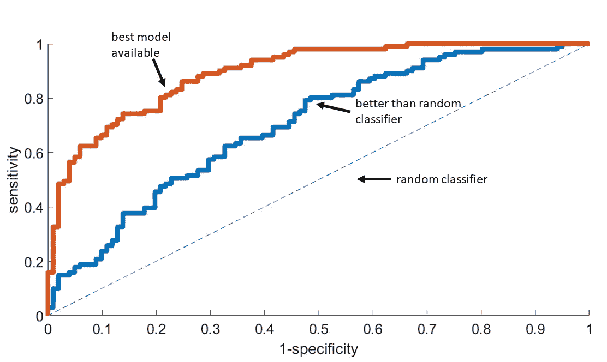

# 数据科学中的性能指标被广泛误解和误用

> 原文：<https://towardsdatascience.com/performance-metrics-in-data-science-are-widely-misunderstood-and-misused-62e292085083?source=collection_archive---------41----------------------->

## [*小窍门*](https://towardsdatascience.com/tagged/tips-and-tricks) ，实用见解

## 在评估分类器的性能时，您应该做些什么来避免误用。

由[凯文·杰瑞特](https://unsplash.com/@kjarrett?utm_source=medium&utm_medium=referral)在 [Unsplash](https://unsplash.com?utm_source=medium&utm_medium=referral) 上拍摄的照片

您认为准确率达到 99%的分类器是好是坏？很大一部分人会认为正确答案是“好”。太震撼了！。正确答案是两者都不是。

让它深入人心。

我参加过许多会议，会上人们认为如果相关的性能指标高于特定值，那么模型一定是好的。作为一名数据科学家，你应该更清楚。

让我解释一下。任何数据科学家都不应该在没有上下文 的情况下， ***记住任何性能指标的任何阈值，以表明它是好是坏。数据科学是应用科学。它非常依赖于上下文。我将用两个广泛使用的性能指标来说明这一点:精确度和接收机工作特性曲线下的面积(ROC)。这两种度量被广泛用于评估分类器的性能。***

**当你看完这篇文章，你会清楚地明白为什么开题的正确答案是*都不是*。**

# ROC 的使用和误用

## 使用

我想你已经明白 ROC 是做什么的了。我在这里简单介绍一下。不过，如果你是新手或者有点生疏，我有更详细的介绍。

 [## 直观理解 ROC 并用 R 和 Python 实现

### 一个基于案例研究的 ROC 介绍，如何设置阈值，它的关系…

towardsdatascience.com](/intuitively-understand-roc-and-implement-it-in-r-and-python-b6aa1e8508d) 

ROC 曲线是评估分类器性能的最广泛使用的性能度量之一。

简而言之，ROC 在 *y* 轴上绘制灵敏度，在 *x* 轴上绘制特异性。敏感度为我们提供了正确识别的阳性类别比例的估计值。特异性为我们提供了被正确识别的阴性病例比例的量度。根据阈值的选择，在灵敏度和特异性之间存在权衡。

我们可以通过从一个极端到另一个极端改变阈值来考虑所有可能的敏感性和特异性对，而不是决定使用什么阈值。ROC plot 就是这么做的。它让我们绘制出灵敏度和特异性的所有可能的配对值，并创建一条“曲线”。

AUC(曲线下面积)是一个可以总结整体表现而不是查看每个阈值的权衡的单一指标。ROC 非常适用于比较分类器，然后选择 AUC 较高的分类器进行进一步考虑(见下图)。

ROC 为例。曲线下的面积是选择更好模型的方便指标。随机分类器的 AUC 为 0.5(图片由作者提供)

## 误用

然而，这就是问题的开始。我们现在不仅使用 ROC 来选择更好的模型，而且更多的时候，我们还将它作为我们数据科学故事的最后一部分。ROC 指标不应作为数据科学项目的最终结果。

这是因为 ROC 代表在所有可能的阈值下运行的模型。然而，在实际操作中，我们只能运行具有单一阈值的模型来进行分类。

使用 ROC 作为分析的最后一部分，类似于说我们不知道哪个阈值可以起作用，所以让我们考虑所有的可能性，绘制结果，然后用 AUC 总结它，就这样吧。

***听起来很懒，不是吗？***

这种方法对于选择一个模型而不是另一个模型来说是足够的，但是不足以确定所提出的模型是否能够解决手头的问题。这需要进一步的思考和分析，而数据科学家没有受过这方面的正式培训(在典型的课程中你找不到)。

你看，人们通常被教导说，AUC 超过 0.5 意味着你做得比机会好。虽然这是真的，但这并没有使模型变得有用。

如果一个模型比现状更好，它将是有用的。现状并不总是随机的分类器。

在没有现有解决方案的情况下，0.68 的 AUC 可能是有用的。这方面的一个实际例子是我们之前为慢性疾病患者开发的早期预警系统(慢性阻塞性肺病，任何有兴趣的人都可以[进一步了解](https://www.jmir.org/2017/3/e69/))。该系统旨在帮助患者在家自己管理病情。因为这个特殊案例中的*现状*没有做任何事情，所以 AUC 为 0.68 的模型是有用的。

然而，如果现有解决方案提供更好的灵敏度和特异性，则 AUC 为 0.80 的模型(提供早期预警以帮助医生更好地管理医院[中的](https://www.sciencedirect.com/science/article/pii/S0300957218309456)患者)是无用的。

> 底线是什么？没有任何上下文，你无法弄清楚一个给定 AUC 的模型是好是坏。AUC 为 0.80 的模型可能是无用的，而 AUC 为 0.6 的模型可能是好的，这取决于上下文。

你可能会和各种各样的人一起工作，从领域专家到软件开发人员，从市场营销到销售。ROC 是一个很棒的工具，但是对于初学者来说并不简单。作为一名数据科学家，您首先应该清楚在给定的上下文中什么是好的 AUC。

如果一次会议倒退到固定在一个具体的 AUC 值上，你最好准备好证据来解释假设一个具体的 AUC 值是黄金标准是一派胡言。

# 准确性的使用和误用

对于每个人来说，准确性可能是最直观的性能指标。准确度为 99%的分类器意味着，对于每 100 个输出，分类器正确 99 次。准确度通常以百分比报告。我们倾向于相信任何超过 50%的精确度都是好的，当然，任何超过 90%的精确度都是惊人的。同样，这是一个需要纠正的谬误。

## 罕见病病例

让我们想象一个简单的假设场景。有一场疾病爆发，感染了很多人。然而，它只在 1%的感染者中致命，而对其余 99%的人来说，对健康没有任何影响。

我们的任务是建立一个分类器，它可以识别出 1%的人，在这些人中感染是致命的，这样他们就可以服用保护性的药丸。由于副作用，我们不能给每个人吃药。

假设我们有 10，000 人的训练数据，其中 100 人不幸死亡。一个完全无用的分类器可能是说没有人会死于感染。 ***这样一个无用的分类器仍然会有 99%的准确率。***

这是你对开题的回答。在上面的场景中，准确率为 99%的分类器毫无用处。除非提供上下文，否则我们无法判断一个 99%准确率的分类器是好是坏。

这种罕见的疾病在现实世界中并不少见。有几个数据科学应用的类别不平衡，有时甚至严重不平衡。

## 如果班级如此不平衡，你该怎么办？

您需要采用关注稀有类的替代性度量标准，而不是使用准确性作为度量标准。在这种情况下，精确/召回曲线是合适的。Precision 测量从所有被*预测为*阳性的病例中识别出的实际阳性病例的比例(阳性预测值)。召回衡量被正确识别的阳性病例的比例(与敏感度相同)。一个结合了精确度和召回率的总结指标是 F1 分数(精确度和召回率的加权平均值)。

人们还可以采用其他几种[方法](https://machinelearningmastery.com/tactics-to-combat-imbalanced-classes-in-your-machine-learning-dataset/)，精确/召回只是众多方法中的一种。

# 最后的想法

这篇文章并不打算为你提供一个所有性能指标的详尽列表(并详述它们的使用和误用)。然而，这篇文章展示了两个最广为人知的例子来说明它们是如何被误解和误用的。

我们*数据科学家*有责任在给定的环境中选择正确的性能指标，然后详细说明结果意味着什么，以及它们与任何现有解决方案相比如何。

使用一个或两个可以上下文化的度量标准要比给出一个没有韵律或理由的性能度量标准清单好得多。

我们会遇到不一定理解数据细微差别的人，我们可能会出于错误的原因挑选一个指标，但…**我们应该这样做吗？**

> “怯懦会问这样的问题，‘安全吗？’权宜之计提出了这样一个问题，“这是策略吗？”虚荣问这个问题，“它受欢迎吗？”但是，良心会问这样一个问题，“这是对的吗？”总有一天，一个人必须采取一种既不安全，也不政治，也不受欢迎的立场，但他必须这样做，因为他的良心告诉他这是正确的”**马丁·路德·金**

 [## 阅读艾哈迈尔·沙阿博士(牛津)的每一个故事(以及媒体上成千上万的其他作家)

### 作为一个媒体会员，你的会员费的一部分会给你阅读的作家，你可以完全接触到每一个故事…

ahmarshah.medium.com](https://ahmarshah.medium.com/membership)