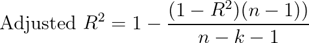

# 机器学习中的性能度量—第 2 部分:回归

> 原文：<https://towardsdatascience.com/performance-metrics-in-machine-learning-part-2-regression-c60608f3ef6a?source=collection_archive---------25----------------------->

## 为正确的任务使用正确的绩效指标

来源:[尼古拉斯·霍伊泽](https://unsplash.com/@nhoizey?utm_source=medium&utm_medium=referral)

在这个由三部分组成的系列文章的[上一篇](/performance-metrics-in-machine-learning-part-1-classification-6c6b8d8a8c92)中，我讲述了每个数据科学家在从事分类工作时应该知道的最常见的性能指标。

> 你可以在这里查看本系列[的前一部分。](/performance-metrics-in-machine-learning-part-1-classification-6c6b8d8a8c92)

在第二部分中，我将介绍最适用于回归任务的性能度量。这些是最常见的工具，能够有效地评估一个模型是否实际上性能良好，可以投入生产，或者它仍然需要一些微调。

# 回归

在深入了解性能指标之前，最好强调一些关键的介绍性概念。

## 错误

误差是一个非常直观的度量，因为它是一个广为人知的概念，所以不需要什么正式的定义。就机器学习性能而言，关键是要定义，当我们谈论误差时，我们特指实际目标值和预测值之间的差异，即“增量”。

刷新我们对上一篇文章的记忆:

> 在评估分类模型的性能时，两个概念是关键，即**实际结果**(通常称为' *y'* )和**预测结果**(通常称为' *ŷ'* )。
> 
> 例如，可以训练一个模型来预测一个人是否会患某种疾病。在这种情况下，它使用样本进行训练，例如一个人的数据，包含预测信息，如*年龄*、*性别*等。每个人都被贴上了一个标签，表明疾病是否会发展。在这种情况下，标签可以是疾病是否会发生( *y=1* )或不会发生( *y=0* )。
> 
> 机器学习模型旨在确保每次向其提供样本时，预测的结果都与真实的结果相对应。模型的预测值与真实值越一致，模型的性能就越高。这里提到了许多不同的评估模型性能的方法，但是一般来说，模型会犯错误，降低性能。

实际结果“y”和预测结果'ŷ'之间的差异越大，模型就越“偏离”现象的准确表现；值越接近，系统的性能越好。

## 均方误差(MSE) /均方偏差(MSD)

均方误差衡量误差平方的平均值。它基本上计算估计值和实际值之间的差异，平方这些结果，然后计算它们的平均值。

因为误差是平方的，所以 MSE 只能假设非负值。由于与大多数过程相关的固有随机性和噪声，MSE 通常为正且不为零。

像方差一样，MSE 的度量单位与被估计量的平方相同。

与方差类似，均方误差的一个主要缺点是对异常值不稳健。如果一个样本的*“y”*和相关误差远大于其他样本，则误差的平方会更大。这与 MSE 计算误差平均值的事实相结合，使得 MSE 容易出现异常值。

## 均方根误差(RMSE) /均方根偏差(RMSD)

与均方误差类似，RMSE 计算所有样本的均方误差的平均值，但此外，还计算结果的平方根，实际上就是 MSE 的平方根。

通过这样做，RMSE 提供了一个与目标变量相同单位的误差度量。例如，如果我们的目标 *y* 是明年以美元计算的销售额，RMSE 会给出以美元计算的误差，而 MSE 会以美元的平方计算，这就不太容易解释了。

## 平均绝对误差

平均绝对误差不取误差的平方。相反，它只是计算误差的绝对值，然后取这些值的平均值。

MAE 采用绝对值，因为我们对估计值和实际目标值的差异方向不感兴趣(估计值>实际值，反之亦然)，而是对绝对距离感兴趣。这也避免了在计算 MAE 时相互抵消的误差。

与 MSE 不同，MAE 对较大误差的惩罚并不比较小误差多，因为 MAE 的公式并不将平方应用于误差。

另一个优点是 MAE 不平方单位，类似于 RMSE，使结果更容易解释。

## 平均绝对百分比误差(MAPE)

平均绝对百分比误差以百分比形式衡量实际值和预测值之间的误差。它通过类似于 MAE 的方法计算它，但是也用它除以实际值，将结果表示为百分比。

通过将误差表示为百分比，我们可以更好地了解我们的预测相对而言有多差。例如，如果我们要预测下一年的支出，50 美元的平均误差可能是一个相对好或坏的近似值。

例如，如果 50 美元的误差是相对于 100 万美元的实际支出而言的，我们可以有把握地说这个预测相当不错。相反，如果错误是在 60 美元的成本预测上，那么它将与实际值相差甚远。

相对而言，100 万美元预测的 50 美元误差是 0.005%的误差。如果这个误差是在 60 美元的预测上产生的，这将意味着误差是预测值的 83%(基本上导致 10 美元到 110 美元的范围，几乎达到实际值的两倍)。

在这种情况下，使用 MAPE 可以更准确地表示相对于绝对值的误差。

## R 的平方(R ) /决定系数

R 的平方(R)代表由自变量 *X* 解释的因变量 *y* 的方差的比例。r 解释了一个变量的方差在多大程度上解释了第二个变量的方差。因此，如果模型的 R 是 0.75，那么大约 75%的观察到的变化可以用模型的特征来解释。

r 的计算方法是用 1 减去残差平方和除以总平方和。

r 将所选模型的拟合度与作为基线的水平线的拟合度进行比较。如果选择的模型比水平线拟合得更差，则𝑅为负。因为𝑅公式，即使涉及到“平方”，它也可以有负值，而不违反任何数学规则。只有当模型不遵循数据的趋势，并且比水平线拟合得更差时，𝑅才是负的。

R 的缺点之一是模型中添加的功能越多，R 增加得越多。即使添加到模型中的特征本身没有预测性，也会发生这种情况。

## 调整后的 R 平方(R)

为此，引入了调整后的 R。它考虑了预测模型中使用的功能。这样，添加到模型中的预测特征越多，调整后的 R 就越高。然而，添加到模型中的“无用”特征越多，调整后的 R 值就越低，这与 R 的情况不同。

因此，调整后的 R 总是小于或等于 R 值。

其中 *n* 是数据点的数量，而 *k* 是模型中特征的数量。

## 使用哪些指标？

总的来说，报告误差度量(如 RMSE)和 R 度量通常很重要。这是因为 R 表示模型中的特征 *X* 和目标变量 *y* 之间的关系。相反，误差度量表示数据点相对于回归拟合的分散程度。例如，报告调整后的 R 和 RMSE，可以更好地将模型与其他基准进行比较。

# 摘要

在浏览了[前一篇文章](/performance-metrics-in-machine-learning-part-1-classification-6c6b8d8a8c92)中的[分类性能指标](/performance-metrics-in-machine-learning-part-1-classification-6c6b8d8a8c92)之后，我们检查了回归指标。

我们首先强调了错误的含义，然后特别关注每个数据科学家都应该知道的最常见的指标。

**误差度量**

*   均方误差(mean square error)
*   均方根误差
*   平均绝对误差
*   multidimensional assessment of philosophy of education 教育哲学的多维评价

**R 指标**

*   稀有
*   调整后 R

查看关于性能指标的其他文章，例如:

*   Neptune AI 的"[机器学习中的性能指标](http://neptune.ai/blog/performance-metrics-in-machine-learning-complete-guide)"

*想看更多这样的文章，关注我的*[*Twitter*](https://twitter.com/jayzuccarelli)*，*[*LinkedIn*](https://www.linkedin.com/in/ezuccarelli)*或者我的* [*网站*](https://eugeniozuccarelli.com/) *。*