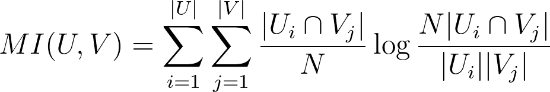

# 机器学习中的性能度量—第 3 部分:聚类

> 原文：<https://towardsdatascience.com/performance-metrics-in-machine-learning-part-3-clustering-d69550662dc6?source=collection_archive---------1----------------------->

## 为正确的任务使用正确的绩效指标


来源:[弗洛里安·施梅兹](https://unsplash.com/@floschmaezz?utm_source=medium&utm_medium=referral)

在本系列的前两部分中，我们探讨了用于评估机器学习模型的主要性能指标类型。这些涵盖了两个主要类型的 ML 任务，分类和回归。虽然这种类型的任务构成了大多数常见的应用程序，但是还存在另一个关键类别:集群。

要阅读本系列的前两部分，请访问以下链接:

</performance-metrics-in-machine-learning-part-1-classification-6c6b8d8a8c92> [## 机器学习中的性能度量第 1 部分:分类

towardsdatascience.com](/performance-metrics-in-machine-learning-part-1-classification-6c6b8d8a8c92) </performance-metrics-in-machine-learning-part-2-regression-c60608f3ef6a>  

虽然分类和回归任务形成了所谓的监督学习，但聚类形成了大多数非监督学习任务。这两个宏观领域的区别在于使用的数据类型。在监督学习中，样本用分类标签(分类)或数值(回归)来标记，而在非监督学习中，样本不被标记，这使得执行和评估成为相对复杂的任务。

正确测量聚类算法的性能是关键。这一点尤其正确，因为经常需要对集群进行手动和定性检查，以确定结果是否有意义。

在本系列的第三部分中，我们将讨论用于评估聚类算法性能的主要度量标准，严格地说是一组度量标准。

# 使聚集

## 剪影分数

轮廓分数和轮廓图用于测量聚类之间的分离距离。它显示了聚类中的每个点与相邻聚类中的点的接近程度。这种度量的范围是[-1，1]，是直观检查类内相似性和类间差异的重要工具。

使用每个样本的平均聚类内距离(`i`)和平均最近聚类距离(`n`)来计算轮廓得分。样本的轮廓系数是`(n - i) / max(i, n)`。

`n`是每个样本和该样本不属于的最近聚类之间的距离，而`i`是每个聚类内的平均距离。

典型的轮廓图在 y 轴上表示聚类标签，而在 x 轴上表示实际的轮廓分数。轮廓的大小/厚度也与该聚类内的样本数量成比例。


轮廓图示例。在 y 轴上，每个值代表一个聚类，而 x 轴代表轮廓系数/得分。

轮廓系数越高(越接近+1)，聚类样本离相邻聚类样本越远。值为 0 表示样本位于或非常接近两个相邻聚类之间的判定边界。相反，负值表示这些样本可能被分配到了错误的聚类。平均剪影系数，我们可以得到一个全局剪影分数，它可以用来描述整个群体的表现与一个单一的值。

让我们通过观察每种配置的性能来了解轮廓图如何帮助我们找到最佳的集群数量:

使用“K=2”，意味着两个聚类来分离群体，我们实现了 0.70 的平均轮廓分数。


将聚类数增加到三个，平均轮廓分数会下降一点。


随着集群数量的增加，也会发生同样的情况。还可以注意到，轮廓的厚度随着聚类数量的增加而不断减小，因为每个聚类中的样本较少。

总体而言，平均轮廓得分为:

```
For n_clusters = 2 The average silhouette_score is : 0.70
For n_clusters = 3 The average silhouette_score is : 0.59
For n_clusters = 4 The average silhouette_score is : 0.65
For n_clusters = 5 The average silhouette_score is : 0.56
For n_clusters = 6 The average silhouette_score is : 0.45
```

在计算了 K=6 的每个可能配置的轮廓分数之后，我们可以看到，根据该度量，最佳的聚类数目是两个，并且聚类数目越多，性能变得越差。

要在 Python 中计算剪影分数，只需使用 Sklearn 和 do:

```
sklearn.metrics.**silhouette_score**(*X*, *labels*, ***, *metric='euclidean'*, *sample_size=None*, *random_state=None*, ***kwds*)
```

该函数将以下内容作为输入:

*   *X* :样本之间成对距离的数组，或者特征数组，如果参数“预计算”设置为 False。
*   *标签*:一组标签，代表每个样本被分配到的标签。

## 兰德指数

另一个常用的指标是兰德指数。它通过考虑所有样本对并对在预测和真实聚类中分配到相同或不同聚类中的样本对进行计数来计算两个聚类之间的相似性度量。

兰德指数的公式是:


RI 的范围从 0 到 1，完全匹配。

Rand Index 的唯一缺点是，它假设我们可以找到地面真实聚类标签，并使用它们来比较我们模型的性能，因此对于纯无监督学习任务，它远不如剪影分数有用。

要计算兰德指数:

```
sklearn.metrics.**rand_score**(*labels_true*, *labels_pred*)
```

## 调整后的兰德指数

随机调整的兰德指数。

Rand 索引通过考虑所有样本对并对在预测聚类和真实聚类中分配到相同或不同聚类中的样本对进行计数来计算两个聚类之间的相似性度量。

然后，使用以下方案将原始 RI 分数“根据机会调整”为 ARI 分数:


类似于 RI，调整后的 Rand 指数的范围是从 0 到 1，0 相当于随机标记，1 相当于聚类是相同的。

与 RI 类似，要计算 ARI:

```
sklearn.metrics.**adjusted_mutual_info_score**(*labels_true*, *labels_pred*, ***, *average_method='arithmetic'*)
```

## 交互信息

互信息是另一种常用于评估聚类算法性能的度量。它是对相同数据的两个标签之间的相似性的度量。其中|Ui|是聚类 Ui 中样本的数量，并且|Vj|是聚类 Vj 中样本的数量，聚类 U 和 V 之间的互信息被给出为:



与 Rand 指数类似，这一指标的一个主要缺点是需要事先知道分布的基本事实标签。这在现实生活中几乎是不可能的。

使用 Sklearn:

```
sklearn.metrics.**mutual_info_score**(*labels_true*, *labels_pred*, ***, *contingency=None*)
```

## 卡林斯基-哈拉巴斯指数

卡林斯基-哈拉巴斯指数也被称为方差比标准。

分数被定义为组内离差和组间离差之间的比率。C-H 指数是评估聚类算法性能的一种很好的方法，因为它不需要关于基本事实标签的信息。

指数越高，性能越好。

公式是:


其中 tr(Bk)是组间离差矩阵的迹线，tr(Wk)是组内离差矩阵的迹线，定义如下:


用 Python 来计算:

```
sklearn.metrics.**calinski_harabasz_score**(*X*, *labels*)
```

## 戴维斯-波尔丁指数

Davies-Bouldin 指数被定义为每个聚类与其最相似的聚类的平均相似性度量。相似性是类内距离与类间距离的比率。这样，距离更远且分散程度更低的聚类将导致更好的分数。

最低分数为零，与大多数性能指标不同，值越低，聚类性能越好。

类似于剪影评分，D-B 指数不需要地面实况标签的先验知识，但是在公式方面比剪影评分具有更简单的实现。

```
sklearn.metrics.**davies_bouldin_score**(*X*, *labels*)
```

# 摘要

总之，在本系列的第三部分中，我们分析了集群性能指标，特别关注:

*   剪影分数
*   兰德指数
*   调整后的兰德指数
*   交互信息
*   卡林斯基-哈拉巴斯指数
*   戴维斯-波尔丁指数

*要阅读更多类似的文章，请关注我的* [*Twitter*](https://twitter.com/jayzuccarelli) *，*[*LinkedIn*](https://www.linkedin.com/in/ezuccarelli)*或我的* [*网站*](https://eugeniozuccarelli.com/) *。*