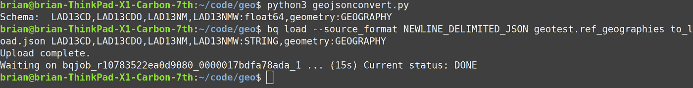
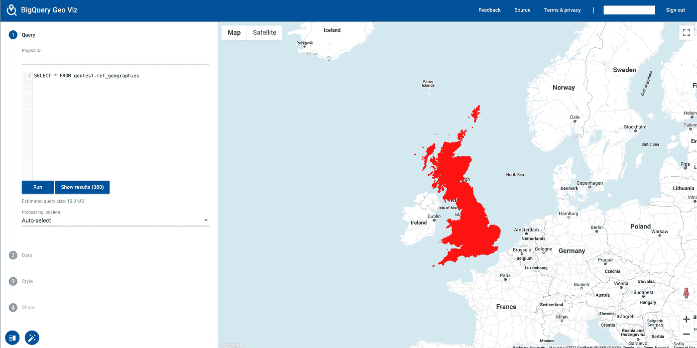
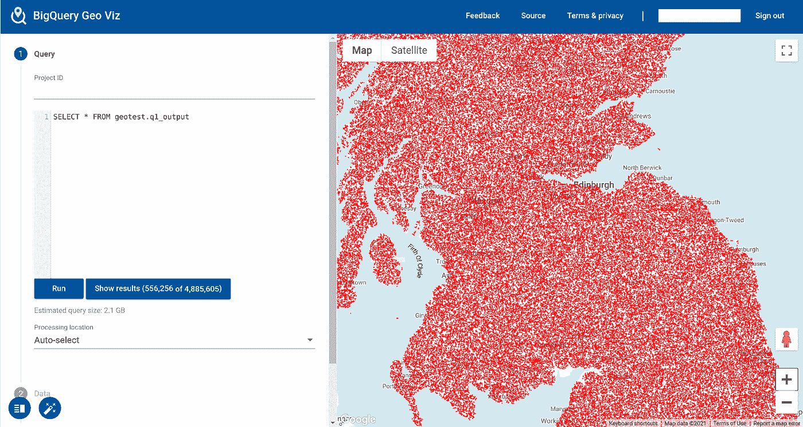
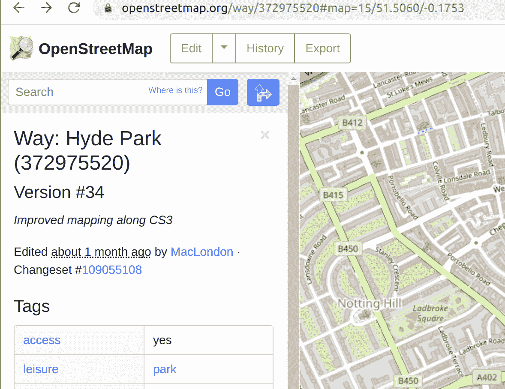
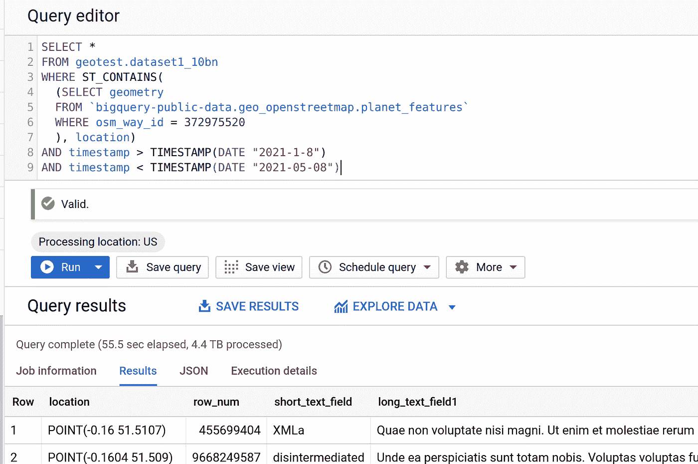
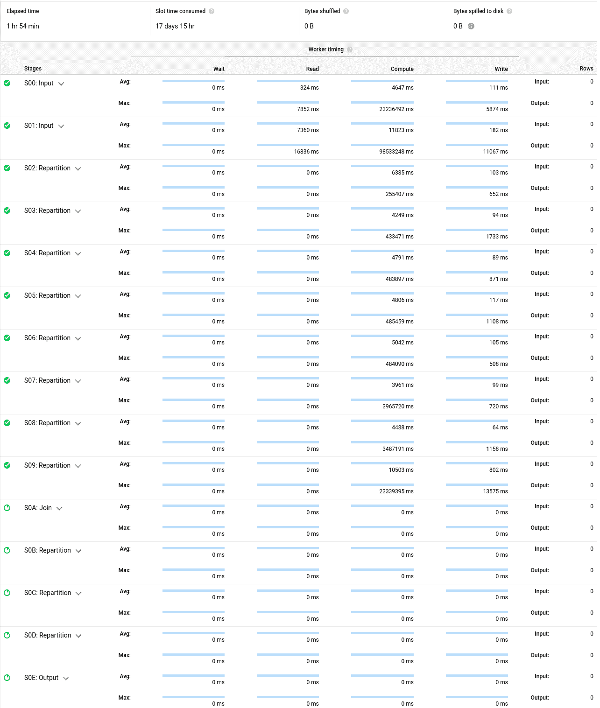
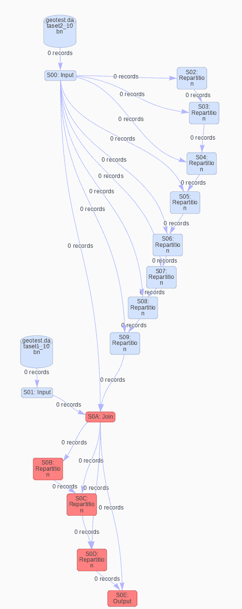
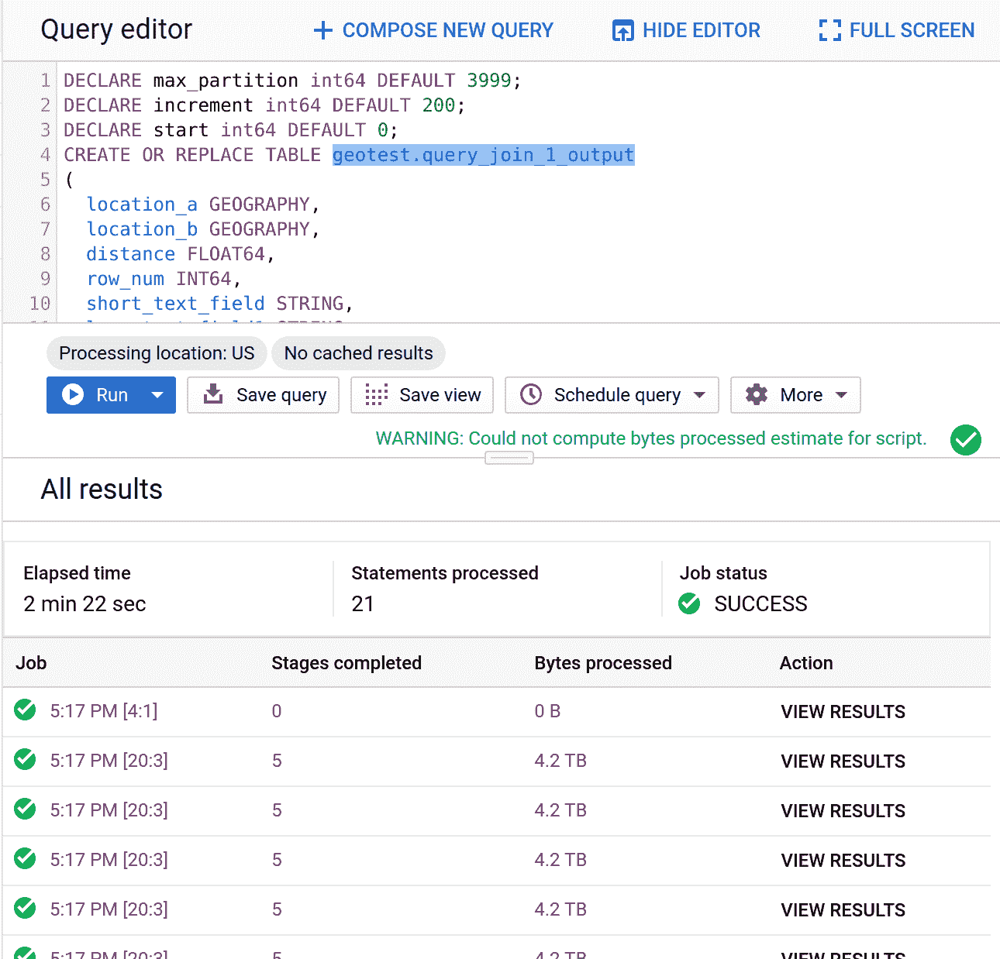
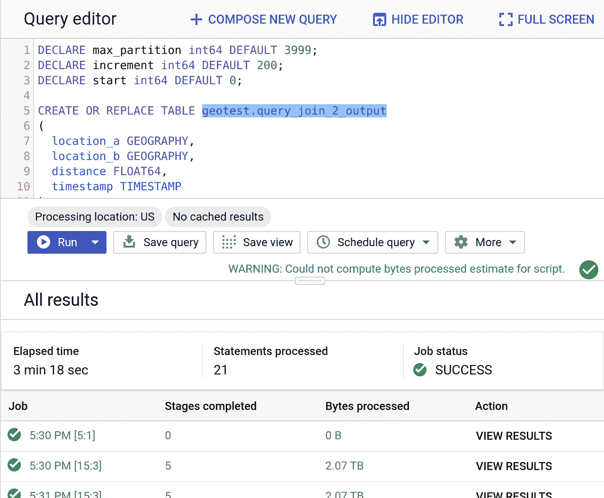

# 性能测试 Google BigQuery 地理空间——技术深度探索

> 原文：<https://towardsdatascience.com/performance-testing-google-bigquery-gis-a-technical-deep-dive-4e8fbc21e998?source=collection_archive---------11----------------------->

## [行业笔记](https://towardsdatascience.com/tagged/notes-from-industry)

# 介绍

数据库性能是一件棘手的事情。当比较不同的技术并尝试选择一种时，有很多因素在起作用。成本、基础设施管理、生态系统、用户体验以及许多其他决策因素都在其中发挥作用。性能变得困难，因为每种技术都有许多不同的旋钮，可以用来调整特定任务的性能。对于地理空间工作负载，我们想尝试找到一些我们可以用来进行性能基准测试的东西，我们还想看看我们是否可以用最少的性能调优工作来做到这一点，并看看效果如何。这篇文章详细介绍了关于如何设置环境的技术信息，我们用来生成测试数据的查询，以及我们用来测试性能的查询。如果你想看统计摘要和动机描述，请参考我在[关于这个话题的主帖](https://sada.com/insights/blog/overcoming-large-scale-geospatial-analysis-using-google-bigquery-gis/)。

作为参考，我们使用的基准测试基于[“地理空间大数据基准测试技术”白皮书](https://www.reply.com/en/topics/big-data-and-analytics/benchmarking-technologies-with-geospatial)，我们将完全在 BigQuery 内部执行数据集生成和运行基准查询。作为参考，我们只处理数据集 1、2 和 3，并且只执行简单、复杂和连接查询。白皮书中的详细信息和结果在第 44 页到第 56 页的“技术比较”部分。我们将跳过字符串处理部分，因为有许多[教程](https://blog.gdeltproject.org/google-bigquery-gkg-2-0-sample-queries/)演示了 BigQuery 在这方面的能力。

此外，还要感谢谷歌的 Bhavi Patel 帮助调试和优化了一些查询。

# 预订和空位

如果你计划在你的谷歌云项目中运行这个，请注意这将会产生费用。了解 BigQuery 是如何收费的，以及您可以使用哪些选项，这一点很重要。BigQuery 使用一种称为插槽的机制进行分析。BigQuery 的[文档](https://cloud.google.com/bigquery/docs/slots)很好地概述了插槽如何工作，以及它如何影响计算性能。对于数据分析，大多数项目通常默认采用[按需定价](https://cloud.google.com/bigquery/pricing#on_demand_pricing)，即每扫描 1tb 数据只收取费用。BigQuery 还允许您通过年度、月度和每分钟级别的预留来[预留固定数量的槽位](https://cloud.google.com/bigquery/docs/reservations-intro)(每分钟预留通常被称为“灵活槽位”)。值得检查您的项目，以了解您当前使用的计费机制(您可能能够在 BigQuery 控制台的[容量管理部分查看预订分配)，但值得与您的 Google Cloud 管理员核实，以了解您的组织是否有您当前可能被分配的现有预订。出于测试目的，本文中的所有查询都是使用 2000 个 Flex 插槽执行的。](https://console.cloud.google.com/bigquery/admin/reservations/capacity-commitments)

# 数据生成

作为测试的一部分，我们希望测试 BigQuery 在大规模数据生成方面的能力。使用[这篇文章](https://medium.com/google-cloud/yet-another-way-to-generate-fake-datasets-in-bigquery-93ee87c1008f)，我们发现我们可以利用 [faker.js](https://github.com/marak/Faker.js/) 中的[biqquery JavaScript UDF](https://cloud.google.com/bigquery/docs/reference/standard-sql/user-defined-functions#javascript-udf-structure)来生成假数据。这符合我们的需要，因为 faker.js 似乎也可以生成经度和纬度坐标。所有的查询大部分都是即插即用的，但是一定要先阅读[关于使用 faker.js 和 BigQuery](https://medium.com/google-cloud/yet-another-way-to-generate-fake-datasets-in-bigquery-93ee87c1008f) 的教程，并相应地用你的文件的位置替换云存储桶 URI。

本教程使用了一个名为`geotest`的数据集，所以如果您想要复制和粘贴查询，那么一定要在您的项目中创建它。如果没有，请确保相应地更改数据集名称。

## 数据集 1

以下是针对数据集 1 描述的结构:

*   **位置:**随机点，有效纬度长，例如“54.22312.234234”
*   **Short_text_field:** 单个随机单词+可选数字，如“Dog456”、“3Cat”、“Cow”
*   **Long_text_field_1:** 多个不同的随机单词(10-200 个单词)和标点符号，例如“狗猫鱼牛马猪…#”
*   **Long_text_field_2:** Multiple, varying random words (10–200 words) and punctuation in a random character set (e.g. “狗; 猫”)
*   **Security_Tag:** 从“高”、“中”&“低”中随机挑选
*   **数值 _ 字段 _1:** 随机整数，如“45”
*   **数值 _ 字段 _2:** 随机浮点数，如“4.45646”
*   **时间戳:**最近 10 年的随机时间，如“2007–04–05t 12:00:01”

我们偏离的一列是`long_test_field_2`,因为我们跳过了字符串处理测试，所以它被确定为非关键的随机字符集，所以所有文本都是 us-EN。

第一个测试是为 100 亿行创建种子表。

```
DECLARE desired_rows INT64 DEFAULT 10000000000;CALL geotest.generate_rows(‘geotest.row_seq_10bn’, desired_rows);ASSERT (SELECT MAX(row_num) FROM geotest.row_seq_10bn) = desired_rows 
  AS ‘max row value does not match desired rows’;
ASSERT (SELECT COUNT(*) FROM geotest.row_seq_10bn) = desired_rows
  AS ‘row count does not match desired rows’;
ASSERT NOT EXISTS(
  SELECT row_num,count(*) as count
  FROM geotest.row_seq_10bn
  GROUP BY row_num
  HAVING count > 1)
  AS ‘row_num must not be reused’;
```

这花了我们 5 分 04 秒的时间。

接下来，我们将运行以下查询来生成数据集。

```
CREATE TEMP FUNCTION entity(seed INT64)
RETURNS STRUCT<longitude NUMERIC, latitude NUMERIC, short_text_field STRING, long_text_field1 STRING, long_text_field2 STRING, security_tag STRING, numerical_field_1 NUMERIC, numerical_field_2 FLOAT64, timestamp TIMESTAMP>
LANGUAGE js
AS """
  var f = getFaker()
  f.seed(Number(seed))
  var t = {};t.longitude           = f.address.longitude();
  t.latitude            = f.address.latitude();
  t.short_text_field    = f.random.word() + f.random.alphaNumeric();
  t.long_text_field1    = f.lorem.sentences();
  t.long_text_field2    = f.lorem.sentences();

  var security_tag_temp = f.random.number() % 3;
  if (security_tag_temp = 0) {
    t.security_tag = "low"
  }
  else if (security_tag_temp = 1) {
    t.security_tag = "medium";
  }
  else {
    t.security_tag = "high";
  }

  t.numerical_field_1   = f.random.number();
  t.numerical_field_2   = f.random.number() * 1.3627;
  t.timestamp           = f.date.past();return t;
"""
OPTIONS (
    library=["gs://path/to/your/faker.js"]
);CREATE OR REPLACE TABLE geotest.dataset1_10bn AS (
  SELECT row_num, entity(row_num).*
  FROM geotest.row_seq_10bn
  where row_num <= 10000000000
);CREATE OR REPLACE TABLE
  geotest.dataset1_10bn AS
SELECT
  ST_GeogPoint(longitude,
    latitude) AS location,
  *  
FROM
  geotest.dataset1_10bn;
```

这花了我们 1 小时 40 分钟跑完。

这从创建一个临时函数开始，该函数概述了我们想要的随机生成的数据模式。然后创建一个新表，该表使用该结构创建 100 亿行，并将每一行的编号作为种子值。最后，我们用地理点类型替换纬度和经度列。

## 数据集 2

以下是数据集 2 所需的结构:

*   **位置**:随机点，有效纬度长，如“54.22313 12.234234”
*   **Short_text_field** :单个随机单词+可选数字，如“Dog456”、“3Cat”、“Cow”

因为数据集 2 需要一千万行，所以我们想要生成一个新的种子表。

```
DECLARE desired_rows INT64 DEFAULT 10000000;CALL geotest.generate_rows('geotest.row_seq_10m', desired_rows);ASSERT (SELECT MAX(row_num) FROM geotest.row_seq_10m) = desired_rows 
  AS 'max row value does not match desired rows';
ASSERT (SELECT COUNT(*) FROM geotest.row_seq_10m) = desired_rows 
  AS 'row count does not match desired rows';
ASSERT NOT EXISTS(
    SELECT row_num, 
      count(*) as count 
    FROM geotest.row_seq_10m
    GROUP BY row_num 
    HAVING count > 1) 
  AS 'row_num must not be reused';
```

这花了我们 35 分钟跑完。与数据集 1 类似，我们可以用同样的方式使用 faker.js 来生成我们需要的数据。

```
CREATE TEMP FUNCTION entity(seed INT64)
RETURNS STRUCT<longitude NUMERIC, latitude NUMERIC, short_text_field STRING>
LANGUAGE js
AS """
  var f = getFaker()
  f.seed(Number(seed))
  var t = {};t.longitude           = f.address.longitude();
  t.latitude            = f.address.latitude();
  t.short_text_field    = f.random.word() + f.random.alphaNumeric();

  return t;
"""
OPTIONS (
    library=["gs://path/to/your/faker.js"]
);CREATE OR REPLACE TABLE geotest.dataset2_10m AS (
  SELECT row_num, entity(row_num).*
  FROM geotest.row_seq_10m
  where row_num <= 10000000
);CREATE OR REPLACE TABLE
  geotest.dataset2_10m AS
SELECT
  ST_GeogPoint(longitude,
    latitude) AS location,
  *  
FROM
  geotest.dataset2_10m;
```

这花了我们 3m34s 跑。

## 数据集 3

以下是数据集 3 的结构:

*   **位置:**随机生成的椭圆，随机长轴为 0.1–10 公里，随机短轴为 0.1–2 公里，方向随机。
*   **时间戳:**最近 10 年的随机时间，如“2007–04–05t 12:00:01”

这样做的总体思路是生成一个由 16 个随机地理点组成的数组，然后围绕它创建一个[凸包](https://cloud.google.com/bigquery/docs/reference/standard-sql/geography_functions#st_convexhull)来创建我们的多边形。当我们创建某些点的乘数时，还有一些辅助函数来修剪坐标，并希望确保它不会超出地球坐标边界的界限。

```
CREATE TEMP FUNCTION entity(seed INT64)
RETURNS STRUCT<longitude NUMERIC, latitude NUMERIC, timestamp TIMESTAMP>
LANGUAGE js
AS """
  var f = getFaker()
  f.seed(Number(seed))
  var t = {};t.longitude           = f.address.longitude();
  t.latitude            = f.address.latitude();
  t.timestamp           = f.date.past();return t;
"""
OPTIONS (
    library=["gs://bq-suk/bq_fake.js"]
);CREATE TEMP FUNCTION
  trim_latitude(latitude FLOAT64) AS ( GREATEST(-90, LEAST(90, latitude)) );CREATE TEMP FUNCTION
  trim_longitude(longitude FLOAT64) AS( GREATEST(-180, LEAST(180, longitude)) );CREATE TEMP FUNCTION
  gen_ellipse(longitude FLOAT64,
    latitude FLOAT64) AS ( (
    SELECT
      ST_CONVEXHULL(ST_UNION_AGG(ST_GEOGPOINT(trim_longitude(longitude + RAND() * 0.05),
            trim_latitude(latitude + RAND() * 0.05))))
    FROM UNNEST(GENERATE_ARRAY(1,16)) ));CREATE OR REPLACE TABLE geotest.dataset3_10bn AS (
  SELECT row_num,gen_ellipse(longitude,latitude) as location,timestamp FROM
  (SELECT row_num, entity(row_num).*
  FROM geotest.row_seq_10bn
  where row_num <= 10000000000)
);
```

这花了我们 1 小时 17 分钟来处理。

# 数据查询

我们现在将深入研究每个查询，分解我们如何解释它，与 BigQuery 兼容的查询，以及它所用的时间。

## 数据集 1-查询 1

白皮书中的第一条是:

```
select * from dataset1 where dataset1.geo is within bbox1
```

根据该论文，“数据集 1 查询 1 涉及返回英国大小的边界框 1 内的所有点。”

很好，那我们就这么做吧。让我们转到[这里](https://github.com/martinjc/UK-GeoJSON/)获取英国的 GeoJSON 文件，并将该文件下载到您的本地机器上。这些是从国家统计局[整理出来的文件，已经为我们转换成 GeoJSON(大多数源文件是 Esri Shapefiles)。我们用于英国边界的具体文件是](https://www.ons.gov.uk/)[这里是](https://github.com/martinjc/UK-GeoJSON/blob/master/json/administrative/gb/lad.json)。然后，我们将使用解析和加载 GeoJSON 文件的指南[来处理和加载我们的文件。Python 代码应该可以正常工作，只需确保更改输入文件名以匹配我们下载的内容。](https://medium.com/google-cloud/how-to-load-geojson-files-into-bigquery-gis-9dc009802fb4)

还要注意，Python 脚本可能会给出不正确的数据类型推断。在这里运行它猜测大多数列是 FLOAT64，而它们应该是`STRING`。只需在运行指南中的`bq load`命令时进行更改。



作者图片

将一个简单的`select *`放入 [BigQuery Geoviz](https://cloud.google.com/bigquery/docs/geospatial-visualize#geo_viz) 告诉我们我们在正确的轨道上。



作者图片

这产生了一个`MULTIPOLYGON`对象，我们可以用它来进行比较。现在，让我们创建一个创建英国边界的工作表。

```
CREATE OR REPLACE TABLE geotest.geo_uk_boundaries AS (
  SELECT ST_UNION(ARRAY_AGG(geometry)) AS uk_outline_geom
  FROM geotest.ref_geographies
)
```

然后，我们可以使用它来创建我们的查询:

```
SELECT *
FROM geotest.dataset1_10bn
WHERE ST_CONTAINS((SELECT uk_outline_geom FROM geotest.geo_uk_boundaries), location)
```

让我们首先尝试使用按需计费来运行它。请注意，因为我们预计生成的数据集会很大，所以使用了目标表。运行时间为 42.7 秒，结果为 4，885，605 行。看起来我们所有的点都在右边界。



作者图片

## 数据集 1-查询 2

根据白皮书，这里是第二个查询:

```
select * from dataset1 where dataset1.geo is within bbox2
```

在这种情况下，`bbox2`就是伦敦的海德公园。为此，OpenStreetMaps 数据集非常有用，因为它已经包含了大多数地标及其地理信息。

```
SELECT
  geometry
FROM
  `bigquery-public-data.geo_openstreetmap.planet_features`
WHERE
  osm_way_id = 372975520
```

看起来这是我们想要的正确边界。让我们将这一点写入我们的`WHERE`条款。

```
SELECT *
FROM geotest.dataset1_10bn
WHERE ST_CONTAINS(
  (SELECT geometry
  FROM `bigquery-public-data.geo_openstreetmap.planet_features`
  WHERE osm_way_id = 372975520), 
  location)
```

这个查询用了 29 秒完成，产生了 45 行。对输出进行快速地图检查显示，它们都在海德公园内。


作者图片

顺便说一句，如果你想在 OSM 寻找物品或地点，只需进入 [OSM 网页](https://www.openstreetmap.org/)，搜索你要找的东西，它会在结果中给你 OSM 身份证号码。



作者图片

## 数据集 1-查询 3

下面是第三个查询:

```
select * from Dataset 1 where Dataset 1.timestamp < time1 and Dataset 1.timestamp > time2
```

为了找到一个过滤时间，我们来看看这个数据集的最小和最大时间戳是多少:

```
SELECT max(timestamp) as max, min(timestamp) as min
FROM geotest.dataset1_10bn
```

我们发现它在`2021–09–08 23:49:22.194 UTC`和`2020–09–08 23:49:23.201 UTC`之间。因此，我们只需过滤该窗口前后大约四个月的时间。

```
SELECT *
FROM geotest.dataset1_10bn
WHERE timestamp > TIMESTAMP(DATE "2021-1-8")
AND timestamp < TIMESTAMP(DATE "2021-05-08")
```

这个跑了 2 分 05 秒。

## 数据集 1-查询 4

以下是基准查询:

```
select * from Dataset 1 where Dataset 1.geo is within bbox1 and Dataset 1.timestamp < time1 and Dataset 1.timestamp > time2
```

让我们使用查询 3 中的相同时间窗口，并向其添加边界框。

```
SELECT *
FROM geotest.dataset1_10bn
WHERE ST_CONTAINS((SELECT uk_outline_geom FROM geotest.geo_uk_boundaries), location)
AND timestamp > TIMESTAMP(DATE "2021-1-8")
AND timestamp < TIMESTAMP(DATE "2021-05-08")
```

这个用了 1 分 05 秒。

## 数据集 1-查询 5

以下是基准查询:

```
select * from Dataset 1 where Dataset 1.geo is within bbox2 and Dataset 1.timestamp < time1 and Dataset 1.timestamp > time2
```

为此，我们也将采用与查询 4 中相同的方法。

```
SELECT *
FROM geotest.dataset1_10bn
WHERE ST_CONTAINS(
  (SELECT geometry
  FROM `bigquery-public-data.geo_openstreetmap.planet_features`
  WHERE osm_way_id = 372975520
  ), location)
AND timestamp > TIMESTAMP(DATE "2021-1-8")
AND timestamp < TIMESTAMP(DATE "2021-05-08")
```

这运行了 25 秒，生成了 25 行。



作者图片

## 数据集 3-查询 1

根据基准测试，下面是我们需要运行的一般查询:

```
select * from dataset3 where dataset3.geo intersects bbox1
```

因此，从数据集 1 —查询 1，我们创建了英国边界对象，即`bbox1`。因此，让我们重新使用它，并查询数据集 3，看看有什么交集。

```
SELECT a.*
FROM geotest.dataset3_10bn a
JOIN geotest.geo_uk_boundaries b
ON ST_INTERSECTS(location, b.uk_outline_geom)
```

这在 35 秒内成功运行。

## 数据集 3-查询 2

以下是基准查询:

```
select * from dataset3 where dataset3.geo intersects bbox2
```

当我们在 BigQuery 中运行时，我们使用以下代码:

```
SELECT *
FROM geotest.dataset1_10bn
WHERE ST_CONTAINS(
  (SELECT geometry
  FROM `bigquery-public-data.geo_openstreetmap.planet_features`
  WHERE osm_way_id = 372975520), 
  location)
```

这个查询运行了 18 秒。

## 数据集 3-查询 3

在这里，我们将使用查询 1，但是也向它添加我们先前的时间边界窗口。以下是基准查询:

```
select * from dataset3 where dataset3.geo intersects bbox1 and dataset3.timestamp < time1 and dataset3.timestamp > time2
```

当我们在 BigQuery 中运行时，查询如下:

```
SELECT a.*
FROM geotest.dataset3_10bn a
JOIN geotest.geo_uk_boundaries b
ON ST_INTERSECTS(location, b.uk_outline_geom)
WHERE timestamp > TIMESTAMP(DATE "2021-1-8")
AND timestamp < TIMESTAMP(DATE "2021-05-08")
```

这花了 46 秒来运行。

## 数据集 3-查询 4

这也将为我们的海德公园数据集 3 查询添加时间边界。以下是基准查询:

```
select * from dataset3 where dataset3.geo intersects bbox2 and dataset3.timestamp < time1 and dataset3.timestamp > time2
```

在 BigQuery 中，它是这样的:

```
WITH hyde_park AS (
  SELECT geometry
  FROM `bigquery-public-data.geo_openstreetmap.planet_features`
  WHERE osm_way_id = 372975520
)
SELECT a.*
FROM geotest.dataset3_10bn a
JOIN hyde_park
ON ST_INTERSECTS(location, geometry)
WHERE timestamp > TIMESTAMP(DATE "2021-1-8")
AND timestamp < TIMESTAMP(DATE "2021-05-08")
```

这个跑了 16 秒。

## 数据集 1-查询 9

这里，我们在数据集内搜索特定点附近的所有点。以下是基准查询:

```
select * from dataset1 where dataset1.geo is within 10km of point1, order by distance to point1
```

由于我住在纽约市，我们将选择帝国大厦的坐标作为我们的搜索点。下面是我们将在 BigQuery 中运行的查询:

```
SELECT *, 
ST_DISTANCE(ST_GEOGPOINT(-73.98567458036479,40.748600441048104), location) distance
FROM geotest.dataset1_10bn
WHERE ST_DWITHIN(ST_GEOGPOINT(-73.98567458036479,40.748600441048104), location, 10000)
ORDER BY distance DESC
```

最后运行了 4 秒钟，生成了 5，116 行。

## 数据集 1-查询 10

这次我们只是改变排序字段。以下是基准查询:

```
select * from dataset 1 where dataset1.geo is within 10km of point1, order by timestamp
```

下面是 BigQuery 中的查询:

```
SELECT *
FROM geotest.dataset1_10bn
WHERE ST_DWITHIN(ST_GEOGPOINT(-73.98567458036479,40.748600441048104), location, 10000)
ORDER BY timestamp DESC
```

这也用了 4 秒钟，生成了 5，116 行。它与前一个非常相似，因为它只是切换了排序列。时差可以忽略不计。

## 数据集 3-查询 5

在这里，我们应用相同的子句搜索距离该点(在我们的例子中是帝国大厦)10 公里以内的所有地理位置，除了它与在数据集 3 中创建的多边形。以下是基准查询:

```
select * from dataset3 where dataset3.geo is within 10km of point1, order by closest distance to point1
```

当我们在 BigQuery 中编写这个代码时，它看起来像这样:

```
SELECT *,
ST_DISTANCE(ST_GEOGPOINT(-73.98567458036479,40.748600441048104), location) distance
FROM geotest.dataset3_10bn
WHERE ST_DWITHIN(ST_GEOGPOINT(-73.98567458036479,40.748600441048104), location, 10000)
ORDER BY distance DESC
```

这最终运行了 14 秒，并返回了 7，690 行数据。

## 数据集 3-查询 6

现在，我们正在做同样的事情，除了切换排序列。基准查询是:

```
select * from dataset3 where dataset3.geo is within 10km of point1, order by timestamp
```

当我们对 BigQuery 进行翻译时，我们得到:

```
SELECT *
FROM geotest.dataset3_10bn
WHERE ST_DWITHIN(ST_GEOGPOINT(-73.98567458036479,40.748600441048104), location, 10000)
ORDER BY timestamp DESC
```

这为我们提供了同样的 7，690 行数据，运行时间为 15 秒。

## 连接查询

对于最后一对查询，它要求我们将数据集 1 和 3 与数据集 2 连接起来，查找两个地理位置相距 10 公里以内的所有内容。两个基准查询是:

```
select * from dataset1 where dataset1.geo is within 10km of any point in dataset2.geo
```

和

```
select * from dataset3 where dataset3.geo is within 10km of any point in dataset2.geo
```

这是最后两个要测试的查询。

**连接查询 1**

为了做到这一点，我们基本上只想得到数据集 1 中的每个点，并找到数据集 2 中 10 公里内的所有点。由于它不断地将十亿行数据集中的每个对象与一千万个对象进行比较，这在计算上会变得很困难。然而，这个查询非常简单。

```
SELECT a.*
FROM geotest.dataset1_10bn a
JOIN geotest.dataset2_10m b
ON ST_DWITHIN(a.location, b.location, 10000)
```

运行了几个小时后，它仍在运行，不清楚什么时候会结束。它也进行了相当多的重新划分。



作者图片

在[大查询可视化工具](https://medium.com/google-cloud/visualising-bigquery-41bf6833b98)中查看，它看起来非常粗糙..



作者图片

所以一定有更好的方法来运行它。而且有！我们希望[这篇博客文章](https://medium.com/google-cloud/breaking-up-very-large-bigquery-jobs-ea1ccc720a7)能指导我们如何将查询分成更易管理的部分。这篇博文很好地解释了它是如何工作的，所以我们不会在这里讨论，但这里是我们运行的查询，以便让它与我们的查询一起工作。对于第一个数据集，生成新分区表的查询是:

```
CREATE OR REPLACE TABLE `geotest.dataset1_10bn_irp`
PARTITION BY RANGE_BUCKET(range_id, GENERATE_ARRAY(0, 3999, 1))
AS (
  SELECT *, 
      ABS(MOD(FARM_FINGERPRINT(CAST(row_num as STRING)), 4000)) range_id 
  FROM `geotest.dataset1_10bn`
)
```

这只花了 9m41s 跑。从这里，我们将我们试图运行的查询，重构为这种新的分解方式，这就是我们运行的结果:

```
DECLARE max_partition int64 DEFAULT 3999;
DECLARE increment int64 DEFAULT 200;
DECLARE start int64 DEFAULT 0;
CREATE OR REPLACE TABLE geotest.query_join_1_output
(
location_a GEOGRAPHY,
location_b GEOGRAPHY,
distance FLOAT64,
row_num INT64,
short_text_field STRING,
long_text_field1 STRING,
long_text_field2 STRING,
security_tag STRING,
numerical_field_1 NUMERIC,
numerical_field_2 FLOAT64,
timestamp TIMESTAMP
);
WHILE start <= max_partition DOINSERT INTO geotest.query_join_1_output
SELECT
a.location as location_a,
b.location as location_b,
ST_DISTANCE(a.location, b.location) as distance,
a.row_num,
a.short_text_field,
a.long_text_field1,
a.long_text_field2,
a.security_tag,
a.numerical_field_1,
a.numerical_field_2,
a.timestamp
FROM geotest.dataset1_10bn a
JOIN geotest.dataset2_10m b
ON
ST_DWITHIN(a.location, b.location, 10000)
WHERE
a.row_num between start and start + increment - 1;
SET start = start + increment;
END WHILE;
```

这稍微复杂一点，但另一方面，这最终在 2m22s 中运行！



作者图片

这比以前快得多，是分解大型查询的一种非常聪明的方式！

**连接查询 2**

我们将使用这个查询尝试一些类似的东西。没有分区的原始查询如下所示:

```
SELECT
  a.location AS location_a,
  b.location AS location_b,
  ST_DISTANCE(a.location,b.location) AS distance,
  a.timestamp
FROM geotest.dataset3_10bn_irp a
JOIN geotest.dataset2_10bn b
ON ST_DWITHIN(a.location,b.location,10000)
```

它遇到了与前一个查询相同的性能问题，作业必须在三个小时后停止。因此，让我们继续用分区重新创建表，与前一个表的创建方式完全一样:

```
CREATE OR REPLACE TABLE `geotest.dataset3_10bn_irp`
PARTITION BY RANGE_BUCKET(range_id, GENERATE_ARRAY(0, 3999, 1))
AS (
  SELECT *, 
      ABS(MOD(FARM_FINGERPRINT(CAST(row_num as STRING)), 4000)) range_id 
  FROM `geotest.dataset3_10bn`
)
```

这需要 8m38s 来创造。然后，我们使用分区表构造查询来计算结果。

```
DECLARE max_partition int64 DEFAULT 3999;
DECLARE increment int64 DEFAULT 200;
DECLARE start int64 DEFAULT 0;CREATE OR REPLACE TABLE geotest.query_join_2_output
(
location_a GEOGRAPHY,
location_b GEOGRAPHY,
distance FLOAT64,
timestamp TIMESTAMP
);WHILE start <= max_partition DOINSERT INTO geotest.query_join_2_output
SELECT
a.location as location_a,
b.location as location_b,
ST_DISTANCE(a.location, b.location) as distance,
a.timestamp
FROM geotest.dataset3_10bn_irp a
JOIN geotest.dataset2_10m b
ON
ST_DWITHIN(a.location, b.location, 10000)
WHERE
a.row_num between start and start + increment - 1;
SET start = start + increment;
END WHILE;
```

这只花了 3m18s 运行！



作者图片

# 那是一个包裹

希望这能让你更好地理解我们是如何生成数据的，以及我们是如何进行测试的。我们做了一些工作来提高连接查询的性能，但是在大多数情况下，我们几乎不需要任何优化工作就可以运行测试。通过组合 BigQuery 的各种功能，并利用平台是完全托管的这一事实，我们能够以最小的努力做一些我认为非常有趣的事情。

一如既往，如果您对代码有任何疑问、反馈或问题，请在评论中告诉我，如果您决定在其他数据技术上运行这些测试，我也很乐意听到这些测试的结果！查询愉快！