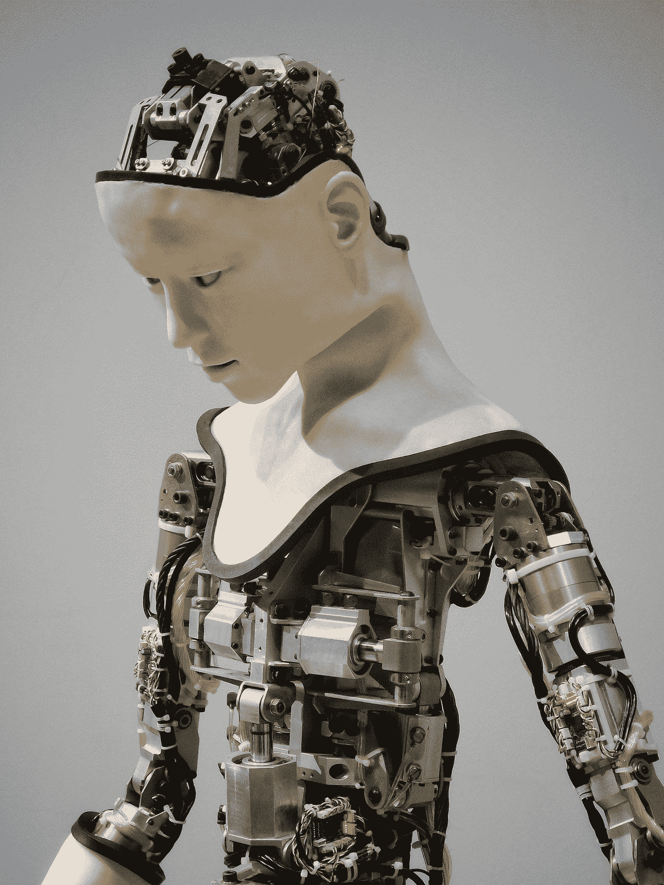

# 用一段代码执行计算机视觉和自然语言处理任务

> 原文：<https://towardsdatascience.com/performing-computer-vision-nlp-tasks-in-a-single-of-code-f7205f212d34?source=collection_archive---------35----------------------->

使用 PaddleHub 加载图像和文本相关数据的预训练深度学习模型



[附身摄影](https://unsplash.com/@possessedphotography?utm_source=medium&utm_medium=referral)在 [Unsplash](https://unsplash.com?utm_source=medium&utm_medium=referral) 上拍照

随着深度学习建模的出现，执行 NLP 和深度学习任务变得相对容易。有多个 Python 库可用于执行计算机视觉任务，如图像分割、图像检测等，NLP 相关问题也是如此。

从头开始创建模型可能会花费大量时间和精力，因为我们需要预处理数据并相应地训练模型，并且使用文本数据或图像数据训练模型通常会消耗大量时间。我们可以使用预先训练好的模型进行图像处理，如 VGG16、ImageNet 等，而不是从头开始创建模型。

使用预训练的模型需要一定的编程经验，尤其是在深度学习领域，因为我们需要创建自己的层或编写代码来使用预训练的模型层。如果我们可以直接使用这些预先训练好的模型进行预测，那不是很好吗？因此，即使是非程序员也可以使用这些模型并生成预测。

PaddleHub 是一个开源的 Python 库，在使用预先训练好的模型时，它具有多种功能。它提供了预训练模型的直接使用，这些模型不仅仅限于图像或文本，还可用于音频、视频和工业应用。它包含大约 300 多个预先训练好的模型，可以很容易地免费下载。它还支持多种平台，如 Linux、Windows、macOS 等。

PaddleHub 包含的一些主要预训练模型有:

a.文本识别

b.图像编辑和图像生成

c.人脸检测、对象检测和关键点检测

d.图像分割和图像分类

等等。

在本文中，我们将使用 PaddleHub 预训练模型进行人脸检测、关键点检测和 NLP 相关操作。

让我们开始吧…

# 安装所需的库

我们将从使用 pip 安装 PaddleHub 开始。下面给出的命令可以做到这一点。

```
!pip install --upgrade paddlepaddle
!pip install --upgrade paddlehub
```

# 导入所需的库

在这一步中，我们将导入所需的库和函数来加载预先训练好的模型，并相应地使用它们。

```
import paddlehub as hub
```

# 使用预先训练的模型

现在我们将开始使用不同类型的预训练模型进行预测。

1.  **人脸检测**

我们将使用人脸检测器模型进行人脸检测。您可以使用任何图像来生成预测。你只需要改变你使用的图像的路径。

```
module = hub.Module(name="ultra_light_fast_generic_face_detector_1mb_640")res = module.face_detection(
    paths = ["/content/IMG-20191210-WA0024.jpg"],
    visualization=True,
    output_dir='face_detection_output')
```


面部检测(来源:作者)

2.**关键点检测**

关键点检测可用于突出关键部分，例如，面部的关键部分是鼻子、耳朵等。

```
module = hub.Module(name="openpose_body_estimation")res = module.predict(
    img="/content/IMG-20191210-WA0024.jpg",
    visualization=True,
    save_path='keypoint_output')
```


关键点(来源:作者)

3.**词法分析**

词法分析或记号赋予器用于将字符序列转换成记号序列。

```
lac = hub.Module(name="lac")test_text = ["This article is in collaboration with Piyush Ingale."]
print(lac.lexical_analysis(texts = test_text))
```


词汇分析(来源:作者)

**4。情绪分析**

在这种情况下，我们试图找出文本数据是积极的，消极的，还是中性的。

```
senta = hub.Module(name="senta_bilstm")test_text = ["Everyone I met in life taught me something"]
print(senta.sentiment_classify(texts = test_text))
```


情感分析(来源:作者)

如果我们尝试制作上面讨论的所有这些模型，将会花费很多时间，但在这里，您看到了我们如何使用所有这些预训练的模型，并仅使用一行代码生成预测。这些是我们在这里探索的 Paddlehub 的一些模型。

继续使用不同的数据进行尝试，并使用本文中讨论的所有模型进行预测。如果您发现任何困难，请在回复部分告诉我。

本文是与[皮尤什·英加尔](https://medium.com/u/40808d551f5a?source=post_page-----f7205f212d34--------------------------------)合作完成的。

# 在你走之前

***感谢*** *的阅读！如果你想与我取得联系，请随时通过 hmix13@gmail.com 联系我或我的* [***LinkedIn 个人资料***](http://www.linkedin.com/in/himanshusharmads) *。可以查看我的*[***Github***](https://github.com/hmix13)**简介针对不同的数据科学项目和包教程。还有，随意探索* [***我的简介***](https://medium.com/@hmix13) *，阅读我写过的与数据科学相关的不同文章。**