# 通过记录链接和监督学习执行重复数据删除

> 原文：<https://towardsdatascience.com/performing-deduplication-with-record-linkage-and-supervised-learning-b01a66cc6882?source=collection_archive---------0----------------------->

## [实践教程](https://towardsdatascience.com/tagged/hands-on-tutorials)

## 用机器学习方法识别重复记录


由 [Valentino Funghi](https://unsplash.com/@iampatrickpilz?utm_source=medium&utm_medium=referral) 在 [Unsplash](https://unsplash.com?utm_source=medium&utm_medium=referral) 上拍摄的照片

## 介绍

大多数数据都是由人工记录的，而且通常没有经过审核，没有同步，仅仅是因为出现了诸如打字错误之类的错误。请想一想，您是否曾经填写过两次相同的表格，但地址略有不同？例如，您提交了如下图所示的表单:

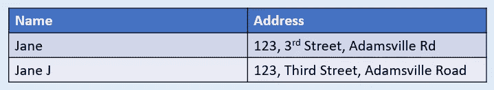

填写样本名称和地址详细信息(图片由作者提供)

请注意，这些细节实际上是指具有相同“地址”的同一个人“简”。许多组织都在处理这样的数据，它们清楚地显示是重复的，并且表示相同的实体，但是单词并不完全相等。因此，python 函数“drop_duplicates”将无法将这些记录识别为重复记录，因为单词并不完全匹配。所以解决这些乱七八糟的数据的办法就是执行**带记录链接的重复数据删除。**记录链接通过比较不同来源的记录来确定记录是否匹配并代表同一个实体*(个人/公司/企业)*。

在本文中，我们将探索使用记录链接和结合监督学习来分类重复和非重复记录。以下是我们将在本文中涉及的主题:

```
[**Table of Contents:**](http://xx) **
- What is Record Linkage? 
- Understand our Data Set
- Applying Record Linkage Process
(a) Preprocessing
(b) Indexing
(c) Comparison & Similarity
(d) Supervised Learning (Classification) 
- Conclusion**
```

## 什么是记录联动？

记录链接是指识别和链接与同一实体(人员、业务、产品等)相关的记录的方法。)在一个或多个数据源中。它搜索可能的重复记录并将它们链接在一起作为单个记录处理，这也使得避免数据冗余成为可能。

当唯一标识符变量存在于数据集中时，例如(标识号、散列码等)，链接相同实体的过程将是简单的。但是，在有些情况下，数据集中不存在唯一的标识符，因此我们需要识别出被复制的变量的良好候选对象，并将它们配对(例如:州、姓氏、出生日期、电话号码)——在执行步骤:索引时，我们会对此有更多的了解。

我们将使用 [Python 记录链接工具包](https://recordlinkage.readthedocs.io/en/latest/)库，它提供了执行记录链接和重复数据删除所需的工具和函数。记录链接工具包的安装和导入如下:

## 了解我们的数据集

对于本教程，我们将使用由 Febrl 项目(来源:[可自由扩展的生物医学记录链接](https://recordlinkage.readthedocs.io/en/latest/ref-datasets.html))生成的 Python 记录链接工具包下可用的[公共数据集。有四组数据可用，但我们将使用第二组数据——feb rl 2。让我们从子模块 *recordlinkage.datasets.* 导入数据集](https://recordlinkage.readthedocs.io/en/latest/ref-datasets.html)

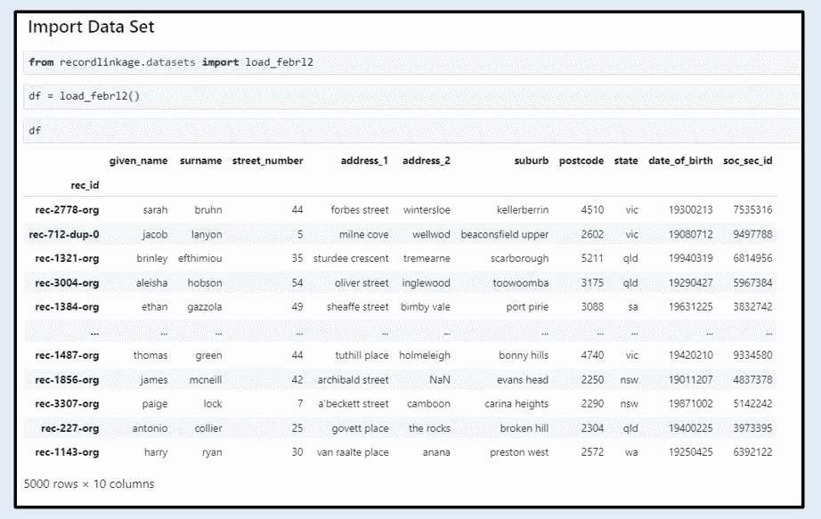

加载数据集— FEBRL 2(图片由作者提供)

数据集以“数据帧”的格式返回，我们可以看到这个数据集总共有 5000 条记录。根据 Febrl 的数据集来源，该表中有 4000 条原始记录和 1000 条重复记录。

让我们使用以下内容来更好地理解表中的数据类型:

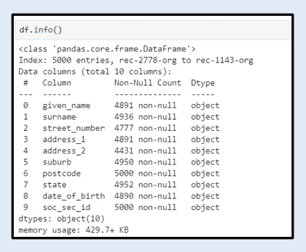

数据类型信息(作者图片)

根据上面的结果，我们的数据集中的列值具有相同的数据类型——“object”(也称为“String”)，并且都具有非空条件。

接下来，我们还应该使用以下函数对数据集的统计汇总进行基本检查:

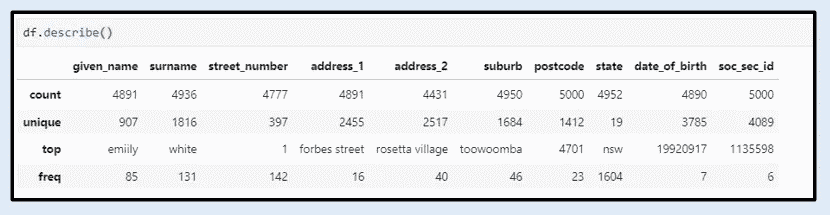

统计摘要(图片由作者提供)

从统计汇总结果中，我们可以很快看到姓氏 given_name 的唯一计数不是 5000，这表明同一个人在数据集中可能有多个记录，这些记录具有不同的地址/街道号/州等。

我们数据集中的重复记录示例如下所示:

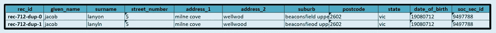

数据集的样本重复记录(作者图片)

请注意，从这一对被称为重复记录的样本记录来看，差异在于“姓氏”、“地址 _2”和“郊区”，只有几个字符的差异。我们的目标是识别并突出显示像这个样本这样的重复记录。

现在，我们已经对数据集有了基本的了解，让我们了解并应用记录链接过程来对数据集进行重复数据删除并正确分类。

## 应用记录链接流程

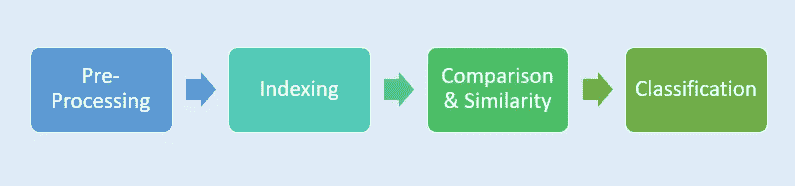

记录链接过程(图片由作者提供)

## **(a)预处理**

这一步很重要，因为将数据标准化为相同的格式将增加识别重复项的机会。根据数据中的值，预处理步骤可能包括:

*   小写/大写

这是文本预处理最简单也是最重要的一步，就是将你的文本数据集标准化为全部“小写”或“大写”。在下面的例子中，我们将数据集中的文本转换为大写。

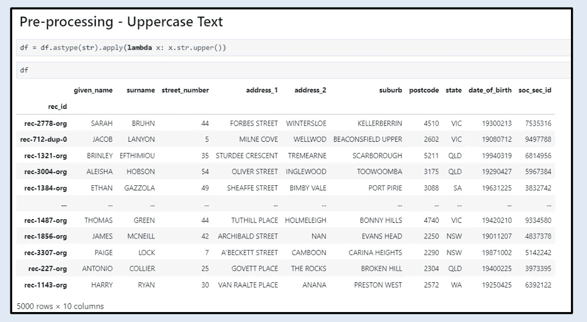

预处理:大写(图片由作者提供)

*   停用词移除

停用词是常见的词，被删除是为了给文本中更重要的信息提供更大的重要性。例如在一个完整的句子中，停用词有**、【the】、【a】、**等。对于公司名称，停用词可以是**、【公司】、【公司】、【有限公司】、**等。对于人名，停用词可以是**、【先生】、【夫人】、【女士】、【先生】等。对于地址，停用词可以是**、【街】、【地点】、【路】、**等。**

对于我们的数据集，没有要从名称中删除的停用词，但是我们可以从地址字段“address_1”中删除停用词。在下面的例子中，我们删除了数据集中常见的停用词。

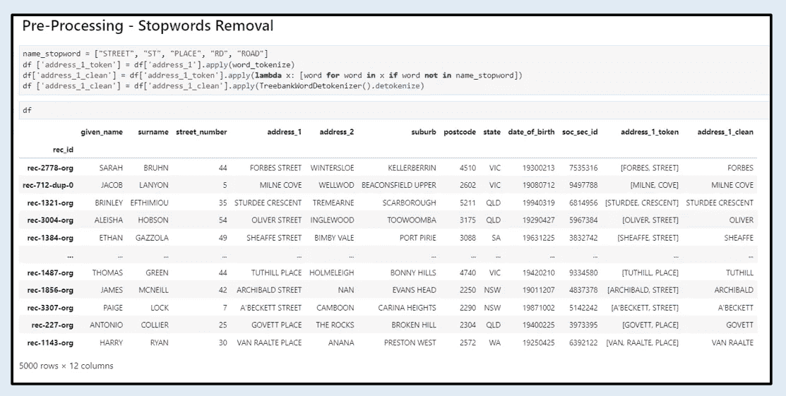

预处理:停用词移除(图片由作者提供)

*   邮政编码清理

邮政编码清理是通过删除可能包含的符号来完成的，如“-”、“+”或空格。*(通常，这种清理是在电话号码上完成的，但由于我们的数据集中没有电话号码，我们将对邮政编码应用类似的逻辑)*

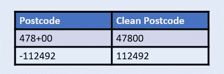

邮政编码清理示例(图片由作者提供)

下面的例子显示了对“邮政编码”的清理，其中只保留数字值。

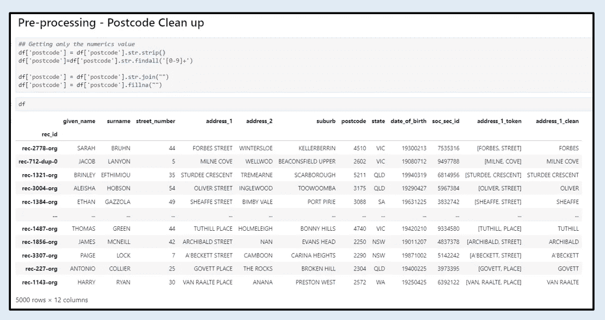

预处理:邮政编码清理(图片由作者提供)

*   删除无关符号

特殊符号无助于识别文本中的相似之处，应该清除。以下示例显示了为删除地址字段中不相关的符号而进行的清理。

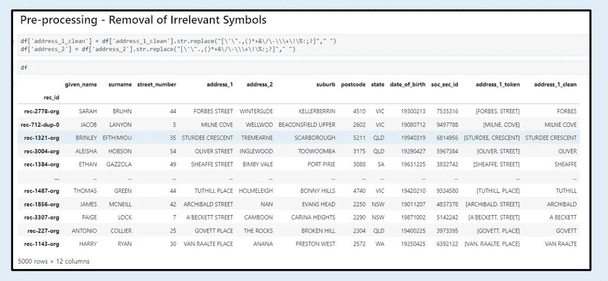

预处理:去除无关符号(图片由作者提供)

## **(b)步进**

既然我们的数据集已经过预处理并被认为是干净的数据集，我们将需要创建记录对(也称为候选链接)。创建记录对并计算相似性，以确定记录对是否被认为是匹配/重复的。 [Python 记录链接工具包](https://recordlinkage.readthedocs.io/en/latest/ref-index.html)提供了索引模块来创建记录配对，从而简化了流程。

有几种索引技术可用于记录链接，例如:

*   完整索引

基于数据集中记录对的所有可能组合创建完整索引。使用完全索引在数据量上有风险，因为记录的数量会以二次方的方式增加。例如，基于我们的 5000 条记录的数据集，使用完整索引总共创建了 12497500 对。


索引方法:完整(图片由作者提供)

*   阻塞

分块索引是完整索引的一个很好的替代方案，因为记录对是基于同一个块(具有公共值)生成的。通过基于特定列进行分块，可以大大减少记录对的数量。例如，通过阻塞“State”列，只有来自同一州的记录对相互链接，总共创建了 2768103 对记录，这也是与完整索引相比较少的记录。

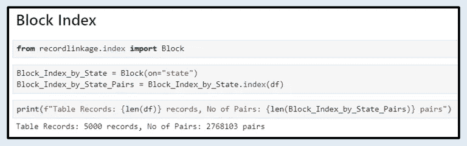

索引方法:块(图片由作者提供)

但是，请注意，拥有较少的记录对并不总是最好的方法，因为如果存在重复的记录，但“State”的值存在拼写错误，则可能会错过实际的匹配。

*   排序邻域

按排序邻域的索引是另一种产生具有邻近值的对的替代方法，例如，以下记录被配对在一起，因为在“姓氏”列中有相似性— *Laundon 和 Lanyon* 。

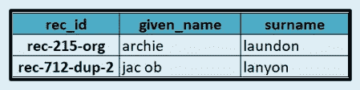

索引方法:排序邻域样本对(图片由作者提供)

使用排序邻域索引总共创建了 75034 对，与完整索引和块索引相比，这也是较少的记录。*(这也取决于所选列的值内容)*

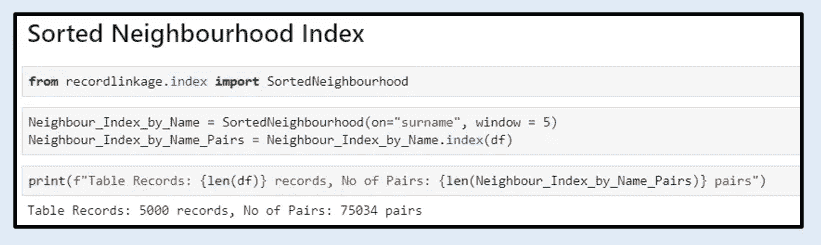

索引方法:排序邻域(图片由作者提供)

在本教程中，我们将结合两种方法对数据集进行索引，即“分块”索引和“排序邻域”索引。

**为什么我选择使用多种指数方法？**

*   使用“全索引”将为我们提供所有可能匹配的记录对，但将导致记录总数的巨大增长。
*   因此，通过“分块”或“排序邻域”使用索引能够解决记录总数大幅增长的问题。
*   然而，仅仅通过使用“分块”或“排序邻域”方法的索引，就有可能错过实际的匹配。那么，为什么不通过结合这两种方法来减少遗漏实际匹配记录的可能性，并且仍然拥有比全索引更少的记录呢！

下面的命令是追加由“分块”和“排序邻域”创建的记录对。

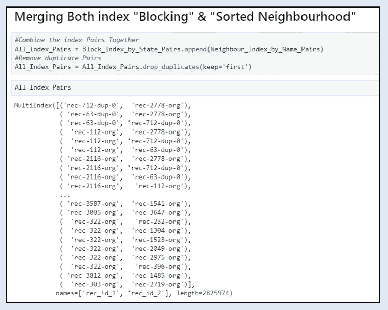

附加两种索引方法(图片由作者提供)

## 比较和相似性

现在，我们已经生成了记录对，我们希望对记录对执行比较，以创建一个比较向量来计算两个记录对之间的相似性得分。下图显示了根据“给定姓名”列上的索引对计算和比较的相似性得分。例如，“rec-712-dup-0”和“rec-2778-org”的记录对在给定名称上具有 0.46667 的低相似性得分。

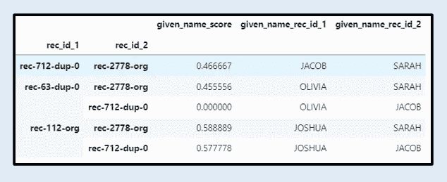

样本比较向量(图片由作者提供)

可以用许多不同的方法进行比较，以计算字符串、数值或日期中的相似性值。在我们计算字符串值的相似性得分的场景中，我们可以使用以下算法:

*   贾罗温克勒
*   莱文斯坦
*   最长公共子串(LCS)
*   雅克卡德

让我们继续计算数据集中不同列的相似性得分。

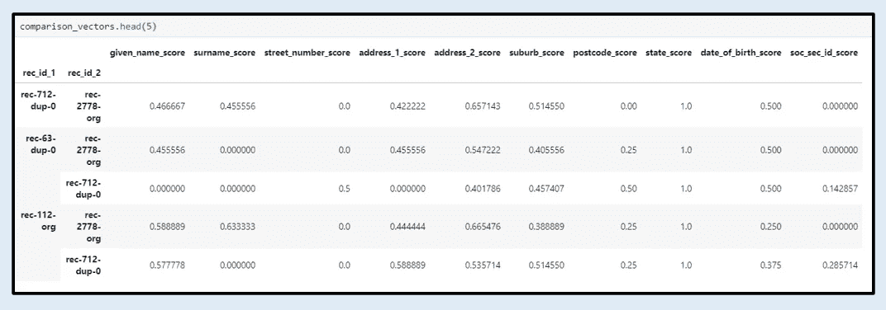

比较矢量输出(图片由作者提供)

请注意，本例中使用的相似性函数是“Jarowinkler”或“Levenshtein”。Jarowinler 相似性得分是通过给予字符串的开头更多的重要性来计算的，因此该算法用于计算诸如姓名、地址、州等特征的相似性得分。Levenshtein 相似性得分是根据字符的顺序计算的，并提供更高的重要性，因此该算法用于计算街道号、邮政编码等特征的相似性得分。*(还有很多其他不同的相似度函数也可以探索，比如“余弦”、“dameray_levenshtein”等)。*现在我们已经创建了相似性特征，我们可以进入下一步，即构建监督学习模型。

## 监督学习(分类)

在本节中，我们将训练一个模型，根据提供的数据集对重复项和非重复项进行分类。但是在我们可以训练模型之前，我们需要在我们的数据集中有一个“标签”列(*目标变量*)，以便模型知道哪些是重复的，哪些不是。

加载数据时，指定“return_links = True”将返回已知的重复记录对。

```
df, links = load_febrl2(return_links=True)
```

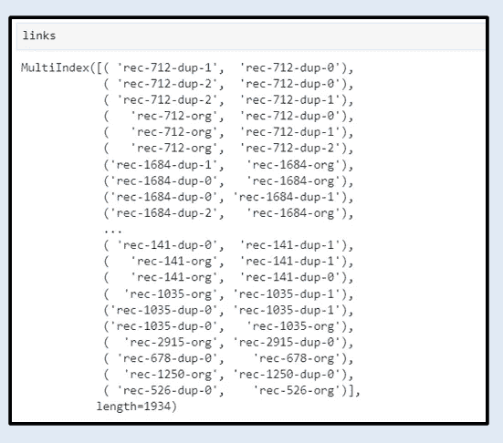

返回“真实重复”记录对(按作者排序的图像)

我们还可以为真正的重复对计算和创建比较向量，以全面了解它们的相似性得分有多高，并将这组配对转换为下一步的数据帧格式。

```
duplicate_pairs_vectors = compare.compute(links,df)
```

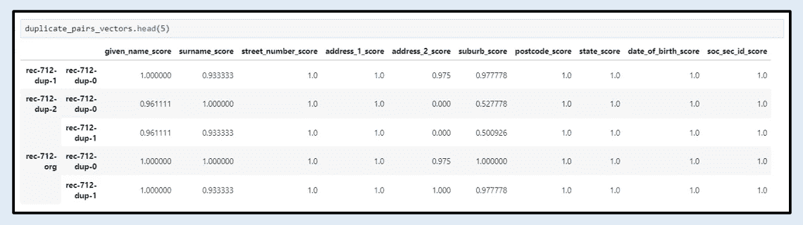

“真实重复”记录对的比较矢量输出(图片由作者提供)

从矢量输出中，我们可以通过观察和注意到，对于大多数特征来说，重复对往往具有高相似性得分，从而给出粗略的估计。

下面的步骤是在我们的数据集上创建列“Label”的一些 ETL 过程，由此如果在数据集“duplicate_pairs”中找到配对，则标签为“1”否则为“0”(Duplicate = 1，Not Duplicate = 0)

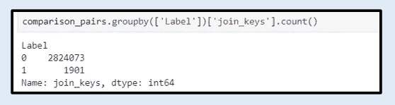

添加了“标签”列的数据集

在标记数据集之后，注意有 1901 对重复项和 2824073 对重复项，这也表明许多配对被索引但却是唯一的。

有了一组标记的数据，我们可以开始训练一个监督学习模型，将记录分类为“重复”或“不重复”。在这个例子中，我将训练一个 XGBoost 模型来执行分类。下面是用于导入模型库和将数据集拆分为训练集和测试集的命令。

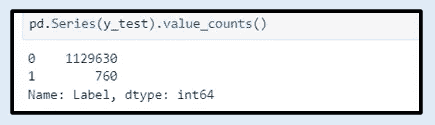

测试集分组(图片由作者提供)

通过查看测试集分布，我们有 760 对模型副本来测试和预测。接下来，我们可以训练 XGBoost 模型，并将训练好的模型应用于测试集，以将记录分类为“重复”或“不重复”

让我们来查看模型归类为“重复项”(predict = 1)的配对记录的输出

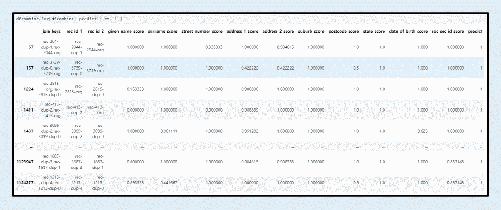

模型将记录分类为“重复”(按作者分类)

接下来，我们将仔细挑选前两对，并查看实际记录，以确定有什么不同。

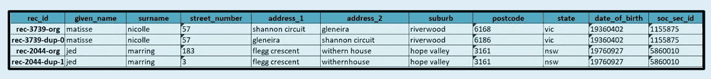

样本记录—归类为“重复”(按作者分类的图像)

从示例记录中，请注意，对于第一次配对，可以在两个地址字段上看到差异。第二次配对的其他地方—可以在街道号码和地址字段中看到差异。看起来模型能够对数据集中不同值的记录进行分类。

恭喜你。我们已经建立了一个模型来识别数据集中的重复项。

## 结论

在本文中，我们学习了如何结合使用记录链接和监督学习来执行重复数据删除。由此，在能够执行比较以计算相似性得分和用于模型训练之前，记录需要被索引成对。但是，请注意，这是为了理解执行重复数据消除的过程而进行的练习，数据集值很简单。真实世界的数据通常比我们的例子更加混乱和复杂。

*感谢您阅读我的文章，如果您喜欢并愿意支持我:*

*   *跟我上* [*中*](https://iam-suelynn.medium.com/) 🙆🏻
*   通过我的[推荐链接](https://iam-suelynn.medium.com/membership)成为 Medium 会员🙋

## 参考和链接:

[1][https://github.com/dedupeio/dedupe-examples.git](https://github.com/dedupeio/dedupe-examples.git)

[2][https://github . com/vinta software/de duplication-slides/blob/master/slides . ipynb](https://github.com/vintasoftware/deduplication-slides/blob/master/slides.ipynb)

[3][https://recordlinkage.readthedocs.io/en/latest/](https://recordlinkage.readthedocs.io/en/latest/)