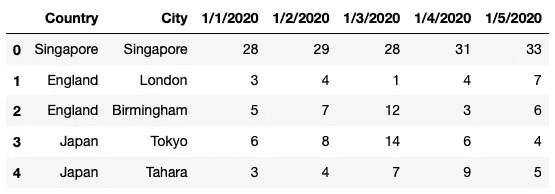
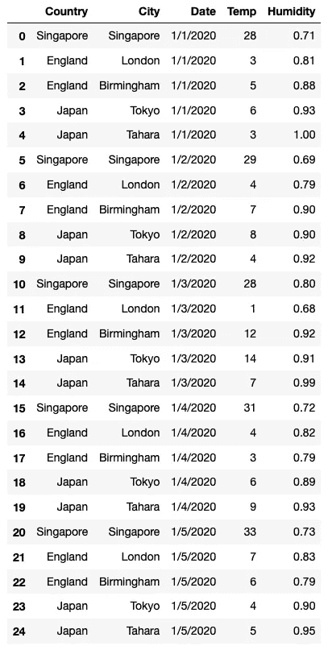
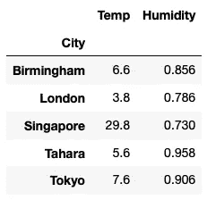

# 在多索引 Pandas 数据帧上执行分组

> 原文：<https://towardsdatascience.com/performing-groupings-on-multi-index-pandas-dataframes-1e22ed435a29?source=collection_archive---------9----------------------->

## 探索 set_index()和 groupby()函数


Maksym Kaharlytskyi 在 [Unsplash](https://unsplash.com?utm_source=medium&utm_medium=referral) 上的照片

在我的上一篇文章——“**使用多索引 Pandas DataFrames** ”中，我谈到了如何将单索引数据帧转换成多索引数据帧，以及使用它的各种技术。

[](/working-with-multi-index-pandas-dataframes-f64d2e2c3e02) [## 使用多索引熊猫数据框架

### 了解如何轻松使用多索引数据框架

towardsdatascience.com](/working-with-multi-index-pandas-dataframes-f64d2e2c3e02) 

在本文中，我将继续讨论多索引数据帧，但这一次我将更多地关注于使用 **set_index()** 和 **groupby()** 函数，并探索它们的相似之处和不同之处。

# 加载数据帧

在这篇文章中，我将使用两个 CSV 文件。第一个是 **temperature.csv** ，包含以下内容:

```
Country,City,1/1/2020,1/2/2020,1/3/2020,1/4/2020,1/5/2020
Singapore,Singapore,28,29,28,31,33
England,London,3,4,1,4,7
England,Birmingham,5,7,12,3,6
Japan,Tokyo,6,8,14,6,4
Japan,Tahara,3,4,7,9,5
```

第二个是**湿度. csv** ，内容如下:

```
Country,City,1/1/2020,1/2/2020,1/3/2020,1/4/2020,1/5/2020
Singapore,Singapore,0.71,0.69,0.80,0.72,0.73
England,London,0.81,0.79,0.68,0.82,0.83
England,Birmingham,0.88,0.9,0.92,0.79,0.79
Japan,Tokyo,0.93,0.9,0.91,0.89,0.9
Japan,Tahara,1,0.92,0.99,0.93,0.95
```

让我们加载两个 CSV 文件并检查它们的结构:

```
import pandas as pd
df_temp = pd.read_csv("temperature.csv")
df_temp
```



```
df_humd = pd.read_csv("humidity.csv")
df_humd
```


如您所见，这两个文件包含了三个国家不同城市的一系列温度和湿度数据。日期以列的形式排列，这使得操作起来并不容易。因此，更好的办法是使用 **melt()** 函数来取消它们的透视:

```
df_temp_melted = \
    **df_temp.melt**(id_vars=['Country','City'], # columns to keep              
                 var_name='Date',   # name of column to add
                 value_name='Temp') # name of new column to 
                                    # store the temp for each datedf_humd_melted = **df_humd.melt**(id_vars=['Country','City'],           
                              var_name='Date', 
                              value_name='Humidity')
```

取消透视的 **df_temp_melted** 数据帧现在看起来像这样:


取消透视的 **df_humd_melted** 数据帧现在看起来像这样:


因为除了温度和湿度列之外，这两个数据帧是相同的，所以使用 concat()函数将它们合并成一个数据帧是有意义的:

```
df_melted = pd.concat(
    [df_temp_melted, df_humd_melted['Humidity']],axis=1)
df_melted
```

最后，您有一个包含温度和湿度值的单指数数据框架:



# 使用 set_index()函数转换为多索引数据帧

让我们尝试使用 **set_index()** 函数，使用 **Country** 列为 **df_melted** 设置一个新的索引:

```
df_melted.set_index(**['Country']**)
```

您将看到以下结果。这是一个单索引数据帧:


用**国家**和**城市**列作为索引怎么样？当然，您只需要将两列作为一个列表传入:

```
df_melted.set_index(**['Country','City']**)
```

因此，现在您有了一个多索引数据框架，以**国家**和**城市**作为索引:


当然我们也可以有三列作为索引:

```
df_melted.set_index(**['Country','City','Date']**)
```

这是结果:


如果你看上面的输出，你可能会对输出有点失望。您可能希望输出如下所示:


不幸的是， **set_index()** 函数的输出会因数据在数据帧中的排序方式而异。为了获得上面想要的输出，在使用 **set_index()** 函数设置索引之前，您需要首先对数据帧进行排序:

```
**# sort the dataframe first ...
df_melted = df_melted.sort_values(by=['Country','City','Date'])****# ... then set the three columns as index**
df_melted.set_index(['Country','City','Date'])
```

您现在应该会看到如上所示的输出。

# 使用 groupby()获取多索引数据帧

获得上一节结果的一个更简单的方法是使用 **groupby()** 函数。默认情况下， **groupby()** 函数根据分组所依据的列对数据帧进行排序。使用 groupby()，您的代码将如下所示:

```
df_melted.**groupby(['Country','City','Date'], 
                  as_index=True).agg(lambda x:x)**
```

在上面的声明中:

*   首先根据**国家**、**城市**和**日期**对行进行排序
*   然后将指定的列用作索引(通过将 **as_index** 参数设置为 **True** (默认值))
*   然后对 **groupby()** 函数的结果调用 **agg()** 函数；然后，数字列的每个值(**温度**和**湿度**)作为一个序列传递给 lambda 函数

> 如果 **as_index** 参数设置为 **False** ，结果将是单索引数据帧。

您可以通过检查传递给 aggregate ( **agg()** )函数的值来验证最后一点:

```
**def check(x):
    print(x)
    return x**df_melted.groupby(['Country','City','Date'], 
                  as_index=True).agg(**check**)
```

上面的代码片段将打印出以下输出。**温度**列中的每个值作为一个序列传入，后面是**湿度**列中的每个值:

```
2    5
Name: Temp, dtype: int64
7    7
Name: Temp, dtype: int64
12    12
Name: Temp, dtype: int64
17    3
Name: Temp, dtype: int64
22    6
Name: Temp, dtype: int64
...0    0.71
Name: Humidity, dtype: float64
5    0.69
Name: Humidity, dtype: float64
10    0.8
Name: Humidity, dtype: float64
15    0.72
Name: Humidity, dtype: float64
20    0.73
Name: Humidity, dtype: float64
```

因为我们的 dataframe 对于每个*国家、城市和日期*都有一个惟一的值，所以传递给 lambda 函数( **x** )的每个值都是一个包含一个元素的 Series 对象。因此，我们可以简单地返回 lambda 函数中的序列:

```
df_melted.groupby(['Country','City','Date'], 
                  as_index=True).agg(**lambda x:x**)
```

多索引数据帧现在如下所示:


> 如果在 **groupby()** 函数中设置 **sort=False** ，会得到不同的结果。试试看，你就会明白我的意思。
> 
> 提示:结果将类似于前面使用 **set_index()** 函数得到的结果。

让我们尝试只使用两列来分组— **国家**和**城市**:

```
df_melted.groupby(**['Country','City']**, as_index=True).agg(
                  **lambda x:x**)
```

以上语句在运行时会产生一个错误:

```
*ValueError: Must produce aggregated value*
```

这是因为现在传递给 lambda 函数( **x** )的序列有不止一行(每个唯一的*国家和城市*行有不止一行日期、温度和湿度)。并且聚合函数期望您返回一个值(或一个具有一个值的序列)，而不是一个具有多个值的序列。要解决这个问题，您需要提供一个函数，比如对序列调用 **mean()** :

```
df_melted.groupby(['Country','City'], as_index=True).agg(
                  **lambda x:x.mean()**)
```

上述语句现在将产生以下输出:


您还可以向 **agg()** 函数传递一个字典，指示应用于每一列的特定函数:

```
df_melted.groupby(['Country','City'], as_index=True).agg( **{
        'Temp':['mean','min','max'],
        'Humidity':['mean','min','max'],
    }**
)
```

上述语句生成以下输出:


# 对多索引数据帧执行 groupby

在多索引数据帧上调用 **groupby()** 函数时，也可以指定索引来执行 groupby。让我们基于您之前看到的 **df_melted** 数据帧生成一个新的数据帧 **df2** :

```
df2 = df_melted.groupby(['Country','City','Date'], 
                  as_index=True).agg(lambda x:x)
df2
```

下面是 **df2** 的样子:


假设您想要每个国家的平均温度和湿度。为此，您可以在 dataframe 上执行一个 **groupby()** 并指定索引*级别*:

```
df2.groupby(level=0).mean()
```

这里，**级别=0** 表示**国家**指数。或者，您也可以直接指定索引的名称:

```
df2.groupby(level='**Country**').mean()
```

两个语句都会产生以下结果:


每个城市的平均温度和湿度怎么样？简单，只需指定**城市**为关卡:

```
df2.groupby(level='**City**').mean()
```



最后，每个**国家**和**城市**的平均温度和湿度如何？供应列表中的**国家**和**城市**:

```
df2.groupby(level=[**'Country','City'**]).mean()
```


> 当然你也可以使用 **agg()** 函数来指定应用于每一列的特定函数

# 结论

在本文中，我们看到了 **set_index()** 和 **groupby()** 函数，它们都允许您创建多索引数据帧。虽然表面上看起来很相似，但是由 **set_index()** 创建的输出依赖于数据帧中行的顺序，并要求您对行执行一些预先排序/重新排列。另一方面， **groupby()** 函数根据默认指定的列对行进行排序，并允许您使用一个或多个索引对多索引数据帧执行“groupby”

> **set_index()** 函数仅适用于单索引数据帧，而 **groupby()** 既适用于单索引数据帧，也适用于多索引数据帧。

[](https://weimenglee.medium.com/membership) [## 加入媒介与我的介绍链接-李伟孟

### 作为一个媒体会员，你的会员费的一部分会给你阅读的作家，你可以完全接触到每一个故事…

weimenglee.medium.com](https://weimenglee.medium.com/membership)