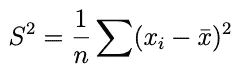
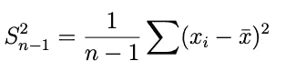
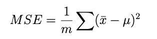
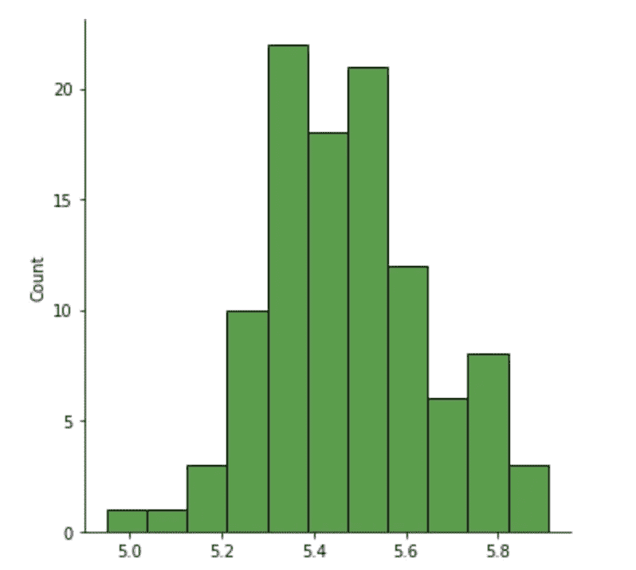
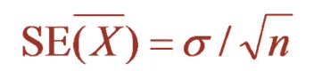
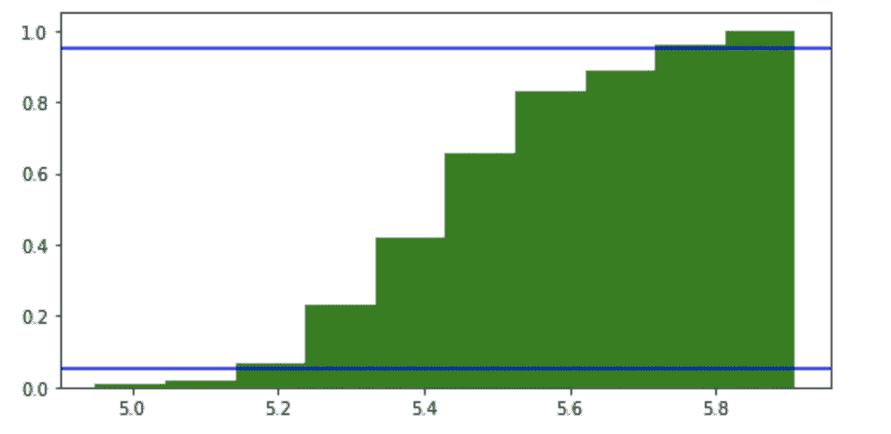

# 执行统计估计

> 原文：<https://towardsdatascience.com/performing-statistical-estimation-82368ad89486?source=collection_archive---------32----------------------->

## 试图用最简单的形式解释统计学中的估计过程。


(图片由作者提供)

众所周知，统计学是一门研究收集数据、总结和可视化数据、识别模式、差异、局限性和不一致性以及从样本中推断人口信息的学科。

这种从样本中推断总体信息的过程被称为**估计**。因为不可能从人口中的每一个成员那里收集信息，所以我们从样本中收集信息，并以我们的方式估计人口的信息。在这个过程中，我们使用一种叫做“估计器”的东西来进行估计。

当对整个人口计算一个值时，它被称为**参数**，而人口子集(也称为样本)的相应术语被称为**统计量**。

## 什么是评估者？

u '(读作 mu)是指总体的平均值或总体的真实平均值。但在大多数情况下，我们不知道这个值，所以我们试图确定一个称为 xbar 的统计量，它是样本的平均值。然后 Xbar 成为我们的估计器。

使用 xbar 来估计 u 似乎是合理的，但是让我们假设我承担这个任务来确定我所在城市所有人的平均身高。我真的不可能去问这个城市的每一个人他们的身高。因此，我决定选择一个较小的样本，即我所在大楼中的人，来估计人们的平均身高。由于我的心不在焉，我最终做了一个不正确的输入，将其中一个值的小数放在了错误的位置(8.0 变成了 80.0)。

我的样本看起来是这样的英寸:[4，5.3，5.2，5.5，5.8，6.0，6.1，80.0]。该样品的平均“xbar”为 14.73 英寸。人真的平均那么高吗？在这种情况下,“Xbar”似乎不是估计“u”的最佳选择。

因此，我决定使用另一种叫做中位数的统计方法。中位数不过是中间值。这个样本的中值是 5.65，这看起来更合理，更接近“u”的实际值。

## 我的估计量是有偏的还是无偏的？

方差是一种常用的估计量，用于确定数据的分布，通常由以下公式给出:



但是，当我们转向更大的样本(或总体)时，这个方差公式往往会低估方差的值。换句话说，是有倾向性的。偏差只不过是期望值和实际值之间的差异或“xbar-u”。当这个偏差等于 0 时，我们说估计量是无偏的。上述公式产生非零偏差。这方面的证据可以在这里找到:[https://en.wikipedia.org/wiki/Bias_of_an_estimator](https://en.wikipedia.org/wiki/Bias_of_an_estimator)

因此，我们使用下面的公式来计算样本方差，用 1/(n-1)代替 1/n



这个公式得出的偏差等于零。它也没有低估人口方差。直觉上，由于分母现在是一个较小的数字，方差的值较大，因此对于一个较大的样本(或总体)，我们自然期望一个较大的方差。

样本均值总是总体均值的无偏估计量。这是因为均值的期望值等于总体的实际值或真实均值。一些样本的均值可能大于总体均值，而一些样本的均值可能低于总体均值。然而，当这个过程重复多次，并且在这些迭代中计算估计值的**平均值**时，这些采样实验的平均值将最终等于总体平均值。

## 我们如何确定最佳估计量？

这实际上取决于我们是在试图最小化错误还是最大化获得正确答案的机会。

如果我们试图将误差最小化，我们使用一种叫做**均方误差**或均方根误差的东西。在真实的实验中，计算估计量的过程在许多不同的样本上重复多次。在没有异常值的情况下，样本均值“xbar”使均方误差(MSE)最小化:



其中“m”是迭代次数。RMSE 不过是 MSE 的平方根。

但是最小化 MSE/RMSE 总是最好的选择吗？想象一下掷骰子的情况。掷骰子的平均值是(1+2+3+4+5+6)/6 = 3.5。我们永远不可能掷出 3.5 的骰子。再一次，想象我们掷出一个 6 面骰子 3 次，我们被要求估计掷骰子的总数。如果我们使用 MSE 方法，并试图确定使 MSE 最小的值，我们将得出结论，总和的期望值将是 3*3.5 = 10.5。

但是掷骰子的总和永远不会是小数。在这种情况下，我们应该选择一个最有可能得到正确答案的估计量，也称为**最大似然估计量**。对于掷骰子的情况，如果我们说 3 次掷骰子的和是 3、10 或 12，我们得到正确答案的机会就会增加。

## 估计量的分布是什么？

回到我寻找我所在城市的人们平均身高的好奇心。我在我的大楼里挑选了一个人的样本(显然我犯了一个错误，最终我改正了这个错误),然后计算了一个统计数据——样本的平均值。那里的样本量是 8。我对我的分析不完全满意，所以我决定对更多相同大小的样本重复这个过程。我决定将这个样本集扩展到我朋友的 4 栋楼。然后每个样本产生一个统计数据(不可救药的我仍然坚持样本均值，尽管它有缺陷并且无法处理异常值)。

以下是我的样品:

```
Sample1:[4,5.3,5.2,5.5,5.8,6.0,6.1,8.0]   Mean1: 5.74  Std dev: 1.13
Sample2:[4.8,6.1,6.3,5.0,5.5,5.9,5.8,5.6] Mean2: 5.62  Std dev: 0.51
Sample3:[6.1,6.2,6.3,6.0,5.11,5.10,6.0,6.1]Mean3: 5.86 Std dev: 0.48
Sample4:[5.1,5.2,5.4,5.9,5.5,5.10,5.9,5.5] Mean4: 5.45 Std dev: 0.32
Sample5:[2.5,4.11,5.7,5.3,5.8,5.9,5.2,5.1] Mean5: 4.95 Std dev: 1.14
```

现在我对平均高度有了一些基本的概念，我决定对大约 100 个样本进行模拟，并计算每个样本的平均值。我使用均值为 5.5、标准差为 0.5、样本大小为 8 的正态分布来生成样本均值。

```
import numpy as np
import random
means = [5.74,5.62,5.86,5.45,4.95]
for i in range(100):
    x = np.random.normal(5.5, 0.5, 8)
    xbar = np.mean(x)
    means.append(xbar)
```

这种统计分布，即样本均值，被称为**抽样分布**。可视化样品的分布意味着:

```
import seaborn as sns
sns.displot(means,color='green')
```



图 1:样本平均值的分布(图片由作者提供)

想象一下，如果我的分析只基于样本 3:[6.1，6.2，6.3，6.0，5.11，5.10，6.0，6.1]。从样本的外观来看，我似乎选择了最高的人。这种由于随机选择或噪声造成的估计值的变化，其中一个样本可能没有完全反映真实总体，被称为**抽样误差**。

## 我们对评估有多少信心？

我们观察样本均值、样本中值和样本标准差来估计相应的总体值。我们使用一个单独的值来表示我们试图估算的值。这叫做**点估计**。当我们使用一系列值来估计相应的总体值时，它被称为**区间估计**。

我们的抽样分布以一个**标准误差**和**置信区间为特征。**

平均而言，标准误差衡量的是我们期望估计值偏离真实值的程度，这与标准偏差不同，标准偏差是样本本身的变化。我们在图 1 中看到的是样本平均值的抽样分布的标准偏差。反过来，这就是我们在上一节中看到的 RMSE，即“xbar-u”所有值的平均值的平方根。在上例中，标准误差为 0.17 英寸:

```
u = 5.5
error = [(mean-u)**2 for mean in means]
rmse = math.sqrt(np.mean(error))
```

当‘n’足够大，n>30 时，标准误差将等于σ/n 的根，其中σ是真正的标准偏差。



请看图 1，直观地将高度的样本平均值视为一系列值。置信区间是一个区间估计值，它提供了包含在抽样分布的给定部分中的一系列值。如图 2 所示，90%置信区间将是第 5 和第 95 百分位之间的值的范围，即大约(5.2，5.7)英寸。更简单地说，这意味着 90%的人口参数(u)将在 5.2-5.7 英寸的范围内。这并不意味着我们的总体参数(u)有 90%的概率位于 5.2-5.7 英寸的范围内。

```
import matplotlib.pyplot as plt
from matplotlib import mlab
fig, ax = plt.subplots(figsize=(8, 4))
ax.hist(means, density=1, cumulative=True, label='CDF', color='green')
plt.axhline(y=0.05, color='b', linestyle='-')
plt.axhline(y=0.95, color='b', linestyle='-')
plt.show()
```



图 2:样本均值的累积分布函数图(作者图片)

置信区间和标准误差是抽样分布的特征，但是它们没有考虑由于抽样偏差和/或测量不精确而产生的误差或噪声。

回到我痴迷于寻找我所在城市的人们的平均身高。我没有实际测量他们的身高，而是决定给他们发电子邮件让他们填写调查问卷。这种方法会有一定的局限性。他们中的一些人可能没有电子邮件，或者他们没有办法回复我的电子邮件，或者有些人可能有时间或可能没有时间填写调查，因为他们的日程安排很忙或不太忙。然后我会对某一类人群进行抽样调查。这被称为**采样偏差**。收入、可用资源、回应意愿(自我选择:一些回应者拒绝回应)等外部因素可能会间接影响我的评估。

在回复电子邮件调查时，回答者可能会低估或高估或向上或向下舍入他们的身高，这可能会导致**测量误差。**

## 结论

进行估计时，重要的是要记住置信区间和标准误差是有用的，但不是抽样误差的唯一指标，并且估计很可能受到其他未考虑的误差的影响，如抽样偏差和测量不准确性。

## 参考资料:

这一汇编深受艾伦·B·唐尼的 *Thinkstats* 书的影响。