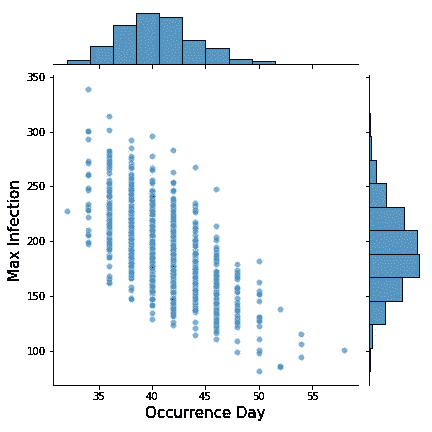

# 分三步进行不确定性分析:实践指南

> 原文：<https://towardsdatascience.com/performing-uncertainty-analysis-in-three-steps-a-hands-on-guide-9110b120987e?source=collection_archive---------13----------------------->

## 这篇文章将带你通过一个完整的不确定性分析案例研究，使用拉丁超立方体抽样，蒙特卡罗模拟和假设的结果图。

paweczerwi ski 在 [Unsplash](https://unsplash.com?utm_source=medium&utm_medium=referral) 上的照片

做出可靠的基于模型的预测并不总是一件容易的事情。

在一般形式下，我们有一个模型 *f* (。)加上一些模型参数 ***θ*** 。这个模型应该模拟一些现实生活中的过程。那么，给定输入 ***x*** ，我们就可以用模型来预测，这就引出了 ***y*** 。

更多的时候，模型参数是 ***θ*** 不确定的，即我们无法确定它的确切值。当我们从有限的、有噪声的训练数据中校准 ***θ*** 时，就会发生这种情况。

不确定 ***θ*** 的结果是对应的预测 ***y*** 也不确定。由于有效的决策在很大程度上依赖于对 ***y*** 的可靠预测，因此分析师必须报告模型预测的不确定性。

为此，我们需要做一个**远期不确定性量化分析**。这种类型的分析旨在量化给定输入数据不确定性的模型预测变化。它被称为*正向*，因为不确定性信息通过模型从输入流向输出。

在本文中，我们将通过一个完整的案例研究来了解如何在实践中进行前瞻性不确定性量化分析。下面是我们将要做的事情的概述:

1.  **案例研究** →我们考虑疾病在人群中传播的建模，其中我们将*感染*和*恢复率*视为不确定参数，并且我们调查*最高感染病例数*及其*发生时间*的预测变化。
2.  **方法** →该分析将通过**蒙特卡洛模拟**进行。蒙特卡洛方法直观易懂，易于实施，在不确定性量化方面非常流行。
3.  **工作流程** →我们分三步进行不确定性分析:随机样本生成、不确定性传播和不确定性可视化。

在接下来的几节中，我们将深入探讨每个步骤的技术细节。

图 1 远期不确定性量化分析概述。(图片由作者提供)

> 你可以在这里找到同伴 [**Jupyter 笔记本**](https://github.com/ShuaiGuo16/Forward_UQ) ，这里可以转载所有呈现的分析和结果。

## 目录

[**1。问题陈述**](#6799)
∘ [1.1 背景](#8905)
∘ [1.2 不确定性分析](#ffd8)
[**2。蒙特卡洛模拟**](#4df7)
[**3。准备**](#fc14)**s**
∘[3.1 包](#aa34)
∘ [3.2 模拟 SIR 模型](#cdda)
[**4。随机样本生成**](#c70e)
∘ [4.1 拉丁超立方抽样](#6e19)
∘ [4.2 样本变换](#ca78)
∘ [4.3 整个抽样过程](#b9ba)
[**5 .蒙特卡洛模拟**](#ec80)
[**6。不确定性可视化**](#fb6e)
[**7。假想结局剧情**](#15fe)
[**8。外卖**](#605c)
[关于作者](#8f47)

# 1.问题陈述

## 1.1 背景

在本案例研究中，我们使用 [**SIR** 模型](https://en.wikipedia.org/wiki/Compartmental_models_in_epidemiology)对疾病在人群中的传播进行建模。在其基本形式中，SIR 模型将𝑁的总人口分为三个不同的区间，这三个区间随着时间的变化而变化:

*   S*S*(*t*)，易感但尚未感染疾病的个体数量；
*   *I* ( *t* )，感染个体数；
*   T4，从疾病中恢复并对疾病免疫的个体数量。

SIR 模型用下列常微分方程组描述了 *S* ( *t* )、 *I* ( *t* )和 *R* ( *t* )种群的时间演化:

其中 *β* 表示感染率， *γ* 表示恢复率。

## 1.2 不确定性分析

我们将𝛽和𝛾视为两个不确定的模型参数。当遇到新疾病爆发时(例如新冠肺炎)，这些模型参数通常是未知的。

在实践中，关于感染和康复病人数量变化的官方记录被用来估计𝛽和𝛾.不幸的是，这些记录可能不准确，尤其是在疫情爆发的早期阶段。因此，𝛽和𝛾从“嘈杂”的数据估计将是不确定的。推导参数估计不确定性属于 [**系统辨识**](https://en.wikipedia.org/wiki/System_identification) 的范畴，通常发生在正向 UQ 分析之前。

由于我们当前的研究侧重于远期不确定性量化分析，我们将简单假设𝛽−𝛾估计已经完成，并且以下二元正态分布表征了它们的不确定性:

这里，(0.22，0.1)表示(𝛽，𝛾)的平均值，(2e-4，1e-4)表示它们的方差值，4e-5 表示它们的[协方差值](/multivariate-probability-theory-all-about-those-random-variables-ef921e099a6f#b7b7)。

运行 SIR 模型还需要除𝛽和𝛾:之外的其他参数

*   *I* (0)，最初感染个体的数量；
*   *R* (0)，初始恢复/免疫个体数；
*   *N* ，人口规模。

我们简单地假设它们是当前研究中的常数，包括𝐼0=8、𝑅0=0 和𝑁=1000.

# 2.蒙特 卡罗模拟

蒙特卡罗模拟是一种简单而强大的统计方法。它使我们能够在甚至不知道分布形式的情况下从目标输出分布中生成代表性样本，这是通过简单地模拟各种输入情景下的模型输出来实现的。稍后，我们可以基于累积的样本检索输出分布。

实施蒙特卡罗模拟非常简单:

1.  从𝛽和𝛾的概率分布(即二元正态)中抽取大量随机*样本*；
2.  对于每个样本，将其𝛽和𝛾值插入 SIR 模型，并运行 SIR 模型以预测感兴趣的输出，即最高感染病例数及其发生时间；
3.  基于预测的集合，我们可以估计两个输出的联合/边际概率分布。

为了更好地理解蒙特卡罗模拟如何帮助量化模型预测的不确定性，请看我在这里的帖子:

</how-to-quantify-the-prediction-error-made-by-my-model-db4705910173>  

# 3.准备

在我们着手进行不确定性分析之前，让我们做一些必要的准备。

## 3.1 包装

除了基本的数据分析和可视化包之外，我们需要导入一些额外的包来促进目标不确定性分析:

*   `[scipy.integrate](https://docs.scipy.org/doc/scipy/reference/tutorial/integrate.html)`(第 6 行):我们用这个包来求解 SIR 模型的常微分方程组。
*   `[pyDOE](https://pythonhosted.org/pyDOE/)`(第 9 行):DOE 代表“实验设计”我们使用这个包来生成𝛽和𝛾.的随机样本具体来说，我们将使用**拉丁超立方体采样**来实现这个目标。要安装`pyDOE`，请使用`pip install pyDOE`。
*   `[celluloid](https://github.com/jwkvam/celluloid)`(第 19 行):我们使用这个包来创建动画，以增强不确定性的可视化。要安装`celluloid`，请使用`pip install celluloid`。

## 3.2 模拟 SIR 模型

为了保持条理，在运行不确定性分析之前定义一个函数来模拟 SIR 模型是有益的。

`SIR_model`函数取感染率𝛽、恢复率𝛾、时间点网格(以天为单位) *t* 计算疫情演变、人口规模 *N* 以及分别为 *I0* 和*r0**。*

通过`[scipy.integrate.odeint](https://docs.scipy.org/doc/scipy/reference/generated/scipy.integrate.odeint.html)`函数(第 14 行)求解常微分方程组，得到在指定时间网格 *t* 计算的 *S* ( *t* )、 *I* ( *t* )、 *R* ( *t* )值。

为了直观地理解 SIR 模型的预测结果，我们可以在给定𝛽和𝛾(即𝛽=0.22 和𝛾=0.1.)平均值的情况下运行上述 SIR 模型

*S*(*t*)*I*(*t*)*R*(*t*)的演变如下图所示。我们可以看到，随着越来越多的人康复，易感和感染人群显著下降。

图 2 预测的流行病演变。(图片由作者提供)

通过对时间序列 *I* ( *t* )进行后处理，我们可以获得我们感兴趣的输出:感染人数在疫情爆发后 40 天达到峰值，总共达到 190 名感染者。

现在我们一切都准备好了。是时候做一些不确定性分析了！在接下来的三个部分中，我们将详细介绍这三个步骤。

# 4.随机样本生成

在这一步中，我们将使用**拉丁超立方体采样**方法生成 *β* 和 *γ* 的代表样本。这些生成的样本将用于随后的蒙特卡罗模拟。

## 4.1 拉丁超立方体采样

拉丁超立方体采样(LHS)是一种先进的采样方法，旨在生成“空间填充”样本。与朴素随机采样方法(如`[numpy.random.rand](https://docs.scipy.org/doc/numpy-1.14.0/reference/generated/numpy.random.rand.html)`)相比，拉丁超立方体样本可以在很大程度上避免参数空间中的聚类和间隙(见下图)，从而均匀地填充整个参数空间。这一特性在蒙特卡罗模拟中是所希望的，因为它提高了估计精度。

图 3 拉丁超立方体采样可以生成“空间填充”样本。(图片由作者提供)

在当前的研究中，我们采用来自`pyDOE`包的 LHS 实现来生成样本。`pyDOE`旨在帮助科学家、工程师、统计学家等。，构建合适的实验设计。[此处阅读更多](https://pythonhosted.org/pyDOE/)。

## 4.2 样本转换

`pyDOE.lhs`创建的样本在[0，1]内均匀分布。因此，我们需要执行**样本转换**，将获得的样本转换为之前指定的二元正态分布。

## 4.3 整个取样过程

我们分三步完成整个取样过程:

**第一步:**从均匀分布*(0，1)中生成样本。*

*对于函数`pyDOE.lhs`，它接受三个参数:*

*   *n:参数个数(整数)；*
*   *samples:要生成的样本数(整数)；*
*   *标准:决定`lhs`如何采样点(一个字符串)。*

*因此，在这种情况下，我指示`pyDOE.lhs`使用 *maxmin* 标准为 2 个参数生成 1000 个样本，最大化样本点之间的最小距离。关于*标准*、[中的其他可用选项，请点击此处](https://pythonhosted.org/pyDOE/randomized.html)。*

*生成的 2D 数组`uni_samples`有 1000 行 2 列，其中每列保存从均匀分布 ***U*** (0，1)中抽取的 1000 个随机实现。*

***第二步:**把均匀分布变成标准正态分布。*

*对于`uni_samples`的每一列，我们将把从均匀分布*(0，1)中抽取的那些值映射到标准正态分布 ***N*** (0，1)中的那些值。**

**为了实现这个目标，我们应用了 [**逆变换采样**](/practical-probability-theory-all-about-a-single-random-variable-8935cfa21a96#e514) 技术。这一转换过程如下图所示，其中蓝色曲线是标准正态随机变量的累积分布函数。**

****

**图 4 逆变换采样技术。(图片由作者提供)**

****第三步:**将标准正态分布转化为目标二元正态分布。**

**一个𝑁-dimensional 多元正态分布**𝑌**∾***n***(***μ***，***σ***)和一个𝑁-dimensional 独立标准正态分布**z**∾***n***(**0**，***I***的关系**

****

**其中 ***L*** 是将[乔列斯基分解](https://en.wikipedia.org/wiki/Cholesky_decomposition)应用于协方差矩阵 *𝚺* 得到的下三角矩阵，即，**

****

**在上面的变换中，我们假设 **𝑌** 和 **𝑍** 都是随机变量的行向量。**

**基于上述定理，我们首先将 Cholesky 分解(`[np.linalg.cholesky](https://numpy.org/doc/stable/reference/generated/numpy.linalg.cholesky.html)`)应用于我们的目标正态分布的协方差矩阵，以得到 **𝐿** 。然后，我们使用上述等式将从上一步获得的标准正态分布样本转化为遵循我们的目标二元正态分布的样本。**

**我们可以看到转化后的样本。**

****

**图 5 从目标二元正态分布抽取的样本。(图片由作者提供)**

**从边际分布中，我们可以看到𝛽和𝛾确实遵循正态分布，分别以 0.22 和 0.1 为中心。此外，我们可以从散点图中看到𝛽和𝛾样本正相关。这与我们的目标协方差矩阵的非对角项为正(准确地说是 4𝑒−5)的事实相匹配。**

# **5.蒙特卡洛模拟**

**现在我们准备执行蒙特卡罗模拟。这一步很简单:我们只需要创建一个循环来预测𝛽和𝛾.的每个样本的 *S* 、 *I* 和 *R* 的演变**

# **6.不确定性可视化**

**现在我们准备好可视化获得的结果。为了呈现输出的不确定性，我们首先想到的是使用直方图和散点图。`Seaborn`软件包提供`[jointplot](https://seaborn.pydata.org/generated/seaborn.jointplot.html)`功能，可以同时显示变量的联合分布和单个变量的边际分布。**

****

**图 6 直方图和散点图中显示的输出不确定性。(图片由作者提供)**

**从上图中，我们可以直观地理解在给定不确定输入参数的情况下，输出是如何变化的。我们可能会注意到以下几点:**

*   **感染病例的最高数量及其发生日期似乎呈正态分布；**
*   **最有可能的情况是，感染病例数攀升至最高 180-200 例，这发生在疫情爆发后 38-40 天；**
*   **我们的两个产出是负相关的。这意味着，如果感染病例的数量在早期达到最高，这个数字也往往会很高，反之亦然。**

**基于获得的结果，我们可能想问更多的问题，如:**

*   **什么样的𝛽−𝛾病毒组合导致最高感染病例数超过某个阈值？**
*   **哪个参数(𝛽或𝛾)对两个输出的变化贡献更大？**
*   **我们应该如何减少输出预测的不确定性？**

**为了回答这些问题，我们需要进一步进行**全局灵敏度分析**和**稳健设计分析**。与前向不确定性量化一起，它们构成了计算科学和工程中**不确定性管理的主干。如果你想了解更多，请看看我在这里的帖子:****

**</managing-uncertainty-in-computational-science-and-engineering-5e532085512b>  

# 7.假设结果图

除了静态可视化之外，我们还可以通过使用一种称为**假设结果图的数据可视化技术，使我们的结果呈现更加生动和直观。**

假设结果图特别擅长于向更广泛的受众传达分析的不确定性，例如利益相关者、领域专家等。，不一定有很强的统计学背景。基本上，这种方法的工作原理是通过创建动画来循环多个不同的情节，每个情节模拟从结果分布中提取的一个可能的场景。更多详情，请查看我的帖子:

</uncertainty-visualization-made-easy-with-hypothetical-outcome-plots-89558574d069>  

下面，我们将使用`celluloid`包来创建动画。要查看如何使用`celluloid,`制作动画的详细教程，请点击此处:

</a-hands-on-tutorial-for-creating-matplotlib-animations-254fc7d52ed6>  

该动画有两个目的:首先，它模拟了易感、感染和康复病例在各种𝛽−𝛾组合下的演变。此外，它还在散点图中捕获了感染病例的最高数量及其发生日期。

图 7 可能的流行病演变动画。(图片由作者提供)

你有它！

# 8.外卖食品

我们刚刚完成了一个关于进行远期不确定性量化分析的完整案例研究。恭喜你！

以下是我们所取得成就的总结:

*   随机样本生成，其中我们使用拉丁超立方体采样来生成不确定输入参数的代表性样本；
*   不确定性传播，我们使用蒙特卡罗模拟将不确定性从输入传播到输出；
*   不确定性可视化，我们以静态形式(直方图和散点图)和动态形式(假设结果图)可视化输出不确定性。

使用简单蒙特卡罗模拟的一个缺点是相关的**高计算成本，在各种输入样本下多次运行模型会导致**。对于我们目前的情况，SIR 模型可以相当快地运行。不幸的是，工业应用通常不是这样。

通常，高保真度的物理模拟被用来进行预测，一次模拟运行可能需要几天甚至几周的时间。在这些情况下，运行成百上千次昂贵的物理模拟模型是不可能的。

一种解决方法是首先训练快速评估的替代模型来近似物理模拟。随后的蒙特卡罗模拟可以应用于训练的替代模型，以实现加速的正向不确定性量化分析。要了解更多，请查看我的帖子:

</an-introduction-to-surrogate-modeling-part-i-fundamentals-84697ce4d241>  </an-introduction-to-surrogate-modeling-part-ii-case-study-426d8035179e>  </an-introduction-to-surrogate-modeling-part-iii-beyond-basics-a60125767271>  

# 关于作者

> *我是一名博士研究员，致力于航空航天应用的不确定性量化和可靠性分析。统计学和数据科学是我日常工作的核心。我喜欢分享我在迷人的统计世界中学到的东西。查看我以前的帖子以了解更多信息，并在* [*中*](https://shuaiguo.medium.com/) *和*[*Linkedin*](https://www.linkedin.com/in/shuaiguo16/)*上与我联系。***