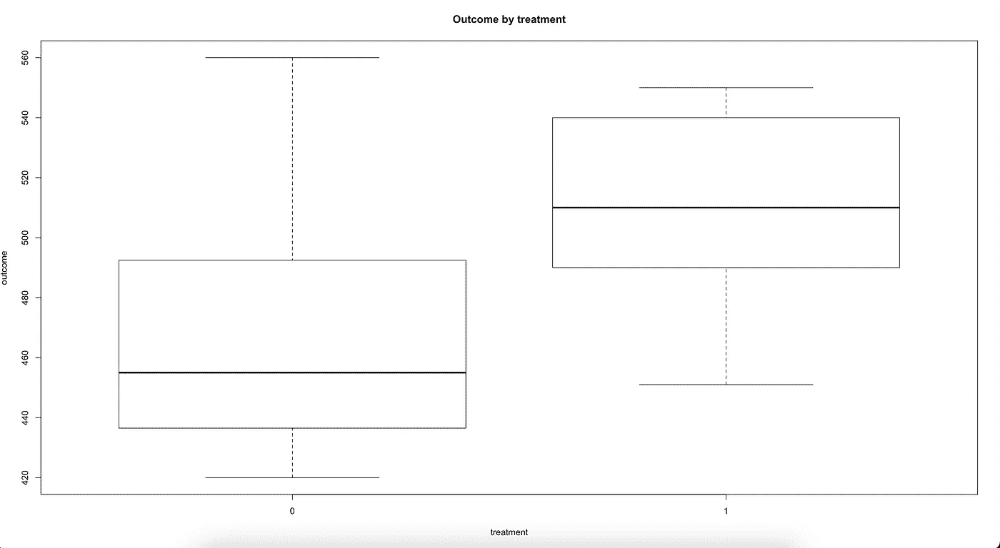
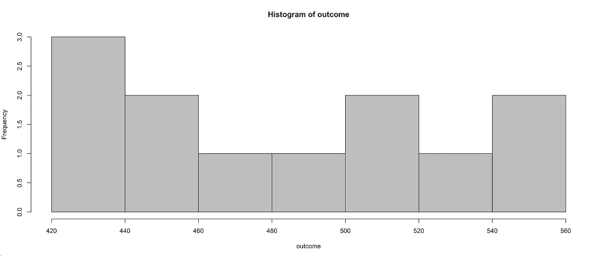
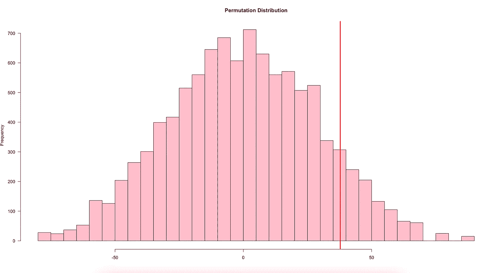
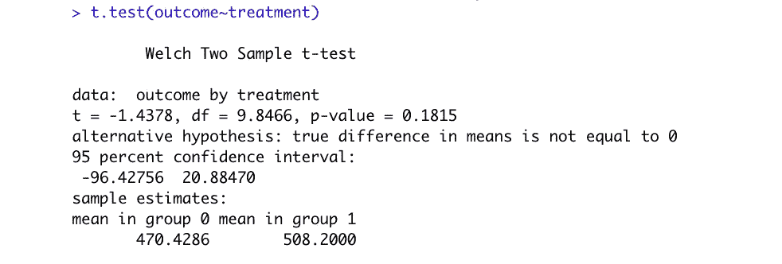
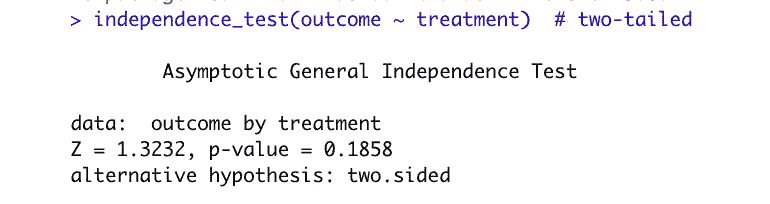

# R 中的置换假设检验

> 原文：<https://towardsdatascience.com/permutation-test-in-r-77d551a9f891?source=collection_archive---------8----------------------->

## 探索一种强大的模拟技术，用 R 从头开始实现


埃里克·普劳泽特在 [Unsplash](https://unsplash.com?utm_source=medium&utm_medium=referral) 上拍摄的照片

# 介绍

为了比较实验结果，我们经常使用学生的 t 检验。它假设数据是从总体中随机选取的，以大样本(> 30)到达，或者正态分布，组间方差相等。
如果我们不符合这些假设，我们可能会使用其中一个模拟测试。在本文中，我们将介绍排列测试。

排列测试不是假设基础分布，而是构建它的分布，打破组之间的关联。通常我们感兴趣的是组间均值或中位数的差异，而零假设是没有差异。我们可能会问这样一个问题:从所有可能的排列中，我们的数据看起来会有多极端？所有可能的排列将代表一个理论分布。在实践中，不需要执行所有排列来构建理论分布，而是运行合理数量的模拟来从该分布中抽取样本。通常有 10k 或者 100k 的模拟。

# 例子

假设我们有一个由 12 家零售店组成的连锁店，我们想测试一种新的销售技巧。例如，我们可以指定或选择 5 家商店，在那里进行尝试。然后将一段时间后的平均销售额与其余 7 家商店的销售额进行比较。

数据不是随机收集的，想必不是正态分布的；而样本本身只有不到 30 个观测值。
在我们的数据集中，我们有两列:treatment——一个二元变量，表示商店是否实施了新方法；结果—记录期末销售额的数字变量。

从箱线图的表示中，我们可以看到各组差异很大，方差大致相等。



结果的直方图似乎不是正态分布的；然而，夏皮罗-维尔克正态性检验得出不显著的 p 值= 0.3654



为了找出组间均值的差异，我们使用内置命令并将其保存到变量 original:

```
original <- diff(tapply(outcome, treatment, mean))
```

相差~37.8 分。现在我们问这样一个问题:如果我们将数据混洗一万次，我们多久会观察到这种或更极端的差异？

我们运行了一个没有替换的 10k 轴的模拟图，并记录了每个排列的平均值的差异。然后，我们执行双边测试，计算绝对值超过原始差值绝对值的记录数。

该函数返回模拟分布和 p 值。

如果我们绘制分布图，我们可以观察到我们的原始差异不是特别极端，精确的 p 值为 0.1822818



在许多研究项目中，这将表明各组之间没有统计上的显著差异:然而，在这个商业案例中，我会选择有一些证据表明销售方法影响结果的选项。

# 与其他测试的比较

如果我们运行 Welch t 检验，我们将得到一个类似的 p 值 0.1815。
夏皮罗-维尔克正态性检验表明，数据可能是从正态分布中得到的，但这不是一般情况。



r 也有几个库来运行排列测试。其中一个是 library(coin)，它执行一个独立性测试。它还返回类似的 p 值 0.1858。



# 结论

排列测试是测量实验效果的有力工具。它易于实现，并且不像其他测试那样依赖于许多假设。直到计算机上的模拟成为常规实施，它才得到广泛的流行。

它与另一个模拟测试密切相关:bootstrapping 假设测试，其中样本是通过替换抽取的。

# 感谢您的阅读！

在 [LinkedIn](https://www.linkedin.com/in/serafimpetrov/) 上连接