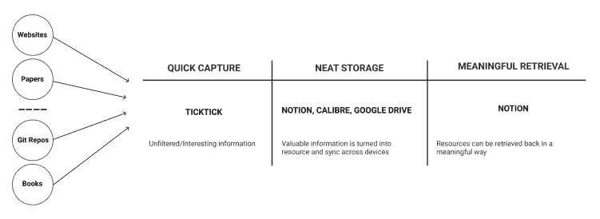
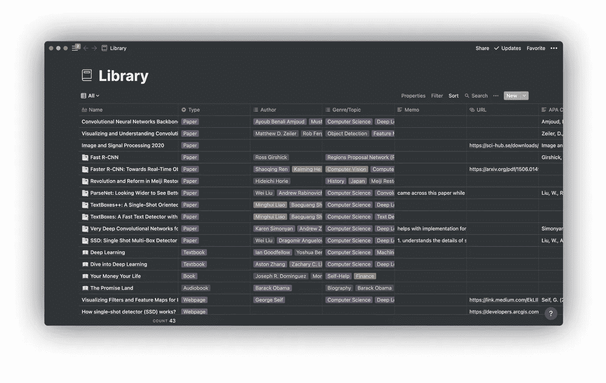

# 作为机器学习工程师的个人知识管理

> 原文：<https://towardsdatascience.com/personal-knowledge-management-as-a-machine-learning-engineer-8a9710a7c10d?source=collection_archive---------26----------------------->

## 我捕获、存储和检索信息的系统

来源:[弗雷迪婚姻](https://unsplash.com/@fredmarriage)

# 介绍

2019 年大学毕业后，我在当地一家初创公司开始工作，担任机器学习工程师。在工作中，我经常发现自己做了大量的阅读和学习。我接触到的信息可以是书籍、Youtube 视频、在线文章、git repos，甚至是 Stack Overflow 的问答。这给了我一些如何在这个领域提高自己的见解。其中一个洞见是使用个人知识管理(PKM)系统来帮助我管理我在做研究和做项目时遇到的所有信息。因此，在这篇文章中，我想和你分享我是如何设置这个系统的。更具体地说，我将带您经历三个阶段，一条信息在我的 PKM 系统中传递，以及我用来实现每个阶段目标的工具。

> 虽然这篇文章重点介绍了我作为机器学习工程师的经历，但我相信其他专业人士或学者可以从这篇文章中获得一些有用的信息。

# 我的个人知识管理系统

> P.A.R.A 方法实质上是将你的整个数字生活分成项目、领域、资源和档案。你可以在这里阅读更多关于 T2 的方法。

就我个人而言，我使用蒂亚戈·福特介绍的 P.A.R.A 方法来管理我数字生活的方方面面。因此，我的 PKM 系统存在于一个用这种方法创建的更大的系统中。在我的 PKM 系统中，一条信息要经过三个阶段。以下部分将详细解释每个阶段。

## 第一阶段:快速捕捉

*工具:* [*勾选*](https://ticktick.com/)

在我的 PKM 系统中，一条信息通过的第一阶段是快速捕获阶段。这是当我迅速记下这条信息到一个中心位置。这是很重要的，因为当我在做 ML 项目或做 ML 相关主题的研究时，我会遇到许多可能感兴趣但目前没有时间浏览的论文、书籍、代码库等。为了实现这个目标，我使用 TickTick。即使我使用 TickTick，你选择的任何其他应用程序都可以使用。也就是说，我使用 TickTick 的原因有三点。首先，它可以在我的设备上运行的所有操作系统中使用，包括 iOS 和 macOS。其次，您可以将文件附加到 todo 项目，这在我想将 pdf 添加到快速捕获收件箱时非常有用。第三，总体来说，我喜欢这个应用的用户界面/UX。在 TickTick 中，我利用收件箱部分作为我遇到的任何信息的目的地。每当我遇到我感兴趣的论文、网页、git repo，我都会把它们放到 TickTick 的收件箱部分，稍后再浏览。

## 第二阶段:整洁的存储

*工具:* [*观念*](https://www.notion.so/) *，*[*Google Drive*](http://drive.google.com)*，* [*口径*](https://www.google.com/url?sa=t&rct=j&q=&esrc=s&source=web&cd=&ved=2ahUKEwjz7OXhjrzuAhV2wosBHd8VAbAQFjAAegQIARAD&url=https%3A%2F%2Fcalibre-ebook.com%2F&usg=AOvVaw2wA3NBTna-dIazLZySVE7Y)

我的图书馆数据库。

我的 PKM 系统的第二阶段是整洁的存储。在这个阶段，我开始整理我的 TickTick 收件箱部分的所有信息。如果一个信息没有用，我会把它从收件箱里删除。然而，如果我发现它是有用的，那么这个信息就有资格作为一个重要的资源来存储。就像 P.A.R.A 方法中的资源一样，我的 PKM 系统中的资源与一个项目相关，而项目与我想要维持的生活领域相关。我可能在资源中包含的其他元数据有:引用、添加日期、阅读日期、我做的笔记、作者和类型/主题。为了设置系统的这一部分，我使用了 idea、Calibre 和 Google Drive。在概念中，我创建了一个名为 Library 的数据库来存储资源及其元数据，以及它们与项目和领域的关系。如果资源是一个文件(PDF、epub、mobi 等)，我首先将文件添加到我的 Calibre library 中，该文件将同步并更新到我的 Google Drive 帐户中。将我的 Calibre 库与 Google Drive 同步的原因是因为我可以对文件进行更改(亮点、注释等)。)所做的更改将在我的所有设备上同步。在文件被同步后，我检索到该文件的 Google Drive 链接，并将它和其他元数据一起存储在我的图书馆数据库中。

## 阶段 3:有意义的检索

*工具:*[观念 ](https://www.notion.so/)

当我想在以后检索资源时，系统的最后阶段就发生了。这个搜索/检索过程完全发生在观念中。因为我用有意义的元数据存储资源，所以我可以通过使用这些元数据来检索它。这是强大的。这让我能够利用我在研究和项目中接触到的所有资源。例如，如果我想找到我读过的与“对象检测”相关的所有资源，那么我可以使用流派/主题元数据来检索它。此外，由于每个资源还包括我在浏览时做的笔记，我将会想起最初让我保留该资源的重要知识。此外，由于我也写中型文章，我发现很容易为每个资源准备好引用，因为一些资源可以作为参考出现在许多不同的文章中。这三个用例只是冰山一角。一旦你开始用这种方式实现你自己的 PKM 系统，你会发现你可以用这种设置做更多的事情。

# 结论

最后，本文通过解释一条信息在我的 PKM 系统中经历的三个阶段来分享这个系统的细节。我希望它能激励你创建自己的 PKM 系统，并给你一些如何开始这一旅程的想法。

*喜欢这篇文章并想表达您的支持？关注我或者给我买咖啡*

