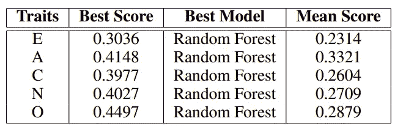

# 音乐中的个性检测

> 原文：<https://towardsdatascience.com/personality-detection-in-music-a78ac3a33cf5?source=collection_archive---------19----------------------->

## [实践教程](https://towardsdatascience.com/tagged/hands-on-tutorials)

音乐是我们用来表达自己的许多方式之一。从沮丧时听电台司令，到想去加州旅馆时听老鹰乐队。

作者图片

因此，[我](https://www.linkedin.com/in/miguelpmmarques/)和我的一个好朋友，也是我数据科学和工程硕士的同事[蒂亚戈·费尔南德斯](https://www.linkedin.com/in/tiago-f-972916177/)开始思考如何将音乐与人格特质联系起来。

# 测量个性

为了开始我们的研究，我们首先要决定如何测量人格。因此，在阅读了心理学领域的一些论文后，我们遇到了多种模型，目的是根据其特质来分析人格:**奥尔波特的特质理论**，**卡特勒的十六因素模型**，**艾森克的巨人三，**和**迈尔斯布里格斯类型指标**，然而，**大五模型**是当今人格心理学领域最广泛的模型。

# 大五模型

它包括在一个连续的范围内(从 0%到 100%)测量五种性格特征。更多的维度已经被尝试添加到这个模型中，但是，与具有更多维度的其他版本相比，当前的五个维度更加可靠和稳定。

[大五模型](https://blog.adioma.com/wp-content/uploads/2018/11/big-five-personality-traits-infographic-700x466.png)

> 如果你已经熟悉五大模型，你可以跳过下面的列表

五种性格特征如下:

*   外向:这种性格特征有两个众所周知的极端，外向和内向。这和与他人的交流互动有关。在这项测试中得分低的人更可能是沉默寡言、沉默寡言、深思熟虑的人。
*   宜人性:这一特质反映在社会和谐中，因此与友好、合作、能够原谅他人相关……在这一特质上得分很低的人往往不值得信任，反之亦然。
*   责任心:这种特质与想要把工作或任务做好、做仔细的品质有关。在这一性格特征上得分高的人往往更有责任感，更好地制定计划，因此与学习和工作中的良好表现相关联。另一方面，那些分数低的人往往更灵活，可塑性更强(极端情况下会疏忽大意)。
*   **神经质**:这种特质与低耐受性、抑郁、不安全感、愤怒、尴尬等(即情绪不稳定)有关。那些高度神经质的人更容易焦虑、悲伤和自卑。分数低的人更有勇气和自信。
*   **开放体验**:这是对冒险、不同寻常的想法、想象力和好奇心的欣赏。与得分低的人相比，在这一性格特征上得分高的人往往更愿意尝试新事物。

# **音乐**

我们的主要目标是为**音乐收藏**(又名播放列表)描绘出个性特征。所以我们决定使用 Spotify 播放列表，并将它们的特征映射到创建它们的人的个性特征上。

为了实现这一点，我们使用了[*spot ipy*](https://spotipy.readthedocs.io/en/2.12.0/)witch，它是用于 [Spotify Web API](https://developer.spotify.com/web-api/) 的轻量级 Python 库。有了 Spotify，你可以完全访问 Spotify 平台提供的所有音乐数据。所以我们用它来从播放列表中提取音乐数据(重要的是要提到我们只能访问公共播放列表)。

有了这个 API，我们决定从播放列表中的歌曲中提取出以下特征:

*   持续时间
*   声学
*   可跳舞性
*   活力
*   工具性
*   活性
*   音量
*   语音
*   效价
*   拍子

> 如果你想更好地理解这些功能的作用和代表，请查看*音频功能主题部分的 [Spotify 开发者 API](https://developer.spotify.com/documentation/web-api/reference/#endpoint-get-audio-features) 文档。*

# 收集数据

为了收集数据，我们决定创建一个[表单](https://miguelmarques422551.typeform.com/to/mureRXL8)，参与者在其中填写他们的 **Spotify 标识符**和一个 [**链接到五大测试**](https://www.truity.com/test/big-five-personality-test) ，然后是 5 个字段(每个字段代表一种人格特质)，供用户填写在同一测试中获得的结果。

> 值得一提的是，由于我们从头开始构建数据库，它并不完全平衡，因为我们不能为了拥有一个同质的数据库而排除用户。

我们总共从 85 个不同的用户(大多数是大学生)那里获得了大约 1000 个播放列表，因此我们能够将每个播放列表与创建它的用户的 5 种个性特征对应起来。

> 对于每个播放列表，我们计算了每个功能的歌曲的平均值。

# 数据分析

在数据收集的开始，为了获得我们正在处理的数据的一些敏感性，我们做了一个探索性研究，目的是从每个用户的播放列表中找到一些模式。

以下两个图是我们对数据进行的第一次分析。

随机选择的参与者的所有播放列表的特征的雷达图(重叠)

大五人格特征的柱状图

由于我们收集的数据非常混乱和随机，我们决定用 10 个值的 10 个区间来描述数据(0 是聚合 1 到 10 的值的最小区间，9 是聚合 91 到 100 的值的最大区间)。

> 通过这种方式，我们用这些原始数据和标准化数据分析了播放列表的特征在不同的个性特征方面的表现。

我们用这些线图的目的，在下面，是为了看看我们是否能在离散的数据中识别出一些模式(关于个性特征)，因为连续的(我们不会在这里展示)只是一个巨大的混乱。我们对所有的五大性格特征都做了这个，但是为了说明，我们将只展示**开放**的那些。

支线剧情中与开放性相关的原始特征

图中重叠的归一化要素

因此，用肉眼，我们可以看到性格特征与播放列表特征的相关性，并更详细地分析相关性最高的特征。下一步是计算性格特征和播放列表特征之间的相关性。

性状和特征之间的相关性

出于好奇，我们决定也独立分析个性特征和播放列表特征之间的相关性。

性状间的相关性

特征之间的相关性

从上面图中的相关矩阵中，我们还可以看到一些相关值较高的特征，如**能量**和**声音**。由此，我们可以得出结论，具有更多**能量**的播放列表往往具有更少的**声音**在下一个图中更详细。

相关能量和声学

# 特征选择

对于功能的选择，我们没有添加任何更多的功能，因为这项工作的重点依赖于播放列表的特性。然而，我们使用 ReliefF 的目的是为我们的目标选择一个特征。

利用 **ReliefF** 算法，我们对与 **5 个性特征**相关的特征进行了分类，能够了解哪些特征对每个特征来说更重要或更不重要。

救济的结果

从表中分析，一般来说，我们可以看到最重要的**特征**是我们预期的**化合价**和**能量**，而不太重要的**特征**是**舞蹈性**和**持续时间**。

# 机器学习

这里我们将讨论各种**分类**和**回归** **模型**，目的是预测多重人格特质。因此，我们决定独立对待每一种人格特质**，这不仅是因为所讨论数据的随机性(我们认为这只会使分类更加复杂)，还因为在关于人格检测主题的文献中，绝大多数也独立分析了各种特质。**

> **然后，我们使用由 **z 分数**标准化的播放列表的特征作为输入，并将每个离散的个性特征作为目标。**

> **我们使用 960 个播放列表中的 25%进行测试，其余 75%用于训练模型。**

> **对于排名，我们使用 **F1 分数**来分析哪些模型最适合不同的性格特征。**

**说到分类器，我们使用以下内容:**

*   **随机森林分类器**
*   **决策树分类器**
*   **额外树分类器**
*   **KNeighbours 分类器**
*   **支持向量分类器**
*   **朴素贝叶斯伯努利分类器**
*   **多层感知器分类器，具有 3 个隐藏层，每层 10 个神经元。**

**对于回归变量，我们使用以下公式:**

*   **线性回归**
*   **支持向量回归**

> **应该注意的是，所有的模型都在 Python 的 Scikit-Learn 库中。**

**我们还决定测试模型的不同数量的特性，从 2 个最重要的特性(根据 ReliefF)到所有 10 个特性。**

****

**f1-不同算法中不同数量特征的得分**

**由此，我们得出结论，大多数算法在所有特征都为**的情况下具有更好的性能，即使有很多 6 和 8 个特征的最佳分数。****

# **结果**

**在这一节中，我们将展示针对每一种性格特征测试的所有模型的结果。**

****

**宜人性得分**

****

**责任心得分**

****

**外向性得分**

****

**神经质得分**

****

**开放性得分**

**召回率和准确率最高的人格特质是**开放性**和**宜人性**，最高分 **44.9%** 和 **41.5%** 和**平均分**分别为 **28.8%** 和 **33.2%** 。从所做的测试中，我们能够得出结论，最好的模型是**随机森林分类器**(尽管**近邻分类器**也获得了非常好的结果)，而最差的模型是**线性回归**，主要是因为它不是为处理这种数据而设计的。**

****

**预测的结果**

# **发现的问题**

**由于我们是基于自己创建的在线调查从零开始建立数据库的，因此我们无法控制用户反馈的类型。这导致了一个不平衡的数据库。**

**我们不能使用像 SMOTE 这样的数据平衡算法，因为不仅**数据库平衡不佳**，而且**我们的目标**中也有缺失值。事实上，我们没有一个适当平衡的个性特征，这将使我们无法对整个数据领域进行适当的分析，这也将影响机器学习算法。**

# **结论**

**总之，我们认为工作远未完成，但进展顺利。这项研究让我们在性格检测和音乐领域学到了很多东西。虽然我们在这里没有得到任何惊人的结果，但我们相信，如果我们有更多的数据和一个更平衡的数据库，我们将能够超过 50%的 F1 分数。**

**虽然在我们阅读的文章中，外向性的特质在大多数情况下是获得最佳结果的特质，但在我们的工作中，它是得分最差的特质(这可能与我们不平衡的数据库有关)。**

**感谢阅读:)**