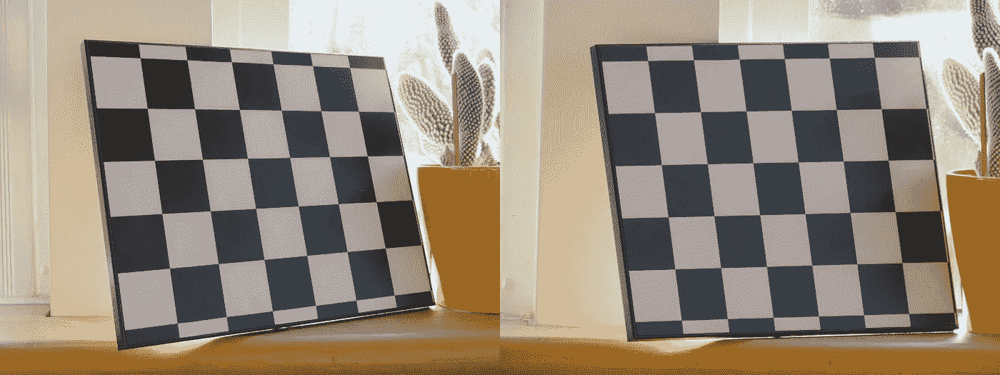

# 透视与仿射变换

> 原文：<https://towardsdatascience.com/perspective-versus-affine-transformation-25033cef5766?source=collection_archive---------5----------------------->

## 图像保持线平行吗？

你有没有注意到，当你拍摄一个矩形平面物体的图像时，角很少是 90 度？

图 1:透视投影扭曲的矩形。在 [Unsplash](https://unsplash.com/s/photos/street-sign?utm_source=unsplash&utm_medium=referral&utm_content=creditCopyText) 上 M[at the Feeney](https://unsplash.com/@matt__feeney?utm_source=unsplash&utm_medium=referral&utm_content=creditCopyText)拍摄的照片

这种现象是[透视投影](https://en.wikipedia.org/wiki/3D_projection#Perspective_projection)的一个特征，3D 场景中的点(例如，矩形的角)通过一个针孔被投影到一个平面(相机图像传感器)上。靠近摄像机的线段看起来比距离摄像机较远的相同长度的线段长。直角可能变成锐角或钝角，平行线可能看起来会向消失点会聚。

在自动检查平面物体的情况下，透视变形可能是一个问题。因为我们想要检查对象特征是否具有正确的形状和大小，所以我们想要“反转”透视变形。如果我们能做到这一点，我们就能得到一幅图像，使物体看起来好像照相机的轴垂直于物体的表面。

图 2:左:从两个不同的角度看一本书的图像。右图:透视变形得到补偿后的对应图像。图片由作者提供。

图 2 显示了反转透视扭曲的效果(代码[此处为](https://github.com/sebastiengilbert73/tutorial_affine_perspective/blob/main/book_compute_transforms.py))。在这种情况下，书的角被映射到一个正方形的任意点上，用红色圆圈标记。右侧的图像更适合自动检测，因为可以轻松定位特征并与模板进行比较。

# 翘曲，对，但是哪一个？

我们希望*扭曲*受透视失真影响的图像，使其恢复感兴趣平面的特征:角度失真最小，3D 中的平行线看起来平行。

OpenCV 提供了两个函数来做到这一点: [warpAffine()](https://docs.opencv.org/2.4/modules/imgproc/doc/geometric_transformations.html?highlight=resize#warpaffine) 和 [warpPerspective()](https://docs.opencv.org/2.4/modules/imgproc/doc/geometric_transformations.html?highlight=resize#warpperspective) 。它们具有相同的签名，除了 warpAffine()需要 2×3 的变换矩阵，而 warpPerspective()需要 3×3 的变换矩阵。这些矩阵分别由函数 [getAffineTransform()](https://docs.opencv.org/2.4/modules/imgproc/doc/geometric_transformations.html?highlight=resize#getaffinetransform) 和[getperspective transform()](https://docs.opencv.org/2.4/modules/imgproc/doc/geometric_transformations.html?highlight=resize#getperspectivetransform)计算。前者期望三对匹配坐标，后者期望四对匹配坐标。直观地说，得到三对比得到四对更容易，所以问题出现了:在什么情况下我们可以摆脱三对坐标，使用仿射变换而不是透视变换？

为了回答这个问题，让我们考虑图 3 中的两幅图像。

图 3:左图:棋盘格图像，相机在大约 1 米处。右图:棋盘格图像，相机在大约 7 米处。图片由作者提供。

虽然棋盘在两次图像捕捉之间没有移动，但图案看起来不同。在右侧图像中，相机距离物体约 7 米，线平行度比左侧图像保持得更好。如果我们计算仿射和透视变换，然后相应地扭曲这些图像(代码[这里是](https://github.com/sebastiengilbert73/tutorial_affine_perspective/blob/main/compute_transforms.py))，我们将获得如图 4 和图 5 所示的图像。

图 4:图 3 图像的仿射变换。棋盘上的点 A、B 和 C 被映射到相应的用红圈标记的任意点。图片由作者提供。

图 5:图 3 中图像的透视变换。棋盘上的点 A、B、C 和 D 被映射到相应的用红色圆圈标记的任意点上。图片由作者提供。

图 4 显示了使用点 A、B 和 c 的仿射变换的效果。右侧图像(在约 7m 处拍摄)得到了相当好的补偿，尽管并不完美(见图 6)。左侧图像仍然严重失真，因为点 D(在图像中甚至不可见)没有投影到靠近其对应的红色圆圈的任何地方。

图 6:图 4 的细节。D 点(蓝色圆盘)被投影得很近，但不完全在红色圆圈的中心。图片由作者提供。

图 5 显示了透视变换的效果。因为四个共面点 A、B、C 和 D 用于计算变换矩阵，所以透视变形在两种情况下都得到了很好的补偿，并且图像看起来相同。

我们应该使用的标准是**保持线平行度**。[仿射变换保持线平行](https://en.wikipedia.org/wiki/Affine_transformation)。如果要检查的物体在 3D 世界中具有平行线，并且图像中的对应线是平行的(例如图 3 的情况，右侧)，仿射变换就足够了。相反，如果 3D 世界中的平行线在图像中发散(例如图 3 左侧的情况)，仿射变换是不够的:我们需要透视变换。

# 透视变换的推导

将平面场景与像素坐标联系起来的透视变换来自于通过针孔的 3D 到 2D 投影的一般情况:

…其中 f 是焦距，(lx，ly)是像素的物理尺寸，(cx，cy)是相机的光学中心，以像素为单位。

等式(1)明确示出了针孔相机模型如何将 3D 点(X，Y，Z)投影到图像坐标(u，v ),直到缩放因子λ。从右到左阅读，它会说:

> 通过旋转和平移将世界坐标中的点转换为相机坐标中的坐标，然后将这些坐标投影到传感器平面中。

投影矩阵 P 具有 3×4 的形状。

**与透视变换的联系来自于场景(点(X，Y，Z)所在的地方)是平面的假设。**因此，Z = αX + βY + γ:

将等式(2)中的 P 项与α、β和γ混合，给出了新的 3×3 未知矩阵 M，**透视变换矩阵**:

为了求解 m 的项，我们必须首先在方程(3)中代入λ=m₂₀ X + m₂₁ Y +m₂₂，这给了我们两个含有九个未知数的齐次线性方程:

我们可以用物平面中的坐标(X，Y)和它们的像素值(u，v)之间的四个对应关系来求解透视变换矩阵 M 的九个元素(达到一个比例因子)。

> 我们有九个未知数。既然每封信都为我们提供了两个含有九个未知数的线性方程，为什么四封信(以及八个线性方程)就足够了呢？

因为我们处理的是[齐次线性方程组](https://en.wikipedia.org/wiki/System_of_linear_equations#Homogeneous_systems)，即方程(4)的右边是一个零向量。如果我们添加第九个独立的线性方程，我们将会陷入平凡解 m₀₀ = m₀₁ = … = m₂₂ = 0。我们通过求解四对方程(4)获得的解可以通过任意非零因子来缩放。我们通常用这个自由度来设定 m₂₂=1.

# 仿射变换

如前所述，仿射变换保持线平行。这意味着一个平行四边形总是映射到另一个平行四边形。当我们计算具有来自两个平行四边形的四个对应的透视变换矩阵时(例如图 5 的情况，右侧)，我们观察到 m₂₀和 m₂₁项非常接近于零。你可以用[这个脚本](https://github.com/sebastiengilbert73/tutorial_affine_perspective/blob/main/parallelogram_mapping.py)来验证这个观察结果，这个脚本比较了普通四边形和平行四边形之间的透视变换矩阵。

图 7:映射两个平行四边形的角的透视变换矩阵的第三行约为[0 0 1]。图片由作者提供。

如果你对经验观察不满意，这里有一个更有说服力的论点:

> 平行四边形到另一个平行四边形的映射可以分解为平移、旋转、剪切、轴缩放、剪切、旋转和平移(加上可选的反射)。这些变换中的每一个都可以由第三行是[0 0 1]的矩阵来表示，因此它们的乘积的第三行也是[0 0 1]。

仿射变换的特殊情况的等式(3)可以写成:

…我们使用透视变换矩阵的自由度来任意设置 a₂₂=1，通过这样做，我们摆脱了(烦人的)λ乘数。我们可以重新排列这些项，以展平未知向量中的仿射变换项:

通过(6)，每封信为我们提供了两个 6 个未知数的线性方程。这就是为什么三个对应足以定义一个仿射变换矩阵。

# 结论

我们从一组对应关系中解决了在平面场景中用像素坐标映射坐标的问题。哪种类型的变换，透视变换还是仿射变换，这个问题占据了本文的中心部分。

我必须承认，直到最近我才注意到这个问题。我面临的情况是，除了三个对应点之外，转换没有将对象特征映射到它们的理论位置。在深入挖掘透视变换矩阵的起源后，我对仿射变换矩阵的特殊情况有了更好的理解。我希望现在已经很清楚，我们必须注意保持平行，以便决定转变的类型。

感谢您的宝贵时间！

[1]在真正的相机中，镜头取代了针孔。镜头允许更多的光到达传感器，代价是减少了景深。

[2]图书参考:*从 A 到 Z，动物和字母的惊人冒险*，索菲·罗森恩·鲍彻，马克索&毕索，2021