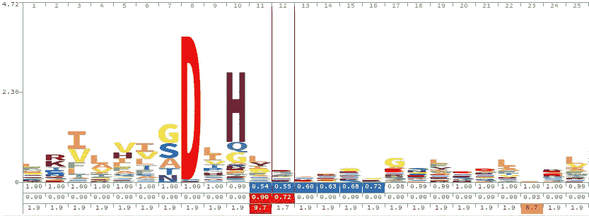

# 使用 Python 进行 Pfam 数据库过滤

> 原文：<https://towardsdatascience.com/pfam-database-filtering-using-python-164c3131c897?source=collection_archive---------35----------------------->

## 通过字符串搜索选择隐马尔可夫模型(HMM)



取自 [Pfam](https://pfam.xfam.org/family/PF00149#tabview=tab4) 上 Metallophos (PF00149)的 HMM 标志图截图。

在生物信息学中，隐马尔可夫模型(hmm)用于识别在功能方面可能进化相似的序列。隐马尔可夫模型试图在给定观察到的 Y(氨基酸序列)的情况下或者对于贝叶斯纯粹主义者:P(X | Y)的情况下指定 X(在这个例子中是函数)。在上面的徽标中，其他具有感兴趣功能的基因(金属磷)可能在第 8 位含有 D(天冬氨酸)，在第 10 位含有 H(组氨酸)。如果这两个氨基酸存在于一个未标记的基因中，那么称这个新基因的功能为金属蛋白的信心就会增加。XKCD(不出所料)有一个很棒的漫画解释了条件(Y)的观测如何影响 X(太阳爆炸)的预测。


图像归功于 [XKCD](https://xkcd.com/1132/) 。

隐马尔可夫模型在生物信息学中有着广泛的应用。一个被充分利用的存储蛋白质功能域 hmm 的仓库是 [Pfam 数据库](https://pfam.xfam.org/)。Pfam 数据库由 Erik Sonhammer、Sean Eddy 和 Richard Durbin 于 1995 年创建，用于帮助基因组注释。Pfam 34.0 于 2021 年 3 月 24 日发布，包含 19179 个蛋白质家族。蛋白质家族是共享相似序列或功能的一组蛋白质。Pfam 提供了一个 [FTP 站点](http://ftp.ebi.ac.uk/pub/databases/Pfam/current_release/)来下载整个数据库。Pfam 网站在允许用户搜索关键字和感兴趣的 Pfam 方面做得很好，但是，直到现在，在查询之后，下载感兴趣的家族是一个耗时的手动过程。

**从数据库中过滤 Pfams】**


照片由法国人 Daphné Be 在 Unsplash 上拍摄

步骤 1:下载 Pfam-A.hmm.gz 数据库

Pfam-A.hmm 数据库可以从 [FTP 站点](http://ftp.ebi.ac.uk/pub/databases/Pfam/current_release/)访问和下载。解压后需要 1.5GB 多一点的内存，所以要准备好。

步骤 2:选择您的家庭或查询选项

本文中的示例是查找包含单词“metallophos”的域。下载数据集中的 Pfams 描述不会像基于网络的搜索那样全面，因为域仅包含家族名称和简短的功能描述文本。

步骤 3:进行过滤

```
from re import search, IGNORECASE
```

re 模块是 Python 标准库的一部分。在数据库中，Pfams 由“//”分隔。我可以将所有内容读入内存，但是，您可以通过下面的 awk 命令分割 Pfam-A.hmm 文件，并搜索每个文件:

**注意:将 n=10000 改为较小的数据库文件

```
awk -v n=10000 'BEGIN{RS=ORS="//\n"; FS=OFS="\n"; c=0} {$1=$1; if(NR%n==1){close(f); f="file_" ++c ".txt"}; print >f}' Pfam-A.hmm
```

为了将 Pfam 记录分割成一个列表，我们用两个正斜杠("//")分割数据库文件。我们还删除了最后一条记录，它对应于一个空条目。

```
a_file = open("Path_to_your/Downloads/Pfam-A.hmm", 'r')file_contents = a_file.read().split('//')[0:-1]
```

现在是字符串搜索魔术:

```
## Our query string
substring="metallophos"## Loop through our database list
for file in file_contents:
     ## Check if substring is in record 
     if search(substring, file, IGNORECASE):
        if file[:1] == '\n':
            file = file[1:]
        ## Write matches to new file
        with open("metallophos.hmm", "a") as myfile:
            myfile.write(file+"//\n")
```

就是这样！我们对子串 metallophos 的搜索返回了 6 个 Pfam 家族，我们可以用它们来搜索我们感兴趣的基因组以识别相似的功能域。我叫科迪·格利克曼，可以在 LinkedIn 上找到我。一定要看看我的其他一些文章！

[](/data-augmentation-in-medical-images-95c774e6eaae) [## 医学图像中的数据增强

### 如何通过重塑和重采样数据来提高视觉模型的性能

towardsdatascience.com](/data-augmentation-in-medical-images-95c774e6eaae) [](/building-a-beautiful-static-webpage-using-github-f0f92c6e1f02) [## 使用 GitHub 创建漂亮的静态网页

### 查找模板和为静态网页创建表单的位置

towardsdatascience.com](/building-a-beautiful-static-webpage-using-github-f0f92c6e1f02) [](/creating-photo-mosaics-using-python-49100e87efc) [## 使用 Python 创建照片镶嵌

### 一步一步的教程，让你自己的美丽的图像

towardsdatascience.com](/creating-photo-mosaics-using-python-49100e87efc) 

[1] Sonnhammer，Erik LL，Sean R. Eddy 和 Richard Durbin。" Pfam:基于种子比对的蛋白质结构域家族综合数据库."*蛋白质:结构、功能和生物信息学*28.3(1997):405–420。