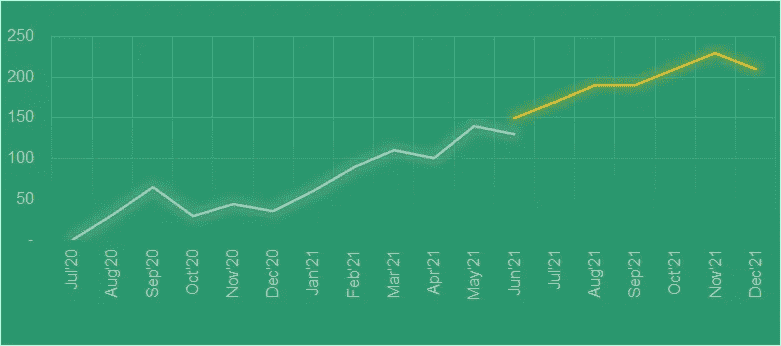
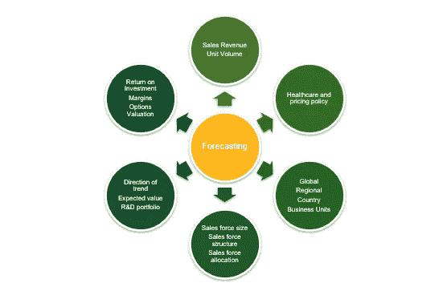
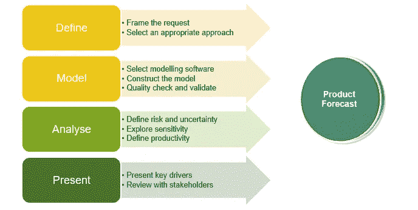

# 医药品牌销售预测

> 原文：<https://towardsdatascience.com/pharma-brand-volume-forecasting-fc85d0c10aaa?source=collection_archive---------22----------------------->

## 建立预测的特定行业视角

Powerpoint 创建的图表，图片由作者提供

我记得当我开始在 ARIMA 预测毒品数量时，问了我的同事/前辈一个问题，团队的其他成员使用随机森林模型预测未来三个月的毒品数量。问题是，“预测和预报之间有什么区别吗？”我过去得到的回答是“是的”，但我从未满足过。在他们的讨论中，我意识到他们之间有一种看法，认为两者非常不同。但随着时间的推移，当我从事一个为期 6 个月的预测项目时，我意识到有一条细线，预测只是预测建模最常见的应用之一。那么，到底什么是预测？以及它如何适应预测分析领域？

# 什么是预测？

对一个普通人来说，预测是基于现在和过去的情景对未知的**未来**(主要关键字)的最佳判断(简单地说，预测)，而预测只是基于未知的数据对结果进行估计。所以，综上所述，预测是带有时间信息的预测的子集，即时间序列数据。很多人都在致力于准确预测，但这是机器学习领域最具挑战性的任务之一，因为未来存在不确定性。许多人尝试过，但都失败了，因为他们要么高估了实际数字，要么取得了远远超出预期的成就。因此，这是一个持续的改进过程，将会看到市场上出现许多新方法。

# 预测的目的是什么？

为了更深入地研究制药预测，第一个重要的问题是任何制药公司预测的目的是什么？它可以有多种用途- *，如收入规划、生产规划、资源分配、项目优先排序、合作决策、补偿计划、游说工作等等*。这使得预测更具挑战性，因为它需要迎合不同的利益相关者。预测利用的另一个复杂性是它是单向使用(在一些其他函数中输入)还是双向使用(用于量化预测中其他市场事件的影响/贡献，称为“**预测函数**”)。因此，了解预测对象选择最佳方法的需求至关重要。

*图片:其他职能领域的预测链接:*

Powerpoint 智能艺术，作者图片

# 未来有什么？

到项目结束时，我明白预测的下一个最重要的方面是记录风险承担者在推动预测时考虑的输入场景和假设，因为这些用于指导资源分配决策。预测者可能无法收集其他职能团队参与的影响品牌的所有领域。请注意，这是一个持续的过程，会根据不断变化的资源分配不时调整预测。

# 预测不是数字！

另一方面，需要强调的是，预测一般不是一个数字。但在行业中，提供一系列预测是很常见的，包括未来不确定性的变化。这被称为概率预测。

# 构建您自己的第一个预测模型

现在，作为一名预测者，我将直接进入下一部分，即如何创建预测。

A.定义对预测的需求(在上一节已经讨论过)

B.评估预测的最终受众，即侧重于业务/流程还是侧重于技术？

C.历史品牌销售和活动动态的市场研究(新的/市场内)

D.选择适当的方法并在模型中包含相关的市场资源。

E.最终确定最佳未来假设并分析预测结果

F.呈现给最终用户，即所有利益相关者。

G.在预测模型中添加反馈循环，以便将来进行调整。

*图片:预测的过程:*

Powerpoint 智能艺术，作者图片

B.为什么需要评估目标受众？

在我项目的每个阶段，我都觉得，虽然最初客户希望利用技术含量高的高级预测分析，如基于树的模型进行预测，但他们后来意识到，由于复杂的机器学习模型带有“黑盒”的光环，它可能不够透明，无法在组织内传播给更广泛的受众。此外，人们认识到，最终用户很难对这种模型进行简单的修改，以频繁调整预测。因此，我们在我们的机器学习模型上建立了一个模拟器，允许客户根据不同的场景调整预测。

所以，我认为真正的责任在于预报员提供满足观众需求的预测方法。

C.无论是新产品还是成熟产品，最重要的是了解品牌在市场中的定位。如果是新产品，由于缺乏数据，预测建模可能不可行，市场研究将是首选(尽管可以考虑类似的旧类比)。在我的案例中，该药物是一个成熟的重磅炸弹，这意味着在市场上有足够的历史数据(5 年)来继续进行。因此，我花了大量时间了解过去每月的时间序列销售，以发现趋势，周期，偏差，逐月增长。

现在，下一个最重要的问题是如何选择“正确的”预测方法？

1.在我们项目的最初讨论中，最初的对话是关于预测的时间范围。这对于预先了解缩小最佳方法和建模结构是非常重要的。因为我必须做一年的模型预测，所以我选择累计月度水平预测以提高准确性。

2.下一个问题是预测水平；对我来说，这是国家和地区&付款人层面(我们称之为次国家)的预测，因为这些推动了客户的业务发展。

# 结论

到目前为止，我们已经介绍了什么是预测、预测的需求/目的、预测面临的一般挑战，然后从预测者的角度从头开始构建预测。下一篇文章将涵盖最关键的部分，即模型的开发和最终短期预测的呈现。

我将在下一篇文章中继续介绍详细的模型代码/流程图。

**注:**一些参考资料/图片摘自阿瑟·G·库克的书《制药业预测》