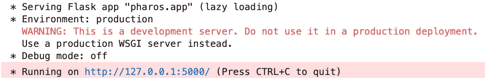
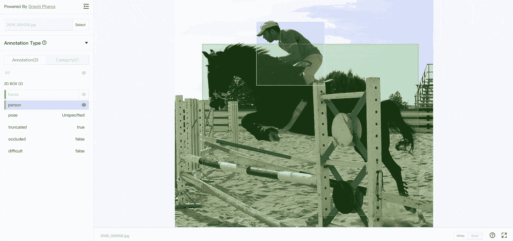
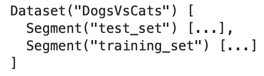
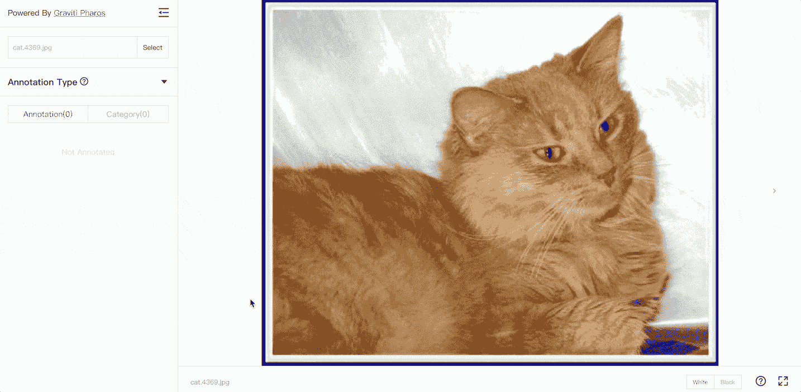

# Pharos:如何用 4 行代码可视化高级计算机视觉数据集

> 原文：<https://towardsdatascience.com/pharos-how-to-visualize-advanced-computer-vision-datasets-with-4-lines-of-code-e4e49d59b974?source=collection_archive---------25----------------------->

## 这个免费的 Python 库可以为您节省大量时间。但是有什么问题吗？


[Bermix 工作室](https://unsplash.com/@bermixstudio?utm_source=unsplash&utm_medium=referral&utm_content=creditCopyText)在 [Unsplash](https://unsplash.com/?utm_source=unsplash&utm_medium=referral&utm_content=creditCopyText) 拍摄的照片

近年来，深度学习已经取得了很大进展。从业者现在已经远远超出了简单的图像分类任务。在图像和视频中检测甚至分割感兴趣的对象变得越来越容易。计算机视觉已经走过了漫长的道路，但有些东西多年来没有改变。可视化就是其中之一。

[Pharos](https://tensorbay-python-sdk.graviti.com/en/stable/features/visualization.html) 是一个用于可视化高级计算机视觉数据集的免费库——想想物体检测。它围绕您的数据集构建了一个 Flask web 应用程序，从而使探索变得毫不费力。

通过使用 Pharos，您可以轻松地探索数据集是如何标记的，并确定是否存在任何数据质量问题。该网络应用程序将向您展示现代标签软件所能提供的一切，而无需过多的选项。

*听起来不错？*让我们先解决问题。

# 法罗斯适合你吗？

大多数数据科学社区从 [Kaggle](https://www.kaggle.com) 获取数据集。组织拥有自己处理的内部数据集，大部分不向公众开放。默认情况下，Pharos 只能可视化来自非常狭窄的数据源的数据集— [Graviti Open Datasets](https://gas.graviti.com/open-datasets) 。这是更高级的计算机视觉问题的一种替代方案。

您可以使用 Pharos 来可视化任何图像数据集，但是有一个问题—您必须手动编写数据加载器。您可以在项目之间复制/粘贴 95%的代码，只需修改路径，因此不会花费您太多时间。

这篇文章将向您展示如何可视化 [VOC2012 检测](https://gas.graviti.com/dataset/hellodataset/VOC2012Detection)数据集，这是一个对象检测数据集，包含来自“flickr”网站的人、动物、车辆和室内物品，因此使用它意味着您同意他们的[许可和条款](https://www.flickr.com/help/terms)。它还将向您展示如何从零开始为 Kaggle 的[猫对狗](https://www.kaggle.com/chetankv/dogs-cats-images)数据集创建一个数据加载器，该数据加载器在 [CC0: Public domain](https://creativecommons.org/publicdomain/zero/1.0/) 下获得许可。

您将在下一节看到如何使用 Pharos。

# Pharos —开始

让我们从创建一个新的虚拟环境开始。我给我的取名为`pharos_env`。下面是如何用 Anaconda 创建它:

```
conda create --name pharos_env python=3.8
conda activate pharos_env
```

下一步是安装所需的库。你只需要`pharos`，但是我也会安装 JupyterLab。欢迎您使用任何其他 IDE。安装 Pharos 将会处理所有相关的库，比如底层的 TensorBay。

```
conda install -c conda-forge jupyter jupyterlab
pip install pharos
```

就是这样！接下来您可以启动 JupyterLab:

```
jupyter lab
```

你必须使用`VOC2012Detection`数据加载器来加载 Pharos 创建应用程序所需的一切。数据加载器需要一个参数，即数据集的路径:

```
from tensorbay.opendataset import VOC2012Detection

dataset = VOC2012Detection('VOCdevkit/VOC2012')
```

数据集已成功加载！现在，您可以使用以下两行将其可视化:

```
from pharos import visualize

visualize(dataset)
```

执行上述代码行后，您将看到以下内容，表明 Flask 应用程序已成功启动:



图 1 — Pharos 应用程序已在本地主机上启动(图片由作者提供)

现在，应用程序已经在本地主机上运行了。可以去`127.0.0.1:5000/`探索一下:



图 2 — Pharos 数据集可视化应用程序(图片由作者提供)

如您所见，Pharos 允许您从数据集中选择任何图像，并探索带注释的对象。可以很容易地看出注释是否正确，数据集是否组织正确。

# 在自定义数据集上使用 Pharos

现在是从零开始编写数据加载器的繁琐部分。您将为 Kaggle 的[狗对猫](https://www.kaggle.com/chetankv/dogs-cats-images)数据集编写一个，但该代码应该适用于任何图像分类数据集。

如果您想学习如何为对象检测和分割数据集编写数据加载器，请告诉我。

开始之前，请确保您的数据集已按以下方式格式化:

```
dataset/
    test_set/
        cat.0.jpg
        ...
        dog.0.jpg
        ...
    training_set/
	cat.0.jpg
	...
	dog.0.jpg
	...
```

猫和狗的图像应该在同一个文件夹中。您不应该为每个图像类都有一个单独的目录。

先做最重要的事——库导入。你需要`os`、`glob`和`tensorbay`的几个类:

```
import os
import glob
from tensorbay.dataset import Data, Dataset
from tensorbay.label import Classification
```

下一步是创建一个`catalog.json`文件。它将包含分类类别的名称。在根目录(而不是数据集目录)中创建文件，并粘贴以下内容:

```
{
    "CLASSIFICATION": {
        "categories": [{ "name": "cat" }, { "name": "dog" }]
    }
}
```

下一步是编写一个函数，在给定数据集路径的情况下创建一个`tensorbay.dataset.Dataset`对象。该函数的工作是创建一个`Dataset`对象，并存储训练集和测试集的图像路径。该函数使用 TensorBay 的`Data`和`Classification`类进行适当的转换并分配类标签。

代码如下:

快到了！现在可以调用`DogsVsCats()`函数并传递数据集路径:

```
dataset = DogsVsCats('/Users/dradecic/Desktop/PharosData/dataset/')
```

下面是`dataset`变量的内容:



图片 3-tensor bay 数据集对象内容(图片由作者提供)

剩下唯一要做的就是可视化数据集。您可以使用以下代码来实现这一点:

```
from pharos import visualize

visualize(dataset)
```

将打开另一个烧瓶应用程序。它看起来是这样的:



图 4 —自定义数据集上的 Pharos 数据可视化应用程序(图片由作者提供)

现在你已经知道了——如何使用 Pharos 可视化定制数据集。

问题仍然是，*你应该使用 Pharos 吗？让我们在下一部分回答这个问题。*

# 判决

默认情况下，Pharos 并不是非常有用。最大的缺点是它受限于[开放数据集](https://gas.graviti.com/open-datasets)，无法可视化任何来自其他来源的数据。此外，每个数据集在`tensorbay.opendataset`中都有自己的类。这对于最终用户来说是非常乏味的，我希望在未来的版本中看到改进。

您可以通过编写自己的数据加载器来减轻上述缺点。当然，这需要一些编码，但是最终的 web 应用程序是值得的。也许不是为了简单的图像分类，但肯定是为了更高级的对象检测数据集。

*你怎么看？您在可视化对象检测和对象分割数据集方面有什么经验？*在评论区告诉我。

*喜欢这篇文章吗？成为* [*中等会员*](https://medium.com/@radecicdario/membership) *继续无限制学习。如果你使用下面的链接，我会收到你的一部分会员费，不需要你额外付费。*

<https://medium.com/@radecicdario/membership>  

# 保持联系

*   在 [Medium](https://medium.com/@radecicdario) 上关注我，了解更多类似的故事
*   注册我的[简讯](https://mailchi.mp/46a3d2989d9b/bdssubscribe)
*   在 [LinkedIn](https://www.linkedin.com/in/darioradecic/) 上连接