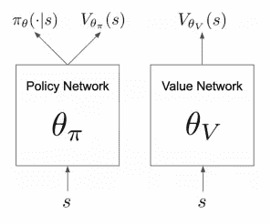
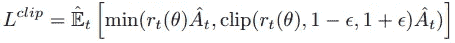
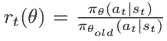
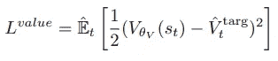
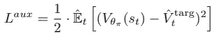
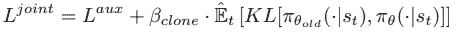
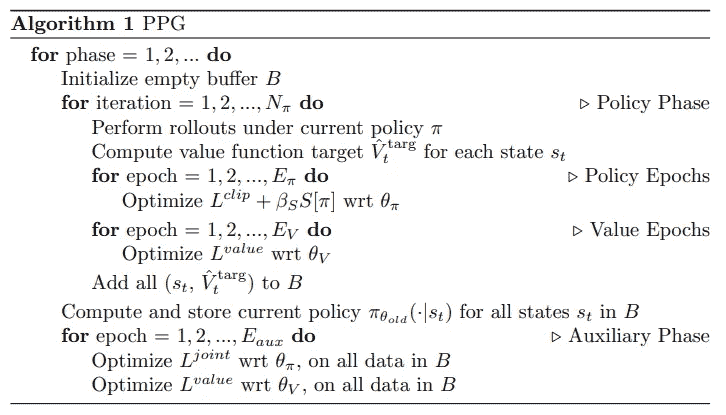
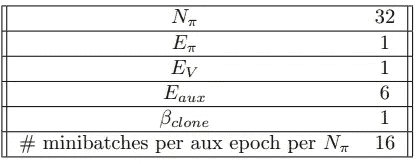
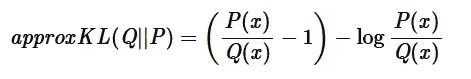

# 阶段性政策梯度(PPG)第 1 部分

> 原文：<https://towardsdatascience.com/phasic-policy-gradient-ppg-part-1-98e01e0f1ffe?source=collection_archive---------18----------------------->

## 对 PPG 背后理论的直观探究

这是我将讨论 PPG 算法背后的理论的两部分系列的第 1 部分。接下来请务必查看 PyTorch 中的 [**第 2 部分**](/phasic-policy-gradient-ppg-part-2-c93afeaf37d4) 的实现。

照片由[安托万·道特里](https://unsplash.com/@antoine1003?utm_source=medium&utm_medium=referral)在 [Unsplash](https://unsplash.com?utm_source=medium&utm_medium=referral) 上拍摄

# 先决条件

如果你有近似政策优化(PPO)的工作知识和行动者批评方法背后的一般数学知识，这会有所帮助。否则，我会在整篇文章中提供一系列参考资料链接来帮助您:)

# 联合演员评论家网络的困境

行动者批评框架依赖于同时优化两个不同的目标:政策和价值函数。简而言之，通常由 ***π*** (a|s)表示的策略表示代理将从给定的观察到的环境状态中采样的行为的贝叶斯分布，并且价值函数描述了处于特定环境状态的预期(折扣)回报。神经网络非常擅长逼近函数！但是一个问题出现了；我们应该用一个神经网络同时逼近这两个函数吗？

让我们考虑一下这样做的好处:

1.  根据经验，由每个目标训练的特征可以用来更好地优化另一个:)
2.  使用一个网络比两个网络使用的内存更少:)

然而，也有一些缺点:

1.  当使用共享参数时，总是存在一个目标的优化将干扰另一个目标的优化的风险:(
2.  两个目标都需要相同水平的样本重复使用。一般来说，价值函数的目标是偏离策略的，因此它具有更高的采样效率:(

# 该算法

PPG 背后的想法是将两个目标的训练解耦，同时仍然允许将学到的价值函数特征注入到策略网络中。为此，如图 1 所示，使用了不相交的策略和值网络:

图 1:分离的策略和价值网络[1]

两个θ代表各自网络的网络参数(权重和偏差)。此外，使用了两个不同的培训阶段，即*政策阶段*和*辅助阶段*。

## 政策阶段

策略阶段的目标是优化策略网络本身的训练。

在这一阶段，代理接受与最近策略优化(PPO)相同目标的培训。具体而言，使用以下目标训练策略网络:

PPO 政策目标函数[1]

其中:

更新前当前策略和旧策略之间的比率[1]

而 **A** 代表优势函数。这背后的想法是剪辑更新，以便新策略不会在任何单个更新中偏离旧策略太多；导致更稳定的训练。通常，熵项被添加到这个函数中以鼓励探索(因为均匀分布具有最大熵)。有关这方面的更多详细信息，请参见[2]。

此处，值网络也用预测值和目标值之间的均方差进行更新:

价值网络目标函数[1]

价值目标和优势函数都是用广义优势估计(GAE)计算的；在所有可能的滑跑长度上 TD 估计值的指数平均值。有关这方面的更多详细信息，请参见[3]和[4]。

## 辅助阶段

辅助阶段的目标是优化价值网络的训练，同时也将一些价值特征注入策略中，以帮助其未来的训练。

价值网络的更新就像在策略阶段一样，具有相同的目标函数。

请注意图 1 中策略网络的辅助值标题。**这是将学习到的价值特征注入策略网络的关键！**现在，我们可以使用这个头部在任意辅助目标函数上训练策略网络。例如，在这种情况下，我们希望添加有用的价值特征，因此我们可以让这个头部预测输入环境状态的值，就像价值网络一样。这样做时，使用相同的价值损失目标函数，除了预测值取自辅助头而不是价值网络:

辅助阶段策略网络的价值目标函数[1]

然而，仍然存在优化辅助目标函数将干扰政策目标的风险。我们不想在辅助阶段破坏政策阶段取得的进展！为了防止这种情况，我们可以简单地在辅助阶段之前的策略和当前预测的策略之间添加 Kullback-Leibler (KL)散度项:

辅助目标函数[1]

对于那些不熟悉 KL 散度的人来说，它是从信息论中推导出来的，本质上描述了当两个输入分布相同时，全局最小值为 0 的两个分布如何不同。β系数控制当前策略与前一个策略的接近程度。如果设置得更大，则 KL 散度项的梯度值将更大，并且总的来说，梯度下降将推动策略更趋向于优化该目标而不是辅助目标，反之亦然。

## 将一切联系在一起

图 2 显示了如何结合策略和辅助阶段来创建 PPG 算法，图 3 显示了本文中使用的默认超参数。

图 2: PPG 算法[1]

图 3: PPG 默认超参数[1]

策略阶段每运行 **N** 次，我们就运行一次辅助阶段。由于该算法的主要目标是优化策略，所以该策略频率参数可以设置得相对较高，因为辅助阶段不直接优化策略。

为了保存对另一个超参数的调整，值时期的数量被设置为与策略时期的数量相同。这可以设置得更高，但没有必要，因为价值网络主要针对辅助阶段。

策略阶段是基于策略的，因此它不会从样本重用中受益。结果，策略时期的数量保持较低，并且在每次策略更新之后收集新的一批经验。

价值函数与策略无关，因此辅助阶段受益于相对于策略阶段的高样本重用，因为其目标是优化价值网络。因此，辅助时期的数量高于策略时期的数量。

前面讲过β系数如何平衡 KL 散度和辅助值目标函数。在本文中，该术语默认设置为 1。但是，这也取决于 KL 散度是如何计算的。不幸的是，KL 散度对于所有的分布都没有封闭的解。因此，有时会使用近似值:

反向 KL 散度的近似形式

这个推导可以在我的文章 [**这里**](/approximating-kl-divergence-4151c8c85ddd) 中找到。这通常小于完全 KL 散度，因此β系数应根据使用的形式适当改变。

# 总结想法

PPG 为联合网络 PPO 算法提出的许多问题提供了一个简单而强大的解决方案。让我们回顾一下优势:

1.  更高的采样效率:)
2.  向策略注入更多受控值:)

然而，与任何事物一样，也有缺点:

1.  更多需要考虑的超参数:(
2.  两个网络的内存需求增加:(

对于第二个缺点，可以使用单个网络，并在策略阶段简单地分离最后一个共享图层的值函数梯度。这与两个网络解决方案的性能基本相同，因此使点静音。

一件令人兴奋的事情是，还有哪些辅助目标可以用来进一步提高性能！

我希望这篇文章对您有所启发，请务必查看 PyTorch 中的 [**第 2 部分**](/phasic-policy-gradient-ppg-part-2-c93afeaf37d4) 。

由 [Unsplash](https://unsplash.com?utm_source=medium&utm_medium=referral) 上的[卡斯滕·沃思](https://unsplash.com/@karsten_wuerth?utm_source=medium&utm_medium=referral)拍摄的照片

如果您觉得这篇文章有用，请考虑:

*   跟踪我🙌
*   [**订阅我的邮件通知**](https://medium.com/subscribe/@rohan.tangri) 永不错过上传📧
*   使用我的媒介 [**推荐链接**](https://medium.com/@rohan.tangri/membership) 直接支持我，并获得无限量的优质文章🤗
*   使用我的 [**自由贸易链接**](https://magic.freetrade.io/join/rohan/1095e108) 获得价值 3- 200 英镑的免费份额🤑

# 参考

[1]卡尔·科布、雅各布·希尔顿、奥列格·克里莫夫、约翰·舒尔曼[https://arxiv.org/abs/2009.04416](https://arxiv.org/abs/2009.04416)提出的阶段性政策梯度

[2]约翰·舒尔曼、菲利普·沃尔斯基、普拉富拉·德里瓦尔、亚历克·拉德福德、奥列格·克里莫夫[https://arxiv.org/abs/1707.06347v1](https://arxiv.org/abs/1707.06347v1)的《近似政策优化算法》

[3]约翰·舒尔曼、菲利普·莫里茨、谢尔盖·莱文、迈克尔·乔丹、彼得·阿贝耳[https://arxiv.org/abs/1506.02438](https://arxiv.org/abs/1506.02438)使用广义优势估计的高维连续控制

[4] A (Long)窥视强化学习作者 Lilian Weng[https://Lilian Weng . github . io/lil-log/2018/02/19/A-Long-Peek-into-Reinforcement-Learning . html # combining-TD-and-MC-Learning](https://lilianweng.github.io/lil-log/2018/02/19/a-long-peek-into-reinforcement-learning.html#combining-td-and-mc-learning)

[5]约翰·舒尔曼[http://joschu.net/blog/kl-approx.html](http://joschu.net/blog/kl-approx.html)的《逼近 KL 散度》