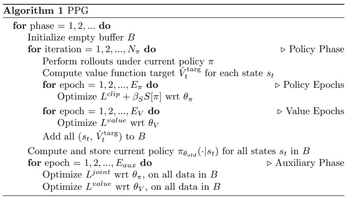

# 阶段性政策梯度(PPG)第二部分

> 原文：<https://towardsdatascience.com/phasic-policy-gradient-ppg-part-2-c93afeaf37d4?source=collection_archive---------15----------------------->

## PyTorch 中的实现

**如果你只是想要一个代码的链接，** [**这里就是**](https://github.com/09tangriro/ppg) **。尽情享受吧！**

照片由 [Florian Olivo](https://unsplash.com/@florianolv?utm_source=medium&utm_medium=referral) 在 [Unsplash](https://unsplash.com?utm_source=medium&utm_medium=referral) 上拍摄

在本系列的第一部分中，我们探究了 PPG 背后的理论。这一次，我们将采用一种更实用的方法，在 LunarLander-v2 环境上测试之前，使用 PyTorch 实现该算法！！

提醒一下，算法本身如下图 1 所示:

图 1: PPG 算法[1]

# 把密码给我！

这篇文章的目的是作为一个演示，如果你想要更多的功能，请留意[这个链接](https://github.com/09tangriro/stable-baselines3-contrib)，我在这里将算法添加到[稳定基线 3 Contrib](https://github.com/Stable-Baselines-Team/stable-baselines3-contrib) 开源库！

## 缓冲

我们需要两个缓冲器。一个用于训练策略阶段并跟踪代理在每个时间步经历的展开，另一个用于训练辅助阶段，它需要存储在每个时间步遍历的值目标和状态。代码 1 中定义了必要的存储器参数。注意，AuxMemory 包含一个 old_values 条目，尽管图 1 中的算法没有指定这一点。这样做是为了允许更新函数中的值裁剪，以便进行更稳定的训练。

代码 1:记忆类型

在代码 2 中，我们使用了集合库中的 deque 数据结构，所以我们不需要担心自己直接实现复杂的缓冲区！我们将把 AuxMemory 元组添加到 aux_memories 缓冲区，把 Memory 元组添加到 memories 缓冲区。

代码 2:缓冲区

## 网络

接下来，让我们定义我们将使用的神经网络。为了保持简单，我们坚持使用多层感知器(MLPs ),但也可以随意摆弄其他更有趣的网络！记住 PPG 的要点是有两个不相交的网络，所以我们定义了两个网络类，一个用于演员，一个用于评论家。

代码 3 中显示了参与者。注意，我们定义了两个头；actor_head 将输出用于策略分布的预测策略参数，而 value_head 将输出预测辅助值。

代码 3:演员神经网络

代码 4 中显示了批评家。这甚至比演员没有额外的头，只是一个香草 MLP 网络更简单！

代码 4:评论家神经网络

## 培养

有两个培训阶段，让我们从代码 5 所示的策略阶段开始。

代码 5:策略阶段

clipped_value_loss 如代码 6 所示，可用于促进更稳定的训练:

代码 6:限幅值损失函数

代码 7 说明了辅助阶段。希望现在我们在辅助存储器中存储旧值预测的原因更加明显，因为这里的值损失使用代码 6 中的 clipped_value_loss。

代码 7:辅助阶段

## 主循环

现在，我们只需要把所有东西放在一起。代码 8 显示了主循环。**关键线路是从 105 到 112** ，它们规定了培训时间表。

代码 8:主 PPG 环路

需要注意的是，这是为具有明确分布策略的代理而设计的，所以**连续代理在这里不兼容！**

# 结果

我们使用 OpenAI gym 的 LunarLander-v2 环境来测试我们的代理，在下面的 7500 场比赛后检查结果:

特工经过 7500 场训练！

很明显，代理在开始时出了一点问题，但能够自我纠正，再多一点培训，它可能会做得更好！

如果您觉得这篇文章有用，请考虑:

*   跟踪我🙌
*   [**订阅我的邮件通知**](https://medium.com/subscribe/@rohan.tangri) 永不错过上传📧
*   使用我的媒介 [**推荐链接**](https://medium.com/@rohan.tangri/membership) 直接支持我，并获得无限量的优质文章🤗
*   使用我的 [**自由贸易链接**](https://magic.freetrade.io/join/rohan/1095e108) 获得价值 3- 200 英镑的免费份额🤑

# 参考

[1]卡尔·科布、雅各布·希尔顿、奥列格·克里莫夫、约翰·舒尔曼[https://arxiv.org/abs/2009.04416](https://arxiv.org/abs/2009.04416)提出的阶段性政策梯度