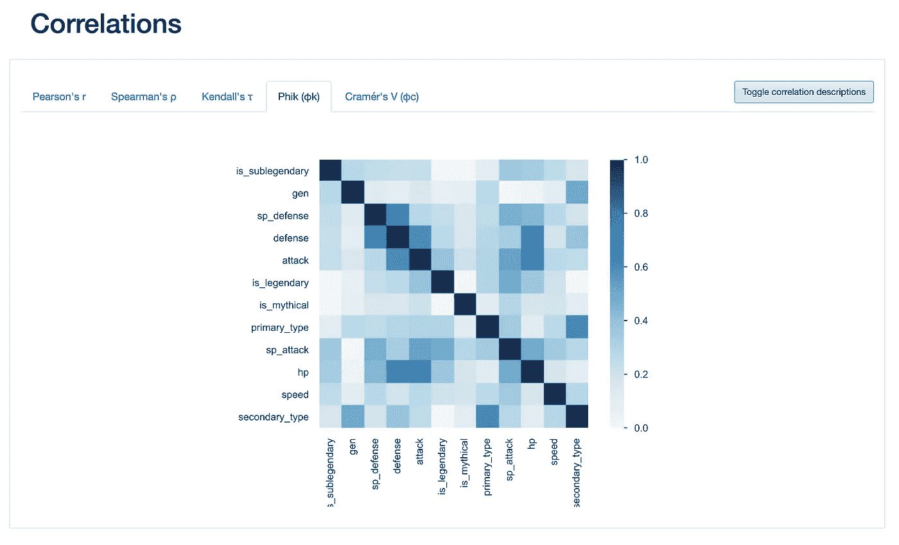
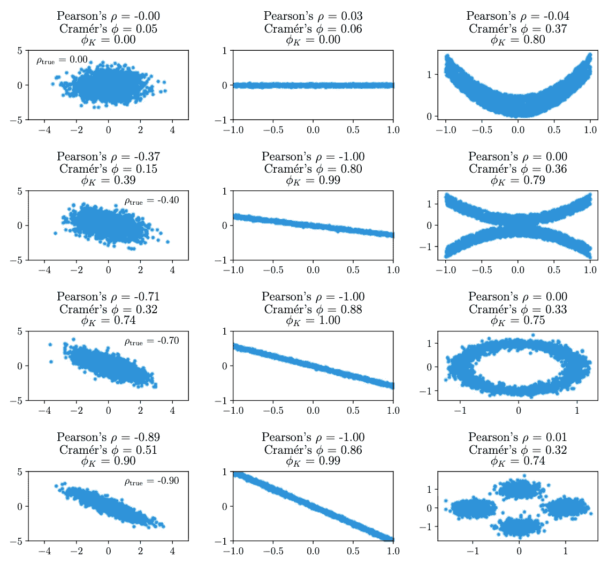
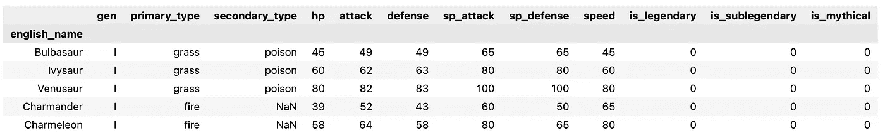
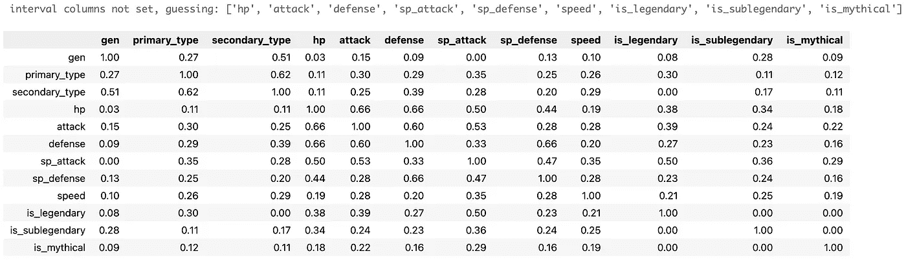
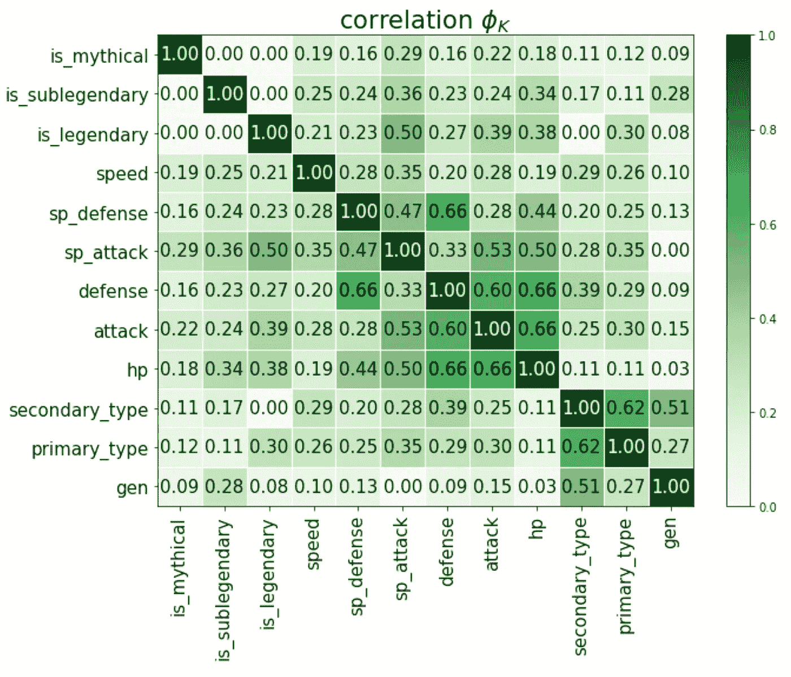
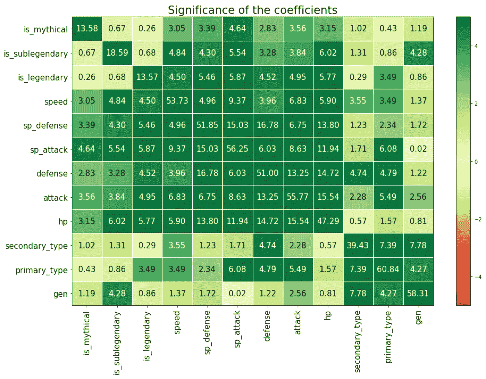
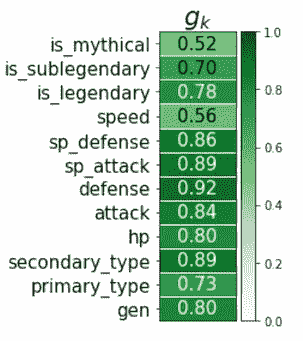
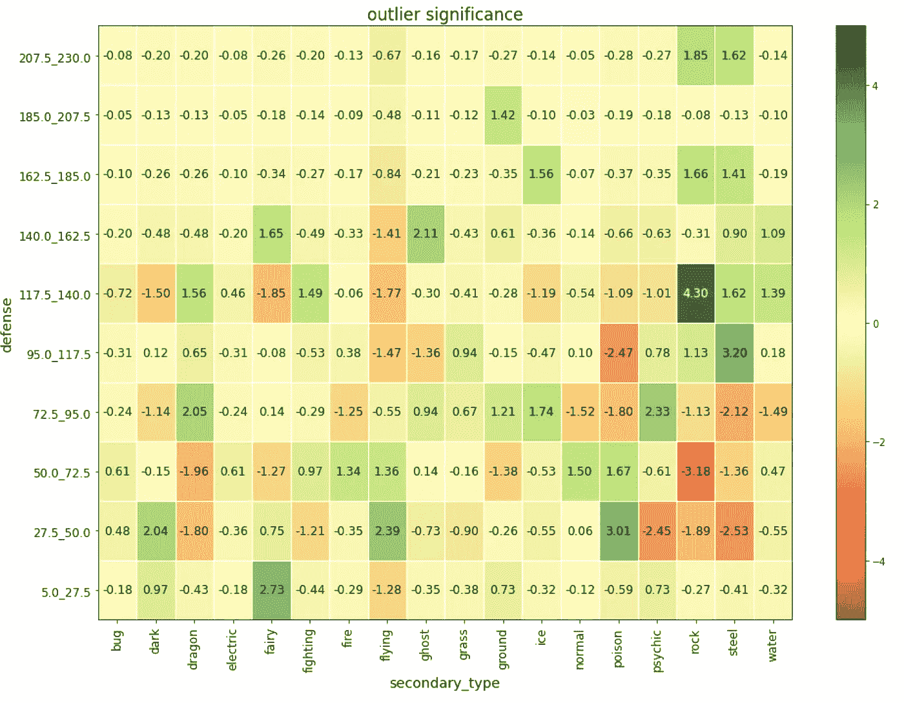
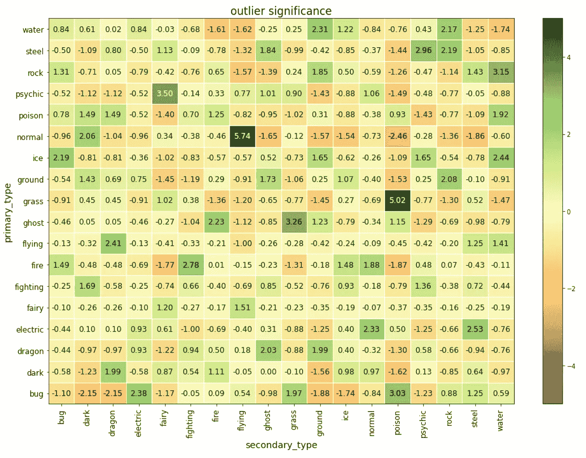

# 菲克(𝜙k)——熟悉最新的相关系数

> 原文：<https://towardsdatascience.com/phik-k-get-familiar-with-the-latest-correlation-coefficient-9ba0032b37e7?source=collection_archive---------0----------------------->


照片由[甘帕尼·库马尔](https://unsplash.com/@gkumar2175?utm_source=unsplash&utm_medium=referral&utm_content=creditCopyText)在 [Unsplash](https://unsplash.com/s/photos/dots?utm_source=unsplash&utm_medium=referral&utm_content=creditCopyText) 拍摄

## [实践教程](https://towardsdatascience.com/tagged/hands-on-tutorials)

## 这在分类变量、序数变量和区间变量之间也是一致的！

最近我在用`pandas-profiling`做 EDA，一些东西激起了我的兴趣。在*相关性*选项卡中，我看到了许多我从大学开始就知道的指标——皮尔逊的 r、斯皮尔曼的ρ等等*。然而，在这些人中我看到了一些新的东西——菲克( *𝜙* k)。我以前从未听说过这个指标，所以我决定深入研究一下。*



作者图片

幸运的是，由`pandas-profiling`生成的报告还有一个选项，可以显示更多关于指标的细节。提供了以下关于 Phik 的信息:

> Phik ( *𝜙* k)是一个新的实用相关系数，它在分类变量、顺序变量和区间变量之间始终有效，捕捉非线性相关性，并在双变量正态输入分布的情况下恢复为皮尔逊相关系数。

我必须说，这听起来真的很有用！尤其是在处理包含数值和分类特征的数据集时。在本文中，您可以找到新的相关性度量的快速总结，以及如何在实践中与`phik`库一起使用它。

# 𝜙简介

在许多领域(不仅仅是数据科学)，皮尔逊相关系数是衡量两个变量之间相关性的标准方法。然而，它也有一些缺点:

*   它只适用于连续变量，
*   它只考虑了变量之间的线性关系，
*   它对异常值很敏感。

这就是𝜙k 发挥作用的地方，它对当前的定位方法进行了一些改进。Phik 的主要优势是:

*   它是基于对皮尔森的χ2 (卡方)偶然性检验(contingency test)的几个改进——一种对两个(或多个)变量之间独立性的假设检验，
*   它在分类、顺序和区间(连续)变量之间工作一致，
*   ti 捕获非线性依赖关系，
*   在输入的二元正态分布的情况下，它回复到皮尔逊相关系数，
*   该算法包含一种针对统计波动的内置降噪技术。

与 *𝜙* k 最相似的指标是克莱默的 *𝜙* ，这是两个分类变量的相关系数，也是基于皮尔逊的χ2 检验统计。值得注意的是，尽管它是用于分类变量的度量，但它也可用于序数和分箱区间变量。然而，该系数的值高度依赖于每个变量所选择的宁滨，因此可能难以解释和比较。对于𝜙k 来说，情况并非如此。此外，克莱姆的𝜙对异常值很敏感，尤其是对于较小的样本量。

在下图中，您可以看到呈现所选三个相关性指标的一些比较。我们可以看到 *𝜙* k 在检测其他系数遗漏的非线性模式方面做得很好。如您所见， *𝜙* k 的值介于 0 和 1 之间，因此没有指示关系的方向。



[来源](https://arxiv.org/pdf/1811.11440.pdf)

自然，新方法也有一些缺点:

*   *𝜙* k 的计算在计算上是昂贵的(由于引擎盖下的一些积分的计算)，
*   没有封闭的公式，
*   没有方向的指示，
*   处理纯数字变量时，其他相关系数会更精确，尤其是对于小样本。

在这篇文章中，我不想深入讨论如何实际计算𝜙k 的细节，主要原因是这个过程比仅仅解释一个公式更复杂，就像皮尔逊的 r 一样。这就是为什么我更喜欢关注前面的实用部分，并让所有感兴趣的人参考[的源文件](https://arxiv.org/abs/1811.11440)(它以一种友好且易于理解的方式写成)。

# **Python 实践示例**

有一段时间，我想知道什么是测试新相关系数的好数据集。在浏览一些视频游戏新闻时，灵感不期而至——包含所有神奇宝贝的数据集将非常适合分析，因为它结合了分类和数字特征。数据集中没有顺序特征，但这对于演示如何使用`phik`来说不是问题。你可以在这里找到数据[。](https://www.kaggle.com/cristobalmitchell/pokedex)


照片由 [Don H](https://unsplash.com/@shugo88?utm_source=unsplash&utm_medium=referral&utm_content=creditCopyText) 在 [Unsplash](https://unsplash.com/s/photos/pokemon?utm_source=unsplash&utm_medium=referral&utm_content=creditCopyText)

和往常一样，第一步是加载库。

然后，我们加载并准备数据。我们只保留相关的列(战斗统计、世代、类型和指示神奇宝贝是否是传奇的布尔标志)，因为许多其他列都与进化和其他形式有关。



作者图片

现在我们准备好使用 *𝜙* k 系数来探索数据。

## *𝜙* k 相关矩阵

获得包含成对的 *𝜙* k 系数的相关矩阵与使用`phik_matrix`方法一样简单。默认情况下，库会从用于计算相关系数的数据中删除 nan。此外，为了提高可读性，我们将结果四舍五入到两位小数。

```
phik_overview = df.phik_matrix()phik_overview.round(2)
```



作者图片

当我们不提供包含区间列的列表作为参数时，将根据有根据的猜测来选择列。在这种情况下，`is_legendary`和 related 不是 interval 列，所以我们将创建一个适当的列表并将其作为参数传递。

此外，我们可以手动指定希望用于区间变量的条块。我们不这样做，所以箱子将被自动确定。

为了使表格的分析更容易，我们可以使用`plot_correlation_matrix`函数将结果绘制成热图。



作者图片

我们可以看到`defense`和`hp`，或者`hp`和`attack`等变量之间存在一定的相关性。更重要的是，我们可以看到`special attack`和`generation`之间没有相关性。

## 相关性的重要性

在评估相关性时，我们不仅要看系数，还要看它们的统计显著性。因为最终，一个大的相关性可能在统计上是不显著的，*反之亦然*。



作者图片

上面的热图显示了重要性矩阵。色标指示显著性水平，并且在+/- 5 个标准偏差处饱和。我们上面提到的战斗统计的相关系数的相对高的值在统计上是显著的，而`special attack`对`generation`的相关性则不是。

有关如何计算统计显著性以及对“标准”p 值计算进行何种修正的更多详细信息，请参考原始论文。

## 全局相关性

全局相关系数是表示数据集中一个变量与所有其他变量的总相关性的有用度量。这给了我们一个指示，一个变量可以如何使用其他变量建模。



作者图片

所有变量都有很高的全局相关性度量值，最高的值是`defense`。我们之前已经看到过`defense`和其他一些战斗数据有很强的相关性，因此这里的分数最高。

## 异常显著性

虽然两个连续变量之间的皮尔逊相关性很容易解释，但对于混合类型的两个变量之间的 *𝜙* k 来说，情况并非如此，尤其是当它涉及分类变量时。这就是为什么作者提供了额外的功能来查看异常值——来自两个变量的列联表的超出和超出预期频率的赤字。

我们首先来看看连续特征和分类特征。对于那个例子，我们选择了`secondary_type`和`defense`。

运行代码会生成以下热图:



作者图片

我们可以从上面的图中得出一些结论——岩石和钢神奇宝贝(作为第二种类型)具有明显更高的防御，而毒药/仙女/飞人则相反。

然后，我们对两个分类变量——主要类型和次要类型——进行类似的分析。



作者图片

分析这张表表明，正常飞行和草毒的神奇宝贝比预期的要多得多，而正常毒和龙虫则少得多。从我对神奇宝贝的了解来看，确实是这样，从这张表得出的结论代表了游戏中神奇宝贝的实际类型。

## 相关性报告

上面，我们已经看到了四种不同的东西，我们可以通过`phik`图书馆进行调查。还有一个方便的函数，允许我们用一行代码生成上述所有内容。

该函数通过成对评估所有相关性、其显著性和异常值显著性来生成报告。

注意:对于较大的数据集，图的数量很容易激增。这就是为什么我们可以调整相关性和显著性阈值，只绘制相关变量。

# 外卖食品

*   *𝜙* k 是一个新的相关系数，特别适合处理混合型变量。
*   使用该系数，我们可以找到具有(不)预期相关性的变量对，并评估它们的统计显著性。我们还可以解释每对变量之间的依赖关系。

您可以在我的 [GitHub](https://github.com/erykml/medium_articles/blob/master/Statistics/phi_k.ipynb) 上找到本文使用的代码。此外，欢迎任何建设性的反馈。你可以在[推特](https://twitter.com/erykml1?source=post_page---------------------------)或评论中联系我。

如果您喜欢这篇文章，您可能还会对以下内容感兴趣:

[](/one-simple-tip-to-make-your-readmes-stand-out-9f06ccdd76b) [## 一个简单的提示让你的简历脱颖而出

### 使用 Mermaid 设计的图表——一种类似 markdown 的脚本——让您的文档更上一层楼！

towardsdatascience.com](/one-simple-tip-to-make-your-readmes-stand-out-9f06ccdd76b) [](/9-useful-pandas-methods-you-probably-have-not-heard-about-28ff6c0bceee) [## 你可能没听说过的 9 种有用的熊猫方法

### 它们可以让你的日常工作更容易、更快捷。

towardsdatascience.com](/9-useful-pandas-methods-you-probably-have-not-heard-about-28ff6c0bceee) [](/chefboost-an-alternative-python-library-for-tree-based-models-f46af028a348) [## chef boost——基于树的模型的替代 Python 库

### 与 scikit-learn 的主要区别概述

towardsdatascience.com](/chefboost-an-alternative-python-library-for-tree-based-models-f46af028a348) 

# 参考

*   Baak、r . Koopman、Snoek、h .和 Klous，S. (2020 年)。具有皮尔逊特征的分类变量、顺序变量和区间变量之间的新相关系数。*计算统计&数据分析*， *152* ，107043。—[https://arxiv.org/abs/1811.11440](https://arxiv.org/abs/1811.11440)
*   [https://stats . stack exchange . com/questions/497742/making-sense-of-the-phi-k-correlation-coefficient](https://stats.stackexchange.com/questions/497742/making-sense-of-the-phi-k-correlation-coefficient)
*   [https://github.com/KaveIO/PhiK](https://github.com/KaveIO/PhiK)