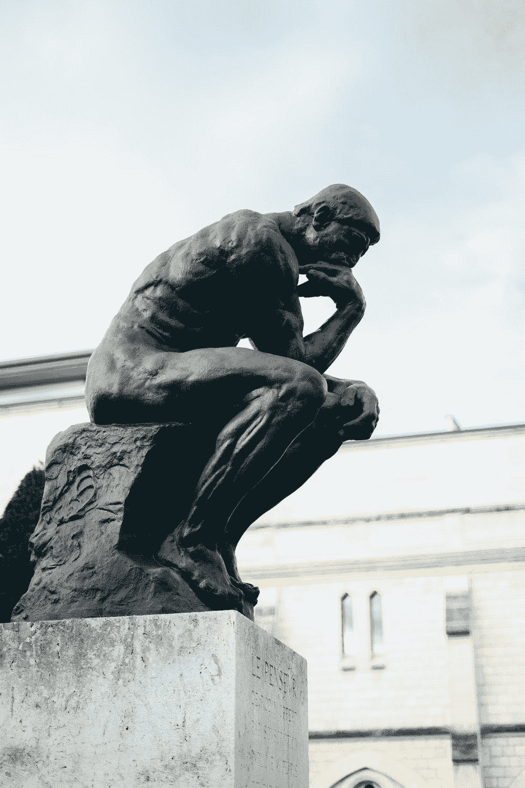
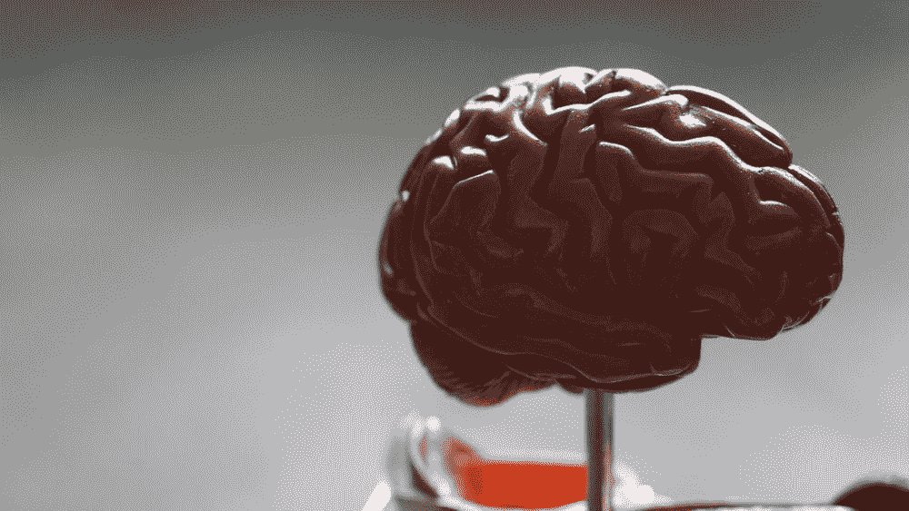
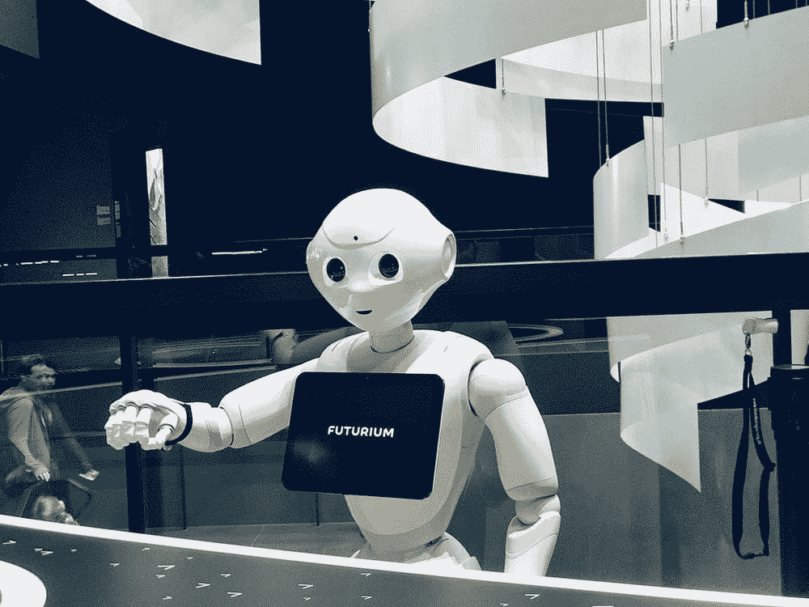
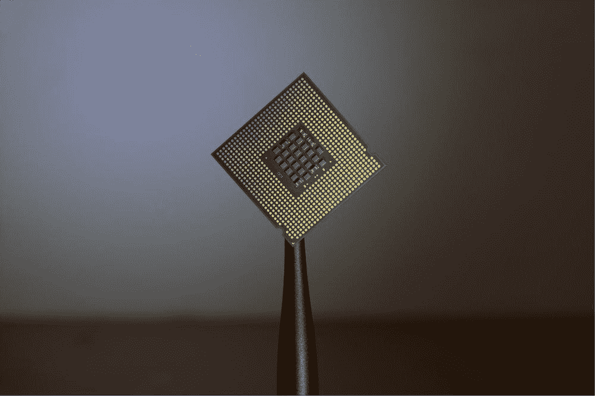

# 什么是心灵？人工智能爱好者的哲学

> 原文：<https://towardsdatascience.com/philosophy-for-ai-enthusiasts-25bed28ba8da?source=collection_archive---------27----------------------->

## [思想和理论](https://towardsdatascience.com/tagged/thoughts-and-theory)

## 人工智能概论系列的第 3 部分

抽象符合应用。资料来源:瓦伦丁·b·克雷默通过 [Unsplash](https://unsplash.com/photos/r8JLP0xW2BY) 。

> “心理生物学在关注自然世界的科学和关注人类经验意义的人文科学之间架起了桥梁。”
> 
> 艾瑞克·坎德尔

欢迎来到这个探索人工智能的新系列的第三部分(AGI)。如果你错过了[第 1 部分](/what-is-artificial-general-intelligence-4b2a4ab31180)或[第 2 部分](/the-cognitive-science-of-agi-139e1f4b31d5)，请检查它们；第一部分介绍了什么是 AGI，第二部分是对人工智能认知科学的简要概述。本周我们将介绍思维哲学中的重要概念，我认为每个计算机科学家、AI/ML 研究者或 AGI 爱好者都应该知道这些概念。

***具体来说，我们在介绍和讨论这些问题:***

1.  ***什么是头脑？***
2.  ***头脑从何而来？***
3.  我们如何测试计算机/人工智能体的思维存在？
4.  机器思维能够真正理解语义吗？

心智的概念——它们的本质，它们的实现，它们的应用等等。——对 AGI 的研究人员，甚至任何对人工智能稍感兴趣的人都有很大的兴趣；可以说，这是人工智能/AGI 研究人员的全部工作:创造*人工*思维(有些只是比其他人更狭隘)。本周，我将尝试阐明上述关于计算机和思想的问题，并向你展示，即使是关于人工智能、思维和 AGI 的最看似无害的问题，也绝不是…

在这个系列中，每周/每隔一周会有一个新的帖子出现(我希望如此),如果有问题、评论或澄清，可以随时给(mferg@mit.edu 发电子邮件。尽情享受吧！

免责声明:毫无疑问，有些人更有资格对我将涉及的问题和主题进行深入的讨论，从情感到神经形态计算。对于这些人来说，这个系列只是对这些主题的介绍，因此，如果为了简洁而省略或浓缩了一些内容，请见谅。我真的只是想要这个系列，以及激发它的课程，作为一个相关 AGI 主题的调查，这些主题通常在学习人工智能或人工智能时不会被教授。还要注意:这个系列与麻省理工学院或其品牌没有任何关系——我只是喜欢写一些我感兴趣的东西，麻省理工学院并不正式认可这里陈述的观点。

# 第一部分:什么是心灵？

## 认知科学来拯救…

> “我无法想象无限，但我不接受有限。我希望这种作为我生活背景的冒险永无止境地继续下去。”
> 
> -西蒙娜·德·波伏娃，拉维耶斯

F 首先，有点跑题:心灵哲学*非常*密集(我曾经花了整整一个月辩论*摇滚*是不是意识？！在哲学课程中…)，我们将*仅仅触及表面*。我打算让这篇文章变得通俗易懂，同时涵盖我认为一个 AGI 研究者或对 AGI 感兴趣的人应该知道的必要内容。焦点(就像在这个系列中一样)是广度，而不是深度:这是对 AGI 感兴趣的所有相关领域的调查(或 AI/ML/RL)。

回到头脑。上周，我们学习了认知科学是对大脑的研究，发生在你头脑中的高级过程，如注意力、意识、感知、语言、记忆等。我们还研究了与 AGI/人工智能/人工智能相关的认知科学的一些细节——比如记忆类型和边缘系统，我还试图准确地解释为什么人工智能的人可能需要知道这些。但是问题仍然存在:什么是头脑？

进入心智的标准模型(SMOM):试图固化 ***心智为了被认为是心智*** 必须做的事情。SMOM 论文的作者之一，保罗·罗森布鲁姆博士(2020 年夏天，我有幸在南加州大学的研究项目/小组[西格玛](https://cogarch.ict.usc.edu/#:~:text=Sigma%20is%20a%20cognitive%20architecture%20that%20is,itself%20grounded%20in%20a%20well-defined%20graphical%20architecture.)认知架构的创建者)在阐述 SMOM 的论文中说[1]:

> 头脑是一个可以思考的功能实体，因此支持智能行为。像许多其他动物一样，人类也有头脑。在这样的自然系统中，思想是通过大脑实现的，大脑是一种特殊的物理设备。然而，人工智能的一个关键基础假设是，思维是一种特殊类型的计算实体，即认知系统，可以通过各种物理设备来实现(这是一个最近被重新定义为基底独立性的概念[Bostrom 2003])，无论是自然大脑，传统的通用计算机，还是其他足够功能形式的硬件或软件。

因此，思维是一种抽象概念，或者说是一种“软件”,根据上文所述，它独立于实现它的硬件。也就是说，心灵*可以*在除了大脑之外的其他媒介中实现(这在心灵哲学中经常被称为“多重可实现性”)。AGI 的好消息！

《SMOM》于 2017 年出版，在很大程度上已经起飞，因为它是一种准确编纂“软件包”必须做什么才能真正被称为大脑的方式。它是通过观察三种不同的认知架构(我们将在几周内介绍认知架构和它们的含义)的共同点而聚合而成的。*它可以被认为是大脑必须做的事情的高级地图或蓝图。*从本质上说，根据论文所述，成为一个头脑所需要的是[1]:

1.  工作记忆的一个主要模块
2.  程序性长期记忆的一个模块
3.  陈述性记忆的一个模块
4.  感知界面
5.  电机接口
6.  工作记忆是连接 PLTM、DLTM 和 P/M 接口的中间人。

希望你能明白为什么我上周谈到了相关的认知科学:)

大脑是唯一可以支撑心智的硬件吗？来源:Robina Weermeijer via[Unsplash](https://unsplash.com/@averey)。

因此，我们实际上可能有一个关于什么是头脑的非常坚实的起点——根据这篇论文，如果它满足上述标准，那么它就是一个头脑，QED。并非所有的思维类型都是平等创造的，一些比另一些更强大或更有特色——例如，人类的思维与海龟的思维有很大不同——但 SMOM 试图为类人类的思维编纂最基本的 ***。我认为这是一个很好的起点，所以这就是我在本系列剩余部分提到“思维”、“类人思维”或“人造思维”时的意思。***

好了，今天我们要解决的问题清单上的第一个问题看起来有一个简单的答案:如果符合 SMOM 标准，大脑就是类似人类的大脑。我们有了一个良好的开端；做好准备，因为哲学思考才刚刚开始…

# 第二部分:头脑从何而来？

## 灵魂？大脑？物质的普遍特征？

> "除了我们自己的思想，没有什么是我们绝对能控制的."
> 
> 勒内·笛卡尔

Q 关于**精神状态的快速插曲**:精神状态是只有思考、感受的生物才能拥有的过程或条件【2】。一些精神状态包括:疼痛，发痒，看到红色，听到音乐，记得你的初吻，情绪，以及在寒冷的夜晚第一次泡热水澡。

好的，回到思想的来源:一个*的精神状态*和身体有什么关系？就像，他们是分开的，还是有一个灵魂在控制你？如果有，它是如何与物质世界相互作用的？如果这听起来令人困惑，那是因为它是！这就是所谓的 [**身心问题**](https://en.wikipedia.org/wiki/Mind%E2%80%93body_problem) (或者特别提到意识时的 [***难题***](https://en.wikipedia.org/wiki/Hard_problem_of_consciousness)*)——***精神状态/体验如何与物质基础/状态相关联？*** 什么*是红色的？冰淇淋的味道是什么*？它从哪里来？我们要看看两个主要的思想流派来回答这个问题:***

1.  *****二元论:*** 在 17 世纪，有影响力的哲学家笛卡尔(发音为 *day-cart* :我在第一堂哲学课上把他称为 *dess-cart-ees* ，这并不好玩:/)阐明了心灵是一个*非物质和非身体的实体*:一个灵魂或精神物质[2]。所以，根据他的说法，是什么让你成为你，也就是你的思想，实际上是你的灵魂，讨论结束，句号。这就是所谓的“二元论”，或者“笛卡尔二元论”: ***你的心灵(你)是什么不是由任何物理的“东西”***——它是完全不同的东西[2]。然而，如果你采用这种观点，主要未回答的问题是: ***非物质实体(灵魂)如何与物质世界和物质*** 互动？笛卡尔在他的时代认为答案是松果体，这相对来说很快就被揭穿了。因此，这通常被大多数现代神经科学家/哲学家拒绝，而支持选项二。**
2.  ****唯物主义(或一元论/物理主义):我**总而言之，**你是你的大脑 。你所经历的，相信的等等…都是大脑中生化反应的产物。没有什么神秘的东西在起作用:宇宙都是物质的，大脑也不例外。大多数神经科学家和心灵哲学家可能持这种观点。如果你归因于此，那么主要的未回答的问题是: ***精神状态是如何从物理状态中产生的？*** 什么是*主观体验？这可以说是认知科学/心灵哲学中最重要的问题。*****

******

***你是你的灵魂吗？还是你的大脑？资料来源:Mim。通过 [Unsplash](https://unsplash.com/photos/N-SRb2o23nw) 获得。***

***这场辩论是所有哲学中最大的一次；它激发了各种各样的争论，因为(传统上)二元论观点与宗教密切相关。然而，现有的立场并不像这种二分法那样清晰——这两者有不同之处，也有不同的组合，所以如果你不归属于其中任何一个，还有其他的:[偶然现象论](https://plato.stanford.edu/entries/epiphenomenalism/)、[泛灵论](https://plato.stanford.edu/entries/panpsychism/)、[综合信息理论](https://en.wikipedia.org/wiki/Integrated_information_theory)等等。我只是想介绍这一领域的两个主要理论。神经科学家兼作家保罗·努内斯在他的巨著《意识的新科学》的前几章中展示了更多的阴影，所以如果你想更深入地研究，就去看看吧。***

***你认为是哪一个？当这是弗吉尼亚大学的一门真正的课程时，这个问题(以及随后出现的其他问题)激发了双方学生的一些最激烈的辩论，所以想一想，看看你会得出什么结论！***

# ***第三部分:我们如何测试计算机/人工智能体中的意识存在？***

***前任玛奇纳和*她的*可能会给我们一点线索…***

> **“我们只能看到前面不远的地方，但我们可以看到那里有许多需要做的事情。”**
> 
> **艾伦·图灵**

**在 1950 年，人工智能创始人艾伦·图灵提出了一个测试来确定一台计算机是否是 ***智能*** 。基本的想法是，你有一台计算机和一个人在终端窗口与另一个人(法官)交流，法官必须通过问任何她想问的问题来确定哪个是人，哪个是计算机。**

**来自*斯坦福哲学百科*【3】:**

> **计算机程序必须能够经受住某人的询问，该人知道对话中的另外两个参与者之一是机器。**

**来自图灵本人[3]:**

> **“……让他们把模仿游戏玩得如此之好，以至于一个普通的审讯者在五分钟的审讯后做出正确辨认的概率不超过 70%……”**

**这个想法很简单:如果一个人可以根据对话来区分人脑和电脑*，那么这个非人类就是不聪明的。非常重要的一点(但也是最容易被忽视的一点)是 ***图灵测试只测试智力*** ，这是图灵的意图和提议。它确实 ***而不是*** 测试意识、知觉或任何类似的东西——仅仅是智力。然而，我提出的理由是，它可以被推断为思想的存在，因为智力通常是思想存在的代理。***

**

*Alexa 或 Google Home 能通过图灵测试吗？来源:Fitore F via [Unsplash](https://unsplash.com/s/photos/robot) 。*

*然而，图灵测试也有其批评之处:*

1.  *图灵测试是沙文主义的:它只认可能够与我们保持对话的事物的智能。[2]*
2.  *图灵测试的要求还不够高:我们已经有轶事证据表明相当不聪明的程序也能通过。[3]*
3.  *图灵测试本身并不决定某样东西是否有智能——它只是决定了它是否能与人类交流 T21。(沟通=智能？？) [3]*
4.  *存在(理论上)可以通过强力方法通过测试的程序，从而使失败无效。问题是，运行这个程序需要比宇宙中可用的资源更多的资源——这是个问题吗？理论与实践:智力需要时间维度吗？*

*我把艾伦·图灵列为我最想与之共进晚餐的五个头脑之一，我认为当他去世时，世界和艾本身都严重倒退了。我个人也认为他走在了时代的前面，但是图灵测试需要更新或扩展以反映现代 NLP 系统能力的变化，比如 GPT-3；但是就像头脑的标准模型一样，这是解决一个棘手问题的绝佳起点。*

# *第四部分:人工大脑能够真正理解语义吗？*

## *“懂”是什么意思？*

> *"哲学敏感性的众多标志之一是对大多数理智的人认为不值得烦恼的问题的痴迷。"*
> 
> *——约翰·塞尔《新世纪的哲学》*

*S 陷阱，这一个是激烈的，并且可能是自笛卡尔时代以来心灵哲学*有史以来*最有力和最重要的论证。*

*然而，在这个令人费解的东西之前，还有一个小插曲，这次是关于**语法**和**语义**之间的区别(你们大多数人可能都知道这一点，但这很重要，所以需要复习一下)。语法与表达的属性有关，如词语选择、语言和实际的符号。相反，语义学关注的是表达式之间的关系(*意为*)【2】。显然是两码事，但是你能从操纵符号中得到意义吗——语义能从语法中产生吗？这就是哲学家约翰·塞尔在他著名的“中国房间论证”中试图解决的问题，他是这样说的:*

*想象一下，一个母语为英语、不懂中文的人被锁在一个堆满中文符号盒子的房间里。他还有一本书，详细介绍了操纵中文符号产生其他中文符号的每一条规则。一个在房间外面的中国人给这个人一些中国符号(输入)，另一个也在房间外面的中国人在另一边等待回应(输出)。通过遵循账本上的规则，这个人能够 100%正确地输出中文短语。该程序使该男子能够通过理解中文的图灵测试，但他自己并不理解中文。*

*因此，主要的含义是，既然房间里的人不能通过执行正确的理解程序(账本)来理解中文，那么一台机器*永远也不会*理解它正在操作的位[2]。这是一个微妙的，但经常被错误引用的结论，所以下面是 CRA 没有展示的:*

1.  *不表明*机器*不能思考。—大脑是一台机器(从广义上说，是一台生物机器)，大脑可以思考。*
2.  *不表明*电脑*不会思考。如果你把计算机定义为任何能够执行计算的东西，那么所有的人都是计算机，他们会思考。**这确实表明，图灵定义为形式符号操作的计算并不是思维的组成部分[2][5]。***
3.  *并没有表明只有大脑才能思考*，只是说如果我们想让机器思考，我们需要模仿大脑的随意属性，以达到目的:*也就是说，改变语法是行不通的。[2].*

*CRA 是一个 doozy，但希望如果你有点迷路，这 TL；博士版将帮助你理解结论的重要性:*

1.  *实现的程序是纯形式/语法的。想象一下 1 和 0 移动得非常快。*
2.  *头脑有精神和语义的内容。思想有意义。*
3.  *句法本身对于语义来说是不够的，因为它不能保证语义理解将来自句法操作。[2]*
4.  ***结论**:实现的程序无法让头脑有意义。*

**

*谷歌翻译**懂**中文吗？资料来源:timothée GID enne via[un splash](https://unsplash.com/photos/xyIA0tRwpX4)。*

*更广泛的，也可能是塞尔所说的最重要的一点是，s *强 AI 是错误的【4】【5】*。我们没有讨论强人工智能和弱人工智能之间的差异(许多人经常使用这种差异来区分狭义人工智能和一般人工智能，但它们 ***与*** 不同， ***不能与*** 互换使用)，但是，简单地说，强人工智能就是这样的人工智能，其中的*或语义、*直接来自于语法重排——没有其他需要:如果你以正确的方式重排符号，那么你将获得意义。塞尔与 CRA 对此进行了反驳，并得出结论，强人工智能并非如此[5]。*

*明确为 AI/AGI/ML 研究人员:基于此， ***你的 AI 永远不会理解它所操纵的比特(如果它是基于传统的图灵机计算模型)。*** ***除了对它所操作的 1 和 0 的表层“理解”之外，它永远不会有更深的东西。*** 比如“狗”对一个人工智能来说，就没有对我们一样的意义；对于人工智能来说，“狗”只是以某种方式洗牌。*

*这是一个非常致命的论点，它让许多人为了反驳它而一头撞在墙上。有几个著名的反驳，如果你感兴趣，它们主要是[系统回复](https://iep.utm.edu/chineser/#:~:text=The%20Systems%20Reply%20The%20Systems%20Reply%20suggests%20that,would-be%20subject-possessed-of-mental-states%20for%20the%20person%20in%20the%20room.)和[机器人回复](https://asaro.wordpress.com/2008/02/12/robot-reply/#:~:text=The%20robot%20reply%20states%20that%2C%20while%20the%20Chinese,things%20in%20the%20same%20way%20that%20people%20do.)，这两个都是塞尔提供的反驳。据我所知，现在还没有一个反驳论点，人们可以同意有效地反驳 CRA 本身。*

*这是不是意味着我们对 AGI 的探索结束了？不一定——我们将很快研究潜在的变通办法，所以请继续关注；所有的希望都没有失去！下周我们将看一个情感和感觉的模型，并试图解决人工智能是否能*感受*事物或*体验*情感的问题。*

# *TL；速度三角形定位法(dead reckoning)*

*帽子很多。一个*头脑*可以用头脑的标准模型来近似。二元论和唯物主义都提供了关于心灵从何而来的观点。图灵测试是衡量一台机器是否有智能的一种方式，也有其缺陷。最后，中文房间论点指出，图灵机计算机永远不会实现意义(语义)。*

**

*CPU 如何才能让**理解**？来源:Brian Kostiuk via[Unsplash](https://unsplash.com/photos/S4jSvcHYcOs)。*

# *其他需要考虑的问题:*

1.  ***故地重游:你认为心是由脑而起，还是有其他东西缺失？***
2.  *如果一台计算机通过了图灵测试，是否意味着它是智能的？*
3.  *对于那些想成为 AGI 的人来说,《中国人的房间》是一个“终极目标”吗？*

# *关于作者*

*Mike Ferguson 是麻省理工学院 DiCarlo 实验室的计算研究开发人员。他将致力于[大脑评分](http://www.brain-score.org/)，这是一种测量人工神经网络有多像大脑的工具。他将于 2021 年春天从弗吉尼亚大学毕业，获得计算机科学和应用数学学士学位，以及认知科学和哲学学士学位。他是《一周挑战》一书的参与者，在两年内阅读了超过 138 本关于人工智能、哲学以及对人类意味着什么的书籍。他和他的伯恩山犬“博伊·温斯顿”以及收养的边境牧羊犬“影子”住在弗吉尼亚州的夏洛茨维尔。*

# *参考资料:*

1.  *莱尔德，约翰 e，基督教 Lebiere，和保罗 s 罗森布鲁姆。《心智的标准模型:走向人工智能、认知科学、神经科学和机器人学的通用计算框架》Ai 杂志 38.4(2017):13–26。*
2.  *罗伯特·威尔逊和弗兰克·凯尔。麻省理工学院认知科学百科全书。麻省理工学院出版社，1999 年。*
3.  *【https://plato.stanford.edu/entries/turing-test/ *
4.  *[http://www . faculty . umb . edu/Gary _ zabel/Courses/Bodies，%20Souls，% 20 and % 20 robots/Texts/UPHS _ 中国 _ 房间. html](http://www.faculty.umb.edu/gary_zabel/Courses/Bodies,%20Souls,%20and%20Robots/Texts/UPHS_Chinese_Room.html)*
5.  *[https://plato.stanford.edu/entries/chinese-room/](https://plato.stanford.edu/entries/chinese-room/)*