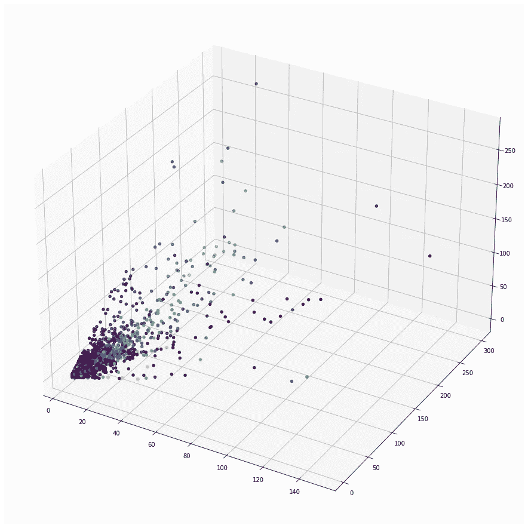
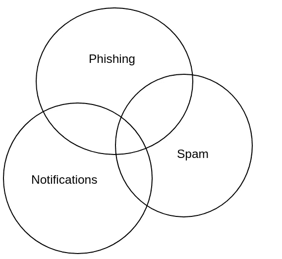
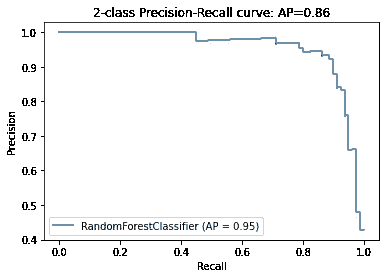
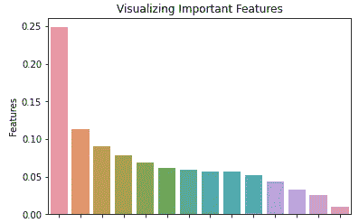
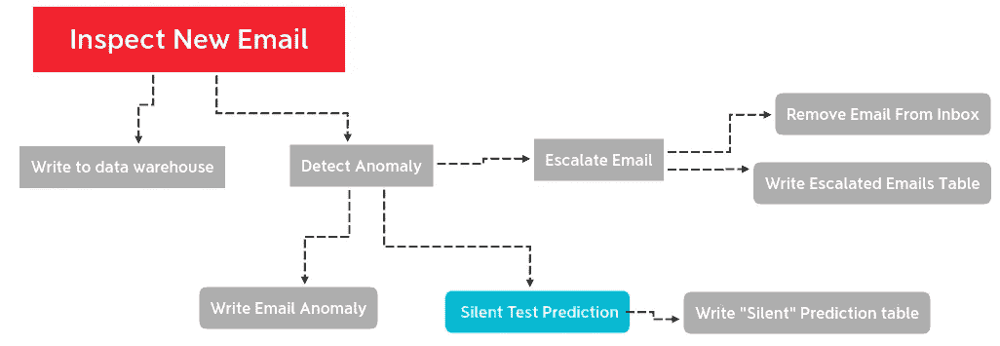
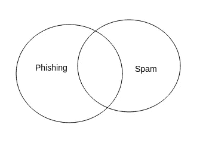
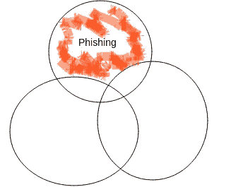

# 基于集成模型的网络钓鱼分类。

> 原文：<https://towardsdatascience.com/phishing-classification-with-an-ensemble-model-d4b15919c2d7?source=collection_archive---------29----------------------->

## [行业笔记](https://towardsdatascience.com/tagged/notes-from-industry)

## 从探索到部署

在这篇文章中，我们将讨论我们的 ML 团队的方法和工作流程，并通过一个案例研究来大规模部署一个真实的机器学习模型。Ironscales 是一家网络安全初创公司，旨在保护邮箱免受钓鱼攻击。我们的产品使用机器学习实时检测网络钓鱼攻击，并可以自动从最终用户的邮箱中删除电子邮件。

为此，我们构建了一个机器学习分类器，可以计算电子邮件的钓鱼概率。模型输入包括特定电子邮件的特征和属性，期望的输出是“网络钓鱼”或“非网络钓鱼”。端到端开发不像训练数据和保存到二进制文件那么简单。数据收集、验证和部署经常超出 ML 教程和文章的范围。通过撰写端到端的过程，我们希望本文可以提供独特的见解，这些见解可以应用于机器学习和威胁检测领域的其他领域。

ML 发展有几个不同的阶段:

1.  数据探索
2.  培养
3.  确认
4.  服务于大规模生产
5.  监视

开发是一个迭代的过程，模型通常要经历几轮训练、验证、监控和再培训。

# 数据探索

数据探索是端到端机器学习工作流的第一步。通常，我们会分发电子邮件，在 Pandas 中打开，为争论和可视化编写脚本，然后保存以供进一步探索或培训。

**选择数据集**

在 Ironscales，我们处理数十亿封电子邮件。处理这种规模的数据是一项艰巨的任务，并且面临着多项挑战。首先，像 Pandas 或 Excel 这样的工具不可能处理、分类和加载如此多的数据。可以使用分布式技术，如 Dask 或 Spark，但这需要更多的复杂性，并且在许多情况下，不适合这种类型的探索性分析。此外，在电子邮件的正常分发中，存在对网络钓鱼的极端偏见。也就是说，绝大多数邮件都不是钓鱼邮件，随机查看一堆邮件更费时间。

在这种情况下，我们可以通过查看至少包含一个异常的电子邮件来减少数据集的大小。异常是意外的或偏离预期值的电子邮件属性。尽管我们不会收集和跟踪所有异常情况，并且一些网络钓鱼电子邮件可能仍未被检测到并从我们的数据集中排除，但将我们的搜索范围缩小到异常电子邮件将减少数据集的不平衡和大小，使其更易于管理。异常本身不足以确定电子邮件是否是网络钓鱼，但我们现在有了进一步探索的起点。

**数据分析**

由于我们已经有了一个可以轻松访问异常电子邮件的存储系统，这项任务的第一步是从存储中提取有趣的电子邮件分布，并在 Pandas 中进行探索。假设我们有一个表格，其中有多行电子邮件和多列属性。

片段 1。加载电子邮件和查看数据帧

表 1。显示器输出(df)

从这里，我们可以开始查看不同的子样本，并尝试理解数据中的模式。在对此数据进行分析时，我们发现特定发件人正在发送大量网络钓鱼电子邮件。同样明显的是，这些发送者中有许多具有共同的属性。为了进行调查，我们希望对表进行透视，并根据发件人值聚集属性。

片段 2。枢纽数据框架

通过旋转表，我们现在有了 sender 作为主索引和列，这些列聚合了样本中包含的该发件人的所有电子邮件的相应属性。

表二。旋转数据框架

此时，可以在 3D 特征空间中显示这一群网络钓鱼发送者。

片段 3。图表 1 的代码

图表 1。3D 特征空间。

在此图中，蓝点代表合法发件人，黄色和绿色代表网络钓鱼发件人。图表 1 清楚地显示，中间是一个集中的网络钓鱼发件人集群，周围是蓝色的合法发件人。这不是一个很容易用规则或基于启发式的业务逻辑来确定的精确关系，但它是用机器学习进行训练的一个很好的候选对象。

在这种电子邮件分布中，我们可以观察到 3 种类型的电子邮件发件人:

1.  通知
2.  垃圾邮件
3.  网络钓鱼

图一。数据集中的电子邮件类型。图片由作者提供。

该模型的目标是专门识别网络钓鱼发件人，并防止他们的电子邮件到达最终用户的收件箱。通知和垃圾邮件都应该被忽略。

片段 4。保存透视表

现在我们将数据保存到 CSV，并打开一个新的笔记本进行训练。

# 分类任务

我们提取了各种特征，并试图适应数据。由于数据本质上是表格形式的，随机森林是一个很好的预测候选模型。

片段 5。培训模式

结果看起来相当不错。

图表 2。精确回忆曲线

表二。分类报告

注意，对于这个模型，我们关心的是精确度而不是回忆。换句话说，假阴性(将网络钓鱼分类为合法)对于该模型是可接受的，但是假阳性(将合法电子邮件分类为网络钓鱼)是不可接受的。这是因为该模型的范围是检测特定类型的网络钓鱼。还有其他模型检测其他类型的网络钓鱼，因此只要我们不意外地从客户的邮箱中删除一封电子邮件，我们就可以通过引入检测其他网络钓鱼电子邮件的其他分类器来改进系统。可以通过添加更多的模型来提高召回率，但是精度只能达到所有模型的加权平均精度。

# 改进功能

通过实验，可以添加新的功能并改进模型的分类指标。RandomForestClassifier 有一个根据重要性对要素进行排序的 API。

片段 6。打印特征重要性表

表 3。特征重要性

片段 7。地块特征重要性

图表 3。功能重要性。

# 交叉验证

既然模型已经被训练和优化，下一步就是交叉验证。为此，我们可以使用校准的 ClassifierCV。这个分类器的优点是可以校准 predict_proba 方法，该方法会使随机森林模型的[发生偏斜。](https://scikit-learn.org/stable/auto_examples/calibration/plot_calibration_curve.html)

代码片段 8。校准模型

## 静默部署

好了，现在我们有了一个模型，并准备将其部署到生产中。为了了解它在实时数据上的表现，我们需要将它集成到我们的电子邮件检查流程中，并进行静默预测。让我们在高层次上讨论一下检查流程。

清单 1。检验流程。(Medium 不支持嵌套列表。)

图 3。检验流程。图片由作者提供。

为了服务于模型，我们需要聚集每个发送者的异常。幸运的是，我们有一个异常表，在创建了一个关于发送者和日期的新索引后，它可以被快速读取。

我们的初始部署有 4 个步骤:

1.  查询发送方为的行的异常表
2.  聚合和展平从查询结果中提取的特征，并格式化以进行预测`[1, 3, .43 , .87,]`
3.  运行预测
4.  如果预测网络钓鱼概率高于阈值，则在静默网络钓鱼表中写入新条目

片段 9。推理功能

值得注意的是，模型预测聚合的时间窗口应该与训练数据的时间相匹配。例如，如果从异常表中提取 30 天的数据用于训练，则 30 天应用于预测。另一方面，例如，如果使用 90 天的窗口大小，模型输入值可能会比训练集大 3 倍，这可能会在推断时导致严重的问题。

最后，在将模型部署到生产系统之前，最佳实践是编写单元测试并验证代码质量。即使是一个静默的模型也有可能在检查流程中导致异常，因此通常更倾向于编写一些基本的测试。首先，最简单的方法是将预先生成的值传递给预测函数，并检查在逻辑和类型处理中是否有容易注意到的异常，或者值错误是否正确。第二，至少一个集成测试，其中数据被插入到测试数据库中，然后为特定的电子邮件调用整个检查流程。第三，测试和基准测试模型的分类性能是很重要的。如果分类器需要大量资源或者从磁盘读取需要时间，它可能需要不同的体系结构。

# 无声预测的分析

​

部署模型后，我们等待了几天，并查看了静默预测表，以确定模型的准确性。

查看预测后，我们注意到该模型将大量垃圾邮件归类为网络钓鱼。这是因为垃圾邮件和网络钓鱼的发件人活动通常是相同的；即，同一发件人同时发送垃圾邮件和网络钓鱼电子邮件，唯一的区别是电子邮件的内容。经过一些计算后，发现精确度只有 80%左右。不幸的是，这个模型还不够成熟，无法部署到主动模式中。

图 4。垃圾邮件和网络钓鱼。图片由作者提供。

# 用于集成推理的训练 NLP 模型

为了进一步完善这一预测，我们需要添加另一个模型来训练使用电子邮件正文来区分垃圾邮件和钓鱼电子邮件，即使它们来自同一发件人。我们将为第二个分类任务创建一个简单的语言模型。对于训练数据集，我们使用静默预测电子邮件。其思想是，在随机森林模型对电子邮件进行预测并确定发件人是网络钓鱼之后，将会有对电子邮件文本的第二语言模型预测来识别垃圾语言并取消第一预测。

代码片段 10。NLP 模型

现在我们有了一个健壮的集合模型。

片段 11。集成推理

如果电子邮件是垃圾邮件，该函数返回的网络钓鱼概率为零。此外，保存原始预测对于将来的分析、重新训练和监控也很有用。由于发件人的属性会随着随后的每封电子邮件而改变，因此也会返回发件人的统计信息。

# 主动部署

经过几天的静默评估，新发送者异常集合模型的测量精度得分在 99%以上。下一个阶段涉及添加到在主动检测流中运行的模型列表中。如果这些模型中的任何一个单独预测电子邮件是高于特定阈值的网络钓鱼，则该电子邮件被升级。由于模型已经在静默模式下运行了几个星期，所以只需要对代码进行少量的修改。

# 监控

在我们将一个模型部署到产品中之后，随着时间的推移监控它的有效性是很重要的。机器学习模型不会永远存在，它们需要维护和再培训。最终，它们被弃用并被删除。随着时间的推移，输入数据可能会发生变化。也许垃圾邮件制造者会使用新的文本模板。网络钓鱼者可以使用新的发送模式来躲避检测。对检查流程其他部分的更改可能会改变保存的异常电子邮件的分布，并且输入数据会有漂移。

虽然我们目前缺乏强有力的监测系统，但这是一个值得关注的主要领域。一项任务是记录一段时间内的预测和概率，并使用 Datadog 等监控工具进行显示，分析师可以轻松地实时查看这些数据。另一个任务是监控输入值的漂移。

# 后续步骤

图 5。完全分离的电子邮件类型。图片由作者提供。

最后，钓鱼邮件在生产系统中以高精度升级！我们的模型已经部署，客户也很满意。该模型的开发总共花费了几个月的时间，从提取异常电子邮件进行探索，到从最终用户邮箱中删除第一封电子邮件。这段时间学到了很多，还有很多可以改进的地方。

这个模型使用了一种新的分类方法。虽然以前的大多数方法都试图根据内容和元数据对电子邮件进行分类，但这是 Ironscales 的第一个模型，仅根据发送模式就可以将电子邮件分类为网络钓鱼。如果某个发件人的一封电子邮件被归类为网络钓鱼，那么该发件人最近发送的所有电子邮件不都是可疑的吗？发件人分类通过收集新类别的关系和活动数据，为未来的探索开辟了一个令人兴奋的新领域。

另一个有趣的发现是垃圾邮件对网络钓鱼分类的影响。我们通过构建模型的观察表明，对什么是*不是*的网络钓鱼进行分类对于识别什么是*是*是有用的。理解和分类垃圾邮件是提高网络钓鱼检测准确性的另一个方面。

# 结论

在本文中，我们讨论了与机器学习模型的开发、部署和监控相关的几个主题:

1.熊猫的数据探索

2.用 RandomForestClassifier 对表格数据训练模型

3.按比例部署模型

4.用 SGDClassifier 训练模型文本数据

5.监控生产代码

首先，为了进行数据探索，我们选择了一个数据集，检查了一个熊猫数据框架，并创建了一些图表和可视化。然后，我们使用 RandomForestClassifier 在表格数据上训练模型。我们在生产系统中验证、校准并部署了我们的模型。在意识到分类分数需要一些改进之后，我们添加了一个基于文本的模型并进行重新部署。最后，我们的模型正在积极地进行预测，我们正在监控回归的性能。

祝贺你——你坚持到了最后！如果你对建立机器学习模型和分布式系统感兴趣，以帮助保护公司免受高级电子邮件攻击，Ironscales 正在[招聘](https://ironscales.com/careers/)。