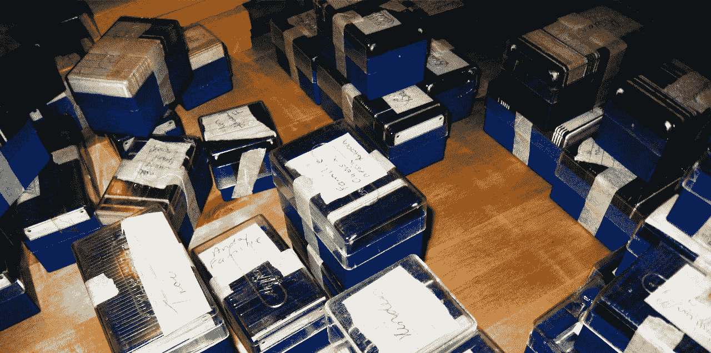
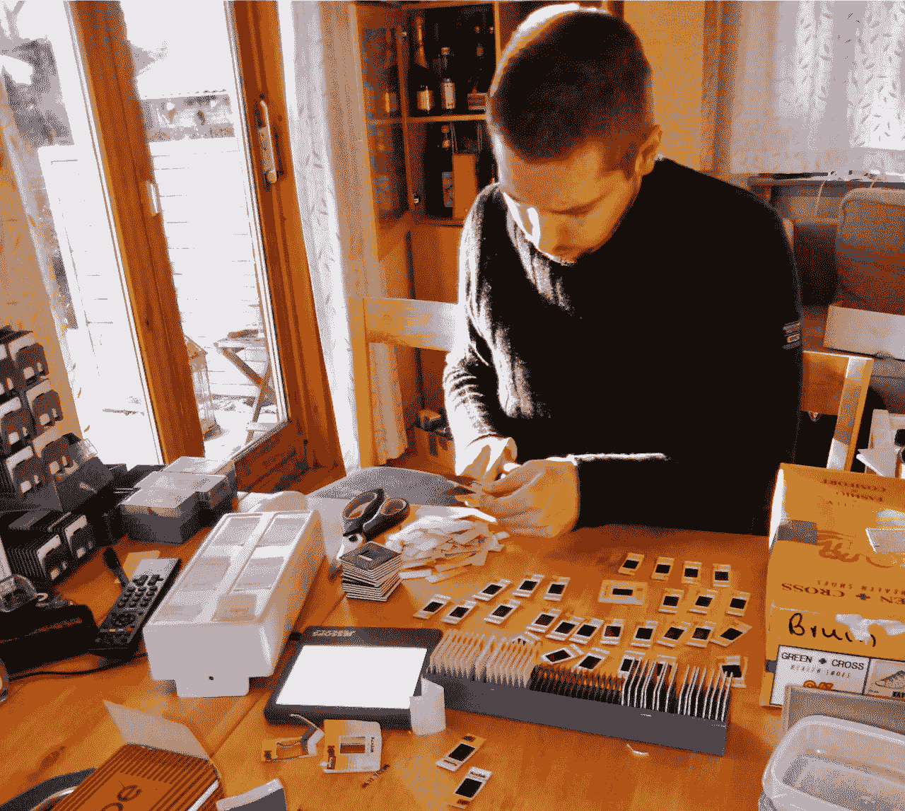
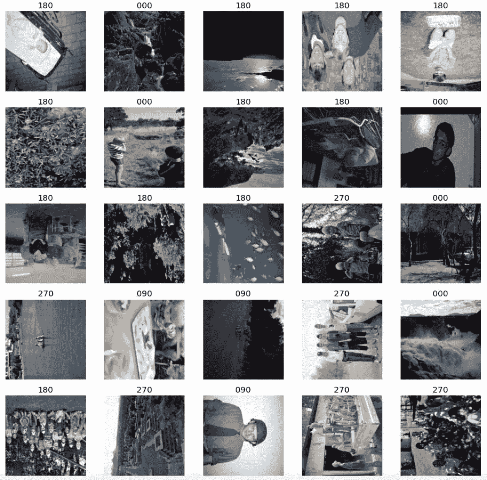
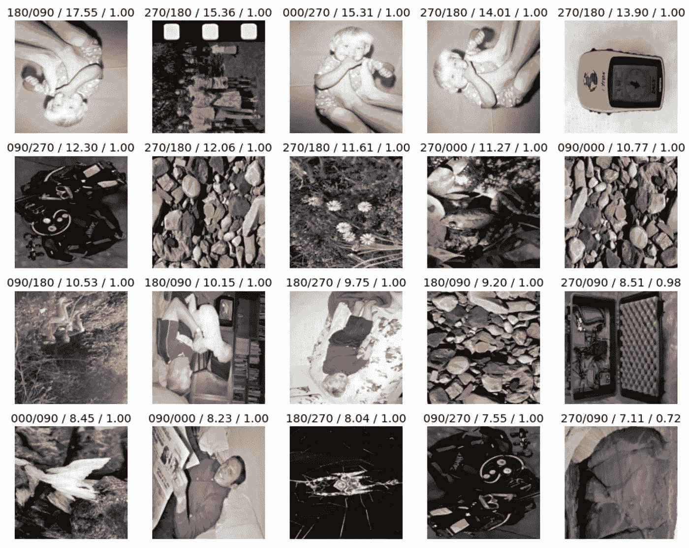
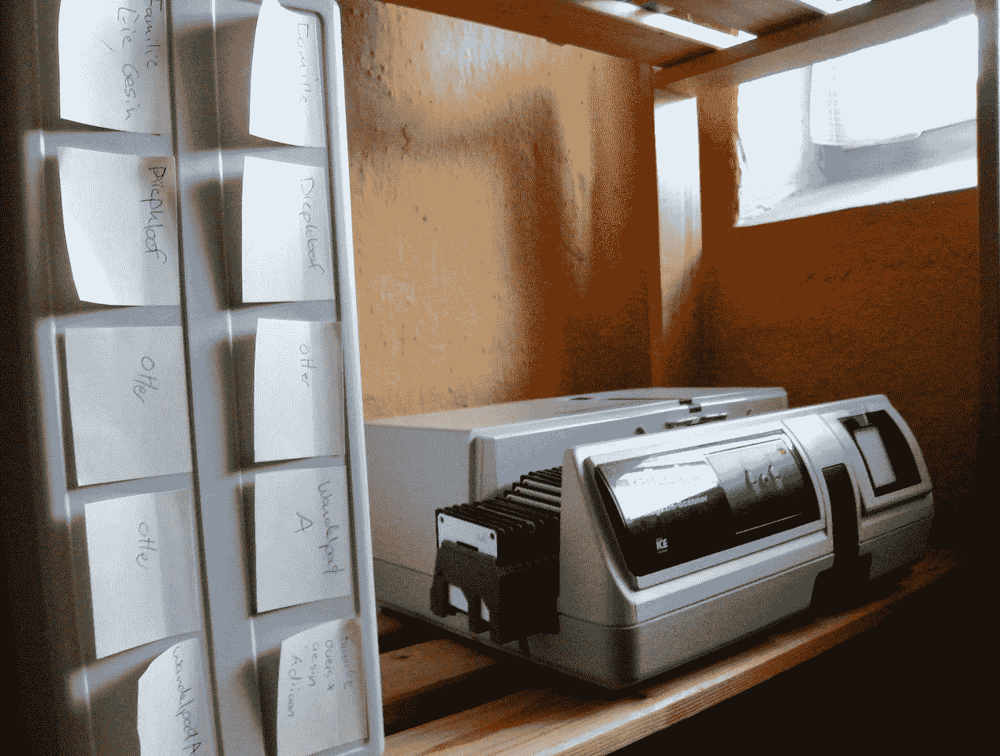

# 美照菲尼莎:在家里构建人工智能

> 原文：<https://towardsdatascience.com/photo-finish-building-an-ai-at-home-2888d54776eb?source=collection_archive---------25----------------------->

## [实践教程](https://towardsdatascience.com/tagged/hands-on-tutorials)

## 一台二手游戏电脑、一门大型开放在线课程和 23 行代码是如何帮我省下了数周的苦差事



我家幻灯片收藏的一小部分。图片作者。

# 照片，到处都是照片…

作为一个 70 年代的孩子，我的大部分早期记忆都停留在老式的摄影媒体上，比如幻灯片和底片。虽然这些幻灯片可能比我活得长，但它们很难索引和分享，更难以任何有意义的方式备份。

2010 年代初，我决定着手一个扫描项目，将我家的摄影史数字化，既为了将来保存照片，也为了更容易与家人分享。

虽然我在项目中使用的扫描仪会自动应用曝光校正和除尘，但这个过程留给我 16 000 张需要手动旋转的图像。

在用手旋转了几百张图像后，我几乎厌倦了，我决定简单地将扫描存档，等待未来:

*   我有时间手动旋转它们，或者
*   技术已经发展到一个程度，计算机可以为我做这件事。

快进到 2020 年，两种未来同时到来。2020 年末，当第二次澳大利亚电晕病毒封锁降临墨尔本时，我突然有了一些室内空闲时间，并决定参加一个在线人工智能编程课程。[程序员实用深度学习](http://course.fast.ai/)是一门免费的大规模开放在线课程，在短短 8 天内教你如何使用一种叫做深度学习的特定类型的机器学习。

# 想出一个解决方案

## 深度学习

深度学习通过使用计算机代码模拟神经网络来模拟我们大脑的工作方式。作为一种有监督的机器学习，深度学习要求你首先用一些已经手动标记的样本数据来训练系统，然后你可以要求它识别新数据中的类似特征。

在我的例子中，我想使用一些手动旋转的图像来教会神经网络识别图像是向左、向右还是上下旋转，并将这些信息馈送给开源图像处理实用程序 [imagemagick](https://imagemagick.org) 以正确旋转它们。

## 旋转与重命名

虽然我最初的设计需要一个完全自动化的程序，可以简单地指向包含一些需要旋转的图像的目录，但事实是我的图像在。jpg 格式意味着我需要一种稍微不同的方法。

不幸的是，修改一个. jpg 图像有点像给一盘老式磁带配音，因为每次你打开-修改-保存文件时，一些图像细节都会丢失。由于我还想在稍后的过程中用不同的 ML 魔术裁剪图像，在这一步中实际旋转它们意味着我将打开-修改-保存每张图像两次。因此，我认为更好的方法是简单地识别每个图像在这一阶段指向的方向，然后以某种方式将该信息嵌入到文件中，而不需要再次打开并保存它。

与修改其内容不同，简单地重命名. jpg 文件对其图像质量没有任何影响。因此，在文件名中嵌入旋转信息提供了一种很好的方式，可以将该信息传送到工作流程的其余部分，而不会降低图像质量。重命名而不是旋转文件还有一个好处，就是将生成的程序从一个单一用途的图像旋转器转换为一个通用的基于内容的文件重命名器，该重命名器还可以被重用以用于其他用途。

## 用户交互设计

对于模型训练步骤，程序被提供到包含几个子文件夹的文件夹的路径，每个子文件夹包含一组图像，这些图像被选择或处理以共享一些共同的特征。

每个子文件夹中的文件然后被馈送到神经网络训练算法，该算法试图提取图像共有的特征。完成训练阶段后，系统保存一个模型文件，该文件包含经过训练的神经网络以及它已经学习的类别列表。

训练后将神经网络保存到磁盘有两个好处:

*   它允许在计算机关闭的情况下重复运行重命名工具，而不必重复训练，并且
*   它允许在云服务上运行训练步骤，如 [Google Colab](https://colab.research.google.com) 如果你在家里无法使用支持 GPU 的机器。



在自动进料器可靠装载之前，一些纸板载玻片需要重新装框。图片作者。

对于文件重命名步骤，向程序提供包含要重命名的图像的文件夹的路径。该程序从磁盘加载模型文件，然后将输入文件夹中的每个图像呈现给神经网络。神经网络计算的结果称为推理，是特定图像属于每个先前训练的类别的概率列表。

在我的图像旋转模型中，给定的图像可能有 83%的概率是垂直的，7%的概率是向左旋转的，6%的概率是向右旋转的，4%的概率是颠倒的。如果任何类别的得分超过 50%，程序会自动重命名文件，在文件名前加上最可能的类别名称。

# 准备我的数据

为了产生我的训练数据，我最初从扫描图像档案中取出 200 张图像，并用手正确地旋转它们。我试图确保这些至少包括一些风景和一些人的图像，以便模型能够学会如何识别这两者。

然后，我将这个文件夹复制了三次，并对每个文件夹中的同一组图像进行了整体旋转，或者向左旋转，或者向右旋转，或者上下颠倒。

```
.fastai
└── data 
    └── familyphotos_small 
        ├── 000
        ├── 090
        ├── 180
        └── 270
```

这给我留下了四个文件夹，我以所附图像的旋转角度命名，文件夹“000”保存直立的图像，文件夹“090”保存向右旋转的同一组图像，文件夹“180”保存颠倒的图像，文件夹“270”保存向左旋转的图像。



FastAi 生成了显示类别名称的我的训练数据的可视化。图片作者。

虽然我碰巧对我的文件夹使用了“000”、“090”、“180”和“270”的名称，但这些只是文本字符串。我可以很容易地将文件夹命名为“左”、“右”、“垂直”和“颠倒”，或者 A、B、C 和 d。程序代码只是将文件夹名称作为文本字符串读取，以标记类别。

有趣的是，该程序对图像文件之间的实际差异也不敏感。我可以很容易地制作包含“海滩”、“雪”和“运动”等类别的图像文件夹，神经网络将学会识别这些图像。我的程序所基于的代码库是 FastAi 代码库中[宠物品种示例](https://github.com/fastai/fastbook/blob/master/05_pet_breeds.ipynb)的一部分，它甚至可以学会辨别 40 种不同品种的猫和狗之间的差异！

# 编写代码

如今，神经网络非常容易整合到你自己编写的程序中。有许多相互竞争的深度学习框架可以为您完成繁重的工作，并且经过优化，可以利用 NVIDIA GPUs 中的矩阵乘法硬件。

两个最受欢迎的深度学习框架，[张量流](https://www.tensorflow.org)(最初由谷歌开发)和 [Pytorch](https://pytorch.org) (最初由脸书开发)，提供了一组基本的机器学习子程序，用于处理神经网络训练和推理。

为了使这些框架更容易使用，几个附加的开源项目提供了包装基础框架的函数库。其中的一些例子是张量流的 [Keras](https://keras.io) 和 Pytorch 的 [FastAi](https://www.fast.ai) 。

由于我跟随的[程序员实用深度学习](http://course.fast.ai/)课程使用了 FastAi 中包装的 Pytorch，所以我在我的文件重命名项目中使用了这个组合。

许多云提供商，如 [AWS](https://aws.amazon.com) 、 [Google Colab](https://colab.research.google.com/) 和 [Lambda Labs](https://lambdalabs.com/service/gpu-cloud) 提供预装 Pytorch 库的虚拟机。如果你不熟悉 Linux，或者你的计算机中没有基于 NVIDIA 的 GPU，这些虚拟机提供了一种快速且经济高效的解决方案，来在云中训练你的深度学习模型。

就我而言，我用的是一台 Ubuntu 电脑，配有 NVIDIA 1080ti 显卡，这是我花 650 美元从一位升级了电脑的游戏玩家那里买的二手电脑。FastAi 文档解释了如何通过几个简单的步骤安装 Pytorch 和 FastAi 库。

## 设置培训数据

程序的第一部分设置环境并加载将用于训练模型的图像列表。

FastAi 使用数据块的概念来描述在哪里可以找到组成数据集的文件，如何标记和组织它们，以及如何将它们呈现给学习算法。

对于大多数任务，你不会希望一个经过训练的神经网络对它要识别的对象的旋转过于敏感。想象一下，你想训练一个神经网络来识别圣诞树。如果在训练过程中，你只向它展示竖直方向的圣诞树，就像展示圣诞树摆放在客厅的照片一样，网络只会学习识别那个方向的圣诞树。如果你随后要求网络识别一张侧躺着的树的图像，比如一张在运输过程中绑在车顶上的树的图片，网络很可能无法完全识别这棵树。

确保神经网络学习识别*对象而不管它们的方向*的方法之一是多次显示训练集中的图像，同时每次随机旋转它们。这样，即使你只有直立的圣诞树的图片，你的网络也会显示一些向左倾斜的树的图片，一些向右倾斜的树的图片，甚至一些完全颠倒的树的图片。

这项技术非常有效，FastAi 库将通过一个名为[项目转换](https://docs.fast.ai/vision.augment.html#aug_transforms)的选项，自动将图像旋转添加到您的数据块配置中。然而，对于这个项目来说，自动将轮换添加到训练数据中会适得其反。由于我们特别希望网络能够学习识别*方向，而不考虑图片中的对象*，因此我们需要在数据块定义的训练过程中关闭自动旋转。

如果仔细观察上面的数据块代码，您会看到行`item_tfms=**RandomResizedCrop**(224,min_scale=0.5)`。这段代码告诉 datablock 构造函数只通过随机调整大小和裁剪来增加数据。这个选项用来代替更常用的`item_tfms=**aug_transforms**(224,min_scale=0.5)`，它也可以增加图像旋转增强。

如果你使用这个程序来完成除了识别图像旋转以外的任何任务，使用`aug_transforms`选项几乎总是会产生更好的结果。关于`aug_transforms`选项的更多信息可以在 [FastAi 文档](https://docs.fast.ai/vision.augment.html#aug_transforms)中找到。

## 训练模型

接下来是训练神经网络的代码。FastAi 库包括一个`lr_find`功能，可以帮助你在开始实际训练过程之前找到合适的学习速度。

学习率被称为超参数，因为它控制学习算法行为的一个方面，它告诉算法在训练期间增加或减少网络权重时使用什么步长。

如果你的程序采取的步骤太小，你的模型将需要几天才能取得几分钟就能取得的进展。如果你的程序采取的步骤太大，你的模型会反复超调，永远找不到最优解。

将计算出的最佳学习率复制到步骤 9，并要求模型在数据集上运行 25 次。这些重复中的每一次都被称为 epochs，在我的 GPU 上花费了大约 2 分钟，总训练时间大约为 45 分钟。

如果计算机没有兼容的 GPU，可以指示同一个库使用 CPU，代价是等待时间更长。当我试图在我的计算机的 CPU 上运行相同的代码时，每个时期需要大约 40 分钟而不是 2 分钟，对于相同的培训工作来说，总共需要 16 个小时。

对于只需要做一次的事情，额外的半天几乎不是问题，但是能够在 45 分钟而不是 16 小时内运行整个过程无疑会使代码调试更容易。

在 25 个时期之后，该模型获得了 2.7%的错误率，这意味着它在 97.3%的时间里正确地猜测了测试集中图像的方向。

当错误率达到稳定水平时，查看网络仍然误解的图像通常是一个好主意，因为这可以指示在哪里寻找问题，或者网络已经简单地了解了它可以做什么，现在只是在努力处理甚至人类都难以处理的例子。

在 FastAi 中，可以通过调用函数`interp.plot_top_losses`生成最常被误解的图像的概述。查看输出可以发现，错误仅限于那些即使人类也难以正确判断的图像:



FastAi 生成了测试集中最常误判的图片的可视化。图片作者。

例如，第一张图片显示了一个 3 岁的我站在我爸爸的脚上保持平衡，而他正仰面朝天拍照:即使现在看着它，也不容易猜出照片的旋转方向…

## 使用模型

模型经过训练并保存到磁盘后，我们可以继续使用它进行推理。本节从重复环境设置开始，因为它假设推理步骤将在不同的日期发生，或者在不同于训练步骤的系统上发生。

从磁盘加载神经网络后，可以通过打印`learn_inf.dls.vocab`变量快速检查模型训练识别的类别。

在这种情况下，加载的模型报告它被训练来识别称为“000”、“090”、“180”和“270”的类别。因为这与原始图像旋转训练数据的目录名相匹配，所以我知道我有正确的模型，并且我知道它将使用哪些标签作为我的图像文件的前缀。

然后向程序提供包含要分类的文件的目录名，并逐个处理它们。例如，文件 SN_600_26.jpg 被呈现给网络，网络预测有 92%的可能性图像是颠倒的(即，它类似于在名为“180”的训练目录中的图像)。

```
************************************
Old Filename: /media/streicher/2TB_ExFAT/Streicher_Negatives/SN_600_26.jpg
Predicted Class: 180
Predicted Confidence:  0.9214386343955994
New Filename: /media/streicher/2TB_ExFAT/Streicher_Negatives/180_SN_600_26.jpg
************************************
```

当预测置信度高于 50%时，程序继续并将文件重命名为 180_SN_600_26.jpg。如果程序在其预测中得分低于 50%的置信度，则它会将文件重命名为 UNK_SN_600_26.jpg，以表示旋转未知。

总之，我的程序的全部功能代码只有 23 行。23 行来组装一个数据集，训练一个神经网络，将它保存到磁盘，并使用它来执行一项需要人类几周才能完成的任务。

# 结论

像 [Keras](https://keras.io) 和 [FastAi](https://www.fast.ai) 这样的库使深度学习的力量在易于使用的函数中可用，即使是新手程序员也可以用它来解决复杂的任务。

这些库提供的易用性和低实现成本意味着，自动化原本是手动的任务正在迅速向自动化倾斜。

GPU 技术的不断进步意味着，廉价的二手游戏电脑可以很容易地重新用于运行最新人工智能软件的强大数据科学工作站。

免费、自定进度的大规模开放在线课程，如 FastAi 的[程序员深度学习](https://course.fast.ai)和 Coursera 的[深度学习](https://www.coursera.org/specializations/deep-learning)提供了自学机器学习基础知识以及如何将其应用于现实世界任务的机会。

这个项目的完整源代码可以在我位于 https://github.com/streicherlouw/DeepRename[的 GitHub 仓库中找到](https://github.com/streicherlouw/DeepRename)



对于那些对扫描硬件感兴趣的人，我用 Reflecta DigitDia 5000 拍摄幻灯片，用 Reflecta RPS 7200 拍摄底片，用 Cannon 8800f 拍摄照片。我选择这些扫描仪是因为它们能够扫描彩色和红外线。红外扫描允许他们检测胶片介质中的灰尘和划痕，并自动润色输出。图片作者。