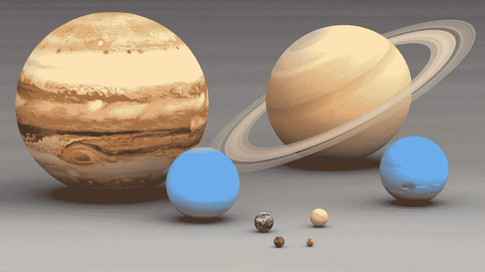
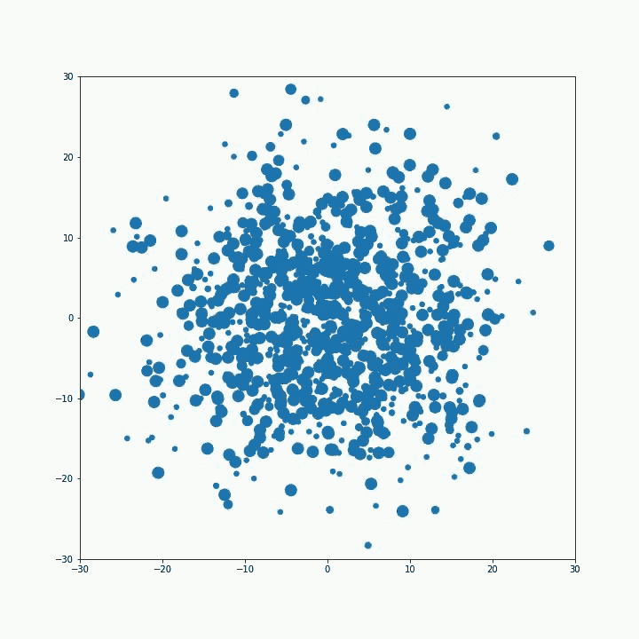
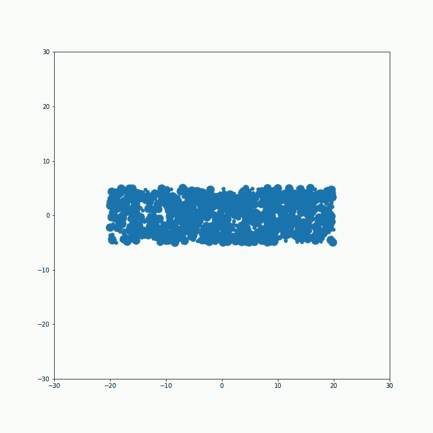
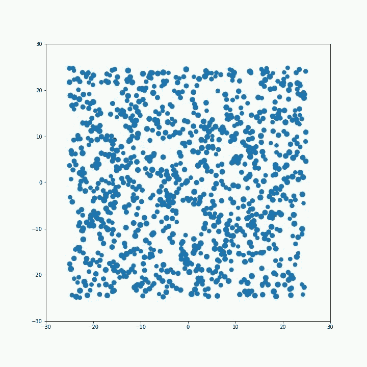
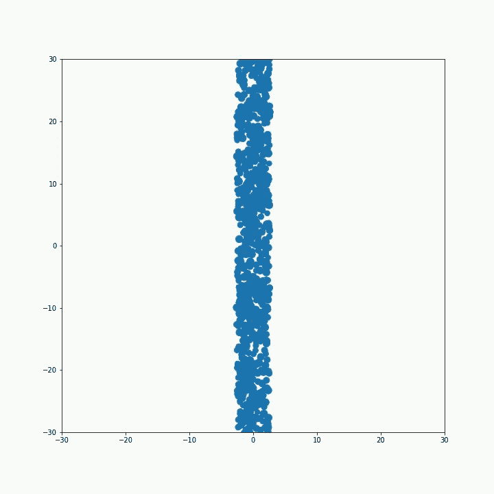

# 物理和深度学习，天体为什么是球形的？

> 原文：<https://towardsdatascience.com/physics-and-deep-learning-why-are-the-heavenly-bodies-spherical-d6a17ac2d8af?source=collection_archive---------44----------------------->

## 探索物理学和人工智能的共同点。

来源:[维基百科](https://en.wikipedia.org/wiki/Solar_System) |太阳系

> 你知道为什么地球形状像一个球体吗？
> 所以你可以踢它，它就会滚走！从你早上醒来的那一刻起，你总是和人们在一起，你的头脑被世俗的想法所困扰。所以在一天中的某个时候，坐几分钟，进入你内心的洞穴，闭上眼睛，像一个球一样把世界踢开。- [Sri Sri Ravishankar](https://www.artofliving.org/in-en/srisri)

抛开这个空灵的答案，我们来看看深度学习有没有这个问题的答案。几乎所有的深度学习和人工智能都是关于解决复杂的优化问题，其中要优化的目标是多个参数的函数，有时这些参数的范围是数百万或数十亿。 [GPT 三号](https://en.wikipedia.org/wiki/GPT-3)拥有 1750 亿个参数！不要担心，物理问题只需要几百个(实际上不是很深！)

你一定想知道物理学和深度学习之间有什么联系，我也是，然后我意识到所有的自然法则都可以重新表述为优化问题的解决方案。我开始了一系列的帖子，在这些帖子中，我将着手解决一个物理问题，并使用 Pytorch 惊人的自动微分和优化能力来解决它。

现在回到我们最初的问题，为什么行星和恒星是球形的？如果我们将它们视为静态系统，忽略它们围绕轴的旋转和它们在时空中的路径，物理定律([最小作用原理](https://en.wikipedia.org/wiki/Principle_of_least_action))告诉我们，这样一个静态系统会处于最低势能状态。对于像地球这样的天体，势能就是自身重力势能。是重力将地球维系在一起，是其组成材料的刚性阻止了它自身的坍塌。

但是为什么重力一定要把地球塑造成一个球体，而不是立方体或者甜甜圈呢？看起来球形的势能最小。让我们尝试一个实验，我拿一些粒子，随机扔进 2D 空间，然后优化重力势能。我给这些粒子增加了一些刚性，以防止这些粒子相互碰撞。通过在势能上增加一项来增加刚性，该势能与粒子之间重叠的平方成比例(类似于弹簧的势能)。

> 在这种情况下，损失函数是每对粒子之间的重力势能和由于相互接触的粒子的弹性而产生的势能之和。

下面是一些动画，展示了这些实验的结果，在这些实验中，我选取了 1000 个不同大小和不同初始位置的粒子，并优化了它们的坐标，以使损失达到最低值。总共有 2000 个参数需要优化。所有这些都只是 matplotlib 中的散点图，点在散点图中相互碰撞！！

(图片由作者提供)优化算法以不同的初始位置运行 1)围绕中心的正态分布 2)以正态分布分散在矩形内的点 3)均匀分布的是正方形区域 4)高的垂直柱。

我们应该得到的最终形状是一个圆形，从上面的实验中得到的形状趋向于圆形，但不完全是圆形，因为这需要更精细的粒子和更多的迭代。这些形状目前停留在局部极小值，它们可以通过轻微的扰动接近一个完美的圆。但是仅用几行 python (Pytorch)代码，结果仍然令人惊叹！你可以在这本 [colab 笔记本](https://colab.research.google.com/drive/1a-6jgvnicEHWc40vZDUiJ3teAb1t1T4T?usp=sharing)里找到这些台词。我希望你现在知道为什么行星是圆的了！注意下一个帖子。
阅读更多博客[点击这里](https://smodi93.wixsite.com/msachin/blogs)。