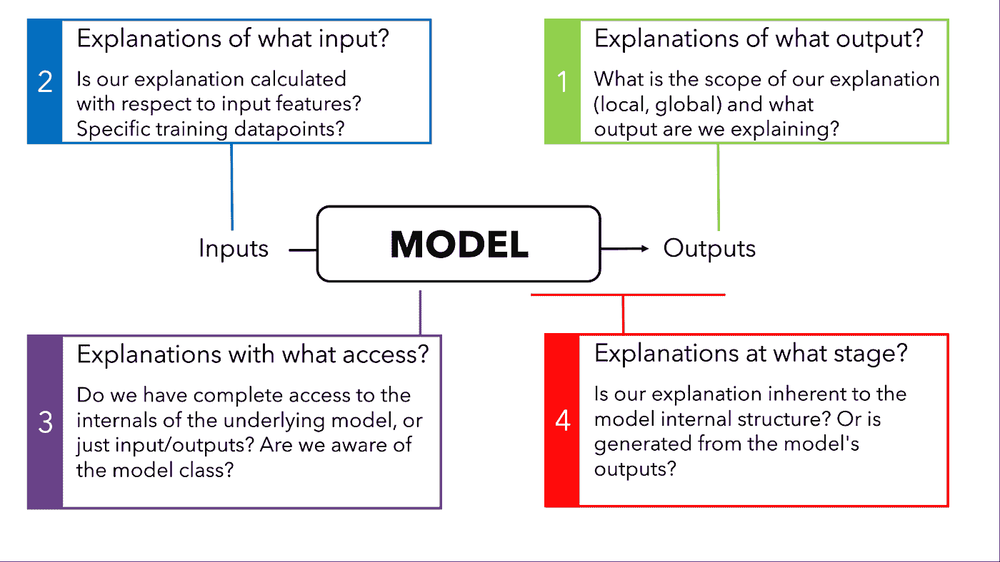
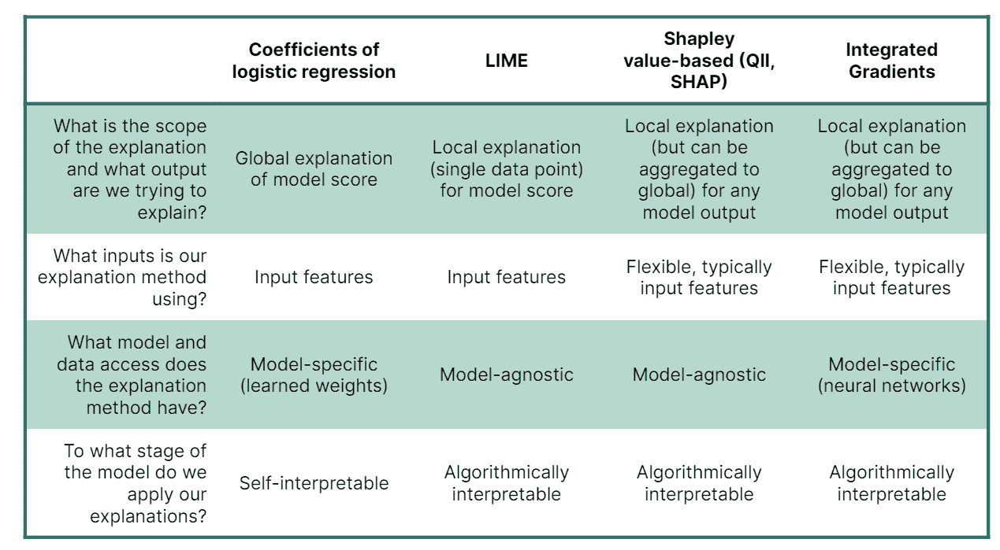

# 选择一种可解释的技术

> 原文：<https://towardsdatascience.com/picking-an-explainability-technique-48e807d687b9?source=collection_archive---------3----------------------->

## [模型可解释性](https://towardsdatascience.com/tagged/model-interpretability)

## 一个ML 可解释性技术分类法来理解你的模型。

由[媒体修改器](https://unsplash.com/@mediamodifier)在 [Unsplash](https://unsplash.com/photos/yx17UuZw1Ck) 上拍摄。

ML 模型可解释性(有时被称为模型可解释性或 ML 模型透明性)是 AI 质量的基本支柱。在不了解机器学习模型如何以及为什么做出决策，以及这些决策是否合理的情况下，不可能信任机器学习模型。在将 ML 模型部署到野外之前，对其进行仔细研究是绝对必要的，在野外，一个理解不充分的模型不仅无法实现其目标，还会导致负面的商业或社会影响，或者遇到监管问题。可解释性也是其他值得信赖的 ML 支柱的重要支柱，如[公平性](/designing-a-fairness-workflow-for-your-ml-models-6518a5fc127e)和稳定性。

然而“可解释性”通常是一个宽泛的、有时令人困惑的概念。最简单地说，机器学习解释是模型功能的一组视图，帮助您理解机器学习模型预测的结果。

# 我如何挑选最好的可解释技术？

这个简单的描述背后隐藏着相当大的复杂性。提供模型解释的方法有很多:逻辑回归系数、LIME、Shapley 值技术(QII、SHAP)和综合梯度解释。你如何知道你是否得到了一个好的模型解释？你如何比较不同的解释方法来为你的模型选择最好的方法？为了清晰起见，我们引入了解释方法的分类，以理解和描述无数种解释技术是如何结合在一起的。

我们的 ML 可解释性分类法有四个维度:

1.  **解释范围**。解释的范围是什么，我们试图解释什么输出？
2.  **输入**。我们的解释方法使用了什么输入？
3.  **访问**。解释方法有什么模型和数据访问？
4.  **阶段**。我们将我们的解释应用到模型的哪个阶段？

让我们将这些问题逐一分解，并理解它们的含义。

图片作者。解释方法的分类。

# 解释范围:我们试图解释什么输出？

让我们用一个具体的例子来说明这种细微差别。假设一位数据科学家训练了一个机器学习模型，来预测给定个体面临疾病风险的概率。该模型在其决策中使用各种医疗数据，数据科学家希望向可能使用该算法的医生证明该模型的预测。

# 全球还是本地？

数据科学家可能会列出驱动所有个人模型预测的前五个重要特征，如一个人的血压和他们是否有该疾病的家族史。这是一个**全局解释**的例子，因为数据科学家正在通过跨许多数据点的预测的整体驱动因素来解释模型。数据科学家也可以用**当地的解释**来补充这一点，这将代替解释单个个体/数据点预测的驱动因素——例如，为什么*约翰*被明确预测有患这种疾病的风险？解释的范围可以从局部到全局。介于两者之间，数据科学家可以解释模型对一部分人口进行预测的驱动因素，例如，只对女性进行预测的驱动因素..

# 输出类型

我们要解释的不仅仅是*有多少*个输出，还有它们的类型。让我们考虑一个决定某人是否值得贷款的模型。我们是否在解释一个模型分配给每个数据点的概率分数(一个人获得贷款的概率)？或者当数据科学家在原始概率分数上阈值时创建的分类决策(是否提供贷款)？正在解释的模型输出的微小变化会对解释本身产生巨大的影响。

作为一个简单的例子来说明被解释的输出的微小变化是如何对解释本身产生重大影响的，让我们以美国总统选举为例。每个州可以被视为一个“特征”，它分配一个分数(选举团选票)，然后该分数被汇总以确定选举结果。如果你要提出一个问题来解释选举的原始分数，“为什么乔·拜登获得了 306 张选举人票？”像德克萨斯州、加利福尼亚州和纽约州这样的大州将是他精确得分的主要贡献者。相比之下，要解释“乔·拜登为什么赢得总统大选？”相反，我们会转向较小的摇摆州，这些州是决定候选人的关键。

# 解释输入:我们的解释是从哪些输入中计算出来的？

可解释性方法必须根据模型的某些部分总结它们的结果。通常，这些被分析的组件是组成特征、中间特征或训练数据。

*   **输入特征。**最常见的是，模型的组成特征正在被解释。一种方法将试图通过解释每个特征如何影响整体模型决策来解释模型的局部或全局属性。在上面的医疗保健示例中，数据科学家可能会指出“血压”和“疾病家族史”是影响模型决策的特定输入特征。
*   **中级特征。**现在让我们转向一个新的例子:假设一名研究人员在图像数据上训练了一个卷积神经网络，以预测图像中是否出现了一只狗。研究人员可能首先针对特定输入图像的每个像素来解释模型，但这可能很难对数千张图片进行推理。然而，研究人员知道神经网络的特定中间层负责识别图像中指示狗存在的模式，并希望检查这些过滤器的正确性。因此，她代之以生成关于网络中间层的解释。这些类型的内部解释对于具有顺序固有结构的模型来说是常见的，例如神经网络的[中间层](https://arxiv.org/pdf/1802.03788.pdf)或决策树中的[分支结构。](/a-visual-guide-to-decision-trees-26606e456cbe)
*   **训练数据特征。**但是关于模型内部计算的解释仍然使用模型的中间“特征”。如果我们的解释方法试图通过追溯到训练数据本身来证明模型行为的合理性呢？其他解释技术试图通过[量化对学习模型行为的某个方面贡献最大的数据点来做到这一点](https://arxiv.org/abs/1904.02868)。

# 解释访问:我们的解释对模型了解多少信息？

解释方法对模型本身的访问量是我们分类法的另一个定义维度。“有限访问”并不一定比“完全访问”更好，反之亦然——它们都有特定的好处。

*   **受限访问。许多解释技术经常假设对模型的输入和输出的访问是有限的，而不知道模型架构本身。**与模型无关的技术**，如[莱姆](https://arxiv.org/pdf/1602.04938.pdf)、 [SHAP](https://arxiv.org/abs/1705.07874) 和 [QII](https://www.andrew.cmu.edu/user/danupam/datta-sen-zick-oakland16.pdf) 检查输入对模型输出的影响，而不检查模型内部。这对于在同一数据集上训练的多个模型之间比较解释非常有用。当数据科学家将逻辑回归模型转换为更复杂的模型(如一组树)时，模型行为会如何变化？**
*   **中间通路。**针对特定**模型类**的解释技术已经变得越来越流行——例如，树模型的 Shapley 值的有效近似，利用模型的结构来提高性能。
*   **完全访问。**在极端情况下，**特定于模型的技术**可能需要对模型对象的完全访问。尽管它们不能跨多个模型类进行转换，但是它们可以利用特定模型类型的结构来提供深入的见解，或者提供相对于模型不可知方法的性能改进。特定于模型的技术的流行示例包括基于梯度的策略，如为神经网络设计的[集成梯度](https://arxiv.org/abs/1703.01365)、[平滑梯度](https://arxiv.org/pdf/1706.03825.pdf)和[梯度凸轮](https://arxiv.org/abs/1610.02391)。

# 解释阶段:什么时候开始解释？

我们的解释分类法的最后一部分与解释在模型开发的哪个阶段被应用有关——在训练期间，还是之后？解释方法可以自然地遵循模型的结构(例如在决策树的情况下)，或者追溯应用以理解更不透明的模型(例如神经网络)。到目前为止，文献中一个常见的争论是，是用**自我或内在可解释的**模型还是**算法可解释的**模型来构建。

## 培训期间可以解释

典型的自我解释(也称为“白盒”)模型是简单的线性或逻辑回归；有了这些，可以从线性模型的系数中直观地了解要素的重要性，并且模型得出结论的确切方式也很清楚，因为线性模型将其预测创建为输入要素的加权和。

决策树、决策集、基于规则的分类器和记分卡也被认为是白盒模型，因为它们迫使模型通过明确定义的规则来创建预测。最近，也有一些研究将可解释性约束的味道直接添加到模型训练本身，例如[基于贝叶斯规则的推理模型](https://arxiv.org/abs/1602.08610)、[通过梯度惩罚稀疏化神经网络](https://arxiv.org/pdf/2102.00554.pdf)，或者甚至通过将[人类反馈添加到优化程序](https://arxiv.org/abs/1706.03741)。

虽然内在可解释的模型确实简化了模型的“解释”，但现实是，将自己局限于线性或基于规则的模型意味着数据科学家将严重限制他们可以通过机器学习实现的模型或用例的类型。

## 培训后可解释

在训练完成后应用于模型*的可解释技术可以解释上面提到的“自解释”模型，同时也解释“算法上可解释”的模型。*

**算法上可解释的**模型是那些在训练中不受限制以符合一组规则的模型。这些规则是在训练过程中推导出来的，对于数据科学家或外部观察者来说不一定是显而易见的。由于这些原因，它们通常被称为“黑箱”模型。为了解释算法上可解释的模型，可解释性技术必须在模型完成训练后应用。出于这个原因，这些技术通常被称为“事后可解释性”，它们可以用于任何类型的机器学习模型，包括白盒和黑盒。

# 缩小:使用这种分类法的常见解释技术

我们已经剖析了解释分类法的每一个维度，但是让我们以一些流行的可解释性技术的例子为基础，总结在下表中。

图片作者。这种分类下流行的可解释技术。

## 解释逻辑回归模型的系数

逻辑回归模型是捕捉输入和输出之间的线性关系的简单模型。因此，很容易理解和解释模型的决策过程——这都是通过逻辑回归的系数获得的。这些系数各自的大小可以给出一个特征在多大程度上驱动模型预测的内在感觉。

因此，解释逻辑回归模型的系数是一种自我解释的技术，因为模型本身固有地被限制为模拟输入和输出之间的简单关系。解释的范围是全局的-系数大小不能用来直观地了解一个特定的数据点，而是预测本身的聚合驱动因素。这也是一种特定于模型的技术，因为它需要访问模型的学习权重。

## 石灰

[里贝罗等人。艾尔的“我为什么要相信你？”论文](https://arxiv.org/pdf/1602.04938.pdf)介绍了局部可解释的模型不可知解释，或 LIME，这是一种众所周知的技术。在高层次上，LIME 致力于通过干扰数据点的特征来解释单个输入的模型决策，并查看这如何改变模型预测。

正如您从名称中所看到的，LIME 是一种*局部*可解释技术，只适合孤立地解释单个数据点。它也是模型不可知的，因为它假设只访问模型输入和输出。它根本不约束模型训练，而是在模型训练后解释模型的决策，使其成为一种算法上可解释的技术。最后，LIME 通常用于计算关于模型输入要素的解释。

## 基于 Shapley 值的解释

基于 Shapley 值的解释技术如 [Lundberg 等人。艾尔的 SHAP](https://arxiv.org/abs/1705.07874) 和[的达塔等人。艾尔的 QII 论文越来越受欢迎。我们将在随后的文章中更深入地讨论这些技术，但两者都使用 Shapley 值的概念(一个来自联盟博弈论的术语)来精确地确定模型的输出得分或每个输入的分类决策。](https://www.andrew.cmu.edu/user/danupam/datta-sen-zick-oakland16.pdf)

基于 Shapley 值的技术，如 LIME，是算法上可解释的和模型不可知的方法。它们假设不能访问模型内部，并且可以应用于任何模型类型。核心算法本身可以应用于任何输入，但最常用于解释模型的组成特征。然而，与 LIME 不同，基于 Shapley 值的解释可用于确定各种模型输出(概率、回归和分类结果等)的局部和全局模型推理。

# 让我们智能地解释我们的机器学习模型

正如我们所见，有各种各样的方法来解释机器学习模型。由于不同的技术适用于不同的模型类型或情况，这种分类法使用解释范围、输入、访问和阶段等维度，有助于数据科学家确定最适合他们的模型的技术。

这种分类法有助于描述和比较每种独特的 ML 场景的解释技术的适用性。当数据科学家为他们的模型选择最合适的技术时，他们将自己放在了准确描述模型结果的最佳位置，并增加了利益相关者和用户对模型的信任，从而最有可能获得现实世界使用和广泛、长期使用的批准。当选择了一个不合适的方法时，数据科学家可能会处于相反的位置——争先恐后地解释模型为什么会这样，解释最终变得不可靠，导致信心螺旋下降。我们希望这有助于做出关于如何评估模型可信度的明智决策。