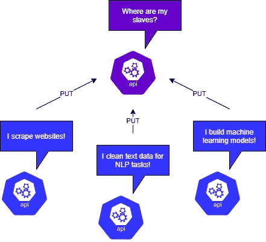
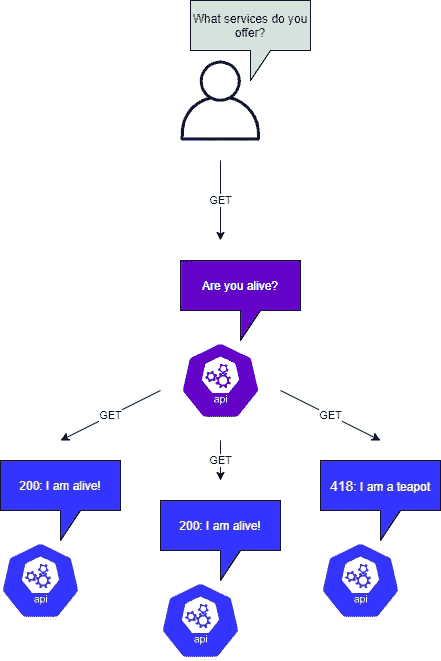
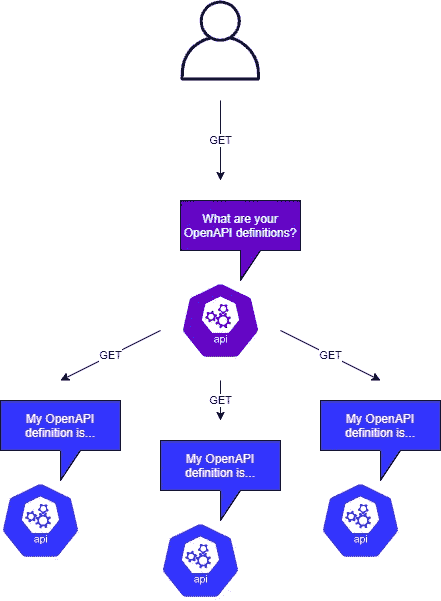

# PicoAPI:微服务的 FastAPI？

> 原文：<https://towardsdatascience.com/picoapi-fastapi-for-microservices-1e0770b747a2?source=collection_archive---------12----------------------->

## FastAPI 是一个令人惊叹的库，但是当我们在微服务架构中使用它时，我们可以改善生活

图片由[李泽同](https://unsplash.com/@zetong)在 unsplash 上拍摄

微服务范式本质上包括一组小的离散的迷你应用程序，它们作为一个整体的更大的应用程序一起工作。这种架构使较小的团队能够支持应用程序的较小部分，并清楚地定义了应用程序不同部分之间的契约。微服务在这种设置中最常见的通信方式是通过 HTTP/RESTful API。将应用程序构建为微服务时，通常会使用像 Consul 这样的服务发现和配置应用程序。

我很少遇到一个图书馆会想，“哇，这真漂亮”。最后一次是 python 的谜一样的请求库。FastAPI 的类型和其他现代 python 特性使它成为开发人员的绝对梦想，并使从概念化到生产模型的周转时间变得更快。它不仅支持快速开发，而且使用请求和响应方案意味着您的 API 从长远来看可以快速、轻松地调试和维护。

Patrick Coffey 的图片(使用 draw.io)

我经常选择一种更简单的方法，而不是全力以赴地制作《领事》的副本。这包括配置我的一个微服务作为主服务，其他微服务在启动时向主服务注册。这意味着我的堆栈只需要知道主微服务的地址，从微服务都可以向主微服务发送一个 PUT 请求，注册它们自己，一组定义它们提供的东西的标签，以及一个健康检查 URL，主微服务可以按计划获取该 URL 以测试该微服务是否仍然可达。

以上是我用来表示微服务向主服务器注册的模式。这里需要注意的是我用来描述微服务的标签字段。一个使用我们大多数数据科学家都熟悉的东西的例子；我们有一个网络爬虫模块。它可能有标签:网络爬虫，examplehost.com，肮脏。这将向主服务器指示该微服务提供 web 爬行，它被配置为从“examplehost.com”中抓取数据，并且该微服务的输出是脏的(需要进一步清理 NLP 任务)。这些标签显然需要提前定义，但是我发现这个松散的字符串列表到目前为止非常灵活。

FastAPI(严格来说是 starlette)提供了一些内部事件的挂钩。其中一些是 ***启动*** 和 ***关闭*** 事件。这些事件允许我们添加应用程序逻辑，这将导致 API 将其微服务定义放入主微服务，从而有效地注册它。一旦接收到这些 PUT 请求中的一个，主节点将把服务定义放入其服务目录中，并且如果定义了 once，则设置所描述的健康检查。

PicoAPI 可以使用 python 中的一个简单线程来处理健康检查信息。HTTP 响应代码范围在 200–299 之间的任何响应都将导致健康状态。所有其他状态代码将导致不健康状态。微服务返回 300 代码可能有一些合理的原因，这个代码可能需要更改。但是，我在使用这个架构的过程中，还没有遇到过这些情况。只要主微服务保持对实例化对象的引用，它就可以简单地检查***health check . health***变量，以查看上次检查时该健康服务是否正在运行。这里唯一需要实现的另一部分逻辑是每个从服务器上的健康检查端点，当微服务正确运行时，它会返回 200 代码。

Patrick Coffey 的图片(使用 draw.io)

主控可能需要哪些额外的端点？因为主节点已经承担了处理服务注册的责任，所以它需要一个端点来允许其他从节点检查哪些服务已经注册。在这方面，它充当注册服务的地址簿。

Patrick Coffey 的图片(使用 draw.io)

我还选择不仅返回注册的服务，还返回它们的 OpenAPI 服务定义。这允许从模块发现关于其他注册从模块的额外上下文。虽然我个人并不需要在我的微服务之间进行这种程度的自省，但是实现起来很容易，所以我把它包括进来了。

这篇文章中的代码已经被打包成一个 python 库，并发布在 PyPI 上，供任何想使用它的人使用。该库仍处于起步阶段，但我正在一些个人项目中成功地使用它。请在 GitHub repo 上提交任何问题、建议和公关，以便我可以妥善处理它们。

您可以在 GitHub 上找到它:

 [## schlerp/picoapi

### 带有定制微服务注册的 FastAPI 的自以为是的包装器——sch lerp/pico API

github.com](https://github.com/schlerp/picoapi) 

在 PyPI 上:

 [## picoapi

### FastAPI 的包装器简化了微服务的创建。非常固执己见，但也很容易分叉，如果你愿意…

pypi.org](https://pypi.org/project/picoapi/)