# 图像完美

> 原文：<https://towardsdatascience.com/picture-purrfect-bbcb5c3e42df?source=collection_archive---------40----------------------->

## 与你毛茸茸的朋友一起捕捉最美好的瞬间！

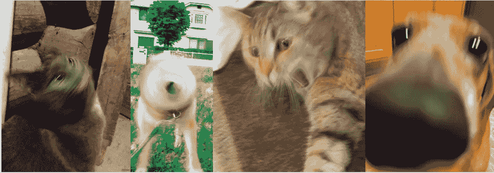

给动物拍照并不总是容易的……(照片来自 Reddit [猫](https://www.reddit.com/r/blurrypicturesofcats/)和[狗](https://www.reddit.com/r/blurrypicturesofdogs/comments/d4hd7d/blurry_picture_of_a_dog/))

曾经为拍摄动物照片而挣扎过吗？

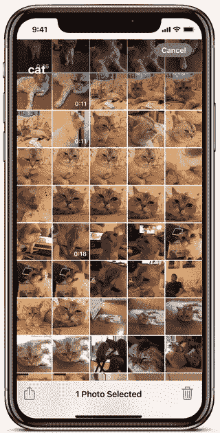

作者 GIF

或者你有没有发现自己给宠物拍了一堆照片…后来翻遍每张照片，手动选择不好的删除？

嗯……这款名为**Picture pur fect**的应用是为了让你轻松拍摄猫咪照片而开发的！只需上传一段你的猫的短视频(特别是当它们在玩耍或走动时)，算法就会自动为你选择最佳帧。

这是该应用的一个简短演示:

如果你对它的工作原理感兴趣，请继续阅读！或者你可以跳到最后看完整的演示。

我将讨论四个部分:

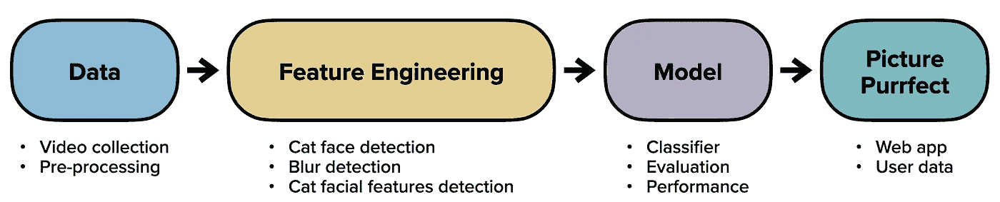

# 数据

用于构建算法的数据由 120 个猫咪视频组成，这些视频要么来自互联网(多个 Youtube 猫咪频道)，要么是我自己拍摄的。每个视频的时长为 10-30 秒。这些导致超过 2000 个帧，每个帧被标记为*好的*或*坏的*。

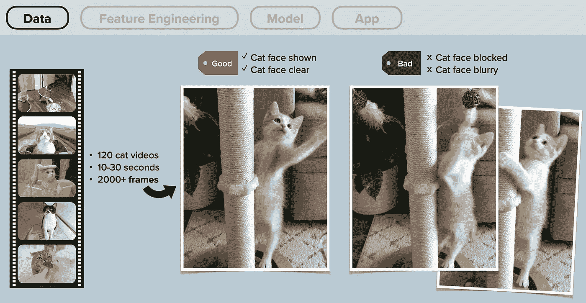

数据收集和预处理。(图片由作者提供)

正如你在上面的例子中看到的，一个好的*帧将包含一只猫，它的脸清晰地显示出来。如果猫的脸被遮挡或模糊，该帧将被标记为*坏的*。但是你可以想象，除了这些基本标准之外，还有一定程度的主观性，这取决于谁在给这些框架贴标签(在这种情况下是我)。最终的问题是，我们如何教会机器算法学习我们如何思考？为此，我们需要特征来定量地描述每一帧。(如果我们能够收集足够多的标记帧，我们就可以使用深度学习方法，而不用担心特征。不幸的是，对于这个项目，我没有足够的时间或合适的来源来收集大量的数据。*

# 特征工程

特征工程当然是这个项目的主要焦点，因为它在模型训练中起着重要的作用。有三类技术:

1.  猫脸检测
2.  模糊检测
3.  猫面部特征检测

## 猫脸检测

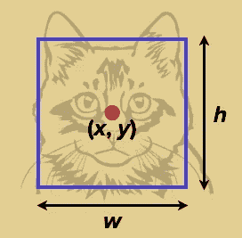

用 Haar 级联分类器进行猫脸检测(猫脸图像经[*Creative Fabrica*](https://www.creativefabrica.com/product/cute-face-cat-with-black-line-art-style/)*授权给作者)*

我使用 Haar cascade classifier(这篇[博文](https://katiehuang1221.medium.com/an-introduction-to-computer-vision-131826e2b512)简要解释了 cascade classifier 如何工作)作为快速过滤器来筛选给定视频中的所有帧，并只保留那些带有 cats 的帧，用于剩余的(更复杂和耗时的)特征工程步骤。

使用这个检测器，您可以获得猫脸中心的坐标以及猫脸周围边界框的高度和宽度。

从包围盒的位置和大小可以进一步发现猫是否是帧的主体(人脸中心到帧中心的距离和人脸占整个帧的大小比例):

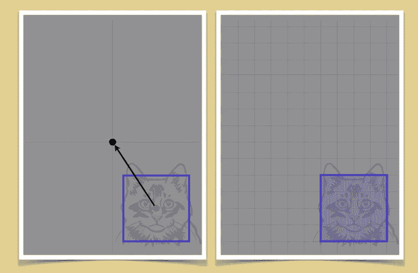

推断猫是否是画面的主体:人脸中心到画面中心的距离，猫脸占整个画面的大小比例。

## 模糊检测

我们还可以使用一些基本的图像处理技术对每一帧进行模糊检测。有许多不同的方法，但一般来说，它们都与图像中的边缘有多清晰有关，即边缘检测。我选择拉普拉斯和 Canny 滤波器。

拉普拉斯方法计算图像的二阶导数，它测量一阶导数变化的速率。然后，我们可以看到相邻像素值的变化是来自不连续的边缘还是来自连续的级数。

Canny 边缘检测稍微复杂一些。它有多个阶段，包括高斯滤波器降噪。得到的图像是二进制的(大部分是黑色的，但是检测到的边缘用白线描绘)。

下面的例子显示了一个清晰的猫脸帧和另一个模糊的猫脸帧。您可以看到应用拉普拉斯算子和 Canny 算子后帧的外观:

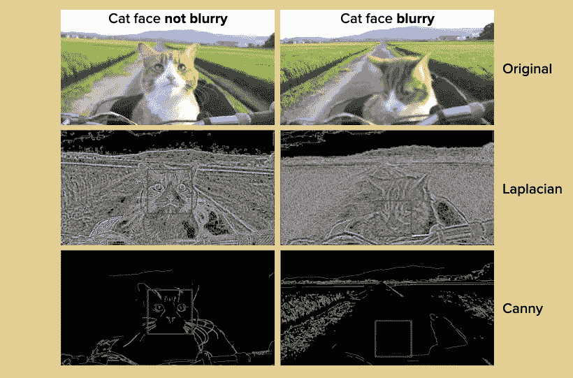

原始帧和应用拉普拉斯算子后的 Canny 滤波器。(来自 YouTube 频道的猫[君的厨房](https://www.youtube.com/channel/UCRxAgfYexGLlu1WHGIMUDqw))

然后，我们可以计算经过处理的帧的方差，并确定原始帧的清晰度或模糊度。可以对整个帧进行计算，也可以只对猫脸进行计算。猫脸锐度占整个画面锐度的比例也应该算一个特征。

## **猫咪五官检测**

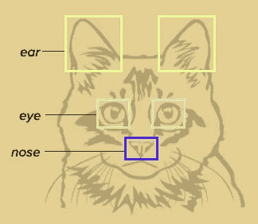

使用定制训练的 YOLOv3 (darknet)进行面部特征检测

前两类与框架的宏观层次更相关。微观层面，我们要识别猫的耳朵、眼睛、鼻子等面部特征。这可以通过基于神经网络架构(darknet 的 YOLOv3)的定制训练对象检测器来完成。与面部检测的情况类似，将返回每个特征周围的边界框的中心坐标和高度、宽度。这其实给了我们很多信息！

这是一个猫从完全清醒到打瞌睡的面部特征检测的例子:

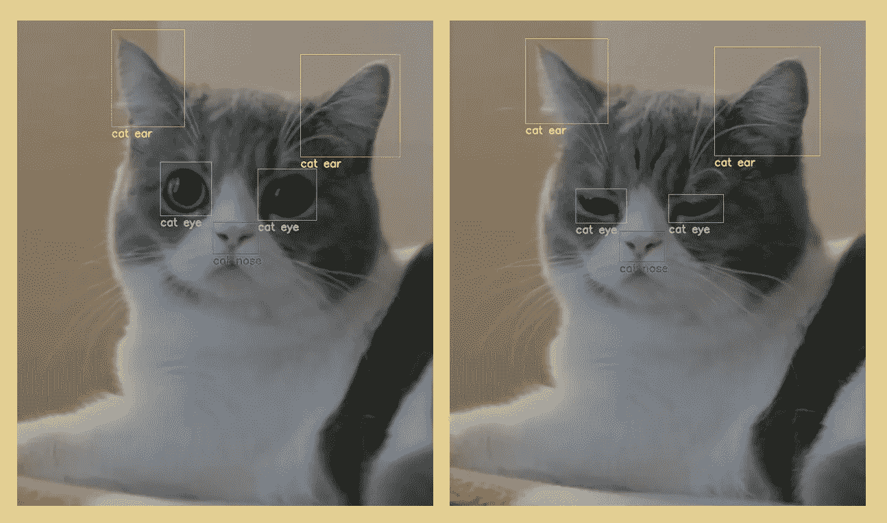

猫面部特征检测。(来自 Youtube 频道的猫 [KiSH-Log](https://www.youtube.com/channel/UC9cH5HQBojNzPCaTLovivbw) )

如果只是看眼睛，很明显从猫眼的高宽比可以推断出眼睛的形状(猫的眼睛是不是睁着的，猫是不是困了)。

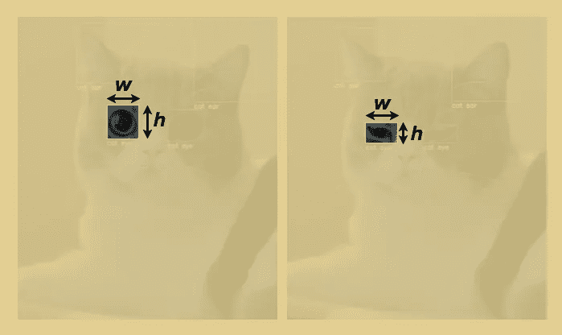

从高度和宽度的比例推断猫眼的形状。(图片由作者提供)

这是另一个猫洗澡的例子:

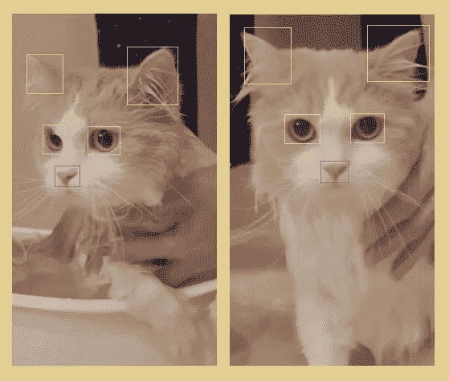

猫在洗澡。(猫来自 Youtube 频道[基底龙](https://www.youtube.com/channel/UCwcsDWGip6vtiZyCnvDoClQ)

从猫的两只眼睛和鼻子的相对位置，我们可以推算出猫的面部角度:猫是直视镜头，还是侧视。

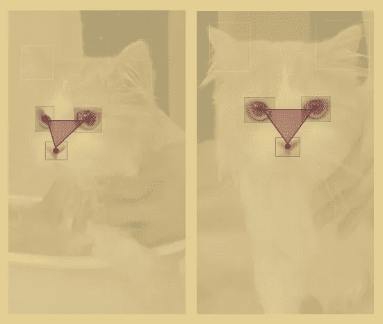

使用眼睛、鼻子的位置来计算猫脸相对于摄像机的角度。(图片由作者提供)

# 模型

在所有准备工作(数据收集、标记、特征工程)完成后，我们就可以开始训练模型了！在测试的几个不同分类器中，Random forest 在 ROC AUC 方面的性能最好(83.3%)。进一步研究特性的重要性，不难发现顶级特性与清晰度有关。

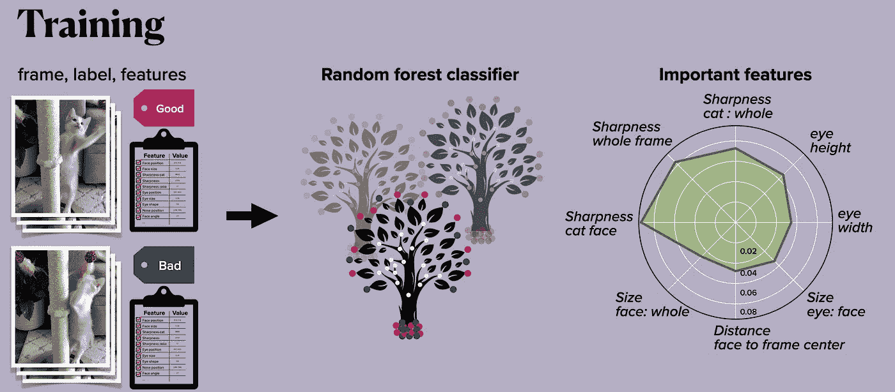

模型训练:给定数据信息，训练随机森林分类器。重要的特征显示在右边。(图片由作者提供)

# Web 应用程序

您已经在开始部分看到了 web 应用程序演示！以下是 Picture Purrfect 选择的几帧:

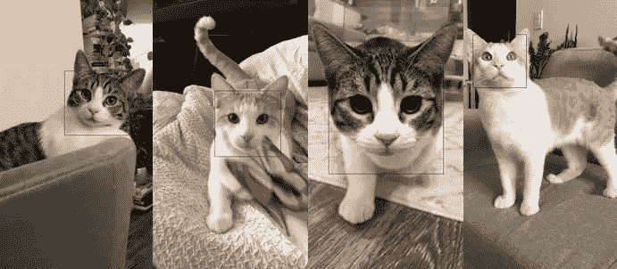

由 Picture Purrfect 选择的雪纺(平纹)和切达(橙色)框架。(作者照片)

希望你喜欢！

## *完整展示*

了解有关项目的更多信息:

 [## Katie Huang 1221/onl _ ds5 _ project _ 5

### 梅蒂斯激情计划为动物拍照并不总是一件容易的事！不用拍一堆照片，直接上传…

github.com](https://github.com/katiehuang1221/onl_ds5_project_5) 

了解有关该应用程序的更多信息:

 [## Katie Huang 1221/picturepurfect _ app

### 1.您的 purffect pic 拖放您的视频文件，并点击按钮开始挑选🐾 2.自定义选取器试用…

github.com](https://github.com/katiehuang1221/PicturePurrfect_app) 

其他视频:

 [## 黄凯蒂

### 与朋友、家人和全世界分享您的视频

www.youtube.com](https://www.youtube.com/channel/UCaZHIPzCIG9Y9xWYDpMvH5w)