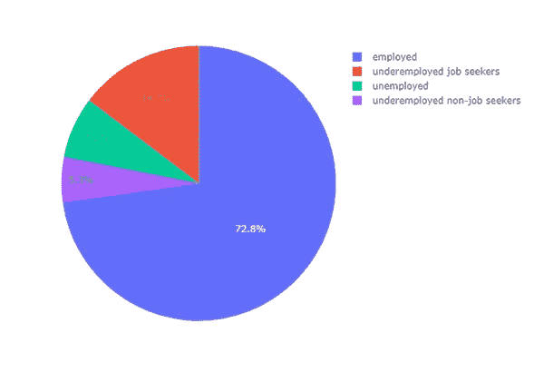

# Plotly 的饼图和圆环图

> 原文：<https://towardsdatascience.com/pie-donut-charts-with-plotly-d5524a60295b?source=collection_archive---------8----------------------->

## 为什么和如何


在 [Unsplash](https://unsplash.com/s/photos/pie-chart?utm_source=unsplash&utm_medium=referral&utm_content=creditCopyText) 上由 [Toa Heftiba](https://unsplash.com/@heftiba?utm_source=unsplash&utm_medium=referral&utm_content=creditCopyText) 拍摄的照片

# **饼状图&备选方案**

**原因:**饼图( **PCs** )用于显示互斥且不重叠类别的整体的**部分。概念上的想法不是在类别之间进行比较，而是**显示每个类别相对于总数**的百分比或比例。这种类型的图表不应用于相关性、偏差或分布分析。**

**如何** : PCs 是被分成**片状扇区**的圆形图表。全圆代表**整体** (100%)，切片代表**部分**。每个部分都必须正确标记，最好包括对应于扇区百分比的数值。**切片**(段、扇区、楔形)**不能重叠**(互斥)。它们的总和必须始终为 100%。



图 1:作者用 Plotly Express 做的饼状图。

PCs 用两个可视属性对相应的数值进行编码:1 .- **每个切片沿周长的长度**；2.- **每个切片的面积**。

**讲故事**:电脑广泛应用于金融、商业、新闻和教育领域，用于显示各种类别的百分比或比例，包括预算、销售、失业率、人口细分、学术表现或调查答案。它们通过每个切片的面积和/或沿饼图周长的每个切片的长度来表达整体-部分关系的信息。

它们作为一种数据可视化技术的使用引起了很大的争议:一方面，这些可视化属性不容易解码；另一方面，观众非常熟悉饼状图的简单美学。无可争议的是，当切片过多时，它们很难阅读。

**一些警告**

总是检查整体是 100%，整体对观众有清楚的意义，并且类别是互斥的。例如，这些要求并不总是在调查结果中得到验证。

总是包括注释和百分比来描述内容。

当类别之间的差异很小时，或用于趋势或模式时，PCs 不应用于精确比较。

尽量不要用超过**六七片**。它们不仅很难读，而且有太多的传说。

如果你有许多难以阅读的小区域，试着**把它们合并成一个单独的区域**，用一个适合新情况的图例和一个中性的颜色。

避免所有 3D 效果。尽管它们在美学上令人愉悦，但它们会引入失真，并严重妨碍对信息的解读。

备选 1: **圆环图**(圆环图)

它们完全等同于饼图(它们显示相互排斥且不重叠的类别的整体的**部分)，唯一的区别是图表中心有一个空白空间(**一个洞**)，在那里显示某种附加信息以增强故事讲述。**

现在**不可能对面积**进行比较，但扇形的数值仅通过沿圆周的弧长进行编码。

当中心的信息允许获得空间，从而减少图表产生的总空间时，使用它是合理的。例如，对应于每个扇区的图例可以指示在圆环的孔中。当然，这种空间上的收益必须超过视觉属性减少所带来的新的困难。

备选方案 2: **段分离**

可以通过从原始饼图中分离出一个或几个片段来加强信息。你可以将整个饼图分开，也可以根据叙述突出显示单个切片。请注意，这种视觉分离会在图表中产生失真，可能会使信息难以理解。

**饼状图&备选方案与策划案**

位于加拿大蒙特利尔的技术计算公司 Plotly 于 2019 年推出了 *Plotly Express* (PE)，这是一个全新的高级 Python 可视化库。PE 包括用一个函数调用来绘制标准图表的函数。

Plotly 还提供了一个名为 *plotly.graph_objects* 的模块，其中包含了 Python 类的层次结构。 *Figure* ，一个主类，有一个数据属性，允许以一种相对快速和简单的方式创建和显示图形。

我们的[数据](https://mundogremial.com/los-numeros-del-desempleo-en-argentina/)指的是 2017 年阿根廷共和国从事经济活动的人口。我们将根据劳动力市场的**压力类型，用饼状图显示四组从事经济活动人口的百分比。这四个组被命名为:1。——“已就业”；2.——“失业”；3.-"未充分就业的求职者"；4.-"就业不足的非求职者"。**

对于本文中的饼状图，Plotly Express 函数是 *px.pie* ，对应的参数是: *data_frame* ，第一个参数，对应饼状图的扇区；*数值*设置与扇区相关的数值；*名称*设置扇区的标签；*颜色*给扇区分配色调。

这是图 1(上图)中饼图的代码:

```
import plotly.express as pxlabels = ['employed', 'unemployed',  
          'underemployed job seekers', 
          'underemployed non-job seekers']values = [72.8, 7.2, 14.7, 5.3]fig1 = px.pie(labels, values = values, names = labels)fig1.show()
```

我们认为**改变其他人的默认颜色**会很方便，这将改善信息。为此，我们使用参数 *color_discrete_map* 并获得图号 2。

```
fig2 = px.pie(labels, values = values,
              names = labels, color = labels,
              color_discrete_map = {'employed':'blue', 
                                    'unemployed': 'red',
                            'underemployed job seekers':'lightblue',
                            'underemployed non-job seekers':'orange'
             })fig2.show()
```


图 2:带有选定颜色的饼图。由作者用 Plotly Express 制作。

接下来，我们添加一个标题和一个胡佛工具提示(图 3):

```
fig3 = px.pie(labels, values = values,
              names = labels, color = labels,
              color_discrete_map = {'employed':'blue', 
                                    'unemployed': 'red',
                            'underemployed job seekers':'lightblue',
                            'underemployed non-job seekers':'orange'
             })fig3.update_traces(title = 'Population Economically Active',
                   title_font = dict(size=25,family='Verdana', 
                                     color='darkred'),
                   hoverinfo='label+percent',
                   textinfo='percent', textfont_size=20)fig3.show()
```


图 3:作者用 Plotly Express 做的饼状图。

让我们来看看**圆环图是如何传达信息的。**我们包括了*孔*参数，用于设置切割出饼图的半径分数。

```
fig4 = px.pie(labels, values = values, hole = 0.4,
              names = labels, color = labels,
              title = 'Population Economically Active',
              color_discrete_map = {'employed':'blue', 
                                    'unemployed': 'red',
                            'underemployed job seekers':'lightblue',
                            'underemployed non-job seekers':'orange'
             })fig4.update_traces(
                   title_font = dict(size=25,family='Verdana', 
                                     color='darkred'),
                   hoverinfo='label+percent',
                   textinfo='percent', textfont_size=20)fig4.show()
```


图 4:作者用 Plotly Express 做的圆环图。

我们感兴趣的是有单独段的图表是什么样子，但是有一个缺点: *Plotly Express* 没有为该任务提供参数。因此，我们不得不求助于 ***plotly.graph_objects。***

对于本文中的以下圆环图， *plotly.graph_objects* 函数为 *data = go。Pie()* 和对应的参数有:*值；标签；洞；标记 _ 颜色。*

```
import plotly.graph_objects as gocolors = ['blue','red','lightblue','orange']fig5 = go.Figure(data = go.Pie(values = values, 
                          labels = labels, hole = 0.4,
                          title = 'Population Economically Active',
                          marker_colors = colors
                 ))fig5.update_traces(
                   title_font=dict(size=25,family='Verdana', 
                                   color='darkred'),
                                   hoverinfo='label+percent',
                                   textinfo='percent', 
                                   textfont_size=20,
                   )fig5.show()
```


图 5:作者用 *plotly.graph_objects* 做的圆环图。

可以看出，我们有一个问题:标题出现了漏洞。为了解决它，我们在孔中添加了一个**注释**。

```
fig6 = go.Figure(data = go.Pie(values = values, 
                               labels = labels, hole = 0.4,
                               marker_colors = colors ))fig6.update_traces(hoverinfo='label+percent',
                   textinfo='percent', textfont_size=20)fig6.update_layout(
                   title_text = 'Population Economically Active',
                   title_font = dict(size=25,family='Verdana', 
                                     color='darkred'))fig6.add_annotation(x= 0.5, y = 0.5,
                    text = 'Year 2017',
                    font = dict(size=20,family='Verdana', 
                                color='black'),
                    showarrow = False)fig6.show()
```


图 6:带有注释的环形图。由作者用 *plotly.graph_objects* 制作。

让我们看看是否通过从原始图表中分离一段的**来加强信息。我们为*拉*设置值，这是一个定义从中心拉出哪些切片以及拉出到什么程度的列表。**

```
fig7 = go.Figure(data = go.Pie(values = values, 
                               labels = labels, hole = 0.4,
                               pull = [0,0.25,0,0],
                               marker_colors = colors ))fig7.update_traces(hoverinfo='label+percent',
                   textinfo='percent', textfont_size=20)fig7.update_layout(
                   title_text = 'Population Economically Active',
                   title_font = dict(size=25,family='Verdana', 
                                     color='darkred'))fig7.add_annotation(x= 0.5, y = 0.5,
                    text = 'Year 2017',
                    font = dict(size=20,family='Verdana', 
                                color='black'),
                    showarrow = False)fig7.show()
```


图 7:拉出一段的圆环图。由作者用 *plotly.graph_objects* 制作。

我们让您来决定哪个图表(图 4、图 6 或图 7)提供了最好的故事讲述。

如果你发现了这篇感兴趣的文章，请阅读我之前的(https://medium.com/@dar.wtz):

棒棒糖和哑铃图，有曲线、平均值或中值？

</lollipop-dumbbell-charts-with-plotly-696039d5f85>  

斜率图表，为什么和如何，用斜率讲故事

</slope-charts-why-how-11c2a0bc28be> 