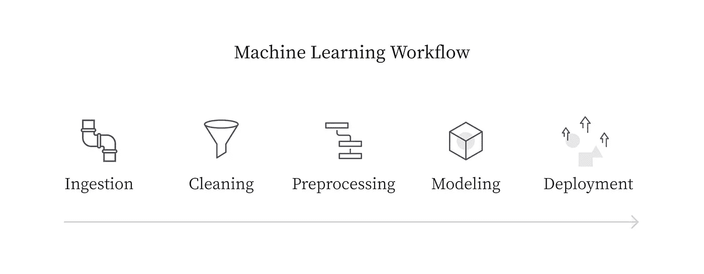
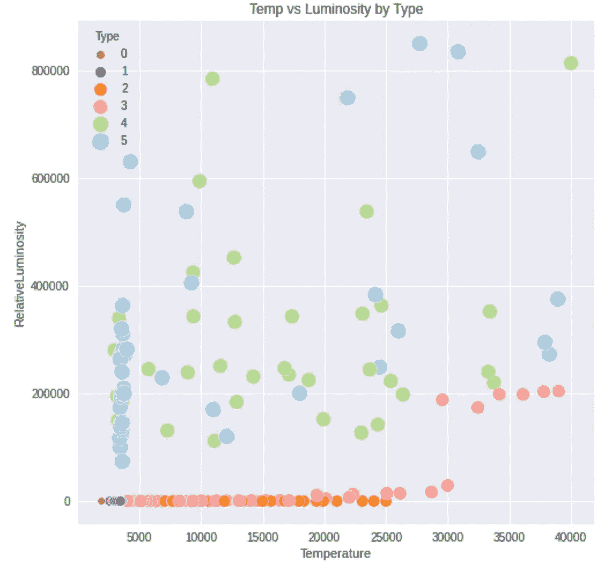
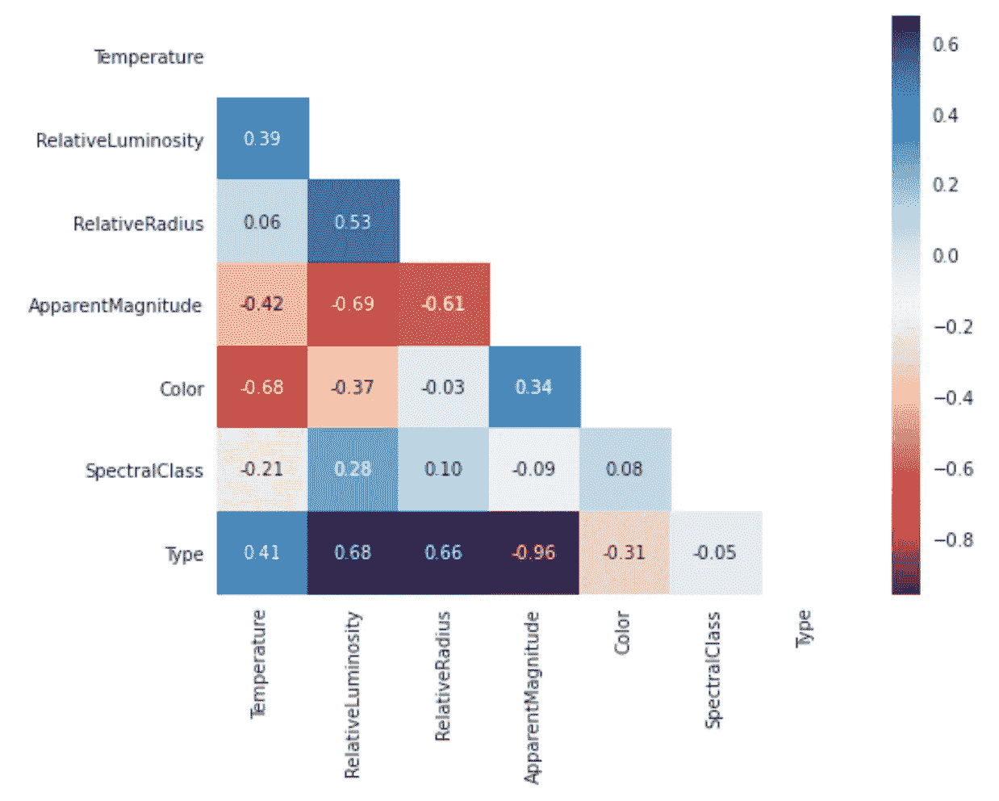

# 管道:具有超参数调整的自动机器学习！

> 原文：<https://towardsdatascience.com/pipelines-automated-machine-learning-with-hyperparameter-tuning-part-1-b9c06a99d3c3?source=collection_archive---------18----------------------->

## 创建自己的可重用代码库的第一步。

厌倦了为每一次深入研究数据科学而重新编写相同的旧代码吗？你来对地方了！

首先是数据，然后是无尽的 ETL 过程，然后是建模，最后是推理。但是，将这一切自动化，以便您可以即插即用任何数据，只需进行最小的修改，这难道不是很酷吗？管道使我们能够做到这一点！



# 什么是机器学习管道？

就像我们在现实世界中的对等物一样，ML 管道是将一个进程与另一个进程连接起来的载体，因此只有一个输入和一个输出的连接点。现代应用程序过度依赖于连接 ML 服务和现有 DevOps 流程的管道架构！简而言之，它帮助你把你的项目超级物化！

*   数据准备，包括导入、验证和清理、管理和转换、规范化和暂存
*   培训配置，包括参数化参数、文件路径和日志/报告配置
*   高效、重复地培训和验证。效率可能来自指定特定的数据子集；不同的硬件计算资源、分布式处理和进度监控。
*   部署，包括版本控制、扩展、供应和访问控制

如果你想了解更多，这里有一个关于 ML 管道的好的开端。

在这篇博客中，我将介绍 Scikit 的基础知识——学习管道。我将编写定制的 Transformer 函数，负责数据清理、特征工程和模型训练。(*我知道你来这里是为了寻找定制变压器解决方案，而不是 onehotencoder 插入管道步骤:D*

# 数据和描述

我正在从 Kaggle 获取“[恒星类型分类](https://www.kaggle.com/brsdincer/star-type-classification)”数据集。这个数据集混合了分类变量和连续变量。我们来做一个多类分类( *saucy* )！


数据帧头

大部分特性都是不言自明的！你可以在这里阅读光谱类。

我们的目标变量是“类型”，它是——红矮星(0)，褐矮星(1)，白矮星(2)，主序(3)，超级巨星(4)，超巨星(5)。

同样，每个类有 40 个观察值**这使得它成为一个完美平衡的问题。**

# 解释性数据分析



我们最喜欢的散点图与花式过滤器！

我使用了这个项目的自动化 EDA 工具 [D-tale](https://github.com/man-group/dtale) 。我喜欢它，因为它的简单和超快的速度。

但是，你不是来找埃达的，对吧？让我们继续前进！

# 数据预处理

以下是我从分析中得出的结论。

1.  数据集中没有丢失的值(不过我还是会处理它)
2.  好家伙，有离群值。所以，在评论中加入你最好的离群点管理策略。我已经通过第 20 和第 80 百分位范围*对异常值的四分位范围进行了修整。见高斯分布[此处](https://suplari.com/data-analytics-for-procurement-series-calculating-outliers-in-spend-data-part-1/)。*
3.  特征向右或向左倾斜。因此，我不能简单地应用线性方法。
4.  缩放——空间非常巨大，需要缩放。因为我想让我的模型看到异常值，但保留它们的方差-偏差权衡，所以我将对我的数据应用 RobustScalar。

# 特征工程

我已经进行了三次测试，以发掘我的脚踏实地的管道中的一个功能的天堂般的重要性。

1.  这是我的小抄！



```
- Pearson’s R for continuous-continuous cases - Correlation Ratio for categorical-continuous cases - Cramer’s V or Theil’s U for categorical-categorical cases
```

2.**方差分析** (ANOVA):是个[美女](https://en.wikipedia.org/wiki/Analysis_of_variance)！它显示了与目标相关的重要性。

```
Temperature: 3.323401956092008e-11
RelativeLuminosity: 1.641155523850019e-33
RelativeRadius: 1.6272694239287043e-31
ApparentMagnitude: 6.33087509199811e-128
Color: 1.047429715544e-06
SpectralClass: 0.44868186785826514
```

如你所见，色彩的 P 值非常高！

3.**卡方检验**:用于传统的分类分析。

```
Color            8.716079e-26SpectralClass    1.167568e-37
```

## 好吧，休息两分钟！回顾刚刚讲述的概念。我知道你是专业的，但只是一个小小的心理回顾！

# 我们来说说变形金刚吧！

不是迈克尔湾的，Scikit-learn 变压器形成了管道的一个组成部分，让你即插即用不同的组件。首先，在这里导入这两个基类:

```
from sklearn.base import BaseEstimator, TransformerMixin
```

我们刚刚导入的这些类就像是自定义类的粘合剂。[*基本估算器*](https://scikit-learn.org/stable/modules/generated/sklearn.base.BaseEstimator.html) 为管道提供所有 sklearn 估算器都需要的 *get_params* 和 *set_params* 方法。[*transformer mixin*](https://scikit-learn.org/stable/modules/generated/sklearn.base.TransformerMixin.html#sklearn.base.TransformerMixin)给出了 fit_transform 方法。

为了防止任何数据泄漏和漂移，最好在开始时分割我们的训练和测试数据集。有几个优点，即:

1.  预处理:您正在填充缺失值并初步移除异常值；你的模型将如何对看不见的真实世界数据进行归纳？因此，首先分裂！
2.  特征缩放:-我们使用标量。在训练数据集上拟合()，让这些计算出的参数转换训练和测试数据。LoL 什么？是的，它有助于检测生产中的数据漂移。

```
X_train, X_test, y_train, y_test = train_test_split(df.drop(columns='Type'), df['Type'],test_size=0.30,                      random_state=1,stratify= df['Type'])
```

我使用分层分割，因为我希望训练和测试数据集能够代表所有的目标标签。(训练数据集可能永远不会包含某些类别)

# 数字特征转换器

我们总是可以使用标量或估算器的默认类实现。但是，如果您的用例要求对一个已经成为问题的特性进行自定义处理，该怎么办呢？它可以打破或使系统！

您需要填充两个方法:

1.  拟合—这里更喜欢计算步骤，如测量平均值、中值和方差。
2.  transform——此处首选应用转换。

用这个的好处是你会有绝对的控制权。此外，您的计算实例不必两次计算相同的统计数据。

***注意*** *:注意你在 fit 和 transform 方法中实现的功能。实现的顺序可能会引入偏差(就像我提到的缩放)。*

# 分类特征的转换器

现在，我们已经处理了我们的数字特征。我们可以继续进行分类特征。我会把我的分类特征变得愚蠢。您可以包含 KninsDiscretiser 或任何其他定制函数来适应您的用例。'

# 厉害！快到了

现在，我们需要将这两个类缝合在一起。Scikit-learn 提供两种功能:

> FeatureUnion:连接多个 transformer 对象的结果。这个估计器将 transformer 对象列表并行应用于输入数据，然后连接结果。这对于将几个特征提取机制组合到单个变换器中是有用的。
> 
> ColumnTransformer:将转换器应用于数组或 pandas 数据框架的列。该估计器允许输入的不同列或列子集被分别变换，并且由每个变换器生成的特征将被连接以形成单个特征空间。这对于异构数据或列数据很有用，可以将几个特征提取机制或转换组合到单个转换器中。

在我们的用例中，我创建了一个基本的转换器，以便分类和数字特征被分别处理。因此，我将使用 ColumnTransformer。

# 击鼓吧。

显然，我们首先需要一个特性列表。🙌

```
numerical_columns = ['Temperature', 'RelativeLuminosity', 'RelativeRadius', 'ApparentMagnitude']categorical_columns = ['SpectralClass']
```

**牛逼**。完成了！

让我们使用基于内核的模型来测试它。因为我的用例是多类分类，所以我将 KNearestNeighbors 作为我的基本模型。

我也使用了 *K 倍交叉验证*。但是，在我心里，我知道它会过拟合，因为训练数据的大小是 110。但是，这不是我们现在关心的问题。过度拟合将很快通过超参数调整和模型迭代来解决。

# 模特培训

一旦您转换并运行了处理，您就可以将它插入到培训管道中。您可以包含各种奇特的步骤，包括 GridSearchCV、交叉验证，并在一个链中创建一组模型。

```
result = cross_val_score(model ,X_train, y_train, cv = KFold(n_splits=3), error_score=-1)

print("Avg accuracy: {}".format(max(result)))Avg accuracy: 0.9107142857142857
```

嘿！成功了，耶，你成功了。我确信这些步骤足以启动你的管道之路。毕竟我们都是马里奥和路易吉！(管道—游戏—请理解这个笑话！)

# 终于！

任务完成！今天，我们在 scikit 中创建了基本框架——了解任何数据科学的深层知识。我们使用定制的转换元素执行数据清理、规范化和数据转换。

接下来，我们使用 ColumnTransfomer 将管道的各个通道(分类通道和数字通道)连接起来，ColumnTransfomer 将两个数据子集粘合在一起。最后，我们用我们的管道训练了一个基本模型。

我希望这篇博客能澄清一些关于定制变压器的基础知识。它们是任何现代 ML 应用程序的支柱，如果你能把它们包含在你的工作流程中，那将是最好的。

*你可以在 Github 上的* *这里获得这个完整的笔记本* [*。*](https://github.com/harshalsonioo1/EndToEndBlog)

使用 HyperOpts 自动调整多个 SKlearn 模型的 Hyper 参数的后续步骤可在[这里](https://harshalisbatman.medium.com/automate-hyperparameter-tuning-with-hyperopts-for-multiple-models-22b499298a8a)找到。

谢谢你留下来！你可以随时通过 LinkedIn 联系我，获得一些想法！